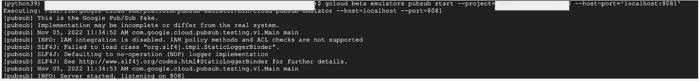

# GCP——云功能——以正确的方式开发它

> 原文：<https://medium.com/google-cloud/gcp-cloud-functions-develop-it-the-right-way-82e633b07756?source=collection_archive---------1----------------------->

> 在云上开发功能的一般趋势是反复试验并多次部署，直到部署成功，从开发人员生产力的角度来看，这不是一个好的方法。

**云功能**是 GCP 的“**功能即服务**”产品，允许部署事件驱动或 http 功能供其他服务或用户使用。

这篇博客关注开发技术，这些技术将有助于第一次就快速部署云功能**和**。****

**下图显示了在云功能上进行**本地开发**和**测试和部署的**典型失败**。****

****

**开发方法开关**

**这不是正确的开发方法，因为**云功能的部署需要时间(1-2 分钟),对于每个小错误，如语法、请求解析、逻辑问题等，这会产生复合效应，开发人员会花费大量时间来首次正确部署云功能。****

> **我们如何简化云功能的开发方法。**

**进入 [**功能框架**](https://www.youtube.com/watch?v=qQiqo1zZJmI&t=49s) ！！**

## **介绍**

****功能框架**帮助在本地建立云功能代码测试环境。
**环境**意味着建立一个快速的本地 web 服务器，在其上部署功能，可以通过简单的 curl 请求或任何本地测试程序进行测试。**

## **入门(HTTP 功能)**

> **出于演示的目的，我将使用 python 运行时，但同样的原则也适用于其他运行时**

**让我们从一个简单的 **HTTP 函数**开始**

**下面的函数 multiply 接受 2 个数字并返回乘法结果。**

> **这是一个非常简单的演示版本，但可以正确处理响应代码和错误。**

**但是为什么有**请求**实参和 **get_json()****

**云函数期望输入对象属于 [**Flask 请求对象**](https://tedboy.github.io/flask/generated/generated/flask.Request.html) 并且 **get_json** 是提取 json 数据内容的 Flask 请求对象函数。**

**为了测试这个函数，让我们从 pypi 包中安装函数框架**

```
pip install functions-framework
```

**运行函数框架非常简单，不需要任何代码更改。**

```
functions-framework --port 8080 --target multiply --signature-type http --source main.py --debug
```

****Port** 表示本地机器上 web 服务器监听的端口
**Target** 表示函数的入口点
**Signature-type** 可以是 event，http 或 cloudevent
**Source** 表示包含函数入口点的代码文件。**

**上面的输出如下所示**

****

**函数框架命令的输出**

**使用 curl 或任何其他方法在本地服务器上运行测试。**

```
curl -X POST \
-H "Content-type:application/json" \
-d  '{"num_1":20, "num_2": 30}' \
-w '\n' \
http://localhost:8080
```

**输出如下所示**

****

**简单的 Curl 请求来测试云函数**

**瞧啊。！测试已经完成。现在，我们可以简单地部署到云功能，并且部署/调用没有任何语法或逻辑问题。**

```
gcloud functions deploy multiply_function \
--source cloud_functions/ \
--entry-point multiply \
--runtime python39 \
--region us-central1 \
--allow-unauthenticated \
--trigger-http
```

****

**部署的云功能**

**云功能一旦部署，就可以以类似的方式调用。**

```
curl -X POST \
-H "Authentication: Bearer $(gcloud auth print-access-token)" \
-H "Content-type:application/json" \
-d  '{"num_1":20, "num_2": 30}' \
-w '\n' \
https://redacted.cloudfunctions.net/multiply_function
```

## **事件驱动—云发布订阅**

**对于云发布订阅，我们将使用一个发布订阅模拟器在本地运行发布订阅，并将消息发布到本地端点**

**该设置的摘要如下所示**

****

**总流量**

> **为简单起见，上面用灰色显示的框可以组合成 bash 脚本的一部分**

**以下命令在本地端口 8081 上运行发布-订阅模拟器**

```
gcloud beta emulators pubsub start --project=<redacted> --host-
port='localhost:8081'
```

****

**云发布-订阅模拟器输出**

**设置将消息重定向到模拟器所需的环境变量**

```
export PUBSUB_EMULATOR_HOST=localhost:8081
export PUBSUB_EMULATOR_PROJECT=<redacted>
```

**现在让我们设置一个 **pubsub 模式、pubsub 主题和订阅。****

**以下命令的参考是 pubsub 的 REST API—[https://cloud.google.com/pubsub/docs/reference/rest](https://cloud.google.com/pubsub/docs/reference/rest)。
下面的命令指向 **localhost:8081** 模拟器运行的地方，而不是**pubsub.googleapis.com。****

> **pubsub 的客户端库也可以用来代替 REST API**

****模式的创建** 我们期望要发布的消息应该具有字符串类型的单个字段 repo_name**

```
curl -X POST \
-H "Content-type: application/json" \
-d @pubsub_schema.json \
-w '\n' \
http://**localhost:8081**/v1/projects/<redacted>/schemas?schemaId="test-json-schema"@**pubsub_schema.json**
{
"name": "projects/<redacted>/schemas/test-json-schema",
"type": "AVRO",
"definition":  "{\"type\": \"record\",\"name\": \"sample\",\"fields\": [{\"**name**\": \"**repo_name**\",\"**type**\": \"**string**\"}]}"
}
```

****创建 Pubsub 主题****

```
curl -X PUT \
-H "Content-type: application/json" \
-d @pubsub_request.json \
http://**localhost:8081**/v1/projects/<redacted>/topics/test-topic**@pubsub_request.json** {
"schemaSettings": {
"schema": "projects/<redacted>/schemas/test-json-schema",
"encoding": "JSON"
}
}
```

****创建发布订阅****

**订阅的推送端点被称为“http://localhost:8080”，其中云功能框架将运行 web 服务器，准备接受消息**

```
curl -X PUT \
-H "Content-type: application/json" \
-d @pubsub_sub_request.json \
http://**localhost:8081**/v1/projects/<redacted/subscriptions/test-topic-sub **@pubsub_sub_request.json**
{
"topic": "projects/<redacted>/topics/test-topic",
"pushConfig": {
"pushEndpoint": "**http://localhost:8080**"
}
}
```

**让我们开始函数框架**

```
functions-framework --port 8080 --target **pubsub_event** --signature-type event --source main.py --debug
```

**pubsub_event 函数的定义**

**现在，让我们试着向模拟器发送消息。
该消息要求采用 base 64 编码，如下所示**

```
base64.b64encode('**{"repo_name":"repository-1"}**'.encode("utf-8"))
b'**eyJyZXBvX25hbWUiOiJyZXBvc2l0b3J5LTEifQ==**'curl -X POST \
-H "Content-type: application/json" \
-d @**pubsub_message.json** \
-w '\n' \
http://**localhost:8081**/v1/projects/<redacted>/topics/test-topic:publish**@pubsub_message.json** {
"messages":[
{
"data": "**eyJyZXBvX25hbWUiOiJyZXBvc2l0b3J5LTEifQ==**"
}
]
}
```

**您将能够在服务器上看到如下输出**

****

**从函数打印的事件数据和上下文。**

**现在，您可以编写您的函数逻辑来处理消息并部署云函数 post 测试**

## **事件驱动—第 1 代—云存储事件示例**

**让我们举一个例子，设置一个在云存储事件时触发的云函数。**

**云函数第 1 代—事件触发器需要 2 个参数
1。**事件** —事件数据的字典表示
2。**上下文** — ( `google.cloud.functions.Context)`表示事件的元数据(event_id、event_type、timestamp 和 resource)**

**事件字典将取决于注册云功能的事件类型。**

****云存储事件触发** —参见[https://cloud.google.com/functions/docs/calling/storage](https://cloud.google.com/functions/docs/calling/storage)
**云存储事件数据**—[https://github . com/Google APIs/Google-cloud events/blob/main/proto/Google/events/cloud/storage/v1/data . proto](https://github.com/googleapis/google-cloudevents/blob/main/proto/google/events/cloud/storage/v1/data.proto)**

**所有这些受支持的事件在 github 中都有它们的原型结构以供测试。**

**云存储事件的上述事件和上下文数据可以通过简单地部署具有事件和上下文打印的虚拟云功能来生成。**

**一旦事件数据准备就绪，就可以通过提供 curl 请求或通过程序以同样的方式使用云函数框架**

```
curl -X POST \
-H "Authentication: Bearer $(gcloud auth print-access-token)" \
-H "Content-type:application/json" \
-d  @request.json \
-w '\n' \
https://redacted.cloudfunctions.net/storage_event
```

**希望这些内容对你有帮助。
如有任何疑问，请通过我的链接句柄与我联系—[https://www.linkedin.com/in/murli-krishnan-a1319842/](https://www.linkedin.com/in/murli-krishnan-a1319842/)**

## **参考**

**功能框架—[https://cloud.google.com/functions/docs/functions-framework](https://cloud.google.com/functions/docs/functions-framework)
功能框架 Python—[https://github . com/Google cloud platform/Functions-Framework—Python](https://github.com/GoogleCloudPlatform/functions-framework-python)
功能框架契约—[https://github.com/GoogleCloudPlatform/functions-framework](https://github.com/GoogleCloudPlatform/functions-framework)**