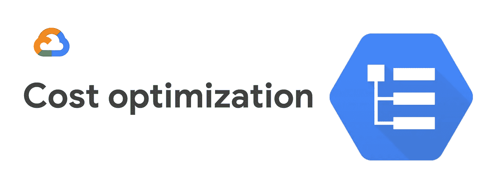
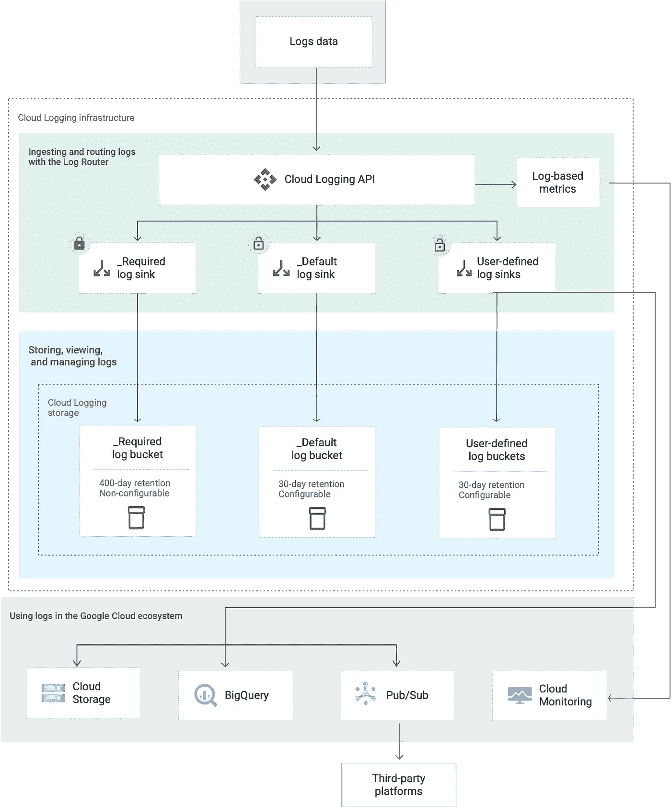
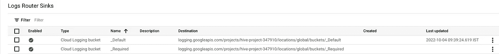
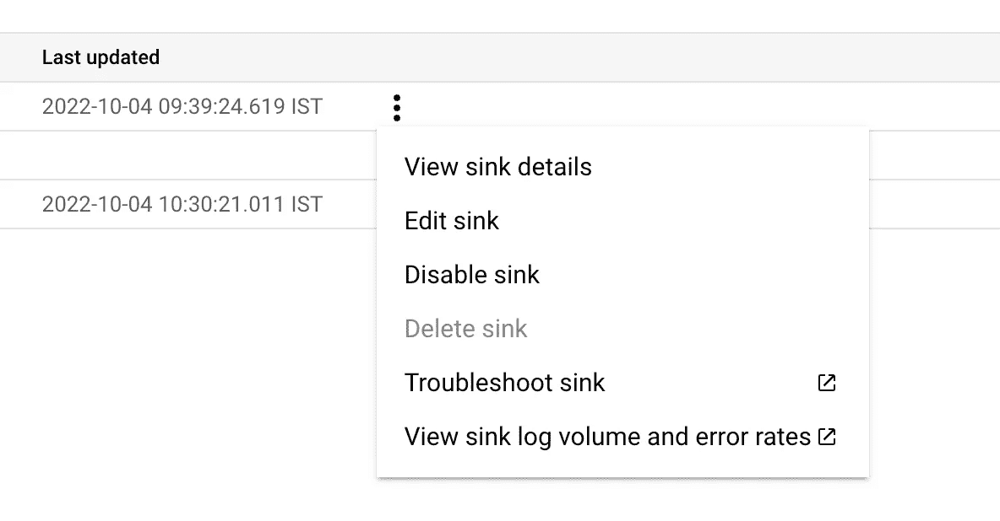
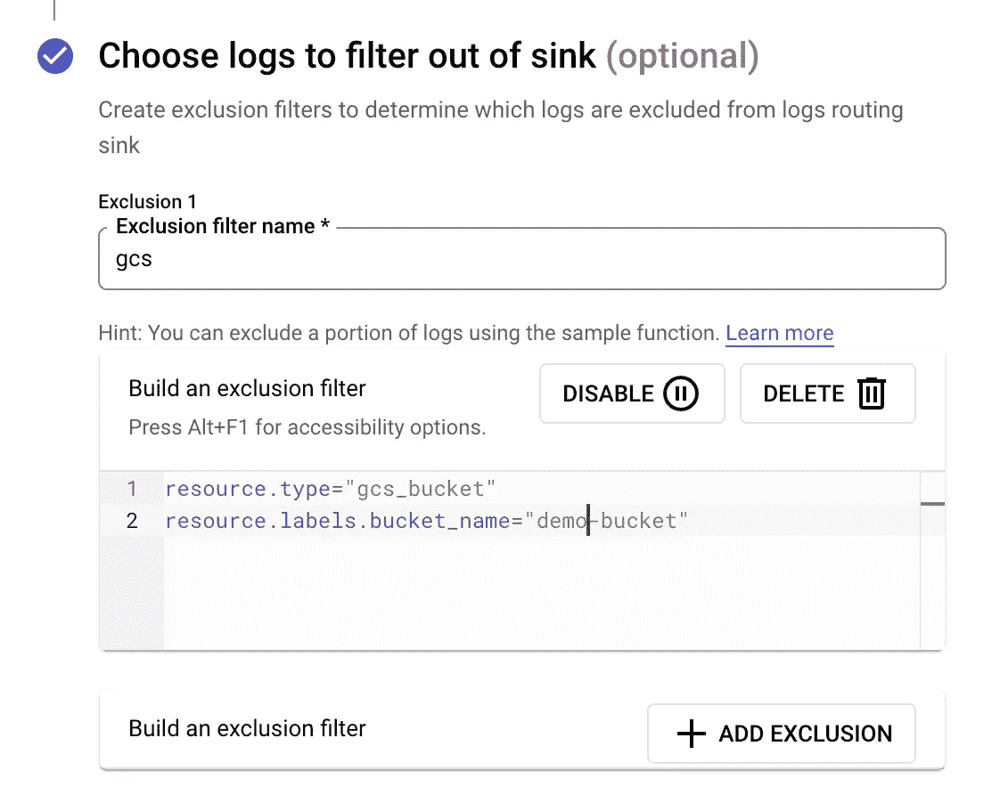

# GCP 云日志记录:如何为选定时段启用数据访问审计

> 原文：<https://medium.com/google-cloud/gcp-cloud-logging-how-to-enable-data-access-audit-for-selected-buckets-aaec12556486?source=collection_archive---------1----------------------->



[数据访问审计日志](https://cloud.google.com/logging/docs/audit#data-access)用于跟踪和监控在任何 GCP 资源上创建、修改或读取用户数据或元数据的 API 调用。默认情况下，数据访问审计日志是禁用的(BigQuery 数据访问审计日志除外)，因为它们会导致生成的日志数量激增，进而导致使用成本飙升。

[点击此处](https://cloud.google.com/logging/docs/audit/configure-data-access#config-console-enable)了解如何启用数据访问审计日志。您会注意到，工作流允许您选择要启用的审核日志的类型(管理员读取、数据读取和数据写入)以及免除审核日志记录的原则。例如，作为调度的一部分，您可能有一个从 GCS 存储桶中读取数据的 Dataproc 工作负载。如果您不想为 Dataproc 使用的服务帐户启用数据访问审计，那么在豁免原则下指定它。

但在启用数据访问审计日志时，您只能配置这些。如果您想从访问审计中免除某些存储桶，或者更进一步，阻止特定的操作，该怎么办呢？

在本帖中，我们将研究如何为选定的 GCS 存储桶启用数据访问审计，同时将同一项目中的其他存储桶排除在审计之外。

这个额外的过滤层将有助于控制日志成本。

# 云日志如何工作的快速概述

谷歌云平台(GCP)中的所有日志活动都是通过日志 API 路由的。日志 API 使用一个健壮的架构来交付您需要的日志——可靠且准时。



日志条目被发送到日志 API，然后通过日志路由器。日志路由器包含定义“哪些”日志需要发送到“哪里”的接收器。

如果接收器配置不正确，日志记录可能会成为您需要支付的最高费用之一。如果启用了数据访问审计日志记录，这一点尤其如此。

# 解决办法

*   一旦您启用了[数据访问审计日志](https://cloud.google.com/logging/docs/audit#data-access)，确保您已经免除了所有不需要记录其访问的主体。
*   然后，导航到**日志记录- >日志路由器(**[https://console.cloud.google.com/logs/router](https://pantheon.corp.google.com/logs/router))



*   您将看到已经为您创建和定义了两个接收器:_Default 和 _Required
*   [_Required](https://cloud.google.com/logging/docs/routing/overview#required-bucket) 是用于路由管理活动日志、系统审计日志和访问透明日志的接收器。该接收器既不能编辑也不能禁用。通过此接收器传送的日志不会产生任何费用。
*   _Default 是发送所有其他日志(包括数据访问审核日志)的接收器。该接收器可以编辑，也可以禁用。点击 3 点下拉菜单并选择**“编辑水槽”**



*   查找标题为— **的部分，选择要从水槽中过滤的日志。**您可以在这里定义希望路由器过滤掉哪些日志，而不发送到接收器中指定的目的地。



*   排除过滤器(以及包含过滤器)需要使用日志查询语言来定义
*   在上面的例子中，我定义了一个简单的排除规则，该规则过滤掉一个名为— **demo-bucket** 的 bucket 中 API 活动产生的数据访问日志。

```
resource.type="gcs_bucket"
resource.labels.bucket_name="demo-bucket"
```

*   关于日志查询语言的详细文档可以在[这里](https://cloud.google.com/logging/docs/view/logging-query-language)找到
*   如果您不想使用预定义的 **_Default** 接收器，您可以创建一个新的接收器，并在那里指定您的自定义规则和条件。确保 _Default 接收器被禁用，否则日志将被路由到两个目标，从而导致成本增加。

**如果只想排除特定操作怎么办？**

日志查询语言允许您不仅在资源级别查询日志，而且在操作级别查询日志，前提是在有效负载中定义了元数据。例如，您可以使用下面的查询来排除名为-demo-bucket 的存储桶上的所有列表操作

```
resource.type="gcs_bucket"
resource.labels.bucket_name="demo-bucket"
logName="projects/<project-name>/logs/cloudaudit.googleapis.com%2Fdata_access"
protoPayload.methodName="storage.objects.list"
```

日志查询语言提供了编写各种复杂查询的机会，使您的过滤器根据您的需要变得通用或细粒度。

# 要记住的事情

*   从接收器中排除的日志条目将继续使用条目。写入 API 配额，因为过滤发生在日志 API 接收条目之后
*   排除过滤器优先于包含过滤器。因此，如果任何日志条目与排除和包含过滤器重叠，该条目将被排除。
*   如果未指定过滤器，则默认情况下会路由所有日志。
*   当您排除一个日志条目时，既不会产生接收费用，也不会产生存储费用。