# GCP —云工作流—以声明方式进行编排

> 原文：<https://medium.com/google-cloud/gcp-cloud-workflows-orchestrate-in-declarative-way-3cfacda25028?source=collection_archive---------2----------------------->

> **云工作流**宣布自 2021 年 1 月起正式发布，该产品正式发布已近一年。云工作流是 GCP 业务流程选项中新增的工具包之一。
> 
> **Cloud composer** 一直是 GCP 平台中满足任何管道编排需求的主要竞争者。**云作曲家 V1** 需要供应和管理整个 PaaS 平台。这也带来了全天候运行 composer 平台的额外成本。作曲家 V2 的出现使得很多管理方面变得简单了。

本博客重点关注云工作流的详细概述、与 Cloud Composer 的比较以及云工作流适合并提供更好替代方案的一些使用案例。

## **简介**

云工作流是**配置驱动(YAML/JSON)的无服务器编排工具。**

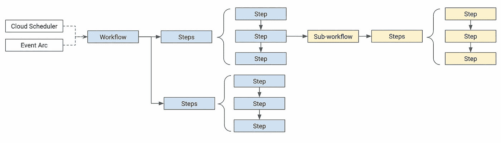

云工作流

云工作流中的每个**工作流**都可以被认为是**步骤的序列。** 在**步骤**中的每个**步骤**代表需要执行的**动作。**

工作流中的**步骤**可以执行**执行调用**，**控制步骤**(迭代，条件执行..)、**错误处理和调用其他子工作流**

云工作流通过 **HTTP 执行调用**提供**与 **GCP 服务(连接器)、本地或其他云中的服务**的集成**。

云工作流可以有可选的**云调度器触发器**来按计划执行，或者**可以对事件弧触发器支持的事件**做出反应

## **开始—创建和执行**

工作流需要提供 **YAML/JSON 配置**，可以通过以下方式之一创建

云控制台—内嵌编辑器
gcloud 命令
Terraform (IaaC —基础设施即代码)

例如，我们将使用云工作流**将 json 文件从 GCS bucket 加载到 BigQuery 表**，并在加载完成后**刷新基表上的物化视图**。

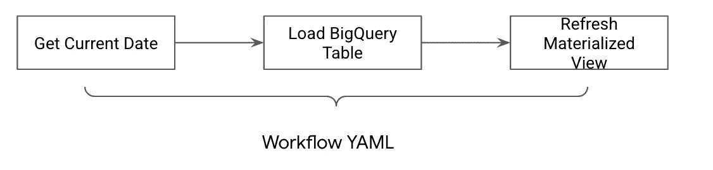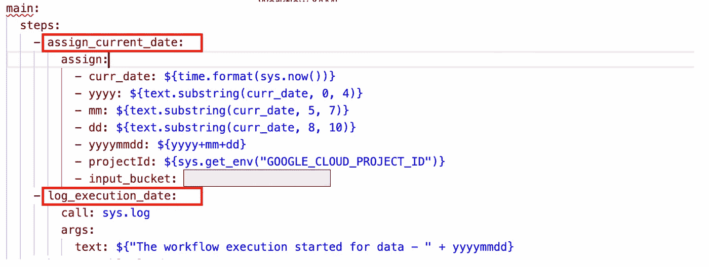

Workflow.yaml —第 1 部分

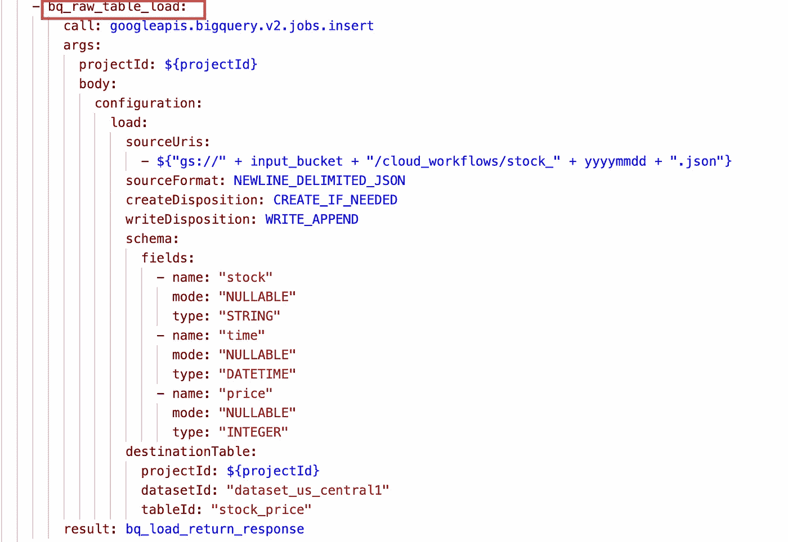

Workflow.yaml —第 2 部分

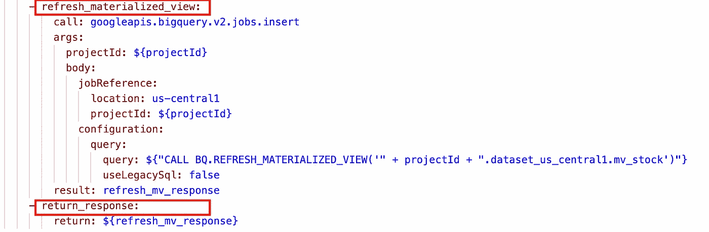

Workflow.yaml —第 3 部分

**隐含地按照申报的顺序依次执行**。

可以使用 gcloud 命令部署工作流，如下所示

```
gcloud workflows deploy wf_bq_load_process --location us-central1 --source=workflow.yaml
```

成功部署工作流后，它将在工作流控制台中可见。

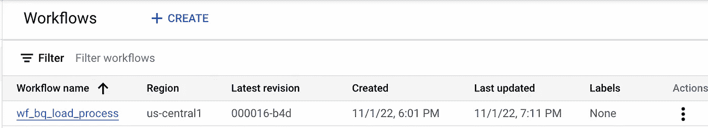

Google 云控制台—工作流列表

工作流显示配置的详细指标、日志、触发器和源

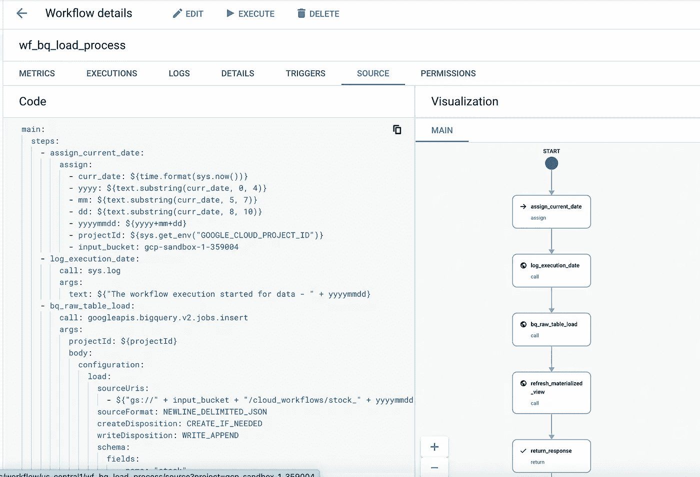

工作流程的图形表示

可以从控制台或使用 gcloud 命令执行工作流，如下所示

```
gcloud workflows execute wf_bq_load_process --location us-central1
```

可以在云控制台中检查执行情况，如下所示

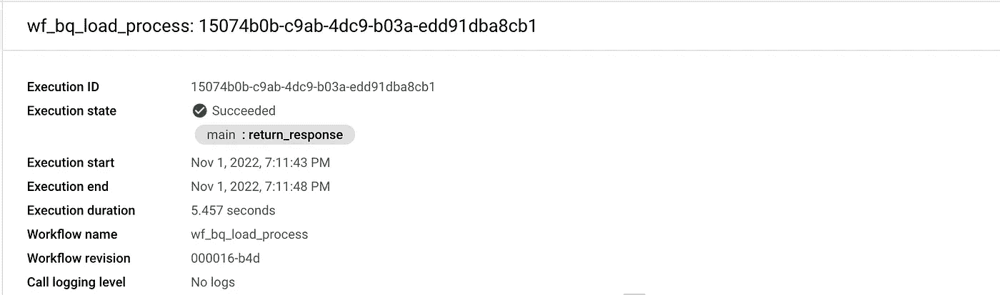

执行细节

## **操作类型**

**呼叫步骤:**

云工作流的核心是**调用**步骤。调用步骤可以用来调用 API 端点。
呼叫步骤分为 3 类呼叫
1。 **API 端点**(外部—内部/其他云)或 [**连接器**](https://cloud.google.com/workflows/docs/reference/googleapis) (用于与 GCP 服务交互)
2 .**调用子工作流**
3。**调用系统定义函数**，如 **sys.log** 记录活动

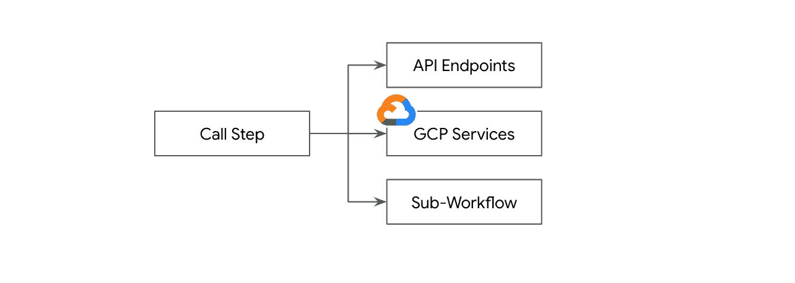

**控制流程**

云工作流可以被认为是以声明方式编写的**程序。****控制流程步骤**有助于不同的功能，如循环、决策、跳过步骤、依赖性或调用另一个子工作流/工作流

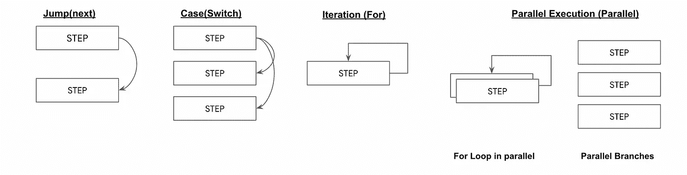

**错误处理流程**

云工作流通过(**尝试**、**除**和**提升**步骤)的方式处理执行中的错误

**变量和参数(步间通信)**

对于工作流或子工作流，可以通过使用变量( [**赋值**](https://cloud.google.com/workflows/docs/reference/syntax/variables#variable-names) 步骤)或运行时参数( [**参数**](https://cloud.google.com/workflows/docs/reference/syntax/runtime-args) )来实现步骤之间的通信。

**变量**可用于存储 API 调用的响应，并相应地采取后续步骤。

## **与 Cloud Composer 的比较**

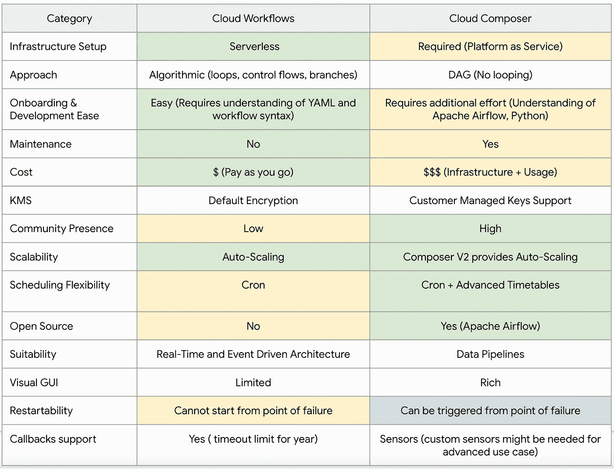

云工作流与云合成器

> Cloud composer 附带了一套非常丰富的操作器和传感器，并与许多内部和外部 GCP 产品广泛集成。

## **云工作流的使用案例**

云工作流的典型用例包括
1。**事件驱动的编排** —通常在事件驱动的系统设计中，云工作流提供了一种非常轻量级的方式来连接服务和编排流程
2。**带人工干预的编排—** 云工作流提供了实现回调的特性，回调可以等待 api 端点的响应，通常用于具有人工批准步骤的操作。
3。**轻量级流程编排—** 适用于对数据管道有轻量级流程编排要求的组织，其中 cloud composer 计费可能是一个问题
4。**过程自动化
5。实时处理**

## **参考文献**

**工作流执行— Python 客户端参考**[https://Cloud . Google . com/Python/docs/Reference/Workflows/latest](https://cloud.google.com/python/docs/reference/workflows/latest)
**g Cloud CLI 工作流参考—**[https://cloud.google.com/sdk/gcloud/reference/workflows](https://cloud.google.com/sdk/gcloud/reference/workflows)
**ML 实现与云工作流**—[https://Cloud . Google . com/community/tutorials/ML-pipeline-with-Workflows](https://cloud.google.com/community/tutorials/ml-pipeline-with-workflows)
**event arc 与云工作流** 【T32