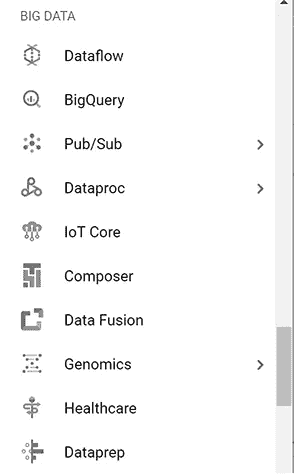
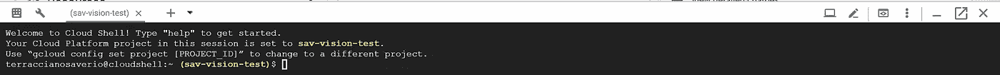

# GCP 仪表板概览

> 原文：<https://medium.com/google-cloud/gcp-dashboard-overview-c80ffd0ed521?source=collection_archive---------0----------------------->

# 让我们熟悉一下它的 UI 和组件吧！

在我们的上一篇文章中，我们看到了如何注册 GCP 和准备我们的环境。一旦完成，我们就准备前往 https://console.cloud.google.com，GCP 仪表板的网址，谷歌云平台提供的网络体验的核心

假设您已经创建了一个项目(如果您还没有，我将在下一篇文章中告诉您如何快速创建)，或者更多，您将会看到一个类似的屏幕:

简单项目的示例仪表板

举个例子，我将使用一个简单的项目，它是我之前演讲的一部分。这个项目使用了 App Engine、BigQuery、云函数、云存储、ML Apis 等服务。

让我们看看发生了什么，从我们在页面中心看到的主要内容开始，慢慢向上到标题:

页面主体包含几个不同的可定制微件，提供与当前项目和 GCP 相关的信息、报告、统计数据和帮助(根据您的项目和设置，您将看到的内容可能会有所不同)。其中的每一个都为您提供了一个上下文菜单，允许您访问相关文档或隐藏小部件:

几乎所有的网站都在底部提供了一个导航按钮，可以引导你找到相关的服务，有些网站会根据内容提供额外的选择，比如编辑图表或添加不同的图表。

现在让我们一个一个地快速浏览一下:

1.  **项目信息** —指定与当前项目相关的基本信息，如名称、ID、编号。
2.  **资源** —列出项目中使用的主要资源/部件。
3.  **Trace** —如果 Stackdriver Trace 被启用，它提供最新的跟踪数据。
4.  **入门** —链接到最常见操作的快速教程。
5.  **App Engine** —它显示与 App Engine 的一个实例的使用相关的图形，默认情况下是计数/秒，但您可以为主图形指定不同的参数或添加新的参数。
6.  **API**—显示项目使用的 API 每秒请求数的图表。
7.  **谷歌云平台状态**——顾名思义，它报告 GCP 服务的状态，在一些中断发生的不太可能的情况下。
8.  **计费** —显示本期与本项目相关的费用估算。
9.  **错误报告** —显示 Stackdriver 错误报告收集的最近 24 小时的错误。
10.  **新闻** —它聚合了与 GCP 和云相关的新闻提要。
11.  **文档**—GCP 文档的热链接。

弹出窗口，为应用程序引擎编辑/添加新的图形小部件

从主内容上移，我们注意到一个带有两个选项卡(仪表板、活动)和自定义的栏

**Dashboard** 是默认选择的选项卡，显示我们刚刚浏览过的所有小部件，而**customize**按钮允许我们快速编辑它们:

自定义模式下的仪表板

您会注意到，在定制模式下，所有小部件的角落都有一个快速切换按钮，并且会提供之前没有的其他小部件(在示例图像计算引擎和 SQL 中为灰色)。一旦你对你的改变感到满意，按下取代定制的完成按钮将完成它们。

另一个选项卡， **Activity** ，将列出项目所有服务部分发生的所有事件，并在右侧提供相关选项进行过滤:

继续向上一层，我们到达主菜单栏:

1.  **导航菜单** —它展开并列出所有最相关的 GCP 组件，并按类别分组，稍后将详细介绍。
2.  **仪表板的导航链接** —如果您在产品页面中，并且想要快速返回导航，这很有用。
3.  **项目选择器** —将显示一个弹出窗口，允许您选择当前项目。
4.  **搜索栏** —允许您在 GCP 提供的产品、服务和功能中进行全文搜索。
5.  **云外壳** —该按钮提供对在 web 控制台中打开的终端窗口中的虚拟机实例的命令行访问，稍后将详细介绍。
6.  **发送反馈** —它将显示一个弹出窗口，其中包含一个分享问题或想法的表格。
7.  **帮助** —显示一个上下文弹出窗口，其中包含文章和支持选项。
8.  **通知** —它会汇总并通知您的项目和账户的相关事件。
9.  **设置** —它允许您设置项目首选项、键盘快捷键、工具下载的直接链接。
10.  **谷歌账户**——很容易猜到，它显示与你当前登录的账户相关的信息，允许你注销或添加其他账户。

6.搜索栏的使用示例，请注意它不仅显示具体的产品或服务，还显示其中的直接操作

点击导航(汉堡包)菜单，打开了一个可能性的世界，诚然，乍一看可能会感到势不可挡，但如果我们开始在更高的层次上看它，了解每个群体做什么，它就会变得不那么可怕。

第一部分包含整个项目共有的元素:

1.  **市场** —在这里你可以找到组件、预打包的解决方案、虚拟机、映像、数据集。
2.  **账单明细**。
3.  **API &服务**——您可以在其中启用和管理您想要添加到项目中的服务(许多服务在您能够使用它们之前必须显式启用)。
4.  **支持** —通过不同的方式寻求帮助(聊天、电话、社区)。
5.  IAM & admin —每个项目的关键部分，身份访问管理，加密密钥&秘密存储，角色管理，审计。
    (我打算很快就此写一篇文章)
6.  **入门** —获取入门教程的另一种方式。
7.  **安全** —它与 IAM & admin 部分重叠，但它也在网络& VPC 端聚合安全功能。

计算—这一部分收集了 GCP 提供的所有计算选项，从传统的完全托管虚拟机(**计算引擎**)，到完全无服务器(**云功能、云运行**)，通过其提供的 PaaS ( **应用引擎**)和 GKE 的容器管理&协调系统。

储物——在这一部分，我们可以找到 GCP 所有不同的储物选择。我们从简单的存储桶(**存储**)到经典的 Sql 实例( **MySql** 、 **PostgreSQL** 、 **SQL Server** )、可水平扩展的 SQL 数据库( **Spanner** )、NoSQL 数据库、宽列数据库( **BigTable** )、内存存储。

网络——顾名思义，从 VPC/VPN 设置、防火墙和安全规则，到我们项目的负载平衡和内容交付网络配置，我们在这里汇总了所有与网络相关的选项。

stack driver——在这里，我们发现收集了一套工具，以隔离或聚合的方式广泛地监控、调试、分析、跟踪和记录我们的代码、实例和服务。

工具——在这一部分中，我们发现一方面是帮助您开发和组织代码的工具和服务，如部署代理、CI/CD 管道、源代码库或容器注册表，另一方面是一组与项目的其他组件协同工作的服务，如云调度程序或异步批处理任务管理器。

大数据—在这一部分，我们可以找到与大数据集的转换、接收和处理相关的产品，这些产品在 convert 中工作，涵盖了该生命周期的所有步骤。你可能听说过这个范围内的核心产品 **BigQuery** ，但是对于更具体的场景，还有其他类似的重要元素，如物联网的**物联网核心**或**基因组学**。
**发布/订阅**和**数据流**通常与其他 GCP 组件(也在本节之外)结合使用，以编排和整理数据。

人工智能——最后但肯定不是最不重要的，我们在 GCP 找到了与人工智能和人工智能相关的产品。GCP 提供的工具涵盖了机器学习中所有的复杂性和用例，从现成的 API 到 **Tensorflow** 支持，以及中级和易于使用的解决方案，如 **AutoML** 和工具，以准备要摄取的数据(**数据标签**)。

最后想讨论的是云壳。
当您按下按钮时，您的个人管理机将被实例化，您将连接到它。

您将拥有对命令行 Linux 环境的终端访问权，该环境具有持久存储(5 Gb ),您可以从中管理所有的云资源。

最常见的开发工具都是预装的(Java，Go，Python，Node。JS，PHP，Ruby…官方页面上的概述没有提到但是也。网芯包括在内，耶！)以及最常用的管理工具如 Docker、Kubernetes、MySql。

您可以打开包含不同项目的多个会话

Cloud Shell 环境是一个 docker 容器，有一个默认的，Google 维护了一个，但是如果你喜欢也可以指定一个不同的。

云壳环境配置

Cloud Shell 还包括一些不错的服务，比如您的服务的网络预览:

还有一个在线可视化代码编辑器，如果您不习惯使用 VIM，它会让您的生活变得更加轻松:

我希望通过这个概述，我已经让你对 GCP 市中心的情况有了一个大致的了解，让它不那么可怕，这样你可能会更容易找到你可能感兴趣的东西。

和往常一样，你可以在 https://twitter.com/TetsuoRyuu 的 Twitter 上联系我，寻求建议、反馈、批评，甚至只是简单的聊天，我的 DM 收件箱永远是开放的。