# GCP —数据流—出口/入口拒绝所有—兔子洞有多远？

> 原文：<https://medium.com/google-cloud/gcp-dataflow-egress-ingress-deny-all-how-far-the-rabbit-hole-goes-46541f361de5?source=collection_archive---------2----------------------->

> Dataflow 是一个**托管服务**，用于运行批处理和流应用程序。数据流运行用 Java/Python/Go 编写的 **apache beam** 作业。
> 
> 在这篇博客中，我们将讨论当存在**高度受限网络** ( **拒绝所有入口和显式拒绝所有出口规则**)时会遇到何种故障，以及它**如何影响数据流工作者**以及需要做什么来处理这些故障

让我们从一个**简单的 apache beam 作业创建**开始，它的功能是**读取一个 JSON 换行符分隔的文件**，**使用 python 库“jsonschema”验证模式**，然后**将传递的/错误记录写入 BigQuery。**

下面是用于解释的样本输入文件

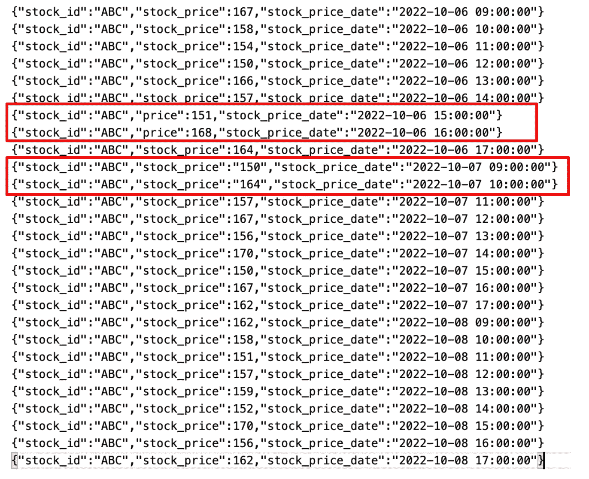

input.jsonl 输入 Json 文件

上面红色标记的行表示模式
1 中的违规。第一组的**股票价格**属性被错误地称为**价格
2。**第二组将**股票价格**作为字符串提及，而不是**数字**

下面是代码片段和功能解释细目。

JSON schema 将使用 JSON 模式规范来解析传入的记录

**validate_dofn** 使用上面的 json 模式并验证传入的记录

数据流管道如下

为工人提及 python 依赖性的设置文件

数据流作业在
1 的网络上提交。**允许同一子网
2 中的工作人员通过端口**进行内部通信。**允许下载 python 依赖项的外部通信
3。子网与私人谷歌访问
4。具有外部 ip 地址的工人**

这项工作运行得非常好，没有遇到任何问题。

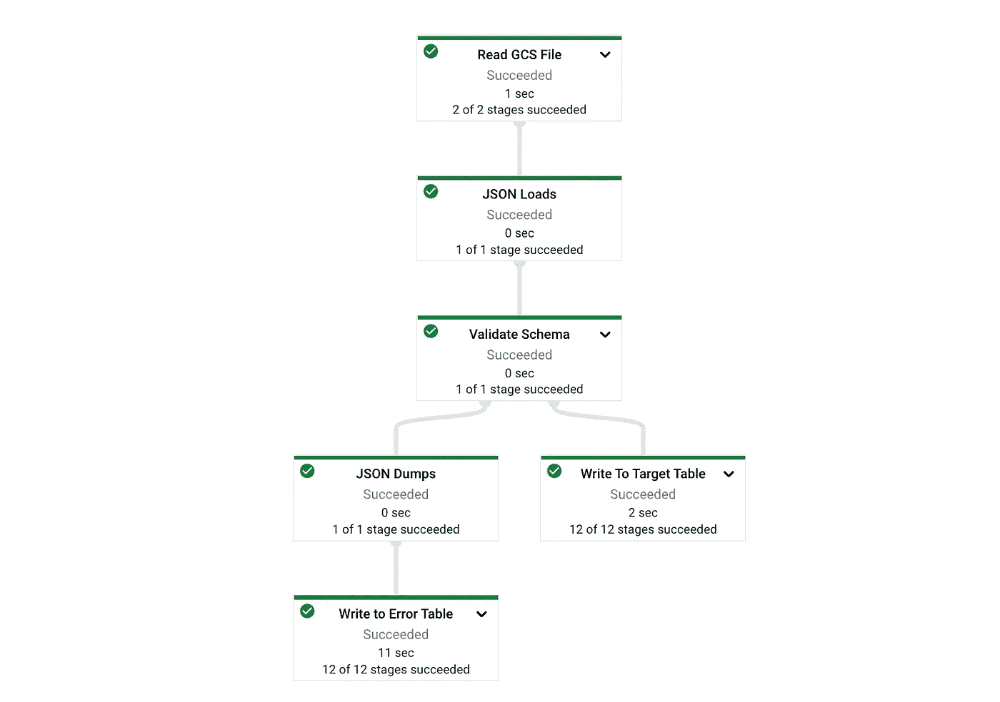

数据流作业图

> 这通常不是客户端网络中的情况。客户端网络在本质上更具限制性

让我们试着在网络中引入 2 个变化。**明确拒绝所有出口规则**

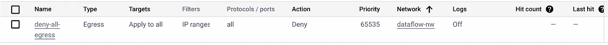

2.**数据流作业的公共 IP 被禁用**

```
--no_use_public_ips
```

现在，当提交作业时会发生什么，作业只是无限期地运行，没有工作日志

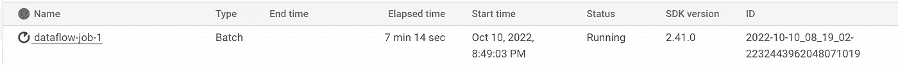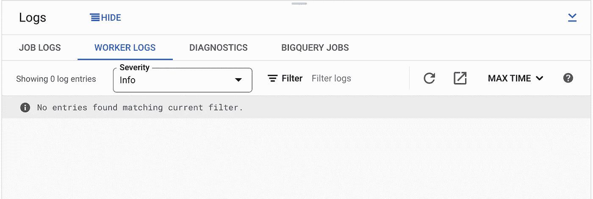

工人日志

我们从文档开始，首先回顾网络规则

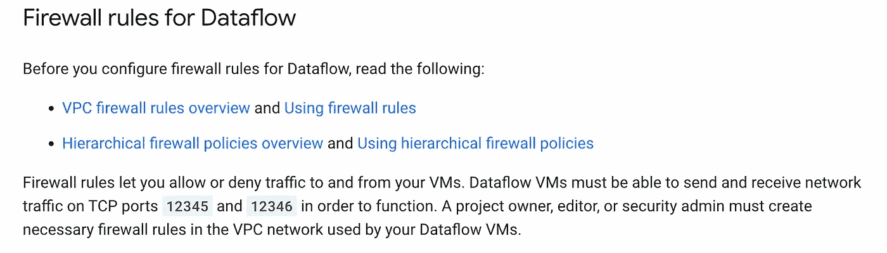

[https://cloud . Google . com/data flow/docs/guides/routes-firewall # firewall _ rules](https://cloud.google.com/dataflow/docs/guides/routes-firewall#firewall_rules)

每个数据流工作虚拟机默认创建有网络标签— **数据流**

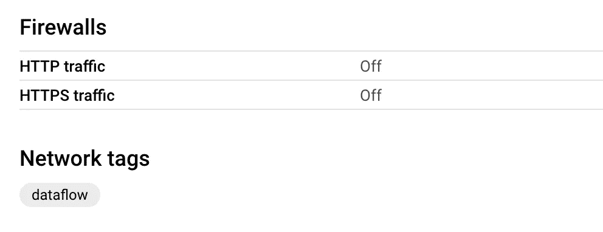

让我们创建一个防火墙规则来允许上述情况

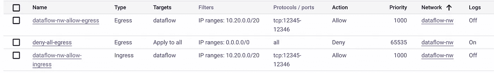

防火墙规则

接下来，当检查网络防火墙日志时，**拒绝所有出口规则**获得命中数

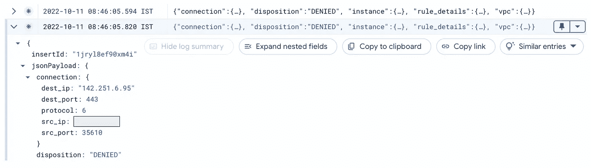

现在这些是 **google api ip 范围**，通信发生在**端口 443 上。**

IP 范围的详细列表发布在以下 2 个链接中

[https://www.gstatic.com/ipranges/goog.json](https://www.gstatic.com/ipranges/goog.json)

[https://www.gstatic.com/ipranges/cloud.json](https://www.gstatic.com/ipranges/cloud.json)

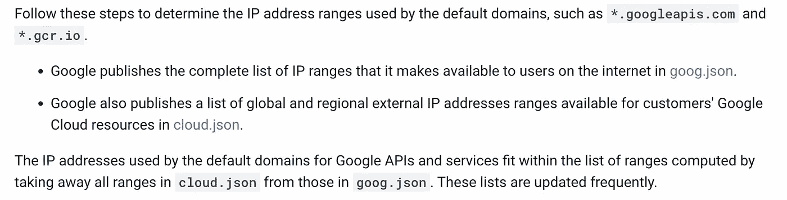

[https://cloud . Google . com/VPC/docs/configure-private-Google-access # config-firewall](https://cloud.google.com/vpc/docs/configure-private-google-access#config-firewall)

让我们创建一个防火墙，允许在提到的 IP 范围列表上的端口 443 通信出口


> 上面的 ip 地址列表是动态的，并且经常更新，允许端口 443 https 通信到 0.0.0.0/0 可能更好，但是这可能会被标记为组织中的漏洞，在这种情况下，需要编写一个程序来读取 IP 范围并刷新防火墙规则

此外，在端口 53 UDP 协议上出现 DNS 解析错误，如下所示

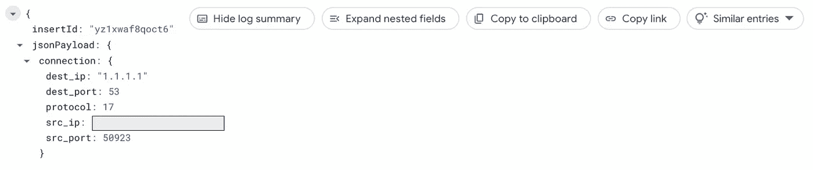

防火墙问题—云日志记录

让我们通过创建允许 DNS 解析发生的防火墙规则来处理它

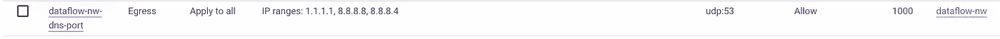

防火墙允许用于 DNS 解析的出口通信

现在，作业被创建，并进入另一个错误，如下所示

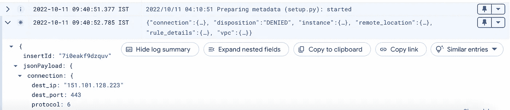

防火墙问题—云日志记录

第一个日志条目显示 **setup.py** 正在准备中，这表明数据流工作者正试图从 pypi 添加额外的 python 包["jsonschema"]，pypi 是外部服务器，在运行数据流工作者的 vpc 网络上被阻止。

为了减少这个错误，让我们创建一个**定制工人容器映像**，其中已经预安装了**必需的包。**

**工人图像**可以从云壳使用 Dockerfile 轻松设置，如下所示

```
FROM apache/beam_python3.7_sdk:2.41.0
RUN pip install --no-cache-dir --upgrade pip
RUN pip install jsonschema==4.16.0
```

使用 gcloud 构建创建自定义容器映像提交

```
gcloud builds submit -t gcr.io/<project>/dataflow/custom-container .
```

创建映像后，可以使用以下选项提交作业

```
--sdk_container_image gcr.io/<>/dataflow/custom-container
```

现在不需要提供 **setup.py** ,因为定制容器拥有所有需要的 python 包依赖关系。

> 使用 setup.py 提及您的代码可能需要的额外模块包

完整的命令如下所示

```
python dataflow_job.py \
--input_file_path gs://<bucket>/dataflow_input/ \
--skip_header_lines 0 \
--bigquery_target_table "<project>:dataset_us_central1.passed_table" \
--bigquery_error_table "<project>:dataset_us_central1.error_table" \
--temp_location "gs://<bucket>/dataflow-temp-path/" \
--runner DataflowRunner \
--project <project> \
--region us-central1 \
--job_name "dataflow-job-1" \
--subnetwork "https://www.googleapis.com/compute/v1/projects/<project>/regions/us-central1/subnetworks/dataflow-subnet-uscentral1" \ **--no_use_public_ips \
--sdk_container_image gcr.io/<project>/dataflow/custom-container**
```

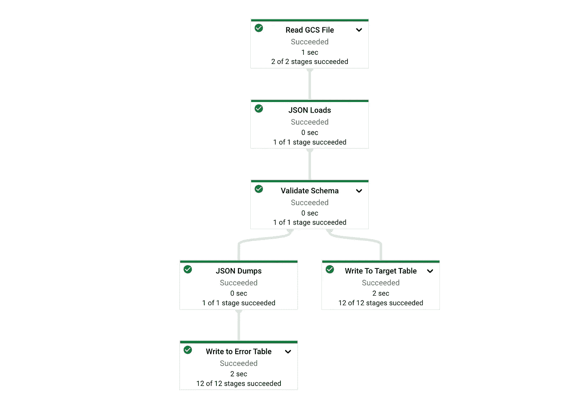

成功的作业执行

总之，执行的活动列表为
1。为标签数据流
2 打开端口 12345:12346 上的数据流工作虚拟机通信。允许在公布的 google api ip 地址列表上的出口通信
3。允许来自 1.1.1.1、8.8.8.8 和 8.8.8.4 的 DNS 解析端口 53 上的出口通信
4。为任何特定的 python 包要求创建自定义容器。

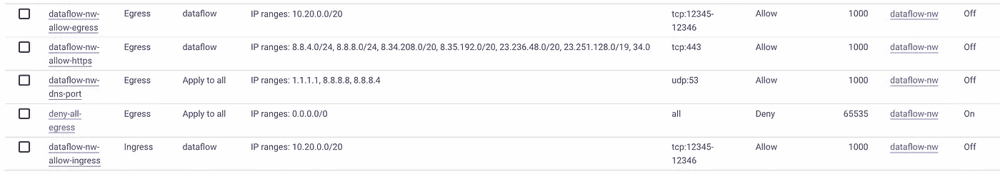

所有防火墙规则的摘要

希望这有助于更好地理解数据流的要求。请发表评论，让我知道这是否有用

LinkedIn-handle—【https://www.linkedin.com/in/murli-krishnan-a1319842/ 