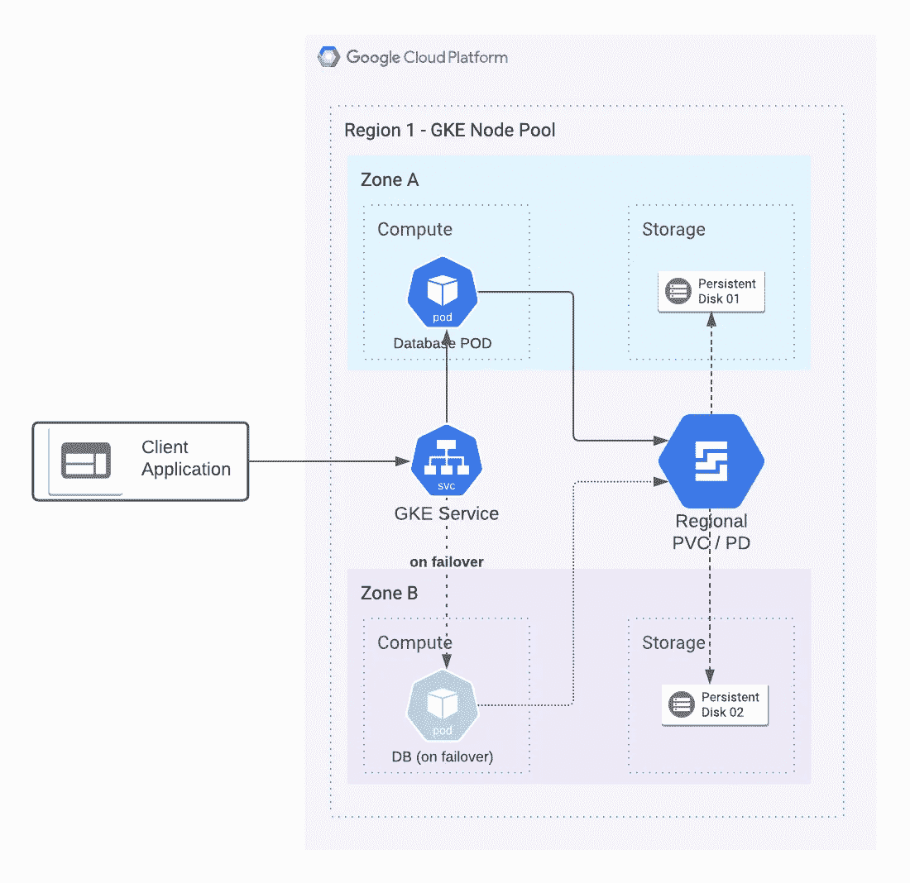

# GCP —在 GKE 部署高可用性数据库

> 原文：<https://medium.com/google-cloud/gcp-deploying-highly-available-databases-with-gke-d4979c7bb6a2?source=collection_archive---------0----------------------->

## 数据库的 GKE

# 介绍

软件应用程序的容器化改变了软件应用程序打包的简易性。除此之外，Google Kubernetes Engine (GKE)使这些容器的管理变得更加容易。在这篇文章中，我们将看看像数据库这样的有状态应用程序如何利用同样的技术。

# 架构图

GKE 的数据库

**识别数据库二进制码**
上图描绘了 GKE 上任何*关系数据库(如 MySQL、Postgresql、MSSQL-Linux)的高可用性部署。你将能够在 [Docker Hub](https://hub.docker.com/) 找到所有这些的现成容器图像。

**创建 GKE 集群** 托管数据库的 GKE 集群应该在单个区域中有一个双区域节点池。这是为了确保基于[区域持久磁盘](https://cloud.google.com/compute/docs/disks/high-availability-regional-persistent-disk)的 HA 设置能够正常工作。
GKE 集群应该有具有备用容量的节点，以便在出现故障时，所有 POD 可以安全地移动到 HA 区域。

**为数据库提供存储** GKE 提供永久卷声明(PVC)来存储数据。可以使用 PD 或 PD SSD 创建 PVC。此外，PVC 可以是区域的或区域性的(双区域的)。在此设置中，您应该使用[区域 PD/PD-SSD 实现 HA](https://cloud.google.com/compute/docs/disks/high-availability-regional-persistent-disk) 目的。区域 PD/PD-SSD 自动维护两个数据副本(图中的磁盘 01 和磁盘 02)。

**GKE 服务**
这是一个允许客户端应用程序与数据库通信的门面。虽然可以有各种低级实现，但通常内部负载平衡器(ILB)是在 GKE 服务的幕后生成的。故障转移后，gke 服务会自动重新配置，以便在新的 gke pod 上发送流量。

# 参考实现

[使用 GKE](https://cloud.google.com/solutions/deploying-highly-available-postgresql-with-gke)
部署高可用性 postgresql 阅读上面的文章(我写的)以获得使用 PostgreSQL 的详细说明。然而，同样可以采用任何*通用关系数据库。