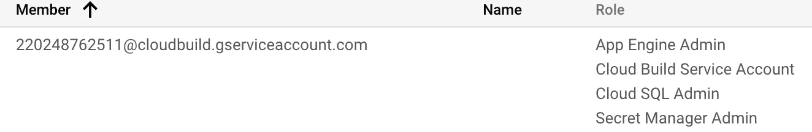

# GCP:通过应用引擎、云构建和 GitHub 进入生产阶段

> 原文：<https://medium.com/google-cloud/gcp-deploying-to-app-engine-from-github-using-cloud-build-df2582f968c7?source=collection_archive---------0----------------------->


我们正在使用本教程，通过 CI/CD(持续集成和持续交付)管道将[库存管理休息](https://github.com/kioie/InventoryManagement)应用程序投入生产。我们的目标是在谷歌计算平台(GCP)应用引擎 flex 环境上构建和部署。

我们将使用 Spring，Cloud SQL，App Engine，Cloud Secret Manager，Cloud Build 和 GitHub。

# 春天的云

[春云](https://spring.io/projects/spring-boot)旨在缩短代码长度，为您提供最简单的 web 应用开发方式。通过注释配置和默认代码，Spring Cloud 缩短了开发应用程序的时间。它有助于创建一个几乎不需要配置的独立应用程序。

# 云 SQL

[Cloud SQL](https://cloud.google.com/sql) 是一个完全托管的关系数据库服务，适用于 MySQL、PostgreSQL 和 SQL Server，由 Google 运行，因此可以轻松集成现有应用和 Google 云服务。

# 应用引擎

[App Engine](https://cloud.google.com/appengine) 是一个平台即服务，用于在谷歌管理的基础设施上大规模开发和托管网络应用。它允许您从几种流行的语言、库和框架中进行选择，以开发和部署您的应用程序，包括带有 Spring 的 Java。应用程序被沙盒化并部署在整个 Google 基础设施中，在应用程序的整个生命周期中，不再需要环境配置和管理。使编写可伸缩的应用程序变得容易。

# 云秘密管理器

> [Secret Manager](https://cloud.google.com/secret-manager) 是一个安全便捷的存储系统，用于存储 API 密钥、密码、证书和其他敏感数据。Secret Manager 提供了一个集中的地方和单一的真实来源来管理、访问和审计 Google Cloud 或其他任何地方的秘密。

这是谷歌的一个相对较新的功能(截至 2020 年 5 月)，旨在弥合围绕 GCP 生态系统已经存在了相当长一段时间的差距。事实上，我们在这里的部署提供了一个很好的用例:

> **您如何轻松管理凭证、密码、秘密、api 密钥和其他敏感数据，同时将您的应用托管在具有 CI/CD 管道的公共存储库(又名 GitHub)上，这需要成功构建敏感数据？**

在这篇 [**文章**](/@kioi/gcp-secret-manager-c043e73679d5) 中我会多谈一点秘密经理人。

# 云构建

云构建是一项在谷歌云平台基础设施上执行构建的服务。Cloud Build 可以从云存储、云资源存储库、GitHub 或 Bitbucket 导入源代码，根据您的规范执行构建，并生成 Docker 容器或 Java 归档等工件。

# 开源代码库

还需要我多说吗？

**先决条件**1。在[谷歌云平台控制台](https://console.cloud.google.com/)中创建一个项目。
2。为您的项目启用计费。
3。安装[谷歌云 SDK](https://github.com/GoogleCloudPlatform/community/blob/master/sdk) 。
4。安装 maven
5。创建 GitHub 帐户

# 入门指南

1.首先初始化云 SDK，创建一个 App Engine 应用程序，并授权云 SDK 在您的本地环境中使用 GCP API:

```
gcloud init
gcloud app create
gcloud auth application-default login
```

# 设置云 SQL

1.启用[云 SQL API](https://console.cloud.google.com/flows/enableapi?apiid=sqladmin&_ga=2.97716831.1749283848.1589680102-1322801348.1576371208&_gac=1.250162036.1587192241.CjwKCAjwp-X0BRAFEiwAheRui4GkVAiJEcD-d_dhMaMnTeAmRAMMUBXLV45atuLUiiLinEjPGLLbuhoCzD8QAvD_BwE) 。
2。按照这些说明创建一个云 SQL (MySQL)实例并设置 root 用户密码[。](https://cloud.google.com/sql/docs/mysql/create-instance#create-2nd-gen)

```
gcloud sql instances create test-instance-inventory-management --tier=db-n1-standard-1 --region=us-central1
```

3.为“root @ %”MySQL 用户设置密码

```
gcloud sql users set-password root --host=% --instance test-instance-inventory-management --password [PASSWORD]
```

***确保用自己的密码*** 替换 `***[PASSWORD]***`

*4.设置`inventory`数据库。*

```
*gcloud sql databases create inventory --instance=test-instance-inventory-management*
```

*5.获取实例的`connectionName`，格式为`project-id:zone-id:instance-id`:*

```
*gcloud sql instances describe test-instance-inventory-management | grep connectionName*
```

*现在让我们测试一下我们的云 Sql 数据库，看看我们是否能够使用这个数据库。我们将从克隆项目和本地测试开始*

```
*git clone [https://github.com/kioie/InventoryManagement.git](https://github.com/kioie/InventoryManagement.git)
cd InventoryManagement/*
```

*我们将快速更新我们的`application-mysql.properties`文件。我们将替换实例连接名称、数据库名称、用户名和密码。* 

*更新`src/main/resources/application-mysql.properties`:*

```
*#CLOUD-SQL-CONFIGURATIONS
spring.cloud.appId=sample-gcp-project
spring.cloud.gcp.sql.instance-connection-name=sample-gcp-project-277704:us-central1:test-instance-inventory-management
spring.cloud.gcp.sql.database-name=inventory
##SQL DB USERNAME/PASSWORD
spring.datasource.username=root
spring.datasource.password=xxxxx*
```

****注:用预配置的数据库实例口令***

替换“xxxxx ”,启动 Spring Boot 应用程序*

```
*mvn spring-boot:run*
```

*测试应用程序*

```
*curl [http://localhost:8080/inventory/](http://localhost:8080/inventory/)*
```

# *设置机密管理器*

1.  *启用[秘密管理器 API](https://console.cloud.google.com/flows/enableapi?apiid=secretmanager.googleapis.com&redirect=https://console.cloud.google.com&_ga=2.72503123.1749283848.1589680102-1322801348.1576371208&_gac=1.225110888.1587192241.CjwKCAjwp-X0BRAFEiwAheRui4GkVAiJEcD-d_dhMaMnTeAmRAMMUBXLV45atuLUiiLinEjPGLLbuhoCzD8QAvD_BwE)*

***您需要授予应用程序访问权限**
——进入 [IAM &管理页面](https://console.cloud.google.com/iam-admin/iam?_ga=2.101936833.1749283848.1589680102-1322801348.1576371208&_gac=1.224978664.1587192241.CjwKCAjwp-X0BRAFEiwAheRui4GkVAiJEcD-d_dhMaMnTeAmRAMMUBXLV45atuLUiiLinEjPGLLbuhoCzD8QAvD_BwE)
——点击页面顶部的`**Project selector**`下拉列表。
-在出现的`**Select from**`对话框中，选择您想要启用 Secret Manager 的组织。
-在`**IAM**`页面中，点击`app engine service account`旁边的`**Edit**`。
-在出现的`**Edit permissions**`面板上，添加必要的角色。
-点击`**Add another role**`。选择`**Secret Manager Admin**`。
-添加完角色后，点击`**Save.**`

2。为我们的数据源配置文件创建新的秘密。*

```
 *echo -n “sample-gcp-project-277704:us-central1:test-instance-inventory-management” | gcloud secrets create spring_cloud_gcp_sql_instance_connection_name — replication-policy=”automatic” — data-file=-

echo -n “inventory” | gcloud secrets create spring_cloud_gcp_sql_database_name — replication-policy=”automatic” — data-file=-

echo -n “root” | gcloud secrets create spring_datasource_username — replication-policy=”automatic” — data-file=-

echo -n “test123” | gcloud secrets create spring_datasource_password — replication-policy=”automatic” — data-file=-*
```

****注:记住在这里使用你自己的凭证进行*** `***spring_cloud_gcp_sql_instance_connection_name***` ***和*** `***spring_datasource_password***`

确认你的秘密已经被运行`gcloud secrets list`创建*

*3.我们现在用机密 url 替换`application-mysql.properties`文件中的值。对于这一步，您将需要 GCP 上定义的机密的全限定名称。*

```
*gcloud secrets describe spring_cloud_gcp_sql_instance_connection_name | grep name

gcloud secrets describe spring_cloud_gcp_sql_database_name | grep namegcloud secrets describe spring_datasource_username | grep namegcloud secrets describe spring_datasource_password | grep name*
```

*我们现在将使用这些名称来创建一个 secret manager url。url 将使用格式`${sm://FULLY-QUALIFIED-NAME}`，其中`FULLY-QUALIFIED-NAME`与上面检索的一样。*

*所以我们更新`src/main/resources/application-mysql.properties:`*

```
*#CLOUD-SQL-CONFIGURATIONS
spring.cloud.appId=sample-gcp-project
spring.cloud.gcp.sql.instance-connection-name=${sm://projects/.../secrets/spring_cloud_gcp_sql_instance_connection_name}
spring.cloud.gcp.sql.database-name=${sm://projects/.../secrets/spring_cloud_gcp_sql_database_name}
##SQL DB USERNAME/PASSWORD
spring.datasource.username=${sm://projects/.../secrets/spring_datasource_username}
spring.datasource.password=${sm://projects/.../secrets/spring_datasource_password}*
```

*重启 Spring Boot 应用程序:*

```
*mvn spring-boot:run*
```

*测试您的应用:*

```
*curl [http://localhost:8080/inventory/1](http://localhost:8080/inventory/1)*
```

# *用源文件设置 GitHub 存储库*

1.  *如果你还没有一个 GitHub 帐号，创建一个。*
2.  *在目标云项目中启用[云构建 API](https://console.cloud.google.com/flows/enableapi?apiid=cloudbuild.googleapis.com) 。*
3.  *继续之前，请派生此存储库。这一步很重要，因为您将把您的更改推送到此回购
    a .导航到[https://github.com/kioie/InventoryManagement](https://github.com/kioie/InventoryManagement)
    b .在页面的右上角，单击`**Fork**`。*

**

*分叉项目*

*4.在 Github 上安装 Google Cloud Build 应用。您可以按照此处的[](https://cloud.google.com/cloud-build/docs/automating-builds/run-builds-on-github#installing_the_google_cloud_build_app)**指令进行操作。***

******确保您选择了*** `***kioie/InventoryManagement***` ***库叉作为您要连接的库，否则这个构建将无法工作。******

***5.在谷歌云控制台中，打开云构建[构建触发器](https://console.cloud.google.com/cloud-build/triggers?_ga=2.173763299.1749283848.1589680102-1322801348.1576371208&_gac=1.259777016.1587192241.CjwKCAjwp-X0BRAFEiwAheRui4GkVAiJEcD-d_dhMaMnTeAmRAMMUBXLV45atuLUiiLinEjPGLLbuhoCzD8QAvD_BwE)页面。***

******在进入下一步之前，确保删除所有创建的、可能与该项目相关的触发器。******

***6.选择您的 Google Cloud 项目并点击`**Open**`。***

***7.点击`**Create Trigger**`。***

***8.填写选项***

*   ****必选*。在`**Name**`字段中，输入名称***
*   ****可选*。在`**Description**`字段中，输入触发器工作方式的简要描述***
*   ***在`**Event**`下，选择`**Push to a branch**`***
*   ***在`**Source**`下拉列表中选择`kioie/InventoryManagement`仓库
    ***注意:如果该仓库没有出现，点击*** `***Connect New Repository***` ***按钮，在 GitHub 上连接您的回购，然后返回步骤 5。******
*   ***在`**Branch**`下，输入`^master$`***
*   ***在`**Build Configuration**` 下选择`**Cloud Build configuration file (YAML or JSON)**`
    为`Cloud Build configuration file location`输入`cloudbuild.yaml`
    ***注意:不要多加一个*** `***/***`***
*   ***点击`**create**`***

***9.在您的活动触发器下，您应该能够看到您新创建的触发器。***

# *****一些简要信息*****

***作为 Google Cloud Build 应用程序的一个要求，您的存储库必须包含一个`[Dockerfile](https://docs.docker.com/get-started/part2/#define-a-container-with-dockerfile)`或`[cloudbuild.yaml](https://cloud.google.com/cloud-build/docs/build-config)`文件才能成功配置您的构建。***

***`Dockerfile`一般用于建造码头集装箱。如果您使用云构建 Docker 构建，您将需要一个`Dockerfile`。本教程针对应用引擎构建，但是您会注意到样例 repo 包含一个`Dockerfile`。这是因为云构建包含一个额外的步骤，该步骤通过创建一个容器工件来完成，尽管这对于本教程来说不是必需的。***

***`cloudbuild.yaml`是云构建的配置文件。您可以在以下场景中使用`cloudbuild.yaml` :***

*   ***对非 Docker 构建使用云构建应用程序时。***
*   ***如果你想微调你的 Docker 构建，你可以提供一个除了`Dockerfile`之外的`cloudbuild.yaml`。如果您的存储库包含一个`Dockerfile`和一个`cloudbuild.yaml`，Google Cloud Build 应用程序将使用`cloudbuild.yaml`来配置构建。***

# ***设置应用引擎***

***我们将需要我们的部署应用程序引擎。最后，我们的应用程序将在[https://YOUR _ PROJECT _ id . appspot . com](https://YOUR_PROJECT_ID.appspot.com)上部署和访问***

1.  ***`pom.xml`已经包含了`projectId`和`version`的配置。我们将对此进行更改，以反映当前的项目 ID。
    `<deploy.projectId>sample-gcp-project-276208</deploy.projectId>`***
2.  ***启用[应用引擎管理 API](https://console.developers.google.com/apis/library/appengine.googleapis.com)***
3.  ***启用 [App 引擎灵活 API](https://console.developers.google.com/apis/library/appengineflex.googleapis.com)***
4.  ***我们需要给云构建服务帐户更多的权限***

*****您需要授予 cloudbuild 服务帐户、Secret Manager 的管理员访问权限、应用引擎和云 Sql** 。***

*   ***转到 [IAM &管理页面](https://console.cloud.google.com/iam-admin/iam?_ga=2.101936833.1749283848.1589680102-1322801348.1576371208&_gac=1.224978664.1587192241.CjwKCAjwp-X0BRAFEiwAheRui4GkVAiJEcD-d_dhMaMnTeAmRAMMUBXLV45atuLUiiLinEjPGLLbuhoCzD8QAvD_BwE)***
*   ***点击页面顶部的`**Project selector**`下拉列表，选择当前项目组织。***
*   ***在 **IAM** 页面上，在`cloud build service account`旁边，(不要与`cloud build service agent`混淆)点击`**Edit**`(或铅笔按钮)。***
*   ***在出现的`**Edit permissions panel**` 上，添加必要的角色。***
*   ***点击`**Add another role**`。并添加特定的角色。
    我们将增加 3 个角色:
    —应用引擎管理员
    —云 SQL 管理员
    —秘密管理员管理员***
*   ***添加完角色后，点击`**Save**`。***

***最终的权限列表应该如下所示***

******

***权限列表***

***我们现在进入触发云构建的最后一步。我们将把更新后的代码推送到 GitHub。***

# ***按下 GitHub 并触发构建***

1.  ***添加您的远程 GitHub fork repo 作为您的上游 repo***

```
***git remote add upstream [https://github.com/YOUR_ACCOUNT_NAME/InventoryManagement](https://github.com/YOUR_ACCOUNT_NAME/InventoryManagement)
git remote -vv***
```

***2.提交您的更改***

```
***git add .
git commit***
```

***3.向上游推进***

```
***git push upstream master***
```

***4.这应该会自动触发您在 GCP 云上的构建。您可以使用下面的命令检查您的构建状态***

```
***gcloud builds list***
```

***5.希望您的构建以成功的结果完成，如果是这样，您可以用命令获取应用程序的 url***

```
***gcloud app browse***
```

***6.我们现在可以测试我们的端点***

```
***curl [https://sample-gcp-project-277704.uc.r.appspot.com/inventory](https://sample-gcp-project-277704.uc.r.appspot.com/inventory)
curl [https://sample-gcp-project-277704.uc.r.appspot.com/inventory/1](https://sample-gcp-project-277704.uc.r.appspot.com/inventory/1)
curl [https://sample-gcp-project-277704.uc.r.appspot.com/inventory/2](https://sample-gcp-project-277704.uc.r.appspot.com/inventory/2)***
```

***如果一切顺利，你现在有一个运行在 GCP 应用引擎上的应用，使用云构建部署，托管在 GitHub 上，并使用秘密管理器来维护你的秘密。***