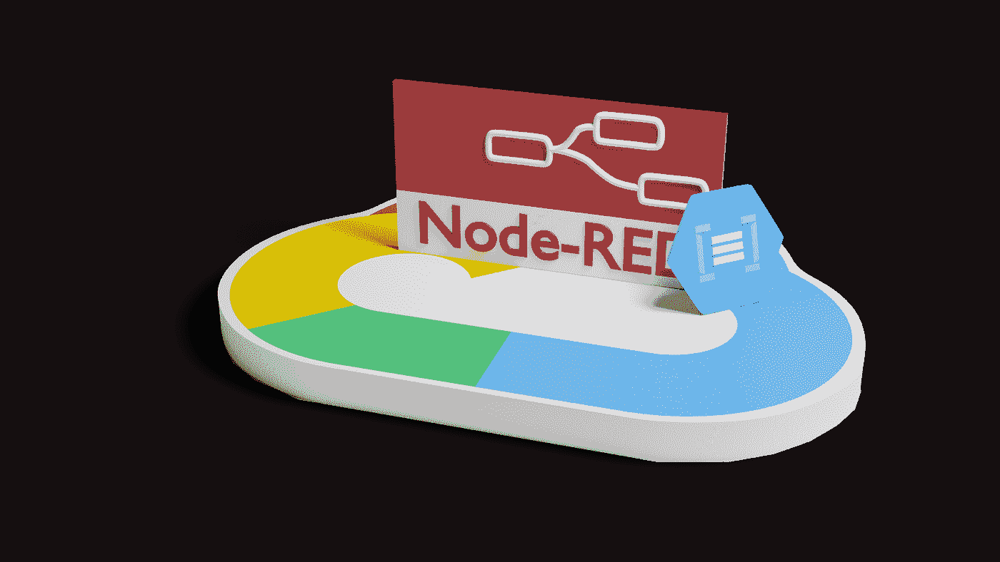
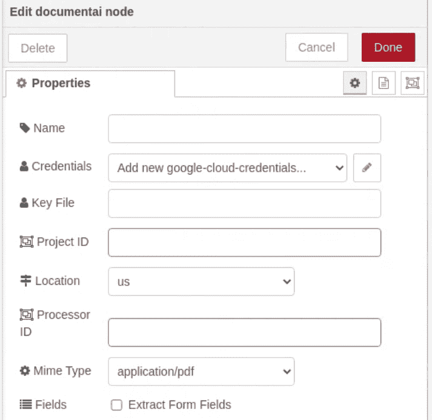

# GCP 文档 AI 和 Node-RED

> 原文：<https://medium.com/google-cloud/gcp-document-ai-and-node-red-d062d7d7768e?source=collection_archive---------0----------------------->

谷歌的文档人工智能服务允许你处理文档，并将其内容解析成结构化和机器可读的数据。当我们在这里考虑文档时，请考虑扫描的文档，而不是已经有结构化内容的 Google 或 Word 文档。相反，请考虑可能输入了手写或键入值的文档。此类文档的示例可能包括:

*   W2 收益表
*   1099 收入申报
*   你的驾照或护照
*   拜访新医生时填写的当前药物表格

文档 AI 产品/服务在此详细描述[。该服务旨在通过调用公开和记录的 API 在您自己的应用程序中使用。这些 API 可以通过 REST 调用和各种编程语言客户端库获得。](https://cloud.google.com/document-ai/docs/basics)

与文档 AI 完全分离的是名为 [Node-RED](https://nodered.org/) 的开源项目，该项目提供了一个非常低代码的可视化绘图组装环境，以将离散功能的可组合构建块连接到解决方案中。Node-RED 已经存在很多年了，并且越来越受欢迎。在 Node-RED 环境中，可以可视化地将传入请求到达时调用的组件连接在一起。Node-RED 是高度可扩展的，这意味着随着新技术的出现，它们可以作为额外的新构建块集成到 Node-RED 中使用。这些新的构造块(称为节点)可以包含在一个存储库中，该存储库可以在节点红色环境中进行搜索。有一个专用于 GCP 集成的[节点包](https://flows.nodered.org/node/node-red-contrib-google-cloud)。该软件包包括对以下内容的支持:

*   发布/订阅
*   BigQuery
*   云存储
*   记录
*   Firestore
*   物联网
*   其他…

随着 GCP 的文档人工智能成为一项新服务，支持文档人工智能的新节点已被添加到列表中。

该节点将文档数据作为输入，然后调用 GCP 文档人工智能服务。该调用的结果是解析后的数据，该数据可立即用于下游节点的处理。下面显示了一个简化的图表，其中我们从 Pub/Sub 接收一条消息(包含一个原始文档)，将它传递给文档 AI，然后将解析后的结果插入到 BigQuery 表中。

现在让我们来看看新文档 AI 节点的更多细节。我不打算解释节点红色或一般 GCP 概念，假设你可以在其他地方学习。参考链接包含在参考文献的末尾。

文档 AI 节点的输入期望在传入的`msg.payload`中找到数据。因为我们传入的是二进制数据，所以有效负载应该是 base64 编码的字符串。这通常是通过用于启动 Node-RED 流的 REST 请求传递的内容……但是，Node-RED 能够将二进制数据(例如从 GCS 对象读取的数据)转换为其等效的 base64 格式。目前 Document AI 支持 PDF、GIF、TIFF 数据格式。我们需要告诉文档 AI 数据的格式。我们可以用两种方法做到这一点。第一个是将`msg.mimeType`字段设置为数据的 Mime 类型。这将是以下情况之一:

*   应用程序/pdf
*   图片/gif
*   图像/tiff

或者，我们可以在节点的配置属性中指定一个固定数据类型。

`msg.mimeType`优先于已配置的 mime 类型。

当调用文档人工智能时，我们必须首先配置一个文档人工智能处理器。当我们这样做时，我们被提供一个处理器 ID 值。我们希望文档 AI 运行的项目 ID、处理器 ID 和位置的三元组必须在相应的参数中提供。

调用文档 AI 节点后，结果将在节点输出的新的`msg.payload`中找到。这是对应于这里描述的文档 AI 数据结构的对象。文档 AI 返回的每个字段都可以由 Node-RED 流程中的下游节点直接处理。

当一个文档 AI 处理器被定义时，我们可以明确地声明它是一个表单处理器类型。然后，Document AI 将显式地解析出它找到的表单字段，将其转换成名称/值对。这是非常聪明的服务，但消费数据并不是最容易的。我们得到的是一个[数据结构](https://cloud.google.com/document-ai/docs/reference/rest/v1beta3/Document#FormField)列表，它为我们提供了对应于字段的每个名称和值的解析文档原始文本的开始/结束索引。通常仍需要工作来使用这些值。文档 AI 节点中的一个可选选项称为“提取表单字段”。选择此项时，将处理已解析文档中的任何表单字段，并在`msg.payload.formFields`添加一个新的名称/值对数组。请将此视为一项辅助功能。

下面的视频演示了在 Node-RED 中如何使用文档 AI 节点:

# 参考

*   [节点-红色主页](https://nodered.org/)
*   [谷歌云平台上的 Node-RED](/google-cloud/running-node-red-on-google-cloud-platform-under-docker-3d4185e97f28)
*   [博客:Node-RED 低代码编程来到 GCP—2020–02](https://cloud.google.com/blog/products/application-development/using-node-red-with-google-cloud)
*   [GCP 节点-红色节点:Github-Google cloud platform/Node-RED-contrib-Google-cloud](https://github.com/GoogleCloudPlatform/node-red-contrib-google-cloud)
*   [node-red-contrib-Google-cloud——GCP 的 Node-RED 节点](https://flows.nodered.org/node/node-red-contrib-google-cloud)