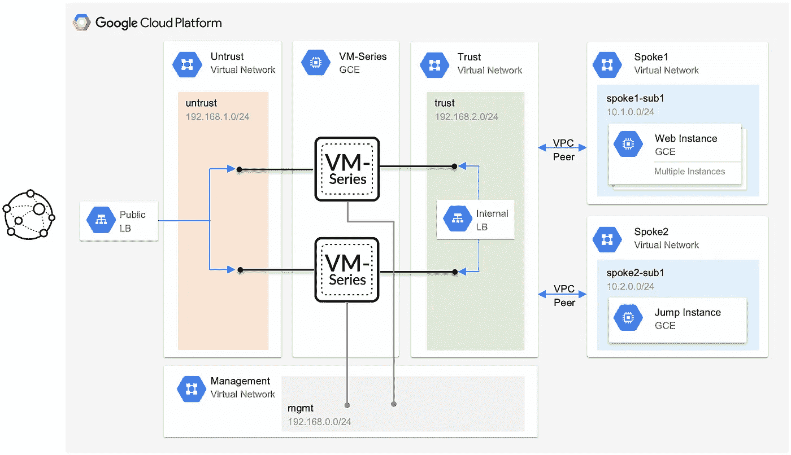
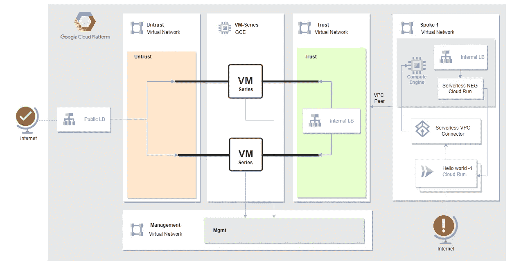

# GCP 企业登陆区|保护通过 Palo Alto VM 系列(NGFW)运行的云的入口流量

> 原文：<https://medium.com/google-cloud/gcp-enterprise-landing-zone-securing-the-ingress-traffic-for-cloud-run-through-the-palo-alto-vm-a896d976241a?source=collection_archive---------0----------------------->

现在是 2022 年，我们生活在一个高度需求云转型的时代。早些时候，初创公司可以灵活地加入云环境，以利用云的优势——主要是创新和敏捷性。

初创公司更容易开始使用云，因为他们没有或很少受到内部部署和相关供应商/系统依赖的影响。企业在开始使用云时面临巨大挑战，主要原因如下

1.  相关系统/供应商
2.  过时的系统/应用程序
3.  遵守安全合规性和审计

云自诞生以来一直在不断成熟，并通过文档和新功能慢慢铺平了道路，使企业能够轻松地迁移到云，并利用云带来的业务优势。

一个组织可以通过三种不同的方式广泛利用云。每种方式都提供不同的商业利益。这些是:-

1.  IaaS(基础设施即服务)
2.  平台即服务
3.  SaaS(软件即服务)

企业通常采用云技术，期望根据其审计和安全性合规性来使用安全性。

其中一个主要要求是在访问内部应用程序之前对互联网流量启用 NGFW 检查。

这适用于 IaaS 和 PaaS，因为 SaaS 是部署在 URL 上的软件，由单独的团队管理

# 在 IaaS(中心辐射模型)中启用 NGFW

图 1.1

图 1.1 是一个在 GCP 上实现 IaaS 的示例架构

在下面的体系结构中，

1.  互联网流量从公共 LB 进入
2.  NGFW 会检查这些流量
3.  最后，流量被转发到内部应用程序，并开始返回流量，从而完成整个流程

# 在 PaaS(中心辐射模型)中启用 NGFW

PaaS 代表平台即服务。我们将考虑本文档范围内的云运行。(目前仅支持云运行)

直到最近，通过 NGFW 检查从互联网到云运行的流量仍具有挑战性。以下是在[着陆区](https://cloud.google.com/architecture/landing-zones)设置云运行的方法

1.  当我们旋转云运行应用程序时，我们得到一个与该应用程序相关联的公共 url。我们可以使用这个公共 URL 来加载应用程序。不幸的是，我们无法使用公共 url 检查通过 NGFW 运行到云的流量。
2.  我们可以在 Cloud Run 启动的同一个项目中扩展上述设置和一个全局 L7 负载平衡器。全局 L7 负载平衡器具有无服务器 NEG 功能，可用于连接到私有运行的云。云装甲也可以集成到负载均衡器中。这种设置在云运行前启用 WAF 功能方面提供了额外的安全性。不幸的是，NGFW 不会检查流量

在通过 NGFW 以私密和安全的方式进行检查时，无法连接云运行

GCP 于 2022 年 5 月 9 日发布了一项新功能，使内部 lb 能够连接到私有云运行。这是 2022 年 11 月 14 日的预览模式([https://cloud . Google . com/load-balancing/docs/l7-internal/setting-up-l7-internal-server less](https://cloud.google.com/load-balancing/docs/l7-internal/setting-up-l7-internal-serverless)

我们可以利用这一新功能，以安全的方式连接通过 NGFW 运行的云。高层架构看起来应该是这样的

图 1.2

入口:

1.  互联网流量从公共 LB 进入
2.  这种流量通过 NGFW 进行检查
3.  流量被转发到内部连接到云运行的分支(分支 1)项目中的内部负载平衡器

出口:

1.  云运行使用无服务器连接器连接到分支网络
2.  源自云运行的流量通过无服务器连接器进入分支网络，并移动到指定路径
3.  如果连接的目的地是 internet 或其他分支项目中的资源，则通过 NGFW 检查该连接

实施上述设置需要以下步骤:-

1.  访问 GCP 项目
2.  VPC 和子网规划和创建(不可信、可信、管理和 VPC)
3.  VPC 凝视着信托 VPC 和辐条 VPC 之间
4.  创建 Palo Alto VM 系列，与不信任、信任和管理 VPC 相连接(这可以通过使用 GCP 市场来实现)
5.  将 Palo Alto 虚拟机连接到 umig(非托管实例组)
6.  创建全局负载平衡器，并将 palo alto umig 作为后端服务连接到 GLB
7.  使用内部负载平衡器在分支项目中创建云运行
8.  配置 Palo Alto 的基本入站和出站连接
9.  为特定应用程序配置带有域名/ ssl 的 GLB
10.  配置 Palo Alto NGFW 将流量路由到云运行

> 作者
> 
> 安基特·阿瓦尔
> 
> 巴维什·库马尔
> 
> 穆罕默德·萨希尔