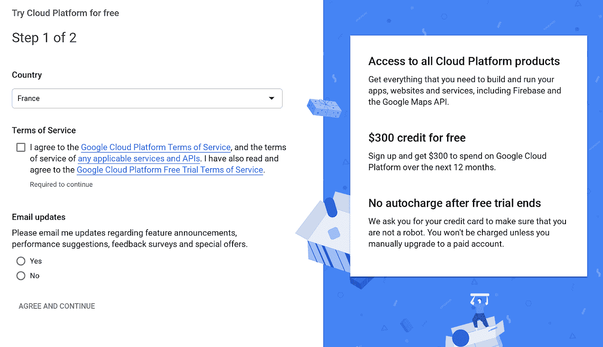
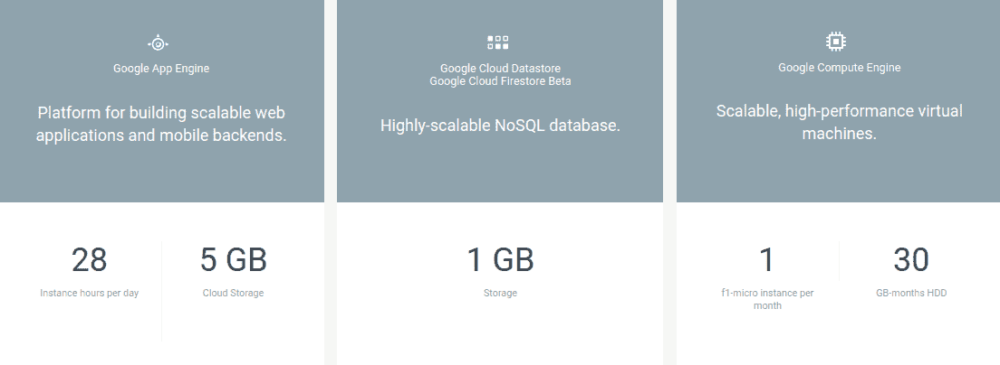
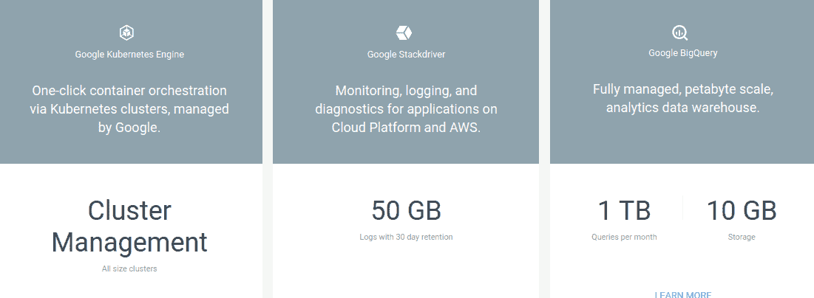
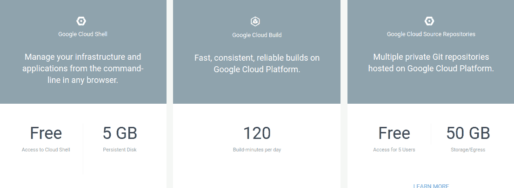
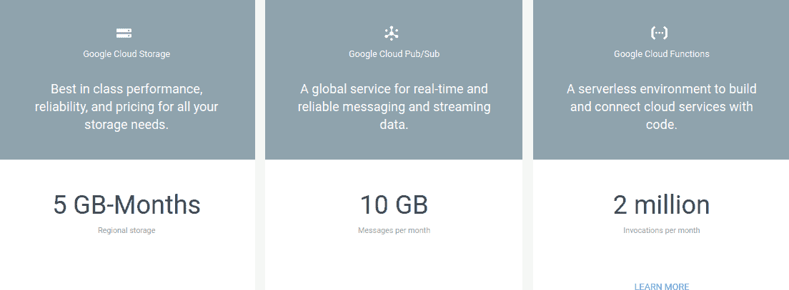
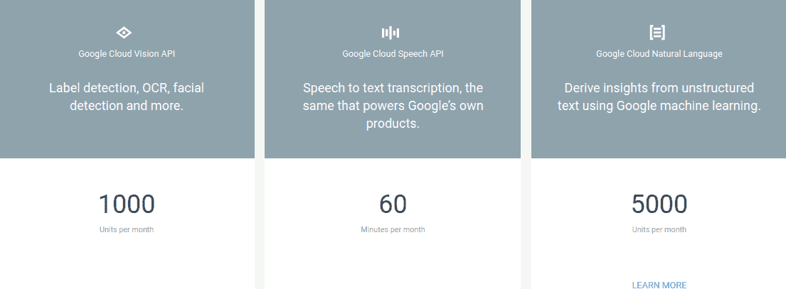

# GCP 精华续—免费试用和免费等级

> 原文：<https://medium.com/google-cloud/gcp-essentials-continued-free-trial-free-tier-ec3e039185da?source=collection_archive---------1----------------------->

# **免费试用**

在试用云提供商时，了解成本可能会令人生畏，您可能不愿意仅仅为了试用而花钱。谷歌云平台提供了一个 ***免费试用版*** 和一个(总是) ***免费版*** 。下面是最新的 ***GCP 必备*** 视频系列:

当你开始使用 GCP 时，你可以注册价值 300 美元的免费积分。这将要求您创建一个帐户(如果您还没有 Google 帐户)，并提供信用卡或银行帐户的详细信息。试用是免费的，不会向您的信用卡收费。

每个月初，你都会收到账单，上面会详细列出你上个月花了多少 300 美元。这为您提供了早期数据点，以了解您未来的服务在 GCP 上运行时的最终成本，并帮助您了解您消耗最多的地方。也可以通过设置预算预警来实现预算管理。

一旦注册了免费试用版，你就可以在整个平台上，在任何地方花掉积分——你使用的是真实的东西，而不是一些沙盒环境。

这个试用在 12 个月内有效，或者直到你用完 300 美元。信用额度和剩余天数显示在谷歌云平台控制台的顶部以及账单部分。

如果您确实使用了所有点数，将不会向您收取费用，但您的资源将在 30 天内暂停到一个付费帐户。你可以随时升级到付费账户，并保留 300 美元的余额。一旦你这样做了，你就要对你的 GCP 资源的成本负责。

# **自由层**

GCP 为其许多主要产品提供慷慨的自由等级。这有时被称为自由配额。这些产品包括应用引擎、计算引擎、Kubernetes 引擎、云存储、云功能、我们的云愿景、语音和自然语言 API 等:

GCP 的顾客每个月都可以免费使用产品。例如:

*   云函数的第一次 200 万次调用
*   云语音 API 的前 60 分钟
*   云构建的第一个每日 120 分钟…

…每个月都是免费的，顾名思义，永远免费不会过期！

订阅本出版物或 GCP YouTube 频道[获取“GCP 精华”视频系列的更新。更多内容即将推出，请随时提供评论(在这里或在视频中)并建议您希望看到的主题！](http://bit.ly/GCloudPlatform)