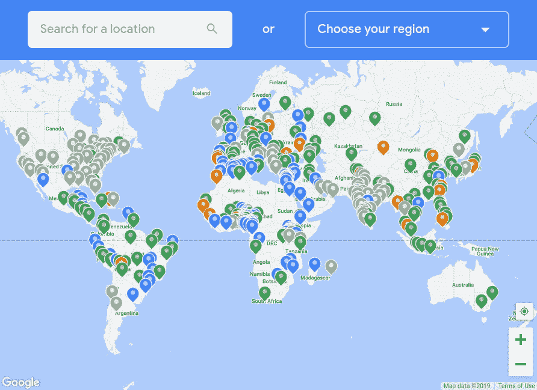
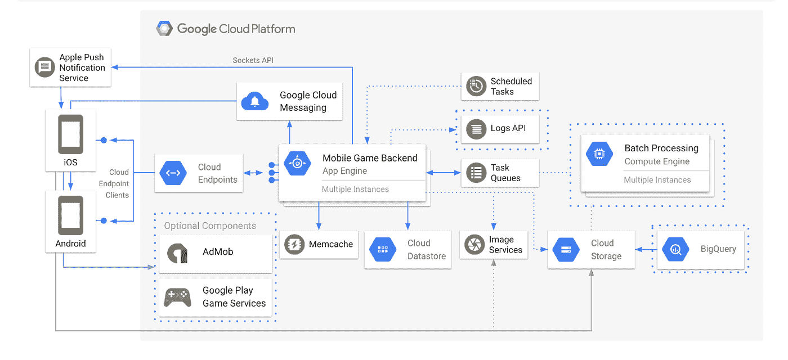
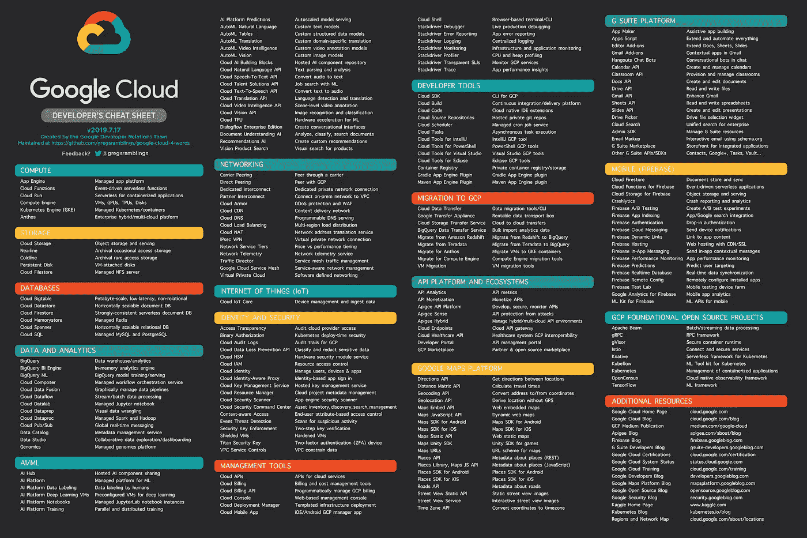

# GCP 精华——保持联系！

> 原文：<https://medium.com/google-cloud/gcp-essentials-staying-in-touch-43764ec9fa0a?source=collection_archive---------1----------------------->

拥有正确的信息来源和使用正确的沟通渠道可能是普通谷歌云平台用户和高产谷歌云平台用户之间的区别。这篇文章和上面的视频带你浏览一些著名的资源，但也有一些不太明显的资源可能对你有帮助。

**语言登陆页面**

由于许多开发人员通过他们选择的语言来识别自己，我们为 GCP 支持的最流行的语言提供了登陆页面(排名不分先后！) :

[GCP **围棋**首页](https://cloud.google.com/go) | [GCP **Python** 首页](https://cloud.google.com/python) | [GCP **Java** 首页](https://cloud.google.com/java) | [GCP **节点。JS** 首页](https://cloud.google.com/node)
[GCP **PHP** 首页](https://cloud.google.com/php) | [GCP **。NET** 首页](https://cloud.google.com/dotnet) | [GCP **红宝石**首页](https://cloud.google.com/ruby) | [GCP **科特林**首页](http://cloud.google.com/kotlin)

查看入门内容、教程以及惯用的 API 和库。

**博客**

主[谷歌云博客](http://cloud.google.com/blog)通常一天有多篇文章，涵盖产品和功能，以及合作伙伴和客户故事。其他谷歌和开源博客包括:

[Google **开发者**博客](https://developers.googleblog.com) | [Google **安全**博客](https://security.googleblog.com) | [Google **AI** 博客](https://ai.googleblog.com/)
[**Apigee** 博客](https://apigee.com/about/blog) | [**Firebase** 博客](https://firebase.googleblog.com) | [谷歌**开源**博客](https://opensource.googleblog.com) | [**Tensorflow** 中](https://medium.com/tensorflow)

**Medium.com**

你可能也对不是由谷歌独家撰写的内容感兴趣。 [GCP 媒体出版物](https://medium.com/google-cloud)是从业者为从业者策划的文章列表。如果你想与社区分享你的经验，这是一个引人注目的好地方。

**播客**

如果你对播客感兴趣的话，可以看看以下的每周专题新闻以及对谷歌工程师、合作伙伴、客户和社区成员的采访:[GCP 播客](https://gcppodcast.com)|[Kubernetes 播客](https://kubernetespodcast.com)

**YouTube 频道**

对于视频内容，显然有一个定期发布内容的 [GCP YouTube 频道](http://www.youtube.com/googlecloudplatform)，其中大部分内容都按照主题、产品和事件分类成播放列表。还有其他几个相关的 YouTube 频道:[Firebase](https://www.youtube.com/firebase)|[tensor flow](https://www.youtube.com/tensorflow)|[谷歌开发者](https://www.youtube.com/GoogleDevelopers) | [G 套件](https://www.youtube.com/GSuite) | [Apigee](https://www.youtube.com/apigee)

**社交媒体**

如果你在 Twitter 上闲逛，你一定要关注[谷歌云平台](http://twitter.com/GCPcloud)，并考虑关注以下活跃账户之一:

[Firebase](http://twitter.com/Firebase) | [G 套件开发者](http://twitter.com/GSuiteDevs) | [谷歌地图平台](http://twitter.com/GMapsPlatform) | [谷歌开源](http://twitter.com/GoogleOSS) | [Apigee](http://twitter.com/Apigee)

**社区教程**

[社区教程](https://cloud.google.com/community/tutorials)是社区贡献的操作指南，在 GitHub 上有一个开放的发布过程。到目前为止有将近 200 个教程，如果你找不到你要找的东西，你应该申请或者甚至自己写点东西然后提交！

**GCP IRL —用户组&事件**

用户组和 GCP 聚会是志趣相投的人聚会分享他们的经验、最佳实践甚至找工作的好地方。世界各地都有活跃的 meetup 团体，附近应该也有一个。如果没有，那么创建一个！

你也可以参加各种大小会议。有些是由谷歌组织的，如我们每年的 [Cloud Next](https://cloud.withgoogle.com/next/sf/) 活动，或者我们在世界各地几十个城市举办的峰会或车载活动。您还会在许多行业活动中发现 GCP 的内容，如欧洲的 OSCon、Kubecon、Devoxx，当然还有 600 多场由社区主导的 [DevFest](https://devfest.withgoogle.com/) 活动。在所有这些活动中，你将能够从技术会议中学习，与谷歌云工程师会面，并提出问题。

**堆栈溢出**

但是你知道吗，谷歌的工程师在 Stackoverflow 上维护和监控着许多与 GCP 相关的标签。这是 GCP 社区支持的一部分，详细信息记录在本页的[中。当然，这不是与谷歌签订正式支持合同的合适替代方案。](https://cloud.google.com/support/docs/stackexchange)

**图标和图表**

一张图胜过千言万语，想象一下如果你使用这些[好看的图标和图表](https://cloud.google.com/icons/)，你的 GCP 建筑的视觉表现对你的同行的价值！

**备忘单**

Google Cloud 四字小抄[有许多不同的格式，包括几种便于打印的格式，并在 GitHub 上维护。这是一个非常受欢迎的资源，你一定要去看看！](https://github.com/gregsramblings/google-cloud-4-words)

正如您所看到的，当谈到跟上谷歌云的速度时，有许多选项可供您考虑。挑选最适合你的！