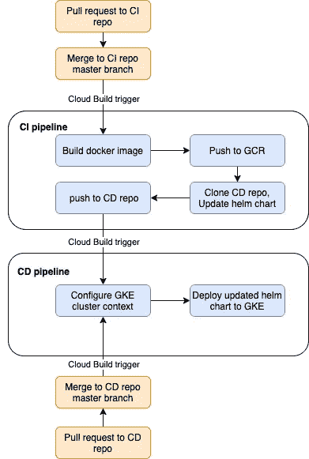
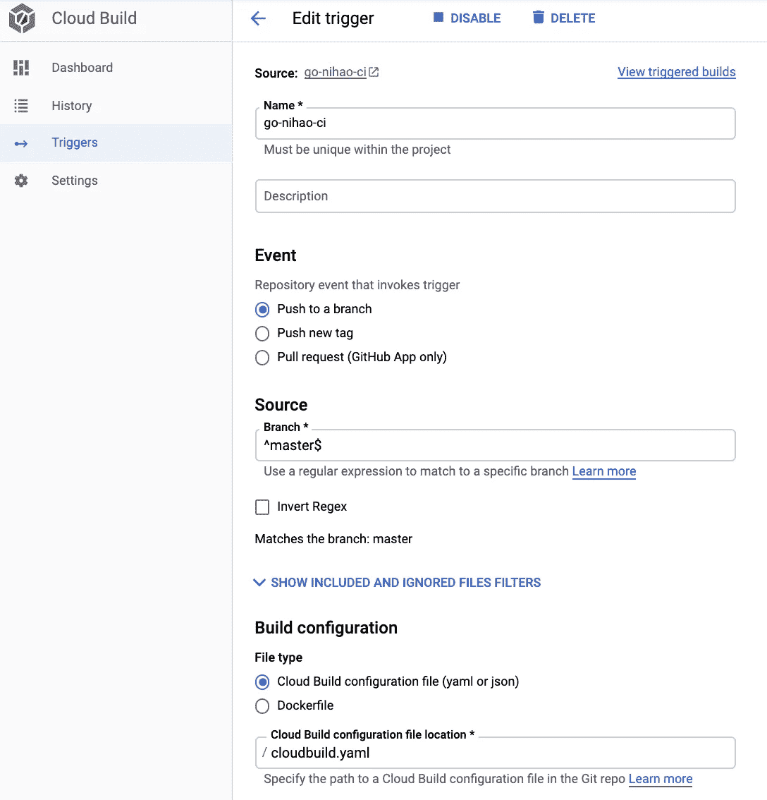
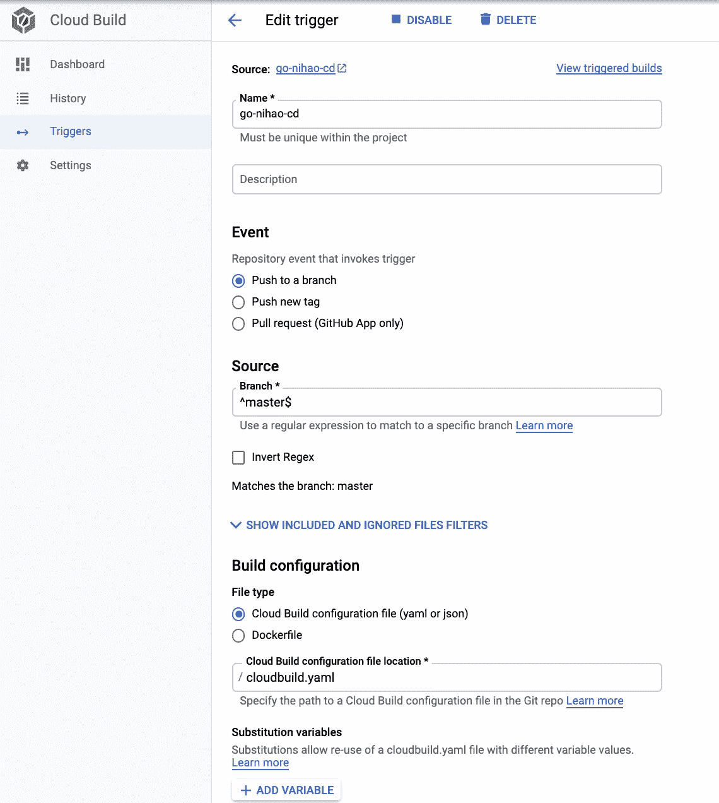

# GCP GitOps 风格的 CICD 与云建设部署舵图到 GKE

> 原文：<https://medium.com/google-cloud/gcp-gitops-style-cicd-with-cloud-build-to-deploy-helm-chart-to-gke-fa003b999b1e?source=collection_archive---------0----------------------->

乔恩·卡塔赫纳通过 [Unsplash](https://unsplash.com/) 拍摄的两个车轮图片

通过学习本教程，您将:

*   使用云构建实现 CI 管道，以构建容器化的应用程序并将其上传到 GCR
*   使用云构建实现 CD 管道以在 GKE 部署 helm chart
*   按照 GitOps 惯例建设 CICD 管道

我们将在本文中构建的 CICD 管道

上图展示了我们将要建设的 CICD 管道。请注意，有两种方法可以触发 CD 管道:

*   您更改舵图，并将拉式请求合并到 CD 回购的主分支
*   您更改应用程序，并将拉请求合并到 CI repo 的主分支，它进一步克隆 CD repo，更新 helm 图表(更改`values.yaml`中的`image.tag`字段)，然后将更改推送到 CD repo

为了简化事情，在第二种情况下，我们将只改变`image.tag`字段。实际上你可以在`Chart.yaml`中进一步更新其他东西，比如元数据。另请注意，我们直接将更改推送到 CD 回购，在现实生活中，您可能需要创建一个拉取请求。

# 先决条件

在你能跟随这个教程之前，你需要下列东西:

*   您有权访问的正在运行的 GKE 集群
*   GCP 云资源存储库中的 CI 和 CD repos
*   您的云构建服务帐户(`<project number>@cloudbuild.gserviceaccount.com`)拥有作为 Kubernetes 引擎开发者和源代码库作者的 IAM 角色

# 动机

毫无疑问，Helm 是最受欢迎和经过现场测试的工具，用于进行 k8s 部署。然而，GCP 的托管管道工具 Cloud Build 并不提供将 helm chart 部署到 GCP 的托管 k8s 集群 GKE 的官方支持。

此外，众所周知的 GitOps 近年来越来越受欢迎。拥有始终包含声明性描述的 Git 存储库的要点是实用且高效的。此外，干净的 git 提交历史对于审计跟踪很有用。触发 CD 管道对 helm chart 的更改不会触发 CI 管道来重建应用程序，这可以防止污染提交历史和容器注册表。由于 k8s 的声明性，它还允许您使用 git revert 回滚到应用程序或 k8s 部署的早期版本。

据我所知，还没有关于这个主题的最新文章。[Patte Hadrien 发布的文章](https://www.padok.fr/en/blog/kubernetes-gcp-cloud-build)讨论了如何在云构建中使用 helm，但需要修改以兼容 Helm 版本 3，并且不是 GitOps 风格的管道。

在本文中，我想通过提供一个在 GCP 使用云构建实现 GitOps 的分步指南来填补这个空白。

注意，这篇文章叫做 GitOps 风格的 CICD，因为 GitOps 经常有一个 GitOps 操作者参与编排步骤。詹金斯 X，Argo CD，Flux CD 是 k8s 中 GitOps 的一些选项。

# 介绍

云构建是 GCP 托管服务，它使用户能够通过 yaml 文件中的声明来执行构建步骤。然后，每个构建步骤将使用 docker 映像和 yaml 文件中声明的命令在相应的 Docker 容器中运行。云构建在同一台机器上连续执行构建的所有步骤。默认情况下，Cloud Build 使用一个名为`/workspace`的目录作为工作目录，该目录是持久的，允许步骤通过它共享资产。当云构建运行一个构建步骤时，它会自动将一个`workspace`卷挂载到`/workspace`中。

现在，云构建还没有官方的支持。幸运的是，社区为我们开发了一个[helm builder](https://github.com/GoogleCloudPlatform/cloud-builders-community/tree/master/helm)build step docker 映像，它将在本文中使用。

请注意，我们将在 GCP 云资源存储库中托管我们的 CICD 回购协议。

让车轮转动起来！

# 将所需的构建步骤映像上传至 GCR

如前所述，我们需要首先将社区构建步骤 docker 映像上传到 GCR，以便能够在云构建中使用它们。

在本教程中，我们需要两张图片，使用 helm 的 **helm** 和编辑 yaml 文件的 **yq** 。你可以把它们上传到你的 GCP 云壳来加速它。

上传头盔生成器和 yq build step docker 图像到 GCR

现在，你应该能够在你的 GCR 中的相应存储库中找到**舵**和 **yq** 图像。

# 在没有 CD 触发器的情况下实施 CI 管道

在本节中，我们将在 GKE 建立一个 GitOps 风格的 CI 渠道。请记住，我们稍后将修改`cloudbuild.yaml`来集成 CI 管道和 CD 管道。

我已经写了一个简单的 go web 应用程序和它的`Dockerfile`。这个 web 应用程序将简单地监听端口 8080，并响应“倪好版本<版本号>来自< GKE 集群 IP >”。

对应的`cloudbuild.yaml`也很好理解。它定义了两个步骤:

*   **构建**，它使用定义的`Dockerfile`构建 docker 映像，将相应的 GCR 地址的地址作为名称(gcr . io/$ PROJECT _ ID/go-倪好)，git-commit-SHA 作为标签。
*   **推送**，将构建好的图像推送到 GCR。

`PROJECT_ID`和`COMMIT_SHA`是 Cloud Build 提供的替代变量，更多细节可以参考这里的[文档。](https://cloud.google.com/cloud-build/docs/configuring-builds/substitute-variable-values)

请注意，我们使用 git-commit-SHA 作为图像的标签，这是使用 GitOps 风格管道时推荐的方式，但是您也可以用其他唯一标识符(如语义版本)来替换它。

> 因为 Git 为每次提交创建一个唯一的散列，所以建议使用 Git 散列来标记 docker 映像，而不是创建一个任意的版本号。除了唯一性之外，每个 docker 映像都可以使用 Git 哈希轻松追溯到 Git repo 历史，以确定 docker 映像中的确切代码。”
> 
> Yuen 等人的 GitOps 和 Kubernetes。铝

这里的两个步骤都运行一个`docker` docker 映像，这是由 GCP 提供的官方构建步骤映像。

CI 管道中的基本文件

然后我们需要在云构建中添加触发器，如下图所示。当提交被推送到主分支时，它将触发在`cloudbuild.yaml`中定义的管道运行。

云构建 CI 触发器屏幕截图

# 实施 CD 管道

CD 管道的回购可在 GitHub 中的[处获得。](https://github.com/hughluo/go-nihao-cd)

在本节中，我们将实施 CD 管道，将我们的 helm chart 部署到 GKE。

我已经为我们的 go web 应用程序生成了一个简单的图表。由于它是通过`helm create`自动生成的，为了简洁起见，我就不在这里附上完整的图表文件了。

我只修改了`values.yaml`中的`image.repository`和`image.tag` ，因为我们现在没有 CICD 集成(我们将在下一节中进行)。

values.yaml 的修改部分

下面是 CD 管道的`cloudbuild.yaml`文件。我们可以看到，它有两个步骤:

*   **配置 kubectl** ，其中使用 kubectl 来配置 k8s 上下文，以确保我们拥有部署 helm 图表所需的凭证
*   **部署图**，哪个嗯……把舵图部署到 k8s 集群。请注意，我们对 values.yaml 进行了回复，以提供部署 helm 图表所需的所有变量。

CD 管道的 cloudbuid.yaml

与上一节中的 CI repo 一样，我们还将在 Cloud Build 中为 CD repo 添加一个触发器，如下图所示。

云构建 CD 触发器截图

# 修改 CI 管道以与 CD 管道集成

CI 管道的回购可在 GitHub 中的[处获得。](https://github.com/hughluo/go-nihao-ci)

正如我们在上一节中看到的，我们依赖于`values.yaml`文件来配置我们的 helm 图表和底层 k8s 资源。

在本节中，我们将更新以前的 CI 管道，这样在我们修改应用程序后，CI 管道将自动更改`values.yaml`(更新容器标记)，并将提交推送到 CD repo，这将触发 CD 管道将我们更新的图表部署到 GKE。

我们将使用之前上传到 GCR 的`yq`码头图片来修改`values.yaml`。与以前的版本相比，新版本的`cloudbuild.yaml`，如下图所示，增加了以下步骤:

*   **克隆 CD** ，将 CD repo 克隆到我们的云构建虚拟机
*   **更新图表**，该图表使用`yq`将`values.yaml`中的`image.tag`字段修改为 git-commit-SHA，这实质上是**构建**步骤中的相同标记。
*   **Push CD** ，然后将上一步的提交推送到 CD repo。

注意，我们在提交消息中添加了一些有用的信息。它帮助我们跟踪哪个 CI 提交触发了 CD 管道。

用于 CI 管道的 cloudbuild.yaml，与 CD 集成

# 结论

原来如此！到目前为止，您可以尝试提交对 CI 存储库的更改以触发 CI 管道，这也将推动对 CD 存储库的更改以触发 CD 管道。您还可以使用`git revert`来转换先前的提交，以查看它如何回滚到相应的版本。

我相信我会让你相信，通过使用云构建，在 GCP 实现 GitOps 风格的 CICD 管道是很容易的。GitOps 非常适合构建 CICD 管道，因为现在构建和部署都是声明式的。

在现实生活中，您可以为您的开发和测试环境这样做。你应该用`git branch`。但是，对于生产环境中的 CD，您必须引入额外的步骤，以确保管道只有在通过测试环境中的必要测试后才会被触发。在现实生活中，根据您的组织，您可能还需要引入额外的人工干预。尽管在 perfect world 中，您可以只通过 git 命令和 pull 请求与您的 CICD 进行交互。

感谢您的阅读:)

# 参考

[GitOps and Kubernetes](https://www.manning.com/books/gitops-and-kubernetes) ，一本由 Billy Yuen、Alexander Matyushentsev、Todd Ekenstam 和 Jesse Suen 撰写的精彩书籍

[谷歌云平台上的 Kubernetes:通过云构建实现自动化部署](https://www.padok.fr/en/blog/kubernetes-gcp-cloud-build)，Patte Hadrien 的一篇简洁的博客文章

GCP 文档，在这里你可以找到几乎所有关于 GCP 问题的答案。虽然你必须有耐心，因为关键信息可能隐藏在某个鬼祟的地方…