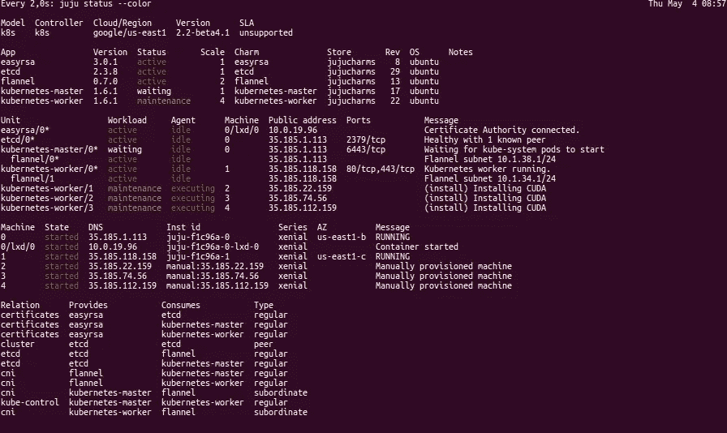
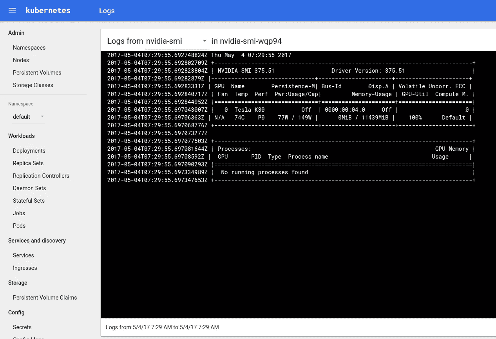

# GCP+GPU💙Kubernetes(和 Tensorflow)

> 原文：<https://medium.com/google-cloud/gcp-gpus-juju-kubernetes-and-tensorflow-5f9f7fe38538?source=collection_archive---------1----------------------->

当我几周前写如何在 Kubernetes 上部署 [Tensorflow 时，我利用 AWS 作为我的云基础。一位读者评论并询问如何在](/intuitionmachine/kubernetes-gpus-tensorflow-8696232862ca)[谷歌云平台](https://cloud.google.com)上设置 GPU 集群。

我说过我会回答 Vikas，所以这就是，在[谷歌云平台](https://cloud.google.com)上用 GPU 部署 [Kubernetes](https://kubernetes.io) 的方法。

# 要求

要复制这篇文章，你需要:

*   了解工具 [Canonical](http://www.canonical.com) 开发和使用: [Ubuntu](http://www.ubuntu.com) 和[Juju](https://jujucharms.com/)；
*   一个 GCP 的管理员帐户和足够的配额，以添加至少 3 个 GPUs
*   对 Kubernetes 工具的理解:
*   安装了 Juju 的 Ubuntu 16.04 或更高版本、CentOS 6+、MacOS X 或 Windows 7+计算机。这个博客将会关注 Ubuntu，但是你可以通过这个展示来遵循其他操作系统的指导方针。

如果您在部署时遇到任何问题，或者您有特定的需求，请通过 IRC 与我联系。我是 Freenode #juju 上的 SaMnCo， [CDK](https://jujucharms.com/kubernetes) 团队的其他成员也可以在那里提供帮助。

# 准备您的环境

首先，让我们在您的机器上部署 Juju 以及一些有用的工具:

```
sudo add-apt-repository -y ppa:juju/devel
sudo apt update
sudo apt install -yqq juju jq git
export SDK_SRC=https://dl.google.com/dl/cloudsdk/channels/rapid/downloads
export SDK_VERSION=154.0.0
wget ${SDK_SRC}/google-cloud-sdk-${SDK_VERSION}-linux-x86_64.tar.gz
tar xfz google-cloud-sdk-${SDK_VERSION}-linux-x86_64.tar.gz && \
  google-cloud-sdk/install.sh
# This is interactive
rm google-cloud-sdk-${SDK_VERSION}-linux-x86_64.tar.gz
```

按照[本页](https://jujucharms.com/docs/2.1/help-google)的说明，为 Juju 准备一个项目和您的 GCP 证书，并填写:

```
juju add-credential google
```

上面一行是交互式的，将引导您完成整个过程。最后，让我们下载 kubectl 和 helm

```
# kubectl
curl -LO [https://storage.googleapis.com/kubernetes-release/release/1.6.2/bin/linux/amd64/kubectl](https://storage.googleapis.com/kubernetes-release/release/1.6.2/bin/linux/amd64/kubectl)
chmod +x kubectl && sudo mv kubectl /usr/local/bin/
```

克隆此存储库以访问源文档:

```
git clone [https://github.com/madeden/blogposts.git](https://github.com/madeden/blogposts.git)
cd blogposts/k8s-tensorflow
```

好吧！我们准备好了。

# 部署集群

因为我们想使用 GPU，就像 AWS 一样，我们需要小心我们正在使用的 AZ。例如，在 us-east1 中，只有 us-east1-d 支持 GPU。谷歌在这个页面上提供了关于这些地点的文档。

GCE 有一种非常特殊的方式来管理 az 和子网，并且不为支持 GPU 的机器提供实例类型(GPU 可以在启动时添加到几乎任何实例类型中)。

因此，为了在 GCE 的 GPU 上部署 K8s，您必须

1.  引导并部署 Kubernetes 的控制面板
2.  手动创建 GPU 实例
3.  一旦启动，将这些机器添加到 Juju
4.  告诉 Juju 在他们身上部署工人

这禁止使用包，所以大部分部署将是手动的。让我们看看它是如何工作的:

```
juju bootstrap google/us-east1 
juju add-model k8s
```

手动部署控制面板和仅用于 CPU 的第一个工作机

```
juju deploy cs:~containers/kubernetes-master-17
juju deploy cs:~containers/etcd-29 --to 0
juju deploy cs:~containers/easyrsa-8 --to lxd:0
juju deploy cs:~containers/flannel-13
juju deploy cs:~containers/kubernetes-worker-22
juju expose kubernetes-master
juju expose kubernetes-worker
```

向项目添加 Juju SSH 密钥

```
gcloud compute project-info add-metadata \
 --metadata-from-file sshKeys=~/.local/share/juju/ssh/juju_id_rsa_gce.pub
```

**注**:这个。pub 是为 gce 改编的默认 juju_id_rsa.pub 文件的副本，看起来像

```
ubuntu:ssh-rsa [KEY VALUE] ubuntu
```

在这里可以看到关于这个[的官方文档。现在，使用以下内容创建所有计算机:](https://cloud.google.com/compute/docs/instances/adding-removing-ssh-keys#project-wide)

```
for i in $(seq 1 1 3)
do 
 gcloud beta compute instances create kubernetes-worker-gpu-${i} \
  --machine-type n1-standard-2 \
  --zone us-east1-d \
  --accelerator type=nvidia-tesla-k80,count=1 \
  --image-family ubuntu-1604-lts \
  --image-project ubuntu-os-cloud \
  --maintenance-policy TERMINATE \
  --metadata block-project-ssh-keys=FALSE \
  --restart-on-failure
 sleep 5
done
```

对于每台机器，我们都会得到这样的答案:

```
Created [[https://www.googleapis.com/compute/beta/projects/jaas-151616/zones/us-east1-d/instances/kubernetes-worker-gpu-2](https://www.googleapis.com/compute/beta/projects/jaas-151616/zones/us-east1-d/instances/kubernetes-worker-gpu-2)].
NAME                     ZONE        MACHINE_TYPE   PREEMPTIBLE  INTERNAL_IP  EXTERNAL_IP   STATUS
kubernetes-worker-gpu-2  us-east1-d  n1-standard-2               10.142.0.5   35.185.74.56  RUNNING
```

记下每台机器的公共 IP 地址

```
juju add-machine ssh:ubuntu@35.185.74.56 # use the Public IP
```

你会得到这样的答案

```
WARNING Skipping CA server verification, using Insecure option
created machine 2
```

在这个阶段，Juju 的状态如下:

```
$ juju status
Model  Controller  Cloud/Region     Version      SLA
k8s    k8s         google/us-east1  2.2-beta4.1  unsupportedApp                Version  Status   Scale  Charm              Store       Rev  OS      Notes
easyrsa            3.0.1    active       1  easyrsa            jujucharms    8  ubuntu  
etcd               2.3.8    blocked      1  etcd               jujucharms   29  ubuntu  
kubernetes-master  1.6.1    blocked      1  kubernetes-master  jujucharms   17  ubuntu  
kubernetes-worker  1.6.1    blocked      1  kubernetes-worker  jujucharms   22  ubuntuUnit                  Workload  Agent  Machine  Public address  Ports  Message
easyrsa/0*            active    idle   0/lxd/0  10.0.19.96             Certificate Authority ready.
etcd/0*               blocked   idle   0        35.185.1.113           Missing relation to certificate authority.
kubernetes-master/0*  blocked   idle   0        35.185.1.113           Relate kubernetes-master:kube-control kubernetes-worker:kube-control
kubernetes-worker/0*  blocked   idle   1        35.185.118.158         Relate kubernetes-worker:kube-control kubernetes-master:kube-controlMachine  State    DNS             Inst id                Series  AZ          Message
0        started  35.185.1.113    juju-f1c96a-0          xenial  us-east1-b  RUNNING
0/lxd/0  started  10.0.19.96      juju-f1c96a-0-lxd-0    xenial              Container started
1        started  35.185.118.158  juju-f1c96a-1          xenial  us-east1-c  RUNNING
2        started  35.185.22.159   manual:35.185.22.159   xenial              Manually provisioned machine
3        started  35.185.74.56    manual:35.185.74.56    xenial              Manually provisioned machine
4        started  35.185.112.159  manual:35.185.112.159  xenial              Manually provisioned machineRelation  Provides  Consumes  Type
cluster   etcd      etcd      peer
```

您可以注意到，我们将机器 2 到 4 作为手动实例添加。现在我们可以告诉 juju 将这些用于额外的工人:

```
# Adding all machines as workers
for unit in $(seq 2 1 4)
do
 juju add-unit kubernetes-worker --to ${unit}
done# Add Relations between charms
juju add-relation kubernetes-master:kube-api-endpoint  kubernetes-worker:kube-api-endpoint
juju add-relation kubernetes-master:kube-control  kubernetes-worker:kube-control
juju add-relation kubernetes-master:certificates  easyrsa:client
juju add-relation kubernetes-master:etcd  etcd:db
juju add-relation kubernetes-worker:certificates  easyrsa:client
juju add-relation etcd:certificates  easyrsa:client
juju add-relation flannel:etcd  etcd:db
juju add-relation flannel:cni  kubernetes-master:cni
juju add-relation flannel:cni  kubernetes-worker:cni# Watch results
watch -c juju status --color
```



CUDA 部署在手动部署的支持 GPU 的 GCP 实例上

现在我们可以测试 CUDA 是否安装了

```
juju ssh 2 "sudo nvidia-smi"
Thu May  4 07:20:37 2017       
+-----------------------------------------------------------------------------+
| NVIDIA-SMI 375.51                 Driver Version: 375.51                    |
|-------------------------------+----------------------+----------------------+
| GPU  Name        Persistence-M| Bus-Id        Disp.A | Volatile Uncorr. ECC |
| Fan  Temp  Perf  Pwr:Usage/Cap|         Memory-Usage | GPU-Util  Compute M. |
|===============================+======================+======================|
|   0  Tesla K80           Off  | 0000:00:04.0     Off |                    0 |
| N/A   74C    P0    77W / 149W |      0MiB / 11439MiB |    100%      Default |
+-------------------------------+----------------------+----------------------+

+-----------------------------------------------------------------------------+
| Processes:                                                       GPU Memory |
|  GPU       PID  Type  Process name                               Usage      |
|=============================================================================|
|  No running processes found                                                 |
+-----------------------------------------------------------------------------+
Connection to 35.185.22.159 closed.
```

现在让我们看看我们的集群是什么样子:

```
juju scp kubernetes-master/0:config ~/.kube/config
kubectl get nodes --show-labels
NAME                      STATUS    AGE       VERSION   LABELS
juju-f1c96a-1             Ready     28m       v1.6.1    beta.kubernetes.io/arch=amd64,beta.kubernetes.io/os=linux,kubernetes.io/hostname=juju-f1c96a-1
kubernetes-worker-gpu-1   Ready     17m       v1.6.1    beta.kubernetes.io/arch=amd64,beta.kubernetes.io/os=linux,**cuda=true,gpu=true**,kubernetes.io/hostname=kubernetes-worker-gpu-1
kubernetes-worker-gpu-2   Ready     17m       v1.6.1    beta.kubernetes.io/arch=amd64,beta.kubernetes.io/os=linux,**cuda=true,gpu=true**,kubernetes.io/hostname=kubernetes-worker-gpu-2
kubernetes-worker-gpu-3   Ready     17m       v1.6.1    beta.kubernetes.io/arch=amd64,beta.kubernetes.io/os=linux,**cuda=true,gpu=true**,kubernetes.io/hostname=kubernetes-worker-gpu-3
```

正如你所看到的，标签已经被添加到节点中， **cuda=true** 和 **gpu=true** 。现在，我们可以像往常一样部署我们的 nvidia-smi 作业

```
kubectl create -f ./src/nvidia-smi.yaml
```

过了一段时间，我们得到了日志:



GCP Kubernetes 上的 GPU 工作负载

# 结论

现在我们在 Kubernetes 上有了一个合适的 GPU 集群，剩下的和我的其他实验类似。使用 Helm，Kubernetes 提供了一个适当的云抽象层，因此您可以安全地使用它来部署您最喜欢的 GPU 工作负载！

尽情享受吧！如果你喜欢这个或发现它有用，不要犹豫，按下小心脏按钮，它总是有帮助的:)