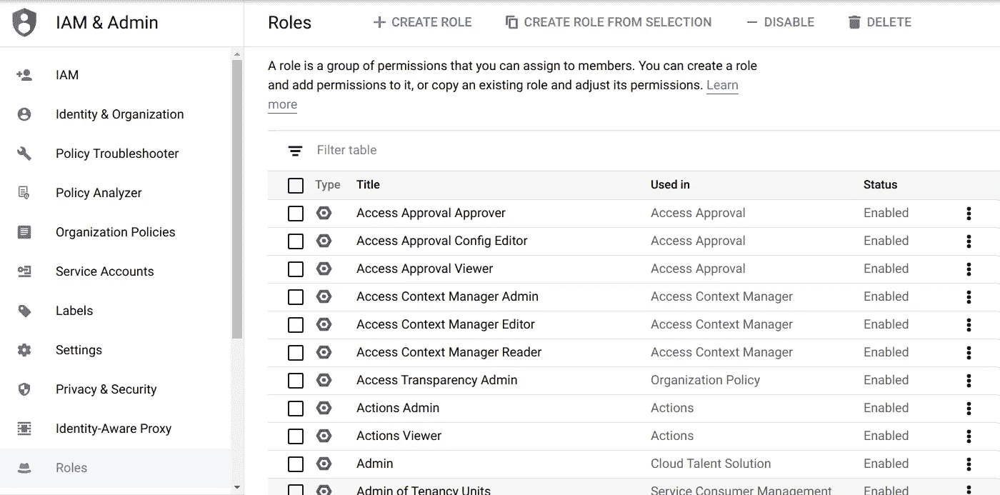

# GCP IAM 角色解释

> 原文：<https://medium.com/google-cloud/gcp-iam-roles-explained-af84955346e7?source=collection_archive---------0----------------------->

# 何时使用基本角色、预定义角色和自定义角色

# 介绍

这是我参与的每一个客户项目都会出现的一个话题:在 GCP，我的角色是什么？我们应该如何去做？在我作为 Google Cloud Professional Services 的一部分的工作中，我必须编写一些文档，详细解释每种类型对于各种用例的优缺点，并为每个客户特定的用例提出建议。

这促使我创建了这个帖子，让任何人都可以轻松地决定他们在 GCP 的 IAM 角色策略。首先，我将提供一些关于 IAM 如何在 GCP 工作的更多背景，如果你习惯于其他云提供商，或者不熟悉 GCP，这可能是有用的。然后，我将描述每个 IAM 角色类型，以帮助您最终为自己的组织做出决策。

作为一般规则，我们建议使用预定义的角色来限制复杂性。在某些情况下，让客户自己管理自定义角色可能是有意义的，但是考虑到与之相关的额外开销，应该仔细考虑这个决定。

# IAM 绑定

在 Cloud IAM 中，身份(即用户、组和服务帐户)可以通过 [**IAM 策略**](https://cloud.google.com/iam/docs/policies?hl=en) 获得对资源 API 的**访问。在这些策略中，您可以定义一个或多个 [**绑定**](https://cloud.google.com/iam/docs/policies?hl=en#multiple-bindings) **，其中的成员被授予一个** [**IAM 角色**](https://cloud.google.com/iam/docs/understanding-roles?hl=en#role_types) 。这将绑定的成员与在该策略级别(组织、文件夹或项目)** **和更低(如果有)**授予该角色**的所有权限相关联。**

重要的是要明白 [**角色只能在特定级别**](https://cloud.google.com/iam/docs/viewing-grantable-roles?hl=en) 授予。例如，文件夹查看者角色在项目级别没有意义，因为其权限访问的资源不在项目级别。您通常会在项目或资源级别(例如云存储空间)授予 IAM 角色，但是您也可以在文件夹或组织级别授予 IAM 角色。

角色由“权限”组成。这些权限通常可以被认为是对特定 Google Cloud API 调用的访问控制。例如，storage.buckets.list 权限只允许访问列出存储桶的 API 调用。

给定项目可用的 IAM 角色示例

最后，一定要注意可能会影响您的部署策略的 [IAM 限制和配额](https://cloud.google.com/iam/quotas)(例如，绑定中的最大成员或组数量)。

# 基本角色

[基本角色](https://cloud.google.com/iam/docs/understanding-roles#basic)(以前称为原始角色)是在云 IAM 出现之前的遗留角色。他们是项目中最强大的角色，拥有成千上万的权限，由 Google 代表您进行管理。

这意味着，随着新产品或新功能的发布，它们包含的权限将自动为您更新。

一般来说，只有**使用基本角色在沙盒环境中测试**、**——而不是在包含任何真实数据的生产环境中测试**。这将限制您在凭据受损的情况下，合法用户或外部参与者未经授权访问敏感数据的风险。

# 预定义角色

[预定义角色](https://cloud.google.com/iam/docs/understanding-roles?hl=en#predefined_roles)是 Google 代表客户为每个 GCP 服务维护的一组 IAM 角色。这意味着产品团队审查了给定产品(或一组产品)的所有可用权限，并定义了大多数工作职能通常所需的最小权限集。例如，[大查询角色](https://cloud.google.com/iam/docs/understanding-roles?hl=en#bigquery-roles) (admin、dataOwner、jobUser 等。)来确保不同的工作职能可以在没有获得过多权限的情况下运行，遵循职责分离和最低权限实践。

创建这些角色的想法是为了**减轻从客户那里选择合适的权限**(从数千个权限中)来使用 GCP 服务的负担，并提供一组自以为是的权限供最终用户选择。这些预定义的角色也由 Google 管理，这意味着每当在 GCP 有新的权限可用时(比如说新的功能或产品)，这些权限将由 Google 自动**添加到相应的预定义角色**中。

# 几句告诫的话

有 [**特殊的预定义角色**](https://cloud.google.com/iam/docs/understanding-roles#resource-manager-roles) **可以让你设置不同级别的 IAM 权限**(organization Admin，folderIAMAdmin，projectIAM Admin)。授予这些角色时，请注意，您是在授予将任何角色分配给任何用户或某人的能力，包括基本角色。

最后，一些角色包含允许您[模拟服务帐户](https://cloud.google.com/iam/docs/impersonating-service-accounts)的权限。提醒一下，服务帐户是应该由非人类实体使用的身份，例如机器人帐户，但在某些情况下，模拟服务帐户对排除故障很有用。

因此，您需要小心分配包含"[iam . service accounts . actas](https://cloud.google.com/iam/docs/service-accounts-actas)"权限的角色，因为它允许用户将服务帐户附加到虚拟机。这可能允许他们通过简单地登录到机器并使用附加服务帐户来提升权限。另外**要小心那些让您获得服务帐户**的短期或长期凭证的角色，例如包含“iam.serviceAccounts.signJWT”权限的角色，该权限是 roles/iam . serviceaccountokencreator 角色的一部分(查看[权限参考](https://cloud.google.com/iam/docs/permissions-reference)页面以了解更多信息)。授予这些权限将**服务帐户的所有权限授予您的最终用户**，以及**代表它进行 API 调用的能力**，这使得在您的组织中实施不可否认安全原则变得更加困难。

# 限制

一些预览版产品可能还没有预定义的角色(这种情况很少见)，在这种情况下，仅有的两个选项是使用原始角色(除非必要，否则不推荐)或自定义角色(如果可能)。

# 自定义角色

[自定义角色](https://cloud.google.com/iam/docs/understanding-custom-roles?hl=en)类似于预定义角色，但由用户直接创建和管理。通常，您可以在组织或项目级别创建自定义角色，方法是选择它应该拥有的权限列表。

# 限制

自定义角色有一些已知的限制。最重要的一点是 [**并非所有权限在任何给定时间都受支持**](https://cloud.google.com/iam/docs/custom-roles-permissions-support)——这意味着在某些情况下，自定义角色对您的工作职能不可用。

自定义角色要考虑的其他限制:

*   限制和配额:在您的组织和每个项目中，您可以创建最大数量的客户角色(每个节点 300 个)。[自定义角色存在其他限制](https://cloud.google.com/iam/quotas)(如名称或描述大小等。)，但一般来说影响较小。
*   不能在文件夹级别(只能在组织或项目级别)创建自定义角色。
*   一些权限—通常在开发中(alpha/preview) —可能不会显示在 UI 中，这可能会导致自定义角色和创建它们的预定义角色之间的行为变化。

# 摘要

建议监控您的身份(用户和服务帐户)实际使用了哪些权限，并删除在合理的时间段内(例如 90-120 天)从未使用过的权限，除非您的使用情形需要这样做(例如，不经常访问您的资源)。见[我的推荐人](https://cloud.google.com/iam/docs/recommender-overview)让这在 GCP 变得简单。

# 摘要

**基本角色**

优点:

*   试图学习 GCP 时易于使用
*   有助于快速排除低级环境中的故障
*   由 Google 管理(自动更新权限)

缺点:

*   由 Google 管理(自动更新权限)
*   太强大:如果使用这些，很难确保职责分离。
*   如果攻击者获得了具有这些角色的身份，爆炸半径会很大。

**预定义角色**

优点:

*   运营开销更少，尤其是在大规模运营时
*   由 Google 管理(自动更新权限)
*   比基本角色更有针对性:分配给用户更安全

缺点:

*   由 Google 管理(自动更新权限)
*   通常会导致比所需更多的权限。随着时间的推移，可以使用 IAM 推荐程序来解决这个问题，或者只针对特定的使用情形切换到自定义角色。

**自定义角色**

优点:

*   通常是更有针对性的角色(整体权限集更小)，这有助于职责分离安全原则的实施。

缺点:

*   更多的运营开销—尤其是在大规模的情况下
*   [有些权限不能在自定义角色中使用](https://cloud.google.com/iam/docs/custom-roles-permissions-support)
*   一些预定义的角色不能完全复制(参见上面的不可见权限)
*   [不能在文件夹级别](https://cloud.google.com/iam/docs/understanding-custom-roles#basic_concepts)创建
*   [限制](https://cloud.google.com/iam/quotas)组织级别(300)和每个项目(300)中允许的自定义角色的数量