# GCP 日志路由器:将 GCP 日志路由到发布/订阅

> 原文：<https://medium.com/google-cloud/gcp-logs-router-route-gcp-logs-to-pub-sub-3962d4873742?source=collection_archive---------0----------------------->

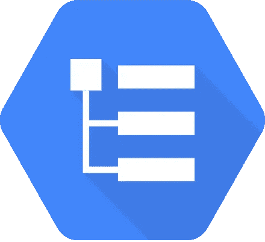

**简介**

在本文中，我们将 GCP 日志路由到发布/订阅主题。这里有三个主要阶段:1)创建主题 2)创建日志路由器 3)管理权限。

**创建发布/订阅主题**

1.  在云控制台中，转到发布/订阅主题页面。转到主题。
2.  单击创建主题。
3.  在主题 ID 字段中，输入主题的 ID。
4.  保留添加默认订阅的选项。
5.  不要选择其他选项。
6.  单击创建主题。(在本演示中，我们创建了主题**日志接收器**

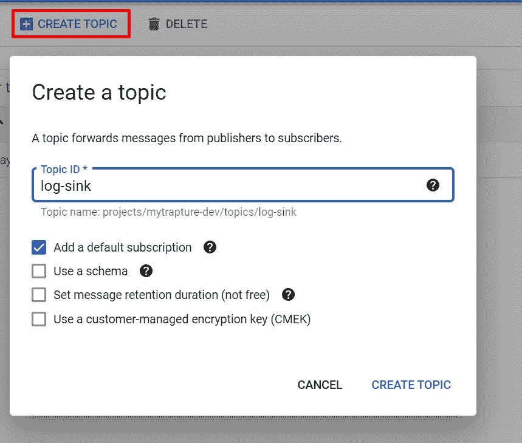

**创建日志路由器**

1.  从云控制台转到日志路由器页面

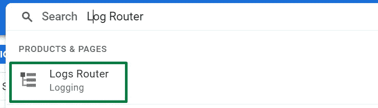

2.点击创建水槽

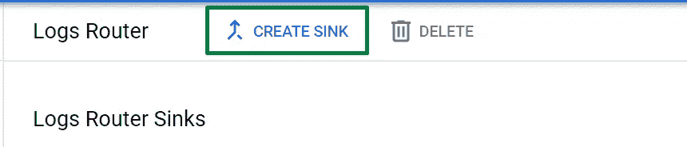

3.提供所需的名称，并使用我们之前创建的主题名称选择目的地作为发布/订阅。

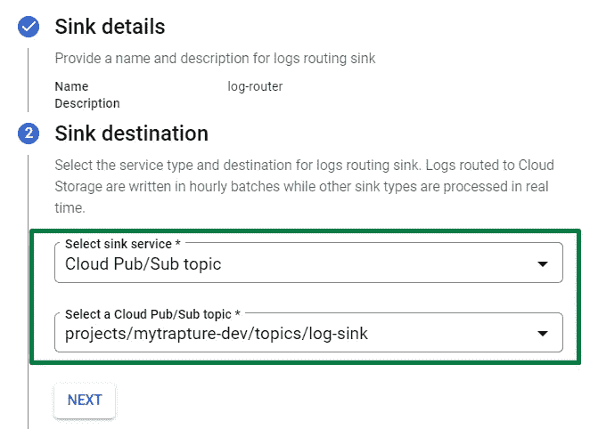

4.点击创建水槽。

5.验证接收器已创建

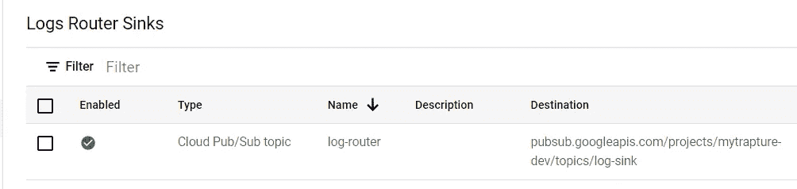

**管理权限**

1.  点击查看水槽详情

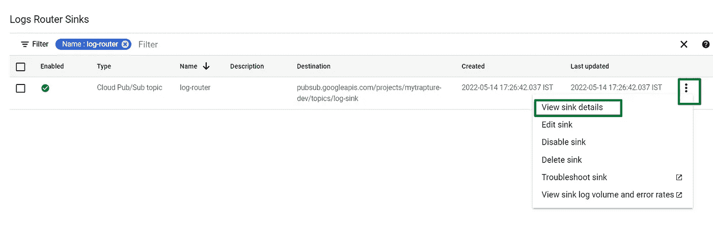

2.复制服务帐户。(从 p * * * *开始仅复制服务帐户)

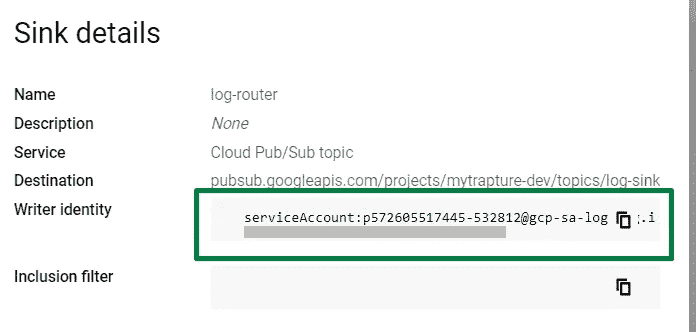

3.转到发布/订阅主题并单击查看权限

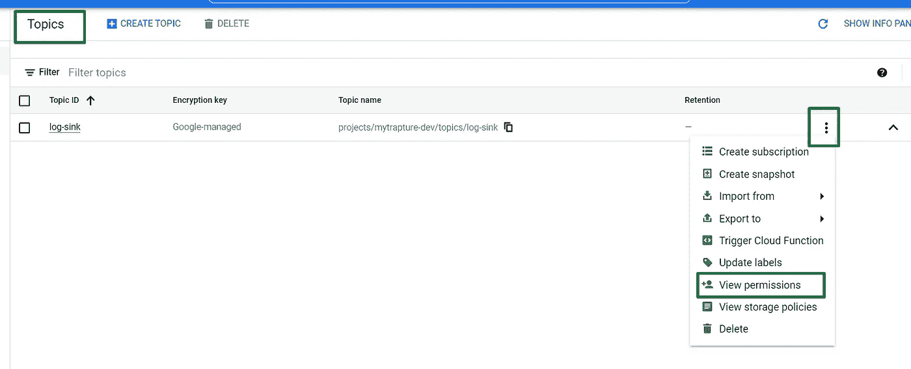

4.点击添加校长

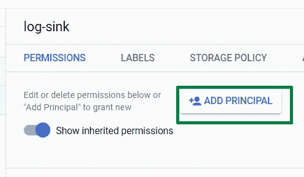

5.提供发布/订阅发布者角色。

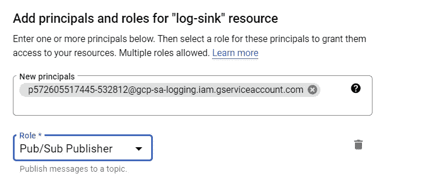

6.通过拉取消息队列来验证日志是否发布在发布/订阅主题中。

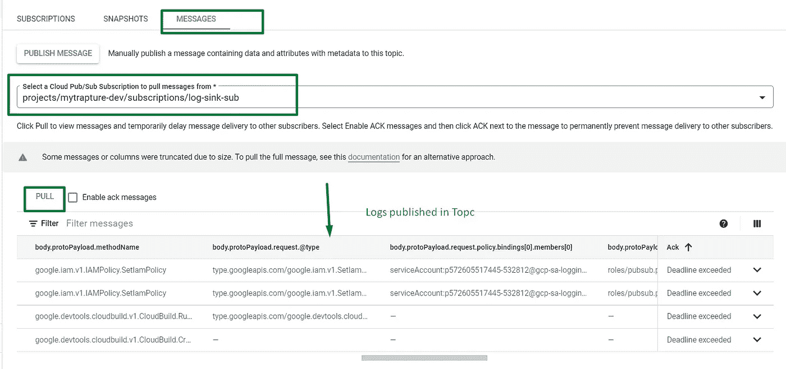

如需更多参考，请查看以下视频。