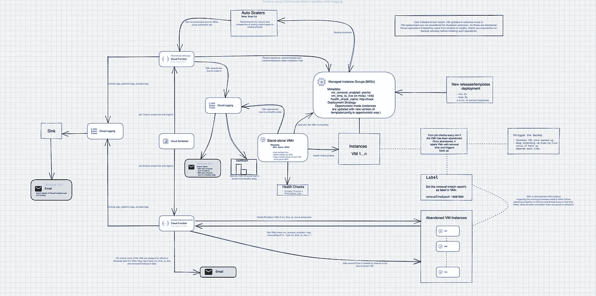

# GCP —打破关闭时间限制，根据需要对托管实例组虚拟机执行备份

> 原文：<https://medium.com/google-cloud/gcp-managed-instance-group-extend-vm-shutdown-period-beyond-90-sec-b1faad24ac6a?source=collection_archive---------3----------------------->

托管实例组(MIG)使用您指定的实例模板创建虚拟机实例。当 MIG 确定虚拟机由于自动扩展或自动修复操作而需要删除或重新创建时，它会将虚拟机置于停止状态，然后关闭虚拟机。在这里，MIG 允许您运行最多 90 秒的关机脚本，以确保您的进程正常关闭。[这里的](https://cloud.google.com/compute/docs/shutdownscript#specifications)是 GCP 强制执行的停机时间限制，以及对 B [uganizer](https://b.corp.google.com/issues/35904817) 的相同功能要求。

在这篇博客中，我将向您展示如何开发一个框架来帮助您实现延长的停机时间，以执行长时间运行的备份操作，该操作可以超过 90 秒或您想要的任何时间。只有当您的系统满足以下要求时，该解决方案才有效:

*   您有一个包含按需实例的托管实例组
*   MIG 在横向扩展模式下启用了自动扩展
*   米格已经关闭了自动修复功能。自动修复方面由框架负责。因此，您需要禁用自动修复功能
*   MIG 可以通过负载平衡器、发布/订阅或任何其他技术实现负载平衡。该框架的工作与所使用的负载平衡器无关
*   米格公司在机会主义模式下部署战略

# 概观

当实例由于扩展或自动修复而被确定为关闭时，想法是将其转换为独立的虚拟机(从 MIG 中取出虚拟机),以便根据需要在虚拟机进程上执行备份或任何其他长时间操作。这些操作包括将应用程序日志、系统日志、网络日志、内存转储、线程转储和任何其他文件存储到远程存储中。为了确保虚拟机不会永远运行，一旦虚拟机的 TTL(生存时间)过去，它们就会被外部服务关闭。如果虚拟机上的所有操作都在 TTL 之前完成，也可以通过内部脚本删除/关闭虚拟机。通过将实例模板元数据设置为

```
vm_shutdown_extenstion_enabled:yes/no.
```

该解决方案针对部署在特定区域的所有 MIG。如果您想在全球范围内覆盖 MIG，您必须在所有需要的地区单独部署该解决方案。下面是该框架如何处理 MIG 的主要方面:

**自动缩放:**MIG 配置为横向扩展模式，而横向扩展决策仍由自动缩放器做出，实际的移除或删除由外部服务完成。这样，缩放计算/决策由 GCP 管理，不会给系统带来任何额外开销。由于该解决方案根据 autoscaler 建议的大小来控制虚拟机的删除，因此可以按照所需的顺序删除虚拟机。例如，可以根据创建时间戳首先删除较旧的实例。

**自动修复**:米格战机在自动修复被禁用的情况下被制造。虚拟机的运行状况由外部服务跟踪。运行在独立虚拟机(每个 MIG 一个虚拟机)上的外部服务仅在运行状况检查探测失败的次数达到不正常阈值时，才从 MIG 中执行实例删除(放弃)。它只跟踪处于*运行*状态且*无*动作由 MIG 执行的虚拟机。它从为特定 MIG 创建的运行状况检查资源中加载运行状况检查配置。该链接在 MIG 模板元数据中被声明为*健康检查名称:{http 检查资源名称}。*

**部署:**该解决方案支持机会主义的部署模式，即使用新版本的模板/代码创建新实例。由于虚拟机的删除可以按其创建日期的升序进行，因此较旧的实例会首先被扩展，从而使新实例在部署过程中保持部署状态，不会受到扩展操作的影响或被删除。

**先决条件:** MIG 实例模板应具有以下元数据-

```
1\. vm_shutdown_extension_enabled: yes/no 
  -  This is to have the flexibility of switching off/on the solution.
2\. vm_time_to_live: 30 (No hard limit. To be entered in mins)
  - It lets instances live till the TTL elapses after removal.
3\. health_check_name: {http_check_resource_name}.
```

**高层次设计:**下面的架构概述了端到端流程和涉及的各种组件。云功能是区域性的，作用于所有的 MIG。以下解决方案充分利用了计算引擎、MIG 管理器和自动缩放器所提供的 rest APIs 您还可以利用 Google 提供的客户端库来使用这些 API。API 参考请参考附录部分。建筑组件:

```
1\. Cloud Scheduler
2\. Cloud Functions
3\. Cloud Logging and alerts
4\. MIGs
5\. Stand-alone VM
6\. Cron Job
```



推迟 MIG 随需应变实例关闭的架构(在新选项卡中打开图像以便清晰查看)

## **组件:**

***云函数【resizeInstanceGroups】:****resizeInstanceGroup*函数由来自云调度器作业的 pub/sub 消息每 5 分钟周期性触发，输入*区域*和*项目列表*。该服务跟踪来自自动缩放器的*推荐大小*和来自 MIGs 的当前大小，以决定是否扩大。如果 recommendedSize 小于 currentSize，服务将放弃较旧的实例，使当前大小等于建议的大小。它不会删除实例，而是放弃它们，以便在不关闭的情况下从 MIG 中排除它们进行备份活动。

***云函数【deleteInstanceGroupVMs】:***该函数加载所有为特定 MIG 启用关机扩展的废弃虚拟机。它通过从当前时期减去移除时期来计算虚拟机的年龄，以确保如果差异超过 TTL 间隔，则删除它们。它还会为虚拟机生成缺失 TTL 和删除时期的警报，以便让管理员了解无法由外部服务删除的虚拟机。这个函数可以增加丢失的删除时间，以确保在以后的运行中删除虚拟机。

***独立虚拟机:*** 虚拟机有一个元数据来知道它必须探测的 MIG。元数据可以设置如下:

```
MIG_name: {target_mig_name}
```

虚拟机运行一个服务来为指定的 MIG 执行运行状况检查。它从虚拟机元数据中提到的指定运行状况检查资源加载运行状况检查配置。然后，如果达到故障阈值，它会探测虚拟机以启动删除操作。一旦虚拟机被删除或放弃，在其中运行的 cron 作业将在删除函数的 epoch 中设置删除时间，以计算虚拟机的年龄。如果由于虚拟机冻结而无法由内部作业设置移除时间，则删除服务将添加缺失的移除时间标签。

***Cron job:*** 它等待虚拟机变成废弃状态*(虚拟机不是 MIG 的一部分。请参考附录中提到的 API，了解如何检查虚拟机是否不再是 MIG 的一部分)*。一旦虚拟机被声明为被放弃，它就用*删除时期(当前时期)*时间来标记虚拟机，删除服务使用该时间来跟踪其年龄并做出删除决定。最后，脚本可以按照客户编写的脚本触发备份操作。备份脚本可以更新 TTL 值，以继续推迟由 deleteInstanceGroupVMs 函数控制的删除操作。

**注意事项**:

*   该解决方案适用于所有 MIG，与负载平衡策略无关。
*   放弃虚拟机时，连接排出不受影响；虚拟机仍在等待连接耗尽期结束，然后才真正从 MIG 中删除它们。
*   放弃操作不会影响虚拟机的运行进程，因此可以轻松获取内存和线程快照。
*   由于云功能是由 GCP 管理的无服务器平台即服务，它可以自动扩展到最大限度。它符合可伸缩性要求。
*   正确设置日志和警报将确保系统的可靠性。
*   TTL 告诉虚拟机在删除后应该保持活动状态多长时间。如果需要延长时间(超过 30 分钟)，可以通过增加 time_to_live 元数据值以编程方式完成。
*   此框架不考虑用户启动的重启、选择性模式下的虚拟机更新或虚拟机更换。由于这些是由用户从控制台或脚本启动的强制操作，因此客户端需要在启动此类操作之前远程运行备份。

**记录:**

*   需要为云功能和调度程序生成日志，以确保 *resizeInstanceGroup* 和 *deleteInstanceGroupVMs* 正常工作，并且 MIG 实例在需要时被移除和删除。
*   虚拟机移除的原因由云功能和独立虚拟机记录。最终用户可以创建控制面板或生成警报，以便随时了解情况。

**警报:**您可以生成以下警报，以避免因虚拟机持续运行而造成的成本损失:

*   如果云功能没有以预期的方式运行。
*   如果启用了该功能的任何被放弃的实例缺少生存时间和删除时期值。
*   如果正在删除虚拟机。

**改进**:

*   在 GCP，独立虚拟机可以被云功能或任何其他计算选项所取代。
*   备份脚本可以由外部服务触发。您可以让外部服务监视被放弃的虚拟机，这也会触发备份。

附录: **API 引用:**

*   I [实例组管理器 API](https://cloud.google.com/compute/docs/reference/rest/v1/regionInstanceGroupManagers)
*   [自动缩放 APIs 获取推荐的大小](https://cloud.google.com/compute/docs/reference/rest/v1/autoscalers/get)
*   [实例组 API](https://cloud.google.com/compute/docs/reference/rest/v1/regionInstanceGroups/listInstances)
*   [放弃的实例](https://cloud.google.com/compute/docs/reference/rest/v1/regionInstanceGroupManagers/abandonInstances)
*   [删除实例](https://cloud.google.com/compute/docs/reference/rest/v1/regionInstanceGroupManagers/deleteInstances)
*   [列出实例](https://cloud.google.com/compute/docs/reference/rest/v1/regionInstanceGroupManagers/listManagedInstances)