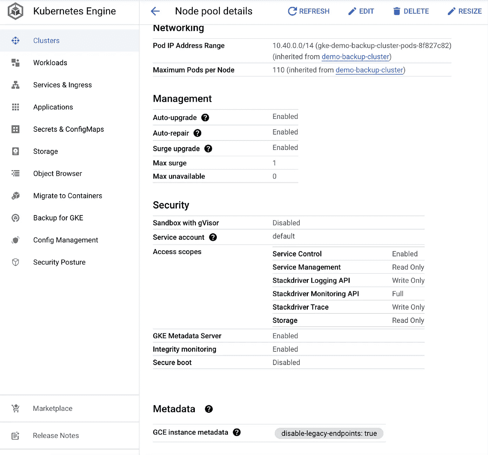

# GCP 本地 GKE 备份解决方案

> 原文：<https://medium.com/google-cloud/gcp-native-gke-backup-solution-ef971750c388?source=collection_archive---------0----------------------->

GKE 的备份

GCP 本地备份解决方案

**简介**

Kubernetes 集群的备份一直是确保高可用性和容错解决方案的热门话题。虽然市场上很少有第三方软件解决方案，但对于希望利用云成熟度的企业客户来说，完全原生的解决方案始终是一个需求。

因此，GCP 推出了 GKE 备份功能，为 GKE 集群提供备份。它集成了 GKE 用户界面、gcloud CLI。

**什么是备份？**

GKE 捕获的备份

1.  配置备份:GKE 集群的 K'8 资源描述集(应用程序)。它单独存储有状态数据，还存储集群数据的自定义脚本。
2.  卷备份:已经创建的所有永久卷声明。

您可以根据需要安排备份和从备份恢复。更多细节可以在[这里找到。](https://cloud.google.com/kubernetes-engine/docs/add-on/backup-for-gke/concepts/backup-for-gke)

**GKE 备份的主要特点**:

1.  谷歌云原生解决方案:与 GKE 控制台完全集成。
2.  精细控制:选择特定的应用程序、命名空间或整个集群进行备份或恢复
3.  灵活运营:在一个区域备份克隆工作负载，然后恢复到另一个区域。
4.  策略管理:设置备份计划和数据保留策略。

**什么没有备份？**

1.  GKE 群集配置，如节点池、启用的功能、节点配置。
2.  备份引用的容器映像。
3.  集群之外的服务的配置信息或状态，例如云 sql 或外部负载平衡器。

**如何配置备份计划？**

要在 GKE 上启用备份，您需要启用工作负载标识。这里有一个现有群集，我将为其启用备份。

1.  在 GKE 集群和节点池上启用工作负载标识，还应该配置一个元数据服务器。

2.滚动到 GKE 服务的备份，并启用 GKE 服务的备份。

3.点击*创建备份计划*，创建备份计划。

4.您可以选择命名空间或整个群集、永久卷和密钥来加密备份。

5.您可以使用 cron 表达式指定备份计划，然后选择保留备份的天数。选项锁定备份从意外删除和审计。最后复习创造。

6.创建备份计划后，它将列在群集名称下。您可以启动按需备份(如果需要)。

**如何配置恢复计划？**

1.  同样，我们可以创建一个恢复计划。

2.选择要恢复的命名空间。我们有两个选择来解决冲突，要么冲突失败，要么回滚。可以相应地选择恢复永久卷的选项。

3.排除其他选项，因为它们是可选的。单击创建恢复计划。

最后，创建恢复计划。您可以使用它从任何可用的备份版本中恢复。万一我们还没有任何后援。

上述所有配置也可以通过 gcloud 命令来完成。这个博客到此为止。快乐学习。