# GCP 网络拓扑“头号杀手”:网络流量常见问题的朋友

> 原文：<https://medium.com/google-cloud/gcp-network-topology-top-talkers-your-friend-for-common-questions-on-network-traffic-2c73fa6c1019?source=collection_archive---------3----------------------->

在我早期的一篇博客中，我浏览了 GCP 各种类型的社交消费。这篇博客扩展了这个主题，概述了一个有助于 GCP 网络成本分析的新功能。CTO、CIO、CFO、技术经理、网络主管、网络架构师、网络管理员和云操作工程师可能会对这个工具感兴趣。通常，以下问题是最先想到的:

1.  我的工作负载发送哪种类型的流量？(GCP 境内/GCP 境外)
2.  我的工作负载发送了多少每种类型的流量(多少 MB 内部流量和多少 MB 外部流量)
3.  我的本地工作负载是否从 GCP 发送/接收了太多流量？
4.  我的 GCP 工作负载是否向谷歌服务发送了过多流量？如果是，这些工作负载是什么？
5.  我如何找到网络出口流量的前 N 名贡献者(以及我的成本贡献者)

我将这些关键问题归纳为几个常见的使用案例，并与英特尔一起探讨 GCP 网络情报中心如何提供帮助。

**用例 1:“面向互联网的网络流量”**

在 GCP，标准层用户和高级层用户的互联网出口成本不同

对于标准层:出口定价为*每 GiB* 交付。定价基于流量的来源地理位置

对于高级层:定价基于流量的来源地理位置，也是网络(出口)全球目的地的一个因素

***任务:*** *一家大型企业财务团队的一名成员正在阅读有关网络出口 SKU 的信息，并希望更好地了解 GCP“网络出口”类别下的支出情况。他要求公司的云网络主管报告对互联网流量贡献最大的前几个虚拟机？*

***解决方案:*** *【网络智能中心】下网络拓扑模块的“最大流量生成者”特性*

***解释:*** GCP 网络情报中心(NIC)是与网络可观察性相关的一切的单一平台。NIC 下的“网络拓扑”模块提供了云网络拓扑的实时视图。

NIC 网络拓扑有一个称为“度量和洞察”的功能，它允许用户看到通往互联网的高出口实例。如下所示

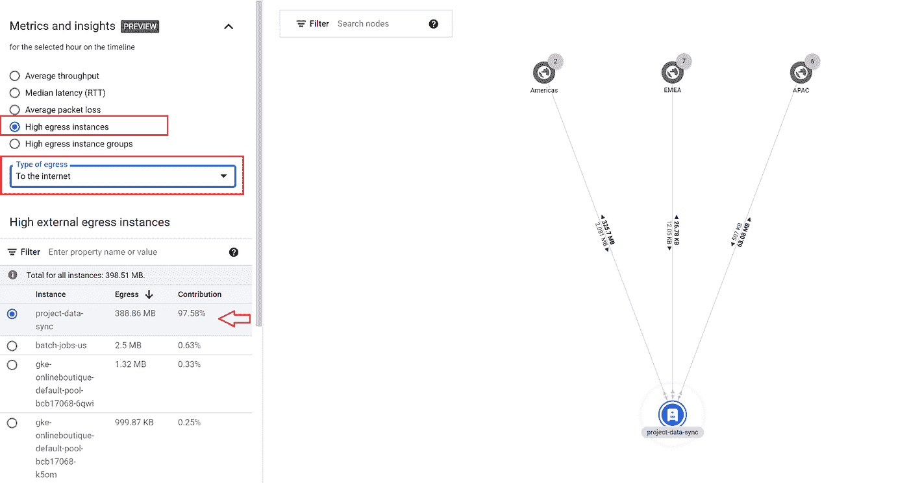

捕获 1 : GCP 网络拓扑“到互联网的高出口实例”

可以用这个分析的重要信息是-

1.  当前向互联网发送流量以及流量统计的排名靠前的实例
2.  也可以看到过去 6 周的历史数据
3.  单击实例还可以帮助用户浏览互联网出口流量统计的趋势。一个这样的例子如下所示

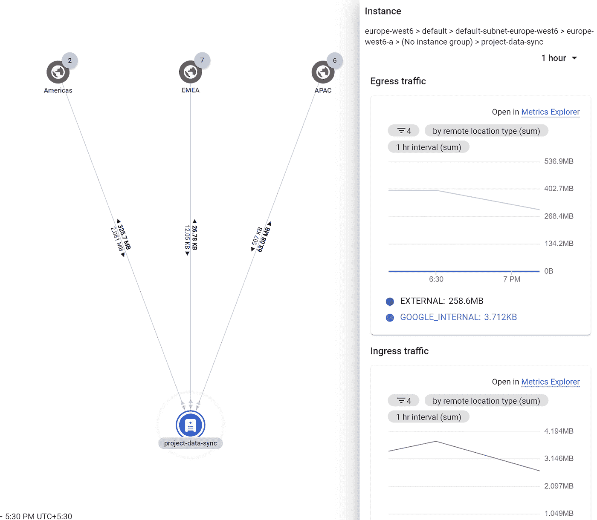

捕获 2 : GCP 网络拓扑:到 Internet 的高出口实例下的实例的详细信息

请注意，这些统计数据是针对互联网的绝对流量，并不打算显示绝对成本价值。但这是找到最高成本贡献者的最快和最有效的方法。

**用例 2:网络流量移出区域**

对于 Google cloud backbone 内部剩余的流量，成本分布如下-

*   使用资源的*内部* IP 地址时，如果出口到同一个谷歌云区域，则不收费
*   交通出了这个区域就要收费。如果流量进入同一个谷歌云区域中的不同谷歌云区域，与流量进入不同的云区域相比，费用会有所不同

***任务:*** *牢记以上定义；一家数字本地创业公司的技术经理要求云网络主管报告哪些虚拟机对 GCP 内的流量贡献最大。他知道区域内流量是不收费的(是免费的)，但是通过本地 GCP 区域的每个字节都要收费。他希望利用这一发现，通过与技术团队讨论，看看是否有任何可能的优化，是否有一些数据保留在本地 GCP 区域内。*

***解决方案:*** *【网络智能中心】下网络拓扑模块的“最大流量生成者”特性*

***解释:*** NIC 网络拓扑有一个名为“指标和洞察”的功能，它允许用户查看高跨区域流量。如下所示

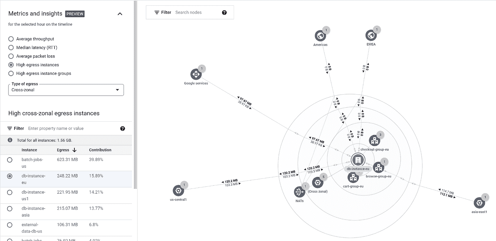

捕获 3:跨区域高出口实例的 GCP 网络拓扑度量

由此得出的重要信息如下:

1.  上面的示例是影响跨区域出口成本的主要实例
2.  上面的例子显示了一个实例“db-instance-eu”的信息。此外，它还显示该数据库实例正在向 asia-east1 和 us-central1 发送流量以及流量统计信息
3.  同一个拓扑图显示了这个实例向 Google 服务发送了多少流量的信息。如果你想知道流量流向哪个谷歌服务，同样可以通过点击谷歌服务来显示。
4.  所有这些都可以查询过去 6 周的历史时期

**用例 3:网络流量在互连/ VPN 上移动**

对于通过互联网(使用 VPN 隧道)的流量，以下是价格组成部分-

*   每个云 VPN 网关的每小时费用
*   IPsec 流量的月费
*   分配给 VPN 网关但隧道使用的*非*外部 IP 地址的每小时费用

***任务:*** *牢记以上定义；一家大型企业的经理在本地有业务，也在多云环境中运营，他要求与云网络团队开会，以报告对 VPN /互连流量贡献最大的虚拟机。他想利用这些数据来看看这些流量是否可以在 GCP 本地传输，而不是通过 VPN /互连传输出去*

***解决方案:*** *【网络智能中心】下网络拓扑模块的“最大流量生成者”特性。*

***解释:*** NIC 网络拓扑有一个名为“指标和洞察”的功能，它允许用户查看高混合流量贡献者。如下所示

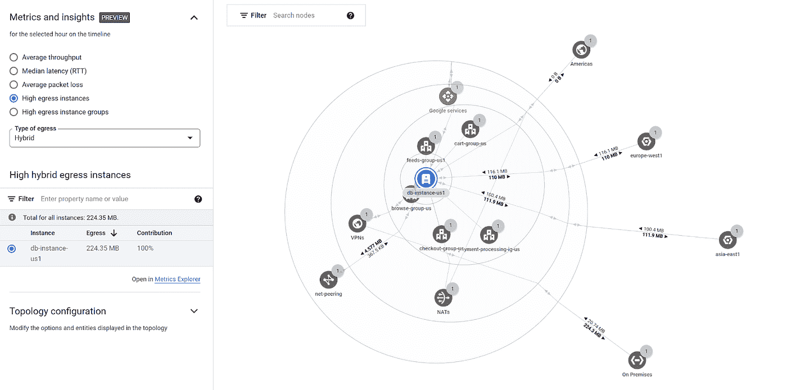

捕获 4:混合高出口实例的 GCP 网络拓扑度量

显示的重要分析如下:

1.  此拓扑显示了通过 VPN 发送流量最多的实例
2.  此拓扑显示了 GCP VPN 对等项的 IP 地址
3.  显示当前时间以及历史 6 周期间的相应流量统计
4.  对于互连，也可以以类似方式显示相同的信息
5.  用户可以点击实例，查看进出 VPN 端点的流量趋势，如下所示

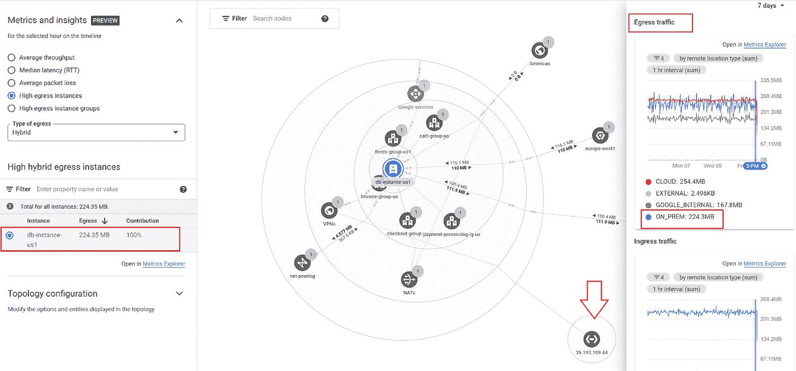

捕获 5 : GCP 网络拓扑度量:混合高出口实例的详细信息

**用例 4:GCP 网络总成本**

***任务:*** *一家大型企业的首席财务官和首席技术官正在共同讨论数字化的长期路线图，其中一个讨论点是制定积极的时间表，将一切迁移到云。他们希望看到“网络”项下支出的更多详细信息，并有兴趣了解哪些项目工作负载对总体网络支出的贡献最大。他们要求云网络业务部门领导提供 GCP 网络成本最高支出者的详细信息，以便对应用流量进行技术分析，并使用这些数据来控制网络支出。*

***解决方案:****‘网络情报中心’下网络拓扑模块的‘Top Talkers’特性。*

***解释:*** NIC 网络拓扑有一个名为“指标和洞察”的功能，它允许用户查看整个出口网络成本的主要贡献者。如下所示

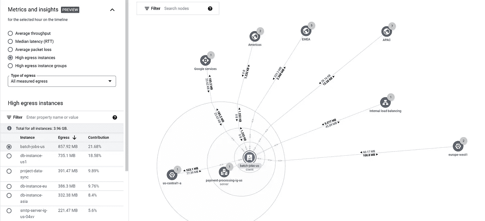

捕获 6:捕获 3:对“总高出口”有贡献的实例的 GCP 网络拓扑度量

重要的分析如下:

1.  此视图显示对整个网络出口(包括跨区域、面向互联网、面向 VPN /互连)有贡献的工作负载
2.  这个总体视图能够呈现过去 6 周的历史数据。因此，查看者可以很快看到给定工作负载的出口贡献的变化
3.  对所选工作负载的快速分析可以提供内部流量与外部流量的快照，如下所示

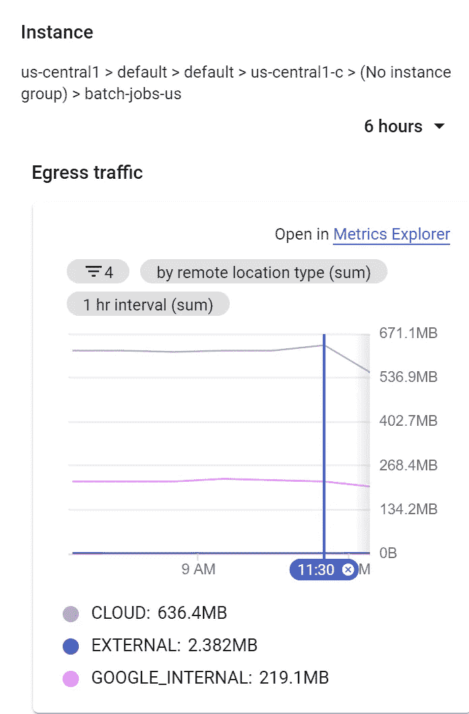

**用例 5**

***任务:*** *在对最近几周的 GCP 支出进行分析的过程中，一家亚洲数字企业的财务团队的一名成员注意到 2 个行项目的支出有所增加(详见下文)，并希望更好地了解是什么导致了这种增加。他呼吁他的技术团队通过分析顶级工作负载来帮助他更好地了解支出。*

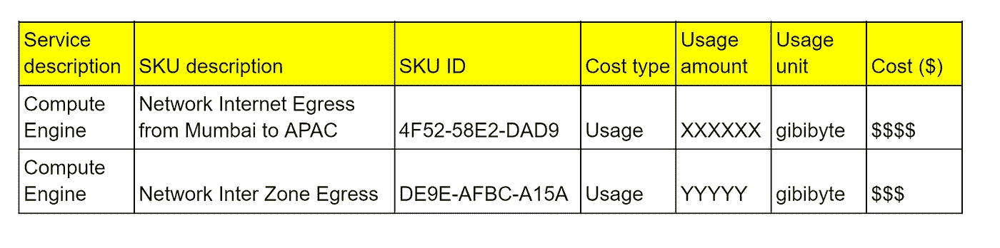

每月 GCP 账单的明细项目示例

***解***

将 Network Intelligence Center 下的“Top talkers”模块的调查结果与账单 SKU 相关联，以更好地了解每月 GCP 账单中上述行项目的成因。

**解释**

该团队使用以下步骤分析支出:

(a)根据[此链接](https://cloud.google.com/vpc/network-pricing#vpc-pricing)中提到的联网 SKU，对互联网流量的定价如下-

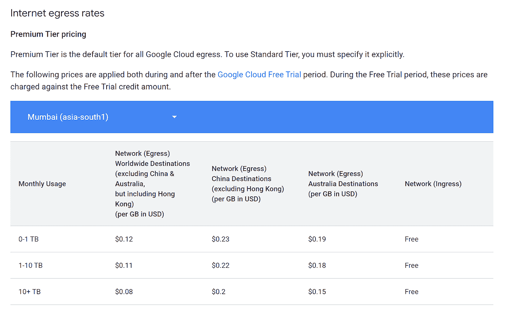

(b)类似地[该 URL](https://cloud.google.com/skus/?currency=USD&filter=DE9E-AFBC-A15A) 描述了区域间流量-

此时，财务和技术团队更好地理解了账单中 SKU 的单价，以及为什么某些 SKU 被列为总支出的贡献者。

(c)为了更好地了解导致支出的关键工作负载，该团队使用网络情报中心的拓扑功能“top talker”来确定“至互联网”流量类型的主要贡献者。这表明，目前有一个特定的实例贡献了 96 %的互联网流量。

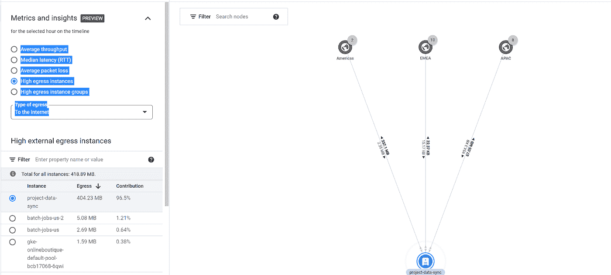

d)团队还想了解上个月该工作负载向互联网发送了多少数据。拓扑也为这个用例提供了有价值的见解，如下所示:

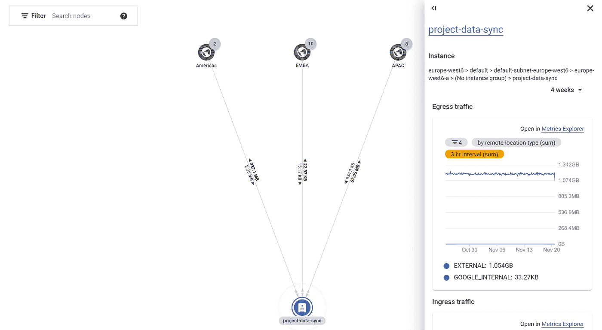

网络智能中心显示的上述详细信息反映了过去 4 周内此工作负载向互联网发送的全部数据。

**关键要点**

为了在云中高效运行，了解网络内外影响成本的各种网络流量组件非常重要。因此，拥有一个 SPOG 来可视化哪些工作负载会产生哪些类型的流量非常重要。网络智能中心的“拓扑视图”通过列出各种流量类型的主要贡献者来快速有效地解决这一问题。技术/商业团队可以在日常工作流程和决策中使用这些信息。

**免责声明**:这是为了告知读者，文中表达的观点、想法、意见仅属于作者，不一定属于作者的雇主、组织、委员会或其他团体或个人。

在撰写本文时，该功能处于“公开预览”状态。请遵循谷歌云文档获取官方信息