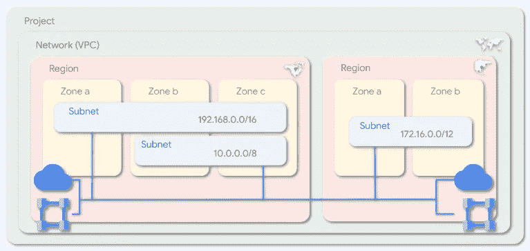

# GCP 网络- VPC 基础知识

> 原文：<https://medium.com/google-cloud/gcp-networking-vpc-basics-78094cb0657b?source=collection_archive---------2----------------------->

VPC 代表虚拟私有云。它为云资源提供虚拟化的网络功能。这个概念比传统的内部部署环境更先进，在传统的内部部署环境中，您使用物理硬件，如交换机、路由器、负载平衡器和防火墙。它消除了通常与支持基础架构相关的开销和维护。当你在谷歌云中配置一个 VPC 时，它会在谷歌的私有软件定义网络(SDN)栈中创建，称为[仙女座](https://cloud.google.com/blog/products/networking/google-cloud-networking-in-depth-how-andromeda-2-2-enables-high-throughput-vms)。

VPC 的主要目的是为计算引擎(VMs)实例、Kubernetes 引擎(GKE)和 App Engine flexible 提供网络服务。谷歌的 VPC 是一种全球资源，跨越私有网络的所有区域，这使其成为与其他云提供商相比的最重要的差异化优势之一。无论将哪个 RFC1918 子网分配给一个区域，实例都可以通过同一个 VPC 相互通信。由于其他云提供商不拥有自己的子网通信网络，因此需要设置 VPN 隧道、虚拟路由器或 VPC 对等。随着时间的推移，这变得难以管理。在 GCP，只需创建 VPC 并将子网分配给所需的区域和分区即可。

1–1

例如，让我们使用 figure 1–1 来理解[创建 VPC 网络](https://cloud.google.com/vpc/docs/create-modify-vpc-networks)的概念和步骤。

1.  创建项目
2.  创建名为(网络)和模式的 VPC。我们有自动和定制两种模式可供选择。在本例中，我们选择了自定义。
    **自动**:自动给所有地区分配子网范围。
    **自定义**:手动分配子网范围的首选方法，具有更强的控制力，推荐用于最佳实践。
3.  为每个区域分配子网范围。
4.  配置防火墙规则以允许/拒绝 VPC 内的通信。
5.  选择动态路由模式:
    **区域**:云路由器只学习指定区域的路由
    **全局**:所有云路由器动态学习所有区域的路由。

现在，我们已经配置了 VPC，区域 1 中的实例(如虚拟机)可以使用分配子网中的内部 IP 地址与区域 2 中的实例通信。