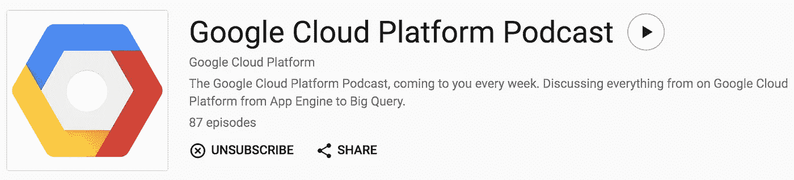

# GCP 播客:白金客户

> 原文：<https://medium.com/google-cloud/gcp-podcast-platinum-customers-efcc250e2270?source=collection_archive---------1----------------------->

谷歌云平台播客是每周一次的播客，由谷歌制作，以谷歌云[开发者拥护者](/google-cloud/a-day-in-the-life-of-a-developer-advocate-for-google-cloud-platform-fe681c8645cf)(和摇滚明星！)[弗朗切斯克·坎波伊·弗洛雷斯](https://www.campoy.cat/)和[马克·曼德尔](http://www.compoundtheory.com/)。

来自 Google Play 音乐播客的截图

作为一名 GCP 开发者，我发现这个播客非常有用。除了**问题**和**本周趣事**外，每集都有一个**与一位嘉宾**(或多位嘉宾)的深入讨论。)关于谷歌云产品、服务、客户或其他感兴趣的话题。

尽管它已经运行了一年半多了，我不得不承认我直到一年后才开始有规律的听音乐。#可惜从那以后，我不仅**听了每一集新的**，甚至还回去补上了我错过的所有集！#赎回

在一些值得注意的剧集中，播客中有一个主题是关于**谷歌如何管理其云并支持其客户**，包括:

*   [#38 现场可靠性工程与保罗·纽森](https://www.gcppodcast.com/post/episode-38-site-reliability-engineering-with-paul-newson/)
*   [#59 SRE 二世与保罗·纽森](https://www.gcppodcast.com/post/episode-59-sre-ii-with-paul-newson/)
*   [#72 客户可靠性工程与卢克·斯通](https://www.gcppodcast.com/post/episode-72-customer-reliability-engineering-with-luke-stone/)

作为白金客户，除了客户经理和客户工程师之外，您还可以获得一个[战略客户工程师](https://careers.google.com/jobs#!t=jo&jid=/google/strategic-customer-engineer-google-cloud-1600-amphitheatre-pkwy-mountain-view-ca-2488260108)。战略客户工程师或 SCE(“skee”)是

> “负责客户在谷歌云平台上的成功，并管理与我们选择谷歌云平台的战略客户的可信技术咨询关系。”

我们的演员是迈克·阿尔塔雷斯，我们爱他！

我突然想到，**战略客户工程师**的话题和他们与客户的关系可能是一个即将到来的播客的好话题！今年 1 月，我向迈克提到了这一点，他在谷歌内部提出了这一点。

当我建议他们**邀请我和迈克作为嘉宾出现在播客上时，我没有想到！**马克在二月份回复说他们喜欢这个话题，想在[下一次](https://cloudnext.withgoogle.com/)后再聊。*这对我来说很好，因为我正忙着为* [*准备我的内容，以获得对贵组织云资源的完全控制*](https://www.youtube.com/watch?v=gE_8zDoCY84) *。*

获得对您组织的云资源的完全控制(Google Cloud Next’17)

马克在 5 月底再次联系安排在 6 月 19 日录制播客。一旦我与我的组织清除了一切，我们就准备好了！

在录制的那天，迈克和我都有点被明星效应吸引，在会议开始时见到了弗朗西丝克和马克。但是当我们聊了一会儿，双方都冷静下来后，我觉得一切都很顺利！

我们讨论了迈克和我如何通过视频[视频聚会](http://Google Hangouts)每周见面，并通过聊天、[空闲时间](https://slack.com/)和电子邮件保持联系，以及我们如何一起工作，让彼此了解我们每个组织正在进行的相关活动的最新情况。例如，我让 Mike 了解我们当前的优先级和项目，他让我了解测试新 Alpha 特性的机会。

我们的播客剧集 [**于 7 月 19 日**](https://www.gcppodcast.com/post/episode-86-broad-institute-and-platinum-customers-with-lukas-karlsson-and-mike-altarace/) 上线，正好是录制后一个月！今天请收听，不要错过本周的节目，该节目涵盖了**客户工程师**。

*   [#86 Broad Institute 和白金客户 Lukas Karlsson 和 Mike Altarace](https://www.gcppodcast.com/post/episode-86-broad-institute-and-platinum-customers-with-lukas-karlsson-and-mike-altarace/)
*   [#87 客户工程师与 Jonathan Cham](https://www.gcppodcast.com/post/episode-87-customer-engineers-with-jonathan-cham/)

我很荣幸被邀请参加 poadcast，并在其中度过了一段愉快的时光。感谢 Mark、Francesc、Mike、Google 和 Broad Institute 让这一切成为可能！