# GCP PostgreSQL —基于计算引擎快照的复制(例如:从生产到开发)

> 原文：<https://medium.com/google-cloud/gcp-postgresql-compute-engine-snapshot-based-replication-eg-production-to-development-d90eb0477e90?source=collection_archive---------0----------------------->


# 快速总结(TL；博士)

在本帖中，将介绍在 Google 云平台上基于 GCE 快照的复制的真实情况和建议。该解决方案适用于数据库管理员和应用程序团队，依赖于 GCE 虚拟机上托管的数据库。此解决方案通过快照利用克隆磁盘。同样的概念也适用于其他数据库。

1.  创建生产数据库磁盘的快照
2.  从快照创建磁盘映像
3.  创建实例模板
4.  使用新的实例模板对托管实例组(在开发项目中)进行滚动更新。

# 介绍

有时由于安全性和合规性要求，开发团队不允许直接访问生产数据库。但是，为了调试特定的生产问题或创建临时报告，开发团队可能需要能够访问数据。

这有时会导致在开发环境中执行数据库备份和恢复操作时出现问题。这个过程通常缓慢而令人沮丧。此外，进行逻辑备份通常需要停机。

如果创建每隔几个小时刷新一次数据的预定脚本或管道，则可以极大地提高体验和生产率。虽然可能有其他解决方案，如流复制、逻辑备份和恢复，但这是一个替代解决方案。

## **优势**

1.  通过为开发人员提供生产数据的单独副本提高了安全性
2.  自动化节省的时间，不用再等票了
3.  不需要生产数据库停机
4.  更快的错误修复和开发周期

# 部署布局

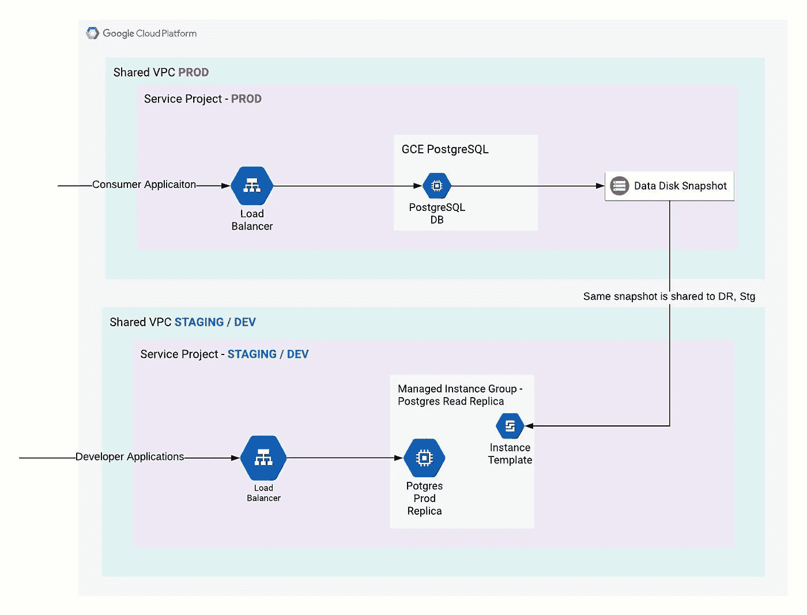

上面的部署图显示了一个典型的设置，其布局如下:

1.  生产数据库虚拟机位于单独的生产项目中。
2.  对于生产和非生产，可能有也可能没有单独的 VPC 网络。
3.  生产 PostgreSql 的数据磁盘会定期拍摄快照。
4.  在非生产环境中，创建托管实例组(MIG)。新数据展示通过滚动更新功能实现。

# 示例实现

为简单起见，我将使用:

1.  一个包含源数据库(假设为生产数据库)和副本(用于非生产用途)的项目。
2.  postgres 数据库虚拟机将只有一个磁盘用于引导、数据和日志。在实际场景中，最好只将数据磁盘复制到非生产环境，这样数据库用户、日志和配置(pg_hba.conf 和 postgres.conf 等)就不会被带到非生产环境中。
3.  托管实例组使用新的数据库快照进行滚动更新。
4.  为在上述步骤中创建的受管实例组创建负载平衡器。
5.  一个 orchestrator 虚拟机，通过调度 cron 作业来触发管道。它将按以下命令顺序执行:
    a .创建源磁盘快照
    b .从快照创建新的磁盘映像。
    c .用新的磁盘映像创建新的实例模板。
    d .在 MIG 上使用新快照进行滚动更新。

## 我们开始吧

如果你还没有使用过谷歌云，你可以前往 https://console.cloud.google.com 注册一个 300 美元起的免费账户。

## 设置源数据库和托管实例组

1.  开放云壳

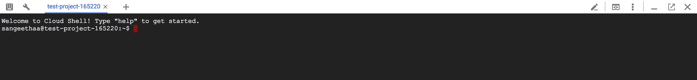

2.为 postgres 实例创建防火墙规则，并创建新的虚拟机实例。

创建防火墙(默认 VPC 网络可选)
执行以下命令创建防火墙规则，允许端口 5432 上的传入连接

```
gcloud compute firewall-rules create pg-firewall-open --direction=INGRESS --priority=1000 --network=default --action=ALLOW --rules=tcp:5432 --source-ranges=0.0.0.0/0
```

创建虚拟机
虚拟机实例可以通过 UI 或 gcloud 命令创建，如下所示。
或者从云壳执行以下命令。

```
gcloud compute instances create postgres-prod --zone=us-west1-b --machine-type=n1-standard-1 --subnet=default  --scopes=[https://www.googleapis.com/auth/cloud-platform](https://www.googleapis.com/auth/cloud-platform) --image-family=ubuntu-1604-lts --image-project=ubuntu-os-cloud --boot-disk-size=100GB --boot-disk-type=pd-standard --boot-disk-device-name=postgres-prod
```

3.SSH 到虚拟机，安装并配置 PostgreSQL 数据库。

安装 PostgreSQL

```
gcloud compute ssh postgres-prod --zone=us-west1-b
sudo apt update
sudo apt install postgresql postgresql-contrib
```

配置 PostgreSQL 以允许远程连接

默认情况下，PostgreSQL 被配置为绑定到“localhost”。
配置 postgresql.conf，我一般做个搜索就能找到。

```
$ find \ -name "postgresql.conf" /etc/postgresql/9.5/main/postgresql.conf
```

打开 postgresql.conf 文件并替换行

```
listen_addresses = 'localhost'
```

随着

```
listen_addresses = '*'
```

配置 pg_hba.conf

类似地，找到并打开 pg_hba.conf，并在最后添加以下条目。

```
host    all             all      0.0.0.0/0     md5
host    all             all      ::/0          md5
```

4.创建示例数据库。

```
sudo -u postgres psql
```

进入 psql shell 后，创建一个新的数据库。

```
create database prod_test_1;
```

退出 psql shell

```
\q
```

退出 postgres-prod 虚拟机

```
exit
```

5.创建磁盘快照。

`Name snapshot as: postgres-prod-initial-snapshot`

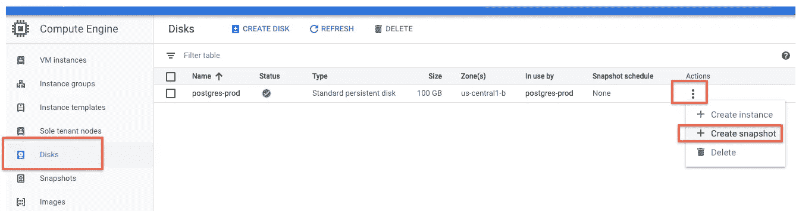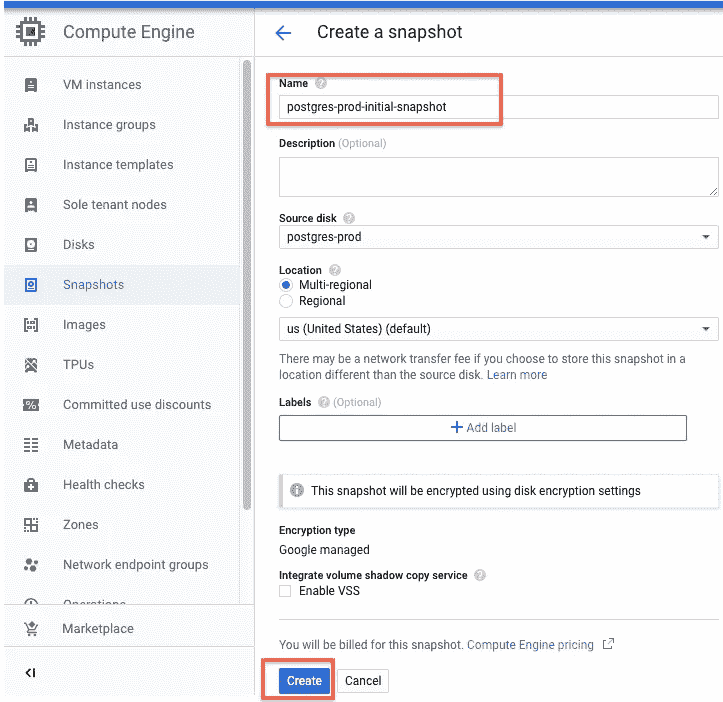

6.从快照创建磁盘映像，如下所示。

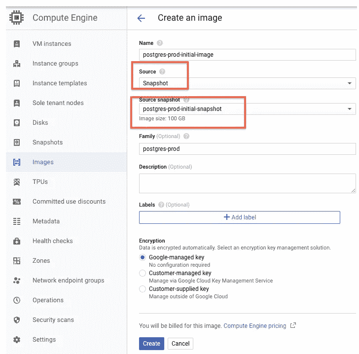

7.创建一个名为 postgres-prd-replica-initial-template 的实例模板，如下所示

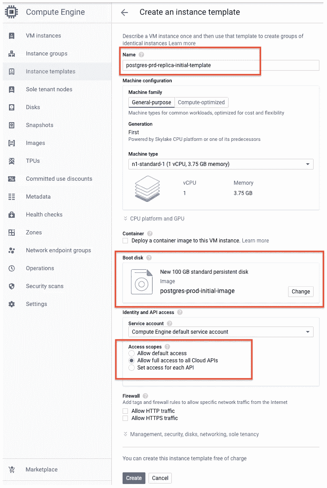

8.使用上述名为 postgres-prd-replica-mig 的模板创建一个托管实例组。计算引擎->实例组->创建实例组。

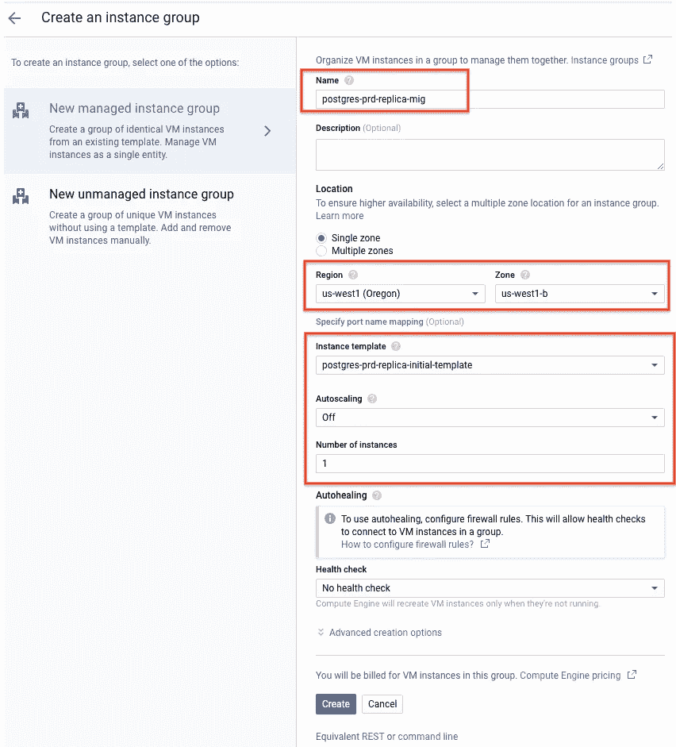

9.现在我们将创建一个负载平衡器。因此它提供了一个不变的 IP 地址来连接数据库。网络服务->负载平衡->创建负载平衡器-> TCP 负载平衡->启动配置

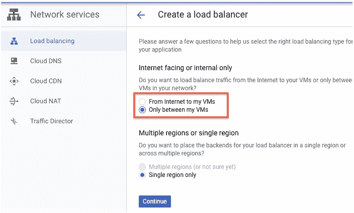

在这里，我们将配置负载平衡器。将其命名为 postgres-prod-replica-lb，并按照下面的屏幕截图进行配置。

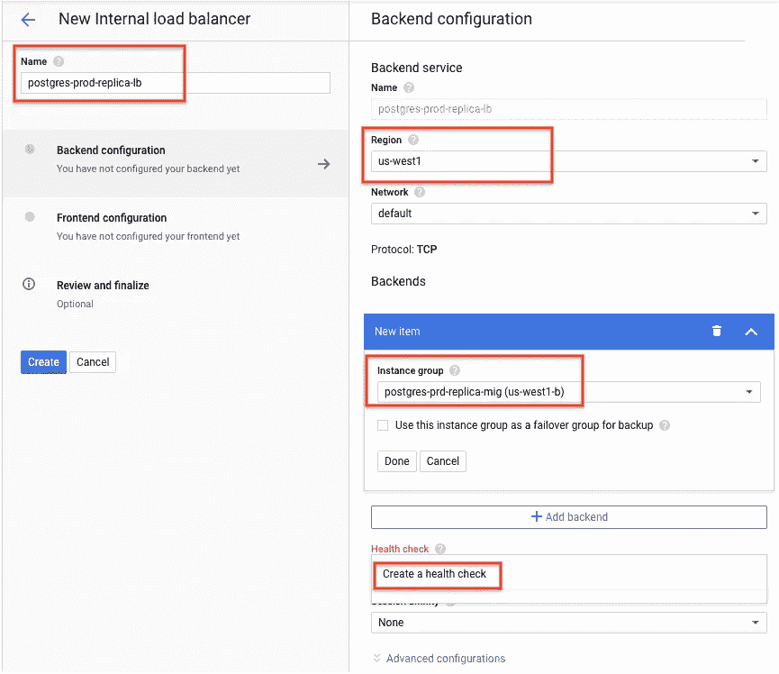

按如下方式配置运行状况检查。

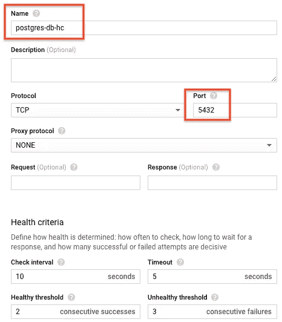

如下配置前端并点击创建按钮。

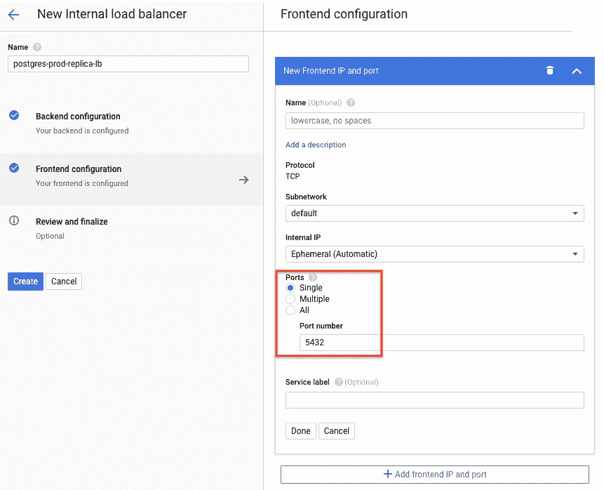

这将创建一个带有内部 ip 的负载平衡器，开发者/应用程序可以使用它进行连接。

您还需要创建一个健康检查防火墙规则来启用它。

```
gcloud compute firewall-rules create allow-hc --direction=INGRESS --priority=1000 --network=default --action=ALLOW --rules=tcp --source-ranges=130.211.0.0/22,35.191.0.0/16
```

用户应连接到此负载平衡器以访问生产副本数据库。

# 手动更新数据库快照副本

为了更新数据的最新副本，我们需要做的事情如下。
磁盘快照- >映像- >实例模板- >滚动更新

1.  创建磁盘快照(如前使用 UI 或如下使用 gcloud)

```
gcloud compute disks snapshot postgres-prod --snapshot-names=postgres-prod-manual1-snapshot --zone=us-west1-b
```

2.创建磁盘映像(像以前一样使用 UI，或者像下面一样使用 gcloud)

```
gcloud compute images create postgres-prod-manual1-image --family=postgres-prod --source-snapshot=postgres-prod-manual1-snapshot
```

3.创建实例模板(使用之前的 UI 或下面的 gcloud)

```
gcloud compute instance-templates create postgres-prd-replica-manual1-template --machine-type=n1-standard-1 --scopes=https://www.googleapis.com/auth/cloud-platform --image=postgres-prod-manual1-image --boot-disk-size=100GB --boot-disk-type=pd-standard
```

4.对托管实例组的滚动更新

转到计算引擎->实例组-> postgres-prd-replica-mig ->滚动更新

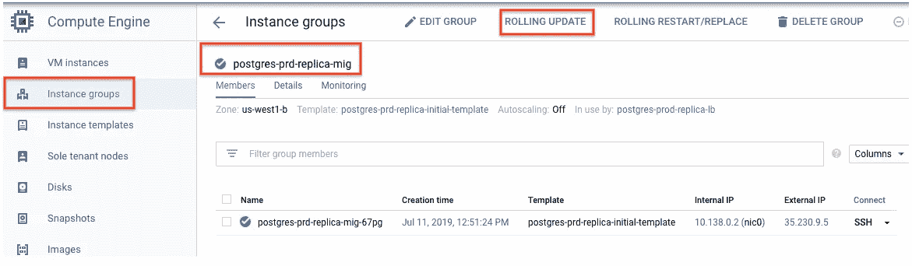

然后选择新模板，将最大不可用时间更改为 0，并单击更新。这将首先创建一个新的复制副本实例，然后删除旧实例。

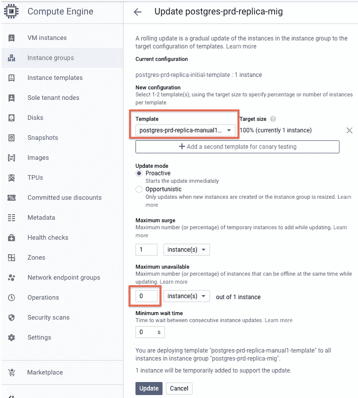

或者，这可以通过以下 gcloud 命令来实现。

```
gcloud beta compute instance-groups managed rolling-action start-update postgres-prd-replica-mig --version template=postgres-prd-replica-manual1-template --max-unavailable 0 --zone us-west1-b
```

# 编排定期自动更新

使用各种第三方部署工具(如 jenkins)都可以轻松做到这一点。但是，这里我将简单地创建一个 shell 脚本，并将其调度为 cron tab。

我将生成一个 uuid(使用 uuidgen 命令),为所有资源提供唯一的名称。我还缩短了资源的名称，因为它们超出了 gcp 的字符限制。

创建一个名为 prd-replica-updater 的虚拟机

```
gcloud compute instances create prd-replica-updater --zone=us-west1-b --machine-type=n1-standard-1 --subnet=default  --scopes=[https://www.googleapis.com/auth/cloud-platform](https://www.googleapis.com/auth/cloud-platform) --image-family=ubuntu-1604-lts --image-project=ubuntu-os-cloud --boot-disk-size=10GB --boot-disk-type=pd-standard --boot-disk-device-name=prd-replica-updater
```

SSH 进入虚拟机，创建名为 prd-replica-update.sh 的 shell 脚本，如下所示

```
# uuid string
rnd=$(uuidgen)# create snapshot
gcloud compute disks snapshot postgres-prod --snapshot-names=pg-prd-auto-$rnd-snap --zone=us-west1-b# create image
gcloud compute images create pg-prd-auto-$rnd-image --family=postgres-prod --source-snapshot=pg-prd-auto-$rnd-snap# create instance template
gcloud compute instance-templates create pg-prd-auto-$rnd-template --machine-type=n1-standard-1 --scopes=https://www.googleapis.com/auth/cloud-platform --image=pg-prd-auto-$rnd-image --boot-disk-size=100GB --boot-disk-type=pd-standard# do rolling update
gcloud beta compute instance-groups managed rolling-action start-update postgres-prd-replica-mig --version template=pg-prd-auto-$rnd-template --max-unavailable 0 --zone us-west1-b
```

可以使用 crontab 调度上述脚本，从而自动更新数据库。