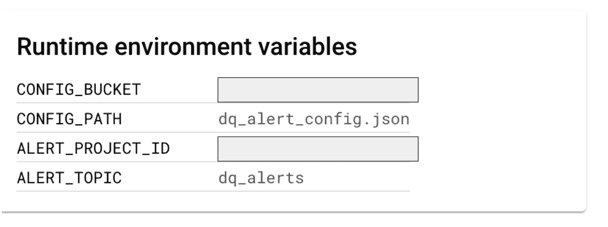
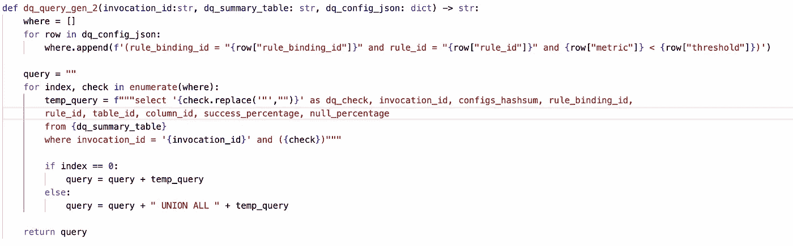
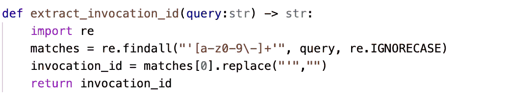

# GCP —主动 DQ 警报设置

> 原文：<https://medium.com/google-cloud/gcp-proactive-dq-alert-setup-6d7e262a4a66?source=collection_archive---------0----------------------->

数据摄取的一个关键方面是如何**测量摄取数据的质量**以及如何**监控数据质量**并在质量控制失败时发出警报。

这篇博客是我对在 BigQuery 中获取的数据设置主动数据质量警报的看法。

**高层建筑**

**顶层**代表典型的数据摄取管道，它将数据加载到大查询中。这通常使用任何迁移或 ETL 工具(本地/合作伙伴/外部工具)来实现。

**数据质量计算**层是使用开源云 DQ 引擎实现的。
**参考**——[https://github.com/GoogleCloudPlatform/cloud-data-quality](https://github.com/GoogleCloudPlatform/cloud-data-quality)

云 DQ 引擎也作为数据质量任务的一部分在 **Dataplex** 中提供

云 DQ 引擎提供了**配置驱动的** (YAML)方法来指定数据质量规则，并提供了**标准** **结构**来存储数据质量结果。

下面是云 DQ 的 YAML 规范的非常简单的表示

基于上述配置，云 DQ 引擎计算数据质量的结果，并发布到具有固定结构的目标表

数据质量输出的结构可以在下面的链接中找到
[https://github . com/Google cloud platform/cloud-data-quality/blob/main/overview . MD](https://github.com/GoogleCloudPlatform/cloud-data-quality/blob/main/OVERVIEW.md)

下面是我们在设置主动数据质量时将参考的一些关键列

source—[https://github . com/Google cloud platform/cloud-data-quality/blob/main/overview . MD](https://github.com/GoogleCloudPlatform/cloud-data-quality/blob/main/OVERVIEW.md)

以下参数有助于确定云 DQ 作业的每次调用，这将是主动数据质量设置的切入点

来源—[https://github . com/Google cloud platform/cloud-data-quality/blob/main/overview . MD](https://github.com/GoogleCloudPlatform/cloud-data-quality/blob/main/OVERVIEW.md)

绑定和**规则**的**规则将是设置数据质量警报和检查的关键驱动因素**

来源—[https://github . com/Google cloud platform/cloud-data-quality/blob/main/overview . MD](https://github.com/GoogleCloudPlatform/cloud-data-quality/blob/main/OVERVIEW.md)

对于这个演示，我使用一个非常简单的表格如下。这个概念可以在用例的基础上扩展。

目的是当**描述**栏中的**空百分比**低于**50%时，设置自动报警。**

第一种方法是设置**云 DQ YAML 配置**，用于测量上表中的数据质量。

一旦执行，云 DQ 利用 **dbt** 在大查询中生成模型和汇总表

这是 json 结果摘要在大查询摘要表中的样子

预期的成功百分比(具有非空描述列的行)为 **50%**

现在讨论的主要话题是设置自动警报来检查 DQ 何时低于 **50%**

我们将首先在**云日志**中设置一个**日志路由器**和一个**特定日志过滤器**

下面的**日志过滤器**标识目标数据质量汇总表上与云 DQ 作业发布事件相关的**日志**。

将 **tableId** 和 **DatasetId** 设置为**大查询表**，云 DQ 作业在此发布执行结果。

日志路由器中的日志过滤器

日志路由器的目的地配置为**发布-订阅主题**

下面是日志消息的示例，其中突出显示了云 DQ 作业的**调用 id** 。

这将是识别已经执行的工作和需要检查的 DQ 警报的关键实体。

检查 DQ 百分比低于/高于阈值的逻辑将通过**云函数处理，其触发器将是发布-订阅主题。**

云函数利用**存储在 **GCS 桶中的**报警配置 json 文件来确定要报警的阈值**

**警报**的阈值设置为**的 50%。**

**云函数**是基于 python 的函数，它将执行以下活动
1。在来自发布订阅的触发器上，读取日志消息并获得云 DQ 作业
2 的**调用 Id** 。从 GCS 桶
3 中读取**警报配置**。基于警报配置创建 **DQ 检查查询**，并查询特定调用 id
4 的 DQ 概要数据集。如果有任何记录返回，通过向**警报发布主题**发送消息进行警报

云函数接受如下环境变量

CONFIG_PATH 和 CONFIG_BUCKET 表示包含阈值设置的警报配置 json 文件

ALERT_PROJECT_ID 和 ALERT_TOPIC 是将向其发送警报的发布-订阅主题。

**功能参考**

从存储桶中读取**警报配置文件(json)** 的实用函数

基于警报配置在 **DQ 汇总表**上生成 **DQ 检查查询**的实用函数

从日志消息中提取**调用 id** 的实用函数

用于将警报发布到警报发布-订阅主题的实用程序功能

编排步骤的主要功能

最后一步是无论何时执行**云 DQ 引擎，云功能都会自动触发，评估阈值并发出适当的警报**

功能执行日志

发布-订阅主题-预警消息

上述消息和属性可以根据消费需求进行调整。

编码快乐！！