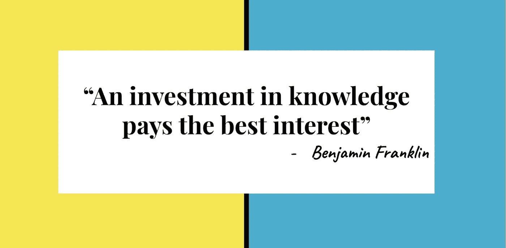

# GCP 专业云架构师认证:指南

> 原文：<https://medium.com/google-cloud/gcp-professional-cloud-architect-certification-guide-74d6b8243cfb?source=collection_archive---------5----------------------->

*寻找如何准备最新版本的谷歌云专业架构师认证？想知道你是否准备好尝试一下？*

*如果是，那么这篇文章可能会帮助你通过认证。*

谷歌云平台(GCP)专业云架构师(PCA)考试于 2021 年 5 月 1 日刷新了新版本。新的考试包括许多以前没有测试过的题目。因此，现在的考试有了多样性和深度。我将简要总结我的谷歌云平台(GCP)专业云架构师(PCA)考试之旅，并指导您完成所有需要的准备工作。

GCP 建筑师考试并不容易，但同时也不是什么难事。所有需要做的就是理解这些概念，*为什么*和*为什么不，*并在整个准备过程中采取一种架构师的心态。为了让这些事情对你来说更容易，这里是你的指南:

# 我的旅程

在考试更新之前，我从 [ACG 课程](https://acloud.guru/overview/73e7ac67-e0f4-4cb6-ab6f-5e2bf7f22a04?_ga=2.82604830.969197469.1627289639-1369633606.1620656470)开始。这让我对 GCP 建筑师的概念有了很好的理解，并获得了一些实践经验。尽管本课程涵盖了过时的案例研究，并且没有涵盖所有的主题(截至目前，尽管将来可能会有所改变)，但它仍然为一些基本概念提供了很好的解释。

如果您对 GCP 核心服务了解甚少或没有了解，我建议您从本课程开始，并跳过案例研究部分。你可以去看看约瑟夫·洛维里教授的另一门 ACG 课程。我没有看过这本书，因为我参加考试的时候还没有。这门课似乎有新考试中出现的最新内容和案例分析。

*注意:不要仅仅依赖课程内容，一旦你理解了各自的概念，就要查阅* [*谷歌文档*](https://cloud.google.com/docs) *，因为谷歌会不断增加新功能并更新旧功能。*

看视频和看文档来学习是个人选择。我查阅了大量的谷歌文档，以涵盖出现在新版本中而在课程中没有涉及到的概念。当我发现 docs 很吸引人时，我开始挖掘更多的资料。但是，我仍然可以理解有很多内容可用——似乎没有深度限制！这就是我来找你的原因。你不需要浏览每一页；我来告诉你如何聪明地使用 docs。确保你看完了。

由于考试大量涉及 GKE，我参加了 Coursera 上的 Kubernetes 课程。快结束时，我看了一些 Google Next 视频和其他一些视频，以了解新的案例研究。谷歌云架构师考试不仅是关于你的知识，也是对你的逻辑和能力的测试。有了对概念的逻辑理解，你就可以很容易地排除试题上的错误选择，最终得出正确的选择。

那么，我们还在等什么？让我们开始吧！

# 知道考试

1.  [关于 GCP 职业建筑师考试](https://cloud.google.com/certification/cloud-architect)
2.  [考试指南](https://cloud.google.com/certification/guides/professional-cloud-architect)
3.  [样题](https://cloud.google.com/certification/sample-questions/cloud-architect)(我强烈推荐从这个开始，这样你就能了解问题的结构。然而，真正的考试题目比这些更难。)
4.  [注册考试](https://cloud.google.com/certification/register)(以防你想提前安排考试。)

# 学习路径

**重要话题**

更多地关注下面的主题，并对它们进行彻底的研究。从考试的角度来看，这些是至关重要的:

1.  网络(对等、共享 VPC、混合连接、负载平衡、云路由器、BGP、IAM 角色)
2.  Google Kubernetes 引擎(服务网格— Istio、集群类型、部署、Pods、扩展、kubectl)
3.  计算引擎(虚拟机、备份、磁盘、映像、快照、gcloud 建议)
4.  云存储(gsutil、传输服务、传输设备、并行上传、复合上传、对象生命周期、版本控制、CLI)
5.  应用引擎、云运行、云功能、云端点、云 IAM、云 Anthos
6.  IAP，云装甲，网络安全扫描器，云 SQL 代理，网络策略，组织策略，秘密管理器
7.  云运营、合规性、灾难恢复、云 NAT
8.  BigQuery (DLP API)、云 SQL(第一代、第二代)和其他数据库选项(备份、灾难恢复、高可用性、可扩展性)

**新考试有什么变化？**

你可能想知道新版本的考试有什么变化或者增加了什么。在准备的时候，我也想确保自己没有漏掉什么。新版本的考试是一个很好的更新，有以下变化:

1.  两个案例研究的名称与之前的相同，但内容已经完全改变:Mountkirk Games 和 TerramEarth。
2.  增加了两个新的案例研究:EHR 医疗保健和直升机竞赛联盟。
3.  这些主题经过了额外的深入测试:Cloud Run、Cloud Anthos、Istio、身份感知代理、Cloud Armor、Cloud Endpoints、Secret Manager、Web Security Scanner、Kubernetes 和 BigQuery。

**视频课程**

通过浏览一些显而易见的东西，你可以明智地把时间花在冗长的课程上，从而节省时间，尤其是 Coursera 的课程。虽然最后一个不是强制性的，但是请确保您对云 Anthos 有很好的理解:

1.  [ACG GCP 建筑师认证课程](https://acloud.guru/overview/73e7ac67-e0f4-4cb6-ab6f-5e2bf7f22a04?_ga=2.82604830.969197469.1627289639-1369633606.1620656470)
2.  [ACG 云润深潜](https://acloudguru.com/course/google-cloud-run-deep-dive)
3.  [Coursera 使用谷歌 Kubernetes 引擎进行架构设计](https://www.coursera.org/specializations/architecting-google-kubernetes-engine)
4.  [Coursera 使用 Anthos 构建混合云基础架构](https://www.coursera.org/specializations/architecting-hybrid-cloud-infrastructure-anthos)

**巧妙使用谷歌文档**

对于每个主题，您只需要浏览三个主要部分:*概念、用例*和*最佳实践*。跳过*操作指南*和*教程*。深入关注*最佳实践*，因为考试中的大多数正确答案都隐藏在其中！从这些角度了解每项服务:*用例、成本、安全性、可伸缩性、可用性、合规性*和*备份&恢复*。尝试使用免费的 GCP 积分进行操作——当您注册 GCP 时，您将获得 300 美元的积分。

**案例研究**

对于案例研究来说，这些视频就足够了。在考试中，你将能够运用你的逻辑理解和知识回答基于案例研究的问题。

[https://youtube.com/user/sunseeandyou](https://youtube.com/user/sunseeandyou)

**其他有用链接**

[https://cloud.google.com/architecture/framework](https://cloud.google.com/architecture/framework)
https://cloud . Google . com/architecture/global-data-distributionT5[https://cloud.google.com/architecture](https://cloud.google.com/architecture)

**Google Next 20 播放列表**

如果你感到筋疲力尽，那么你可以跳过这里的所有内容，除了云存储安全视频！
[https://youtube.com/playlist?list = pln 30 EDG 8 lkaagxvc 4h-snext 8 QE-zu BAP](https://youtube.com/playlist?list=PLn30eDG8lKAAgxvc4h-SnEXT8qE-ZUBap)

# 考试准备

无论你准备了多少，你都不会觉得足够。你可能会感到筋疲力尽，但仍然有冒名顶替综合症。如果您已经完成了*最佳实践*和上述主题，戴上您的架构师帽子，并且您感到精疲力尽，*祝贺您！你已经准备好参加考试了。这个考试测试你是否很好地理解了概念，并且不会问你任何你不能回答的问题，尽管有以上所有的问题。无论考试中的问题有多长，都要关注每个问题问你的问题:可用性是决定性因素，还是成本起决定性作用？用例真的关心全球存在吗？诸如此类。一旦你读了问题实际上问的是什么，你会很容易马上排除三个选择。*

记住，没有什么是容易或艰难的；你的想法让它如此。我们都想提高和学习，但很少有人付诸行动。做到的人就是赢家！不断学习，不断成长。万事如意！