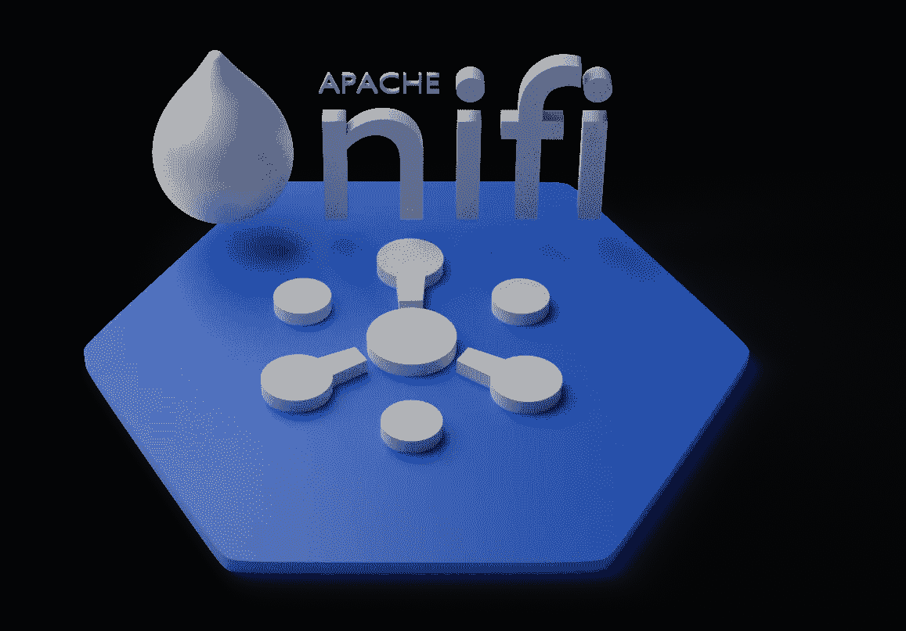
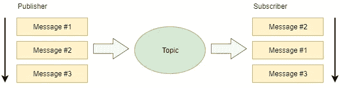
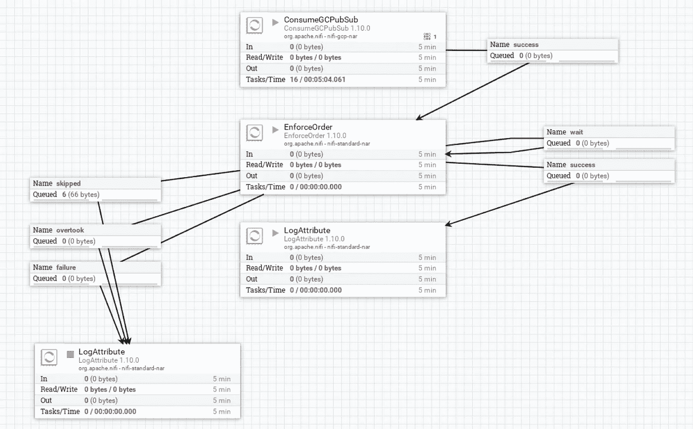
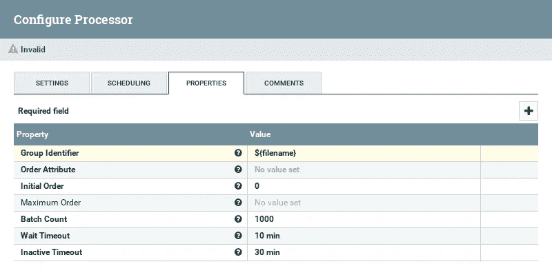

# GCP 公共/订阅订购和 Apache NiFi

> 原文：<https://medium.com/google-cloud/gcp-pub-sub-ordering-and-apache-nifi-5e1ac9a14752?source=collection_archive---------0----------------------->

**注:**本文发表于 GCP Pub/Sub 的一个名为 [*订购消息*](https://cloud.google.com/pubsub/docs/ordering) 的功能可用之前。请将 GCP 发布/订阅的本机特性视为优先于本文中先于新功能的概念。

GCP 发布/订阅不保证消息排序。这意味着，如果单个发布者发布了消息#1、#2 和#3 的序列，则不能保证它们被单个订阅者以该顺序接收。

对于某些用例，这可能是一个严重的问题。例如，如果按顺序发布的逻辑消息是:

*   开户
*   在账户上存 100 美元
*   从账户上转账 50 美元

那么处理的顺序可能非常重要。不按顺序执行前面的消息很容易导致不正确的结果。

Apache NiFi 是一个处理和分发数据的开源平台。我们不会在这里讨论 Apache NiFi 的细节，但是在其他地方可以找到很多关于它的优秀文献。我们要看的是如何使用 Apache NiFi 为 GCP 发布/订阅提供消息排序。

Apache NiFi 有一个 GCP 订户处理器( [ConsumeGCPubSub](https://nifi.apache.org/docs/nifi-docs/components/org.apache.nifi/nifi-gcp-nar/1.10.0/org.apache.nifi.processors.gcp.pubsub.ConsumeGCPubSub/index.html) )，可以用作流文件的源(流文件是数据的单位……想想 GCP 发布/订阅消息)。我们需要确保消息按顺序处理。实现这一点的一种方法是使用 NiFi 提供的名为 [EnforceOrder](https://nifi.apache.org/docs/nifi-docs/components/org.apache.nifi/nifi-standard-nar/1.10.0/org.apache.nifi.processors.standard.EnforceOrder/index.html) 的处理器。这个处理器有两个与提供给它的流文件相关的重要概念。

首先，每个流文件都应该有一个序列号属性。正是这个属性用于定义所需的排序。

> 注意:这里出现的一个问题是，当每条消息都有一个发布时间戳时，为什么我们还需要一个序列号。我们不能按时间顺序排列信息吗？要了解为什么这不起作用，请考虑一条时间戳为 2:00:00 的消息。我们确定没有一条消息可能随后到达，时间戳为 1:59:59 吗？如果下一条消息的时间戳是 2:05:00 呢？我们确定没有遗漏 2:03:00 的信息吗？

假设 EnforceOrder 最初期望序列 ID 为 1 的消息。如果具有该 id 的消息到达，它将被传递。EnforceOrder 是有状态的。它知道它所期待的消息序列 ID。当它找到一个匹配的消息时，它不仅传递该消息，而且还增加预期的序列号…在本例中，我们现在将寻找序列 ID 为 2 的消息。如果看到的下一条消息的序列 ID 为 3，EnforceOrder 就会意识到有问题。它现在会将这个消息路由到*等待*连接，并继续处理下一个输入消息。如果它看到的下一条消息的序列 ID 为 2，它将传递该消息，并将有状态的期望的下一条消息递增为 3。最终，被路由到 *wait* 的消息将被重新处理，我们将发出正确的有序序列。

与 EnforceOrder 相关的第二个概念是，并非所有流文件都需要相对于彼此排序，而是可以相对于分组排序。如果我们设想可以有多个同时处理的订单，那么我们发现我们只需要维护每个分组的订单，而不是作为一个整体。

将这些想法映射到 EnforceOrder 处理器的属性，我们发现序列 ID 将作为传入流文件上的一个属性来查找，其名称在“Order Attribute”属性中提供。形成序列的流文件分组作为“分组标识符”属性中的表达式提供。这通常是一个表达式，其计算结果为在流文件中找到的属性。

在我们的示例中，我们将假设一个流文件包含以下属性:

*   `seqNum` —从 1 开始的整数值序列号。
*   `groupId` —同一组中的流文件共有的字符串值。

让我们更详细地研究一下 EnforceOrder，以了解它是如何工作的，以及如何用它来解决我们的问题。如果我们查看 EnforceOrder 处理器的默认属性，我们会发现以下内容:

我们还会发现处理器有以下输出连接:

*   成功
*   失败
*   等待
*   跳过
*   赶上

总体目标是让流文件通过*成功*连接以正确的顺序到达和输出。为了了解这是如何发生的，让我们检查一系列消息。第一个到达的消息是 groupId 为 XYZ，seqNum 为 1 的消息。EnforceOrder 将查看 groupId，并意识到它过去没有看到过这样一组消息。它现在将维护该组的状态，并将初始期望顺序设置为 1。将检查传入消息的 seqNum，发现它为 1。这确实是下一个(在我们的例子中是第一个)预期消息，并将通过*成功*传递。下一个预期的 seqNum 将从 1 递增到 2，这意味着我们预期的下一条消息的值应该是 2。现在我们假设下一条消息的 groupId 为 XYZ，seqNum 为 2。EnforceOrder 识别出这是以前见过的 groupId，并将预期的 seqNum (2)与包含在消息(2)中的当前 seqNum 进行比较，并再次让它通过*成功*连接。下一个预期的 seqNum 从 2 递增到 3。现在让我们来看一个失序消息。假设下一条消息的 groupId 为 XYZ，seqNum 为 4。EnforceOrder 发现我们有一个已知的 groupId (XYZ ),并希望消息的 seqNum 为 3。它发现 seqNum 是 4，因此它到达得太早了(失序)。消息被发送到*等待*连接，并且 EnforceOrder 的状态保持不变。假设 *wait* 连接返回到 EnforceOrder，以便将来可以再次处理该消息。花点时间看看流程图，看看 *wait* 确实被路由回 EnforceOrder。继续以这种方式处理消息，接收到的消息被发送到 *wait* ，下一个预期的消息被传递到 *success* ，并且 EnforceOrder 下一个序列号的状态被递增。提前接收并发送到 *wait* 的消息将在未来重新检查。

这是 EnforceOrder 的核心，但还有我们尚未讨论的其他可能性，我们现在将研究这些可能性。

重复消息是指不止一次收到的消息。考虑清楚这一点，我们将认识到重复消息是 seqNum 等于我们已经看到的值的消息。这相当于 seqNum 小于我们下一个期望的序列号。例如，如果我们正在等待序列号为 4 的消息，而收到序列号为 2 的消息，这意味着我们之前已经处理了序列号为 2 的消息。在这种情况下，EnforceOrder 将重复消息路由到跳过的*连接。*

如果我们接收到消息 1、2 和 4，而*从来没有*接收到消息 3，这种不连续的消息序列会怎么样？这可能是一个问题，因为我们将永远维护 message 4 并无缘无故地锁定资源。这就是*等待超时*属性发挥作用的地方。这是一个可配置的时间间隔，用于定义等待(早期接收)消息应该保持多长时间。如果该消息在该间隔后仍然存在，则它被路由到*超越*连接。

我们还看到 EnforceOrder 维护每个 groupId 的状态。由于我们不知道一个组中有多少条消息，也没有最后一条消息的迹象，这似乎意味着组的状态将继续累积。这就是可以使用 EnforceOrder 的*非活动超时*配置属性的地方。这指定了导致 EnforceOrder 忽略消息组的时间间隔。该属性被定义为在给定组中看到的最后一条消息之后的时间间隔。例如，如果在 12:00 看到组 XYZ 的 5 号消息，并且我们定义了 10 分钟的非活动超时，那么在 12:10 我们可以声明我们将不再看到属于该组的消息，并且可以忘记我们正在维护的状态。

对于 GCP 发布/订阅，我们可以将发布消息的属性映射到与 groupId 和 seqNum 对应的属性，以提供 EnforceOrder 所需的数据。