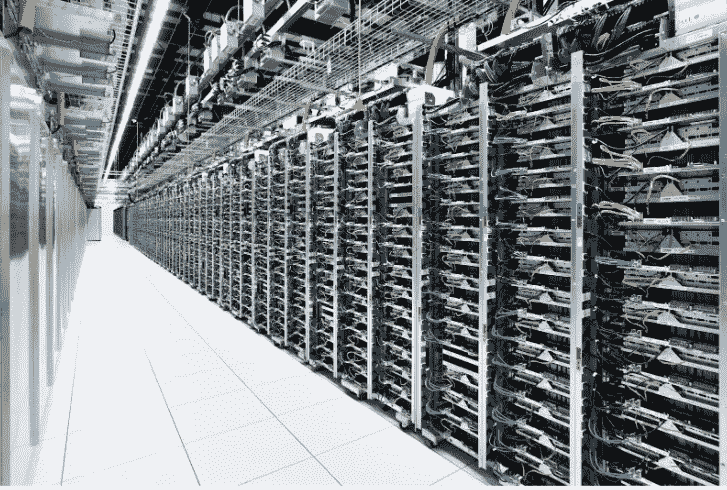
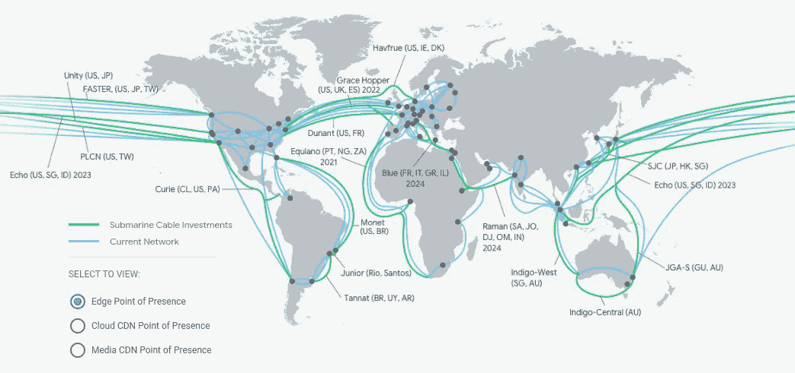
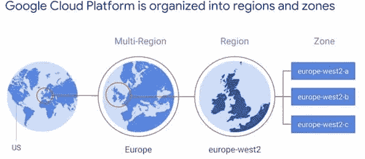
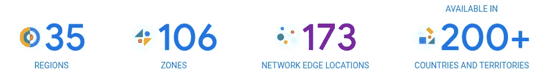

# GCP 网络-区域和分区

> 原文：<https://medium.com/google-cloud/gcp-region-and-zones-4eb4bf1f99ab?source=collection_archive---------2----------------------->

## 解释

谷歌云服务分布在全球最大的基础设施之一。该网络是所有云提供商中最先进的，是运行应用程序和服务的理想选择。根据您所需的体系结构或位置，您必须选择最佳区域来适应性能、可伸缩性、弹性和高可用性，同时使其尽可能具有容错能力。选择最佳区域和分区对于成功实施至关重要。

截至本文发布之日，谷歌云为 200 多个国家提供了多种服务。这些服务运行在支持谷歌搜索、YouTube、地图、Chrome 和 Gmail 等数十亿用户的同一基础设施上。因此，您可以利用低延迟、高吞吐量的网络。网络基础设施分为相互连接的区域和地带，构成谷歌的私人网络。网络边缘位置(pop)允许通过互联网连接到谷歌云。

https://cloud.google.com/about/locations#network

> 地区、区域和网络边缘位置之间有什么区别？

截至本出版物发布之日。

[区域](https://cloud.google.com/about/locations#regions):由三个或三个以上区域组成的独立地理位置。

[区域](https://cloud.google.com/compute/docs/regions-zones):由网络、电力和冷却等独立基础设施组成的区域内的部署区域(数据中心)，使其成为单个故障域。

[网络边缘位置](https://cloud.google.com/about/locations#network):通过对等网络(如第三方)提供从互联网到谷歌网络的连接。

*   分区资源在单个分区中运行，可能会受到分区停机(如虚拟机)的影响。
*   区域资源跨越多个区域，以实现类似于静态 IP 地址的冗余。
*   多区域支持在单个区域发生故障时跨多个区域的冗余。

[针对区域和地区的谷歌云架构框架最佳实践](https://cloud.google.com/architecture/framework/system-design/geographic-zones-regions)