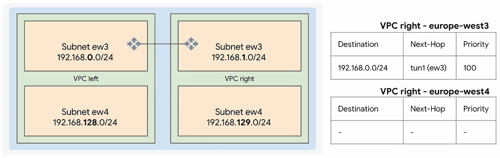
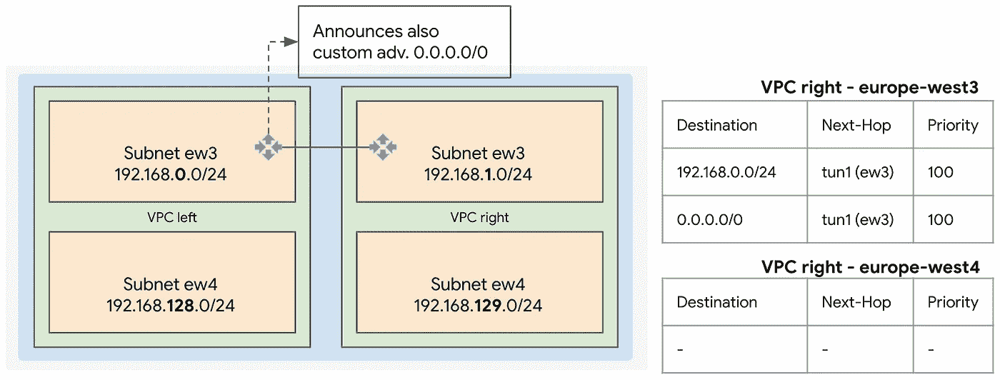
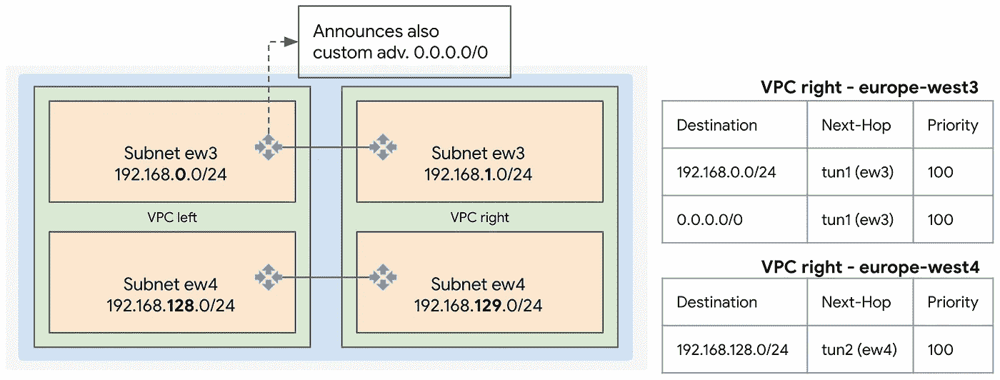
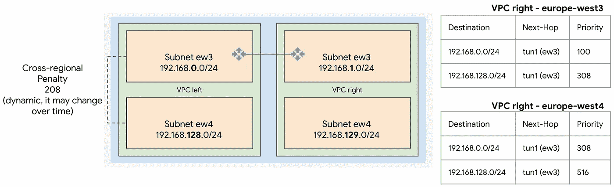
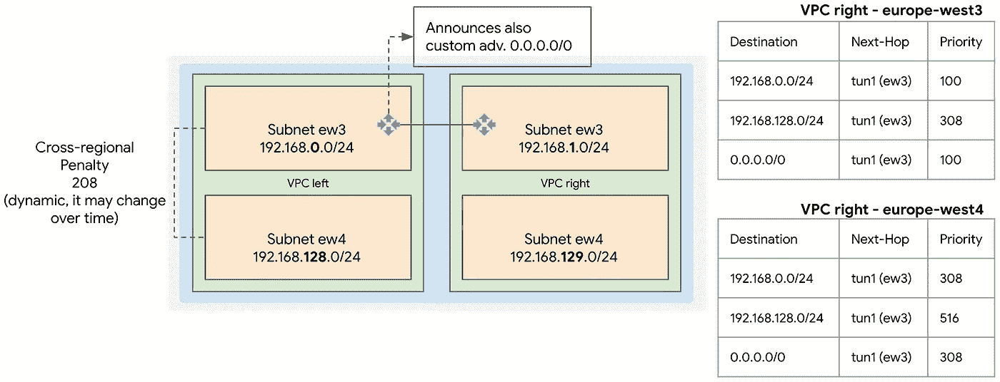
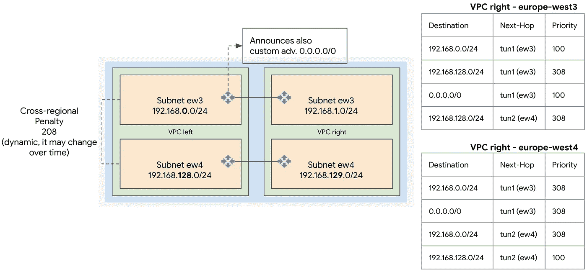
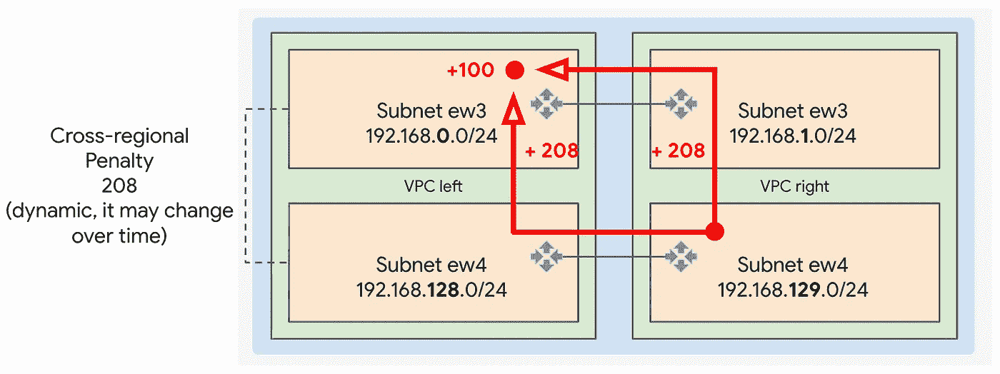
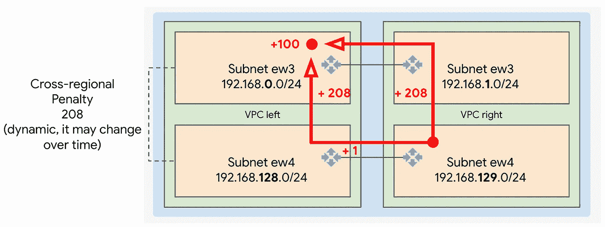

# GCP 路线历险记(第 1 卷)

> 原文：<https://medium.com/google-cloud/gcp-routing-adventures-vol-1-44a57806f739?source=collection_archive---------0----------------------->

“我完全理解 GCP 路由是如何工作的！”。这是我每次开始新的网络设计时不断重复的话。虽然不像每次都从零开始，但我总是需要刷新一些基本概念，这些概念是正确掌握主题的关键，然后才能正确设计。

经过几天漫长的实验(再次！)和其他队友一起，我决定写这篇文章，这样我就可以为自己提供一个快速参考，并希望对更广泛的受众有用。

我们将在本文中尝试解决的关键问题包括:

*   VPC 路由基础
*   动态路由模式:全局与区域
*   静态和动态路由的效果
*   路线优先级:基本成本和 c [跨区域(区域到区域)罚款](https://cloud.google.com/network-connectivity/docs/router/concepts/overview#guidance_for_base_priorities)
*   多区域部署路由基础知识

# VPC、云路由器和路由表

让我们从一些基本概念开始:

*   [GCP 虚拟专用云(VPCs)](https://cloud.google.com/vpc) 是*全球虚拟网络*，横跨所有 GCP 地区。假设防火墙规则到位，同一 VPC 网络中的资源可以相互通信。
*   在 VPC 网络中，我们可以创建区域性[子网。](https://cloud.google.com/vpc/docs/subnets)每个子网都有一个关联的 CIDR(不包括别名范围)。CIDRs 在子网和 VPC 网络中是唯一的。
*   [云路由器(CR)](https://cloud.google.com/network-connectivity/docs/router/concepts/overview) 是*区域资源*，允许在 VPC 网络或其他第三方路由器之间交换动态(BGP)路由。
*   VPC 网络中的路由具有相关联的*路由优先级*。路由优先级会受到许多因素的影响，本文将对其中的许多因素进行研究。优先级通常也称为(路线)成本，因此我们将继续使用这两个术语。

> **第一个重要的误解是假设每个 VPC 网络都与一个全局路由表相关联**。

这通常是由于路由条目在 GCP 控制台中的图形化表示方式:实际上，是一堆条目放在一个表中。

事实证明这并不完全正确。在深入探讨之前，我们应该在这里暂停一下，了解一下什么是*动态路由模式*。

# 动态路由模式

您可能已经注意到，VPC 网络有一个名为 [*动态路由模式*](https://cloud.google.com/vpc/docs/vpc#routing_for_hybrid_networks) 的参数，可以在创建时设置，也可以在创建后设置。

此参数规定如何在同一个 VPC 网络内将动态路由(读取 BGP 路由，无论它们是否来自第三方网络设备、VPN、互连)从一个区域交换到另一个区域，以及如何在底层网络中对这些路由进行编程。

以下是可用的选项及其对动态路由的影响。

在 VPC 网络中，如果动态路由模式被设置为**区域**，云路由器**会让它们学习到的路由只对同一区域内的实例可用**

另一方面，如果动态路由模式被设置为**全局**，同一 VPC 网络**内的云路由器使它们学习的路由对 VPC 网络**中的任何实例(即 VM)可用，而不管云路由器的区域或实例的区域

# 路由和路由表的实用方法

那么， [VPC 网络的路由表](https://cloud.google.com/vpc/docs/routes)如何能够是全局的，如果在特定条件下，云路由器使路由只对它们相同区域的实例可用？

如前所述，这个假设并不完全正确。
随着时间的推移，我建立了一个心理模型，帮助我合理地解释事情是如何工作的:我喜欢想象 **VPC 网络有多个区域路由表。**

当静态路由(我们手动添加的路由)创建时，它们在所有区域路由表中的优先级相同。因此，所有实例都将能够利用这些路由，无论它们位于何处。

对于动态路线，*取决于*:

*   如果动态路由模式是区域的，则动态路由仅在云路由器所在的区域路由表中编程(因此它们仅在该区域的实例上有效)
*   如果动态路由模式设置为全局，则动态路由(理想情况下)存储在每个区域路由表中，以便这些路由可用于 VPC 中的任何实例。

使全局选项更有趣的是与动态路由相关联的优先级，因为这些路由会被传播。这就是我们在下一段要关注的。

# 动态路线优先和跨区域惩罚

虽然静态路由在所有区域路由表中都具有相同的优先级，但动态路由并非如此。

我在这种情况下使用的心理规则是:

> **每当动态路由从一个区域传播到另一个区域时，增加一个** [**跨区域惩罚**](https://cloud.google.com/network-connectivity/docs/router/concepts/overview#guidance_for_base_priorities) **。**

[跨区域( *XR* )惩罚](https://cloud.google.com/network-connectivity/docs/router/concepts/overview#guidance_for_base_priorities)(也称为[区域间成本](https://cloud.google.com/network-connectivity/docs/router/concepts/overview#guidance_for_base_priorities))是路径上跨区域发送流量“我们付出”的额外成本。
想想……这不是逻辑吗？跨区域意味着在到达目的地之前，交通要行驶更远的距离。
实例(即虚拟机)和其他路由器必须意识到这一点，并利用优先级(总成本)，考虑延长路径。

请记住， [**跨地区罚款**](https://cloud.google.com/network-connectivity/docs/router/concepts/overview#guidance_for_base_priorities) **在每对地区之间是不同的，它是动态的**，这意味着它会随着时间的推移而变化。其值在 [201 和 9999(含)之间](https://cloud.google.com/network-connectivity/docs/router/concepts/overview#advertised-prefixes-and-priorities)。

深入研究这个问题的最简单的方法是跳到一个实际的例子，看看云路由器和 VPC 网络在路由设置改变时是如何表现的。

# 第一个示例:区域路由

让我们从简单开始，随着我们的发展，我们会增加更多。

在图中，我们看到两个 VPC 网络(左侧和右侧)，动态路由模式设置为*区域*。



两个 VPC 网络配置为动态路由模式设置为区域。

每个 VPC 网络都有两个子网:上层子网配置在 europe-west3 (ew3)中，下层子网配置在 europe-west4 (ew4)中。

VPC 网络通过 [HA VPN](https://cloud.google.com/network-connectivity/docs/vpn/concepts/overview#:~:text=HA%20VPN%20is%20a%20high,SLA%20of%2099.99%25%20service%20availability.) (及相关云路由器)连接，设置在 ew3 的子网之间。在这个场景中，左边的云路由器将 VPC 网络[子网路由](https://cloud.google.com/vpc/docs/routes#types_of_routes)通告给右边的云路由器(反之亦然)。

让我们观察一下*右侧的 VPC 网络*及其按地区划分的路由表。这些显示在图表的右侧。

右边的云路由器只接收一条路由:192.168.0.0/24，其下一跳是 VPN 隧道的另一端。
这是从左到右的广告，基本开销为 100(GCP 默认的基本优先级)。

值得注意的是，由于动态路由模式是区域性的

1.  左边的云路由器只向右边的云路由器通告其所在区域的子网
2.  ew4 中右侧的 VPC 网络路由表为空(该图不包括本地[子网路由](https://cloud.google.com/vpc/docs/routes#types_of_routes)，因为 ew3 中的云路由器没有传播到其他区域的路由
3.  右 VPC 网络(ew4)中的实例无法联系左 VPC 网络(ew3)中的实例，因为右 VPC 网络的区域路由表中不存在路由(ew4 联系左 VPC 网络— ew3 中的实例)

让我们再添加一个片段:让我们指示位于左侧 VPC 的 CR 也向右侧 VPC 的 CR 通告一个[自定义路由](https://cloud.google.com/vpc/docs/routes#types_of_routes)，0.0.0.0/0。



左侧 VPC 网络中的云路由器也向右侧 VPC 网络中的云路由器通告自定义路由通告 0.0.0.0/0。

请注意，右边的云路由器也收到了这个新广告，其[基本开销为 100](https://cloud.google.com/network-connectivity/docs/router/concepts/overview#guidance_for_base_priorities) 。

现在让我们在 ew4 中添加第二个 VPN 隧道，看看情况如何变化。



第二个 HA VPN 隧道建立在欧洲-西方 4 地区的两个 VPC 之间。

新隧道在右 VPC 网络路由表(在 ew4 中)中安装了一个新条目，因此它的实例可以与同一区域内左 VPC 中的实例进行通信。请注意，右侧 VPC 网络(ew4)中的实例仍然无法到达左侧 VPC 网络(ew3)中的实例。

# 第二个示例:全局路由

让我们从头开始练习，但这次我们将 VPCs 动态路由模式设置为全局。



两个 VPC 配置为动态路由模式设置为全局。

再次查看右侧 VPC 网络的路由表，我们可以看到路由传播的不同之处。

假设动态路由模式设置为全局，很少会发生以下情况:

*   左 VPC 网络(ew3)中的云路由器通告来自其所在的 VPC 所有地区的路由。在这种情况下，ew4。这就是我们在右侧 VPC 网络(ew3)的路由表中找到第二个条目 192.168.128.0/24 的原因
*   当左 VPC 云路由器通告来自其他区域(ew4)的路由时，它向基本路由开销添加了[跨区域代价](https://cloud.google.com/network-connectivity/docs/router/concepts/overview#guidance_for_base_priorities)。在本例中，[跨区域成本](https://cloud.google.com/network-connectivity/docs/router/concepts/overview#guidance_for_base_priorities)(在撰写本文时，ew3 和 ew4 之间的成本为 208)与基本成本相加为 308。这是与条目 192.168.128.0/24 相关联的优先级，存储在右侧 VPC 网络(ew3)的路由表中
*   正确的 VPC 网络路由器不仅在路由器所在的路由表中编程路由，还在 ew4 的路由表中编程路由
*   在对其他地区(特别是 ew4)的路由进行编程时，右侧 VPC 网络中的云路由器为其路由增加了额外的地区间成本(是的，这是第二次为 192.168.128.0/24！).观察 VPC 右边的路由表— ew4:对于 ew3 中相同 VPC 中的相同条目，优先级增加到 308

如果我们指示左侧 VPC 网络中的云路由器发送(除了[子网路由](https://cloud.google.com/vpc/docs/routes#types_of_routes)之外)自定义广告[0 . 0 . 0 . 0/0，会发生什么？](https://cloud.google.com/network-connectivity/docs/router/how-to/advertising-overview)



左侧 VPC 网络中的云路由器也向右侧 VPC 网络中的云路由器通告自定义路由通告 0.0.0.0/0。

正如在上面的区域示例中发生的那样，[自定义路由](https://cloud.google.com/vpc/docs/routes#types_of_routes)被通告给正确的路由器。没有惊喜。但是同样，假设动态路由模式被设置为全局，那么[定制路由](https://cloud.google.com/vpc/docs/routes#types_of_routes)也被编程在右 VPC 网络(ew4)中，并具有 208 的附加[跨区域惩罚](https://cloud.google.com/network-connectivity/docs/router/concepts/overview#guidance_for_base_priorities)。

请注意，在左侧 VPC 网络(ew4)中，0.0.0.0/0 路由不是*而不是*被*编程*，因为这不是[子网路由](https://cloud.google.com/vpc/docs/routes#types_of_routes)。我们只是指示左边的云路由器将这条额外的路由作为[自定义广告](https://cloud.google.com/network-connectivity/docs/router/how-to/advertising-overview)通告给右边的 VPC 网络。

让我们让事情变得更加有趣:让我们在 ew4 地区的两个 VPC 网络之间添加第二个 VPN。



第二个 HA VPN 隧道建立在欧洲-西方 4 地区的两个 VPC 网络之间。

再次查看路由表，新的 VPN 创建了一组新的条目，这些条目可能不容易理解。

*   *ew3 路由表有新条目 192.168.128.0/24，下一跳为 tun2 (ew4)，优先级为 308。*
    该路由最初是从左 VPC 网络(ew4)中的云路由器获知的，没有增加任何额外的跨区域开销，是来自云路由器所在区域的路由。右侧 VPC 网络(ew4)中的云路由器也在 ew3 中编程路由，增加了[跨区域惩罚](https://cloud.google.com/network-connectivity/docs/router/concepts/overview#guidance_for_base_priorities)。

对称地…

*   *ew4 路由表有新条目 192.168.0.0/24，下一跳为 tun1 (ew3)，优先级为 308。*
    该路由最初是从左 VPC 网络(ew3)云路由器获知的，没有增加任何额外的跨区域开销，是来自云路由器所在区域的路由。右侧 VPC 网络(ew3)中的云路由器也在 ew4 中编程路由，增加了[跨区域惩罚](https://cloud.google.com/network-connectivity/docs/router/concepts/overview#guidance_for_base_priorities)。

请注意

*   **具有相同前缀和相同优先级的路由都保存在路由表中**(阅读下面关于 ECMP 的更多信息)
*   **如果相同前缀的多个路由以不同的优先级被学习，只有优先级最低的一个(或多个)仍然可见。一旦优先级最低的路线被撤回，其他路线将再次出现**

事实上，以下路线尚未规划:

欧洲-西方 3
192.168.0.0/24，下一跳 tun2 (ew4)，优先级 516

欧洲-西方 4
192.168.128.0/24，下一跳 tun1 (ew3)，优先级 516

这是因为对于同一目的地(100) ，区域路由表已经具有具有*较低优先级* *的条目。*

# 我的路线在哪里？

好吧，我想复制卢卡刚才给我看的东西！你打开试验台，到 GCP 控制台，你看不到我之前给你看的所有路线。Ups，惊喜！并非所有这些路线都可以从谷歌云控制台(GUI)上看到。

你看不到的是由目的地 VPC 网络中的云路由器编程的动态跨区域路由。参考上面的例子，我们在上图中看到的例子，当我们在 ew4 中添加第二个 VPN 隧道时。

要查看这些，您需要使用 [gcloud CLI](https://cloud.google.com/sdk/gcloud/reference/compute/routers/get-status) :

```
gcloud compute routers get-status ROUTER_NAME --region=REGION --project PROJECT_ID
```

输出将向您展示

*   云路由器正在通告什么路由(bgpPeerStatus/ *通告路由*
*   云路由器从别人那里学到了什么路由(第*节最佳路由路由器*
*   区域路由表中编程了哪些路由，包括您在 GCP 控制台中错过的路由(第*节最佳路由*

# 路径实施

在最后一个示例中，我们看到了在给定路由设置的情况下，流量如何通过多条路径到达同一个目的地。


两个 VPC 网络，每个网络有两个区域子网。几个 HA VPN 网关(和云路由器)连接每个地区的 VPC 网络。右侧显示了右侧 VPC 网络的区域路由表。

例如，如果右 VPC 网络(ew4)中的一个实例想要到达左 VPC 网络(ew3)中的另一个实例，它将采用什么路径？



从右侧 VPC 网络(ew4)到左侧 VPC 网络(ew3)有两条路径。

看一下右边的 VPC 网络(ew4)路由表，我们可以看到 *192.168.0.0/24 有两个条目:*

*   下一跳 tun1 (ew3) /优先级 308
*   下一跳 tun2 (ew4) /优先级 308

这意味着，当两条隧道开通时，[等成本多路径(ECMP)](https://wikipedia.org/wiki/Equal-cost_multi-path_routing) 将用于向目的地发送流量。如果两条隧道中的一条关闭，所有的交通将通过保持开启的那条。

如果我们想要强制流量通过特定的路径，即使两条隧道都是打开的，该怎么办？我们需要[对基本开销进行操作，以便我们更改最终路由优先级(在“目的地”区域路由表中)](https://cloud.google.com/network-connectivity/docs/router/how-to/updating-priority)。

假设我们希望流量始终通过 tun1 (ew3 ),即使 ew4 中的 VPN 开启。从正确的 VPC 网络角度来看，这意味着我们总是先跨区域，然后通过 tun1 (ew3)穿越 VPN。

为此，我们需要在左侧 VPC 网络(ew4)中通告来自 CR 的具有较高基本优先级的路由。高多少？



左 VPC 网络(ew4)云路由器通告基本优先级为 101(而不是默认的 100)的子网路由。

**在基础成本上增加 1 点就足够了**使具有下一跳 tun1 (ew3)的路由优先于经过 tun2 (ew4)的路由。

**考虑到** [**跨区域惩罚**](https://cloud.google.com/network-connectivity/docs/router/concepts/overview#guidance_for_base_priorities) **(从 201 到 9999 不等)的动态性质，将 delta 设置为高于 1 肯定是更好的方法。**例如，10000 将保证您要更改其值的路由将始终被视为优先级低于 GCP 为相同前缀自动传播的任何其他路由。

我们的路线的成本为
基本成本+增量= 100 + 10000 = **10100**

GCP 生成的路线(具有可能的最大跨区域罚金)的成本为
基本成本+跨区域罚金= 100 + 9999 = **10099**

# 结论

正如人们所说，魔鬼总是在细节中。正如您所看到的，高层次上看似简单的东西隐藏了大量的技术细节，为了正确设计复杂的网络基础设施，应该仔细评估这些细节。

希望你喜欢这本书，这篇介绍 GCP 路由的文章对你很有用，对我也一样，每次我开始(再次)质疑我是否真的了解 GCP 网络时。

一如既往地关注官方文档的最新更新，最重要的是和 GCP 玩得开心！