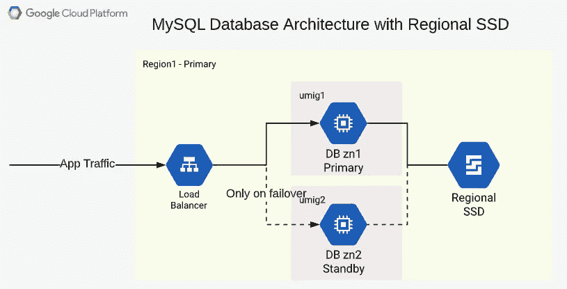
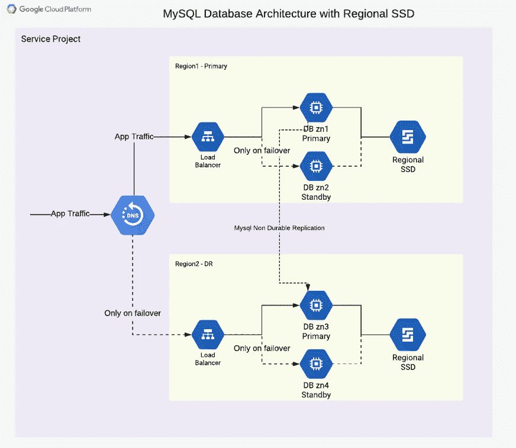
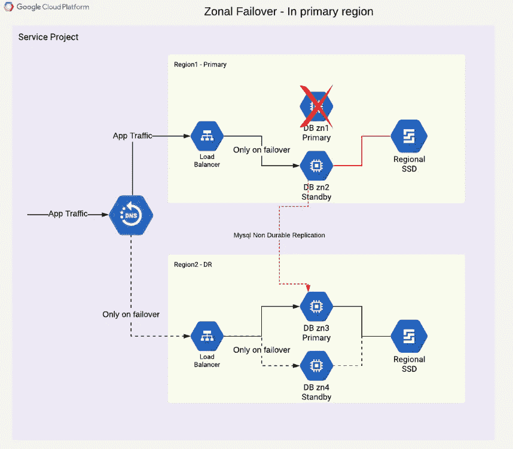

# GCP 解决 MySQL 高可用性复制延迟

> 原文：<https://medium.com/google-cloud/gcp-solving-mysql-ha-replication-lag-4f005779a32c?source=collection_archive---------0----------------------->

**TL；DR** :该解决方案侧重于使用多区域磁盘(称为区域磁盘)来实现持久的 MySQL HA 复制。这是基于 GCE 的 [CloudSQL 复制技术](https://cloud.google.com/sql/docs/mysql/high-availability)的实现。

# 问题陈述

当持久性开启(即 sync_binlog = 1)且平均负载大于约 300 tps(每秒事务数)时，公共云(如 GCP)开始显示 MySQL 副本实例的复制延迟。然而，裸机硬件在大约 300 tps 的极限下没有显示出滞后。
**注意** : 300 TPS 的限制可能因事务大小和类型、单线程或多线程复制等而异。

次要目标—在 30 秒内实现故障切换。

# 假设

Mysql 版本:5.7.10+
复制类型:异步
持久性:必需(即 sync_binlog = 1)
故障转移时间:30 秒以下

# 理解问题

**为什么需要耐久性？**

数据库管理员需要在复制时具有持久性，以确保副本中数据的一致性和稳定性。此外，它使故障切换更快更容易，因为除了告诉副本服务器停止复制之外，不需要对副本服务器进行任何更改。

**什么导致了持久复制的滞后？**

复制滞后的根本原因是虚拟化增加了延迟。

此外，由于多线程时 mysql 复制的无效性，这一问题变得更加突出。MySQL 不能很好地使用多线程来在线程之间分配复制负载，并且经常求助于单个线程来完成大部分工作。

**为什么 MASTER 不滞后或者高延迟？**

Master 通过多个连接(线程)接收流量，并有机地写入数据库。换句话说，MySQL 作为 master 使用多线程是有效的，但在复制时却不是这样。

除非主服务器处于半同步复制设置，否则它可能不会显示高延迟。即使半同步模式也仅确保事务被提交给至少一个复制品。因此，如果您从本地主服务器复制到(1)本地副本服务器。(2) gcp 复本。主机不会显示额外的延迟。

# mysql 复制延迟的解决方案

在上面的部分中，我们已经确定 MySQL 中的复制延迟是由于(1)虚拟化导致的延迟(2)MySQL 软件在复制时的无效性

为了解决这个问题，我们可以通过使用 GCP 的[区域持久磁盘](https://cloud.google.com/compute/docs/disks/#repds)来消除(2)。这些圆盘在给定的区域是双带的。因此，在其上写入的任何内容都会同时写入两个区域。

**部署图**



带区域 ssd 的 MySQL Master (HA)

1.  创建 GCP 内部负载平衡器是为了将所有流量发送到 umig1(非托管实例组 1)，并且仅在故障转移时发送到 umig2。
2.  虚拟机 DB zn1 和 DB zn2 使用相同的启动映像与 mysql 一起安装。(更多细节见下一节)。
3.  每个虚拟机都被添加到单独的非托管实例组(umig)中。
4.  区域 SSD 是 mysql 用来写数据和日志的磁盘。在给定时间，只有一个虚拟机可以以读/写模式连接它。

# 设置基于区域磁盘的方法的详细信息

1.  创建金启动磁盘。
    a .创建一个新的虚拟机并通过 ssh 连接到虚拟机
    b .安装软件 mysql(以及任何监控软件，如果需要的话)。c .在 my.cnf 文件中配置 mysql 使用挂载的磁盘路径。
    `datadir = /mnt/attached-disk/msql/data
    log-bin = /mnt/attached-disk/msql/log/repl`
    d .禁用 mysql 服务自动启动
    `sudo systemctl disable mysqld` e .关闭虚拟机
    f .创建启动盘镜像
2.  创建区域 pd-ssd。
3.  使用元数据“attached_disk_name= <name of="" regional="" pd-ssd="">”创建主虚拟机和备用虚拟机。
    注意:将所有计算引擎 API 权限授予虚拟机。</name>
4.  登录到上述两个虚拟机，并复制 failover.sh 脚本(如下)。
5.  在主实例中执行以上 failover.sh 以开始服务 mysql。

**failover.sh**

```
#### Variables
export other_vm_name="<other instance name primary/standby>"
export other_vm_zone="us-central1-a"
export mysql_root_password="<password>"
#### Variables ENDecho $(date) " starting failover #############"
gcloud compute ssh $other_vm_name --zone $other_vm_zone --quiet -- -o ConnectTimeout=10 -t "sudo systemctl stop mysqld"
echo $(date) " stopped current master ##########"export inst_zone=$(curl "http://metadata.google.internal/computeMetadata/v1/instance/zone" -H "Metadata-Flavor: Google" |  awk '{split($0,a,"/"); print a[4]}')
export inst_name=$(curl "http://metadata.google.internal/computeMetadata/v1/instance/name" -H "Metadata-Flavor: Google")
export attached_disk_name=$(curl "http://metadata.google.internal/computeMetadata/v1/instance/attributes/attached_disk_name" -H "Metadata-Flavor: Google")gcloud compute instances attach-disk $inst_name --zone "$inst_zone" --disk "$attached_disk_name" --device-name "$attached_disk_name" --mode rw --force-attach --disk-scope "regional"echo $(date) " attached regional disks ##########"sudo mount -o discard,defaults /dev/sdb /mnt/attached-diskecho $(date) " mounted regional disks ##########"sudo systemctl start mysqldecho $(date) " started mysql ##########"
echo $(date) " failover complete ##########"mysql -uroot -p$mysql_root_password -e "show master status"
```

# 执行故障转移

在备用虚拟机中执行`failover.sh`。负载平衡器将自动检测和切换流量。

# 执行回切

从主虚拟机执行`failover.sh`。负载平衡器将自动检测和切换流量。

# 多区域部署

同样，可以部署多区域复制，以便 DC 和灾难恢复都高度可用。唯一的区别是，从 DC 到灾难恢复的复制必须是非持久性的，以弥补复制滞后。



在该架构中需要考虑以下几点:

1.  迁移 MySQL 和实例的故障转移是本文的重点。因此，该图用相当简单的术语显示了所有其他方面。
2.  每个数据库虚拟机位于不同的区域，即 ZN[1–4]
3.  该图清楚地显示了这两个区域中的主服务器和备用服务器。主数据库和备用数据库之间没有复制。
4.  待机将停止 mysqld 服务。在主节点(在相应区域中)发生故障之前，备用节点不会连接到区域 ssd。
5.  每个负载平衡器应该“仅在故障转移的情况下”向备用服务器发送流量。
6.  灾难恢复主节点(zn3)从 DC 主节点(zn1)进行非持久性复制。
7.  从区域 1 到区域 2 的单向复制。因为 region2 的 mysql 是非持久的。
8.  [可选]使用 dns 服务路由应用程序流量。
9.  [可选]如果配置了额外的读取副本，将使用分区 ssd 进行非持久复制。

# 借助区域 PD-SSD 实现分区故障转移和故障回复

在事件主节点(DB zn1 主节点)中，拓扑将更新如下。



一旦检测到故障，脚本(如上的 failover.sh)将需要执行以下步骤:

1.  尝试优雅的失败。尝试停止主数据库(超时 10 秒)。
2.  将区域 pd-ssd 强制连接到备用虚拟机。
3.  启动备用的 mysql 服务。
4.  更改灾难恢复主服务器上的主服务器，以继续灾难恢复中的复制。

一旦步骤 1、2 和 3 完成。理想情况下，负载平衡器会自动检测备用实例是否正常，并开始向备用实例发送所有流量。

# 添加多个读取副本

多个读取副本(用于 mysql 性能)可以进一步添加到同一个设置中。通过添加独立的 mysql 节点进行不持久的复制。

# 替代解决方案

在解决这个问题的过程中，我们发现了以下更多的解决方法。但所有这些都是通过调整 mysql(应用层)复制设置实现的，因此每个都有一些缺点。

1.  **半同步复制:**可能以增加主设备延迟为代价解决复制延迟。这通常是不希望的。
2.  **关闭**[**log _ slave _ updates**](https://dev.mysql.com/doc/refman/5.7/en/replication-options-binary-log.html#sysvar_log_slave_updates)**:**当副本也生成 bin 日志时，复制延迟通常会提高。消除 bin 日志，加快复制速度，直到达到 700 tps 的限制(几乎翻倍)。这可以在 my.cnf 中使用(log_slave_updates = OFF)来关闭。因此，灾难恢复中的任何读取副本也必须从主 DC 主机复制。
3.  **多线程复制:**我们进行了尝试，通过 sysbench 生成的负载显示了很好的结果。然而，在真实负载下，它的性能并没有好到完全赶上复制延迟。

# 结论

使用区域性持久磁盘是创建高可用性数据库基础设施的最佳选择。给出小于 30 秒的故障转移时间。

感谢阅读。如果你想看到 terraform 或 shell 脚本来启动整个基础设施，请回复这个帖子并告诉我。我可以写第 2 部分给出完整的端到端代码。