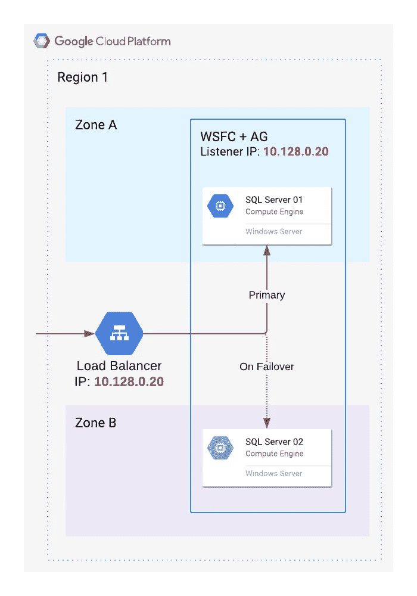

# GCP —带单子网的 SQL Server AO-AG

> 原文：<https://medium.com/google-cloud/gcp-sql-server-ao-ag-with-single-subnet-30f9b98816ce?source=collection_archive---------1----------------------->

# 介绍

SQL Server 始终在线可用性组(AOAG)允许用户使用 SQL Server 数据库部署高可用性和自动化故障切换。它通常使用 Google Cloud 中的多个子网进行部署。

但是，有时可能希望将其部署在单个子网配置中。这可能是因为网络设计仅计划每个区域有一个子网，添加新子网可能很困难。

**注:**[多子网部署配置](https://cloud.google.com/solutions/deploy-multi-subnet-sql-server)比单子网配置更简单(组件更少)。因此，如果可能的话，最好使用多子网。

# 了解单一子网的问题

通常，单个子网内的可用性组需要有浮动 ip。在 GCP 真正的[浮动 IPs 是不可用的](https://cloud.google.com/community/tutorials/sql-server-ao-single-subnet)。因此，以下解决方案是通过使用 GCP 的内部负载平衡器(ILB)组件来模拟浮动 ip 的变通办法。

# 体系结构

SQL Server 节点将是 Windows Server 故障转移群集(WSFC)组的一部分，并且始终处于启用状态。AG-侦听器的 IP 与 ILB(内部负载平衡器)的 IP 一致。这意味着，任何发送到 ILB 的流量都将被路由到 AG-Listener。这造成了一种错觉(对于 SQL Server ),即侦听器 IP 在节点之间浮动。实际上，IP(例如下图中的 10.128.0.20)只连接到 ILB，而不连接到 SQL Server 节点。在 WSFC 层创建运行状况检查，ILB 能够使用它将流量路由到当前主节点。



单个子网中的 SQL Server 可用性组

这里，资源部署的顺序很重要，AG-Listener 应该首先创建，ILB 应该在此之后创建。创建 AG-Listener 时，windows/sql server 会自动检查该 IP 是否已被使用。因此，如果首先创建 ILB，AG-Listener 创建将会失败。

WSFC 上的运行状况检查是通过 WSFC 群集上的以下 powershell 配置创建的。健康检查代码示例如下。它使端口 59997 能够接受任何 sql server 主节点上的连接。

```
$cluster_network_name = 'Cluster Network 1'
$ip_resource_name = 'sql-ag_10.128.0.20'
$load_balancer_ip = '10.128.0.20'
[int]$health_check_port = 59997
Get-ClusterResource $ip_resource_name |
  Set-ClusterParameter -Multiple @{ 'Address'=$load_balancer_ip;
                                    'ProbePort'=$health_check_port;
                                    'SubnetMask'='255.255.240.0';
                                    'Network'=$cluster_network_name;
                                    'EnableDhcp'=0; }
```

与上图相对应的是 ILB 层上的健康检查配置需求，以探测 59997 端口并确定主节点。

```
gcloud compute health-checks create tcp sql-healthcheck \
    --check-interval="2s" \
    --healthy-threshold=1 \
    --unhealthy-threshold=2 \
    --port=59997 \
    --request=10.128.0.20 \
    --timeout="1s"
```

# 详细的实施步骤

[https://cloud . Google . com/community/tutorials/SQL-server-ao-single-subnet](https://cloud.google.com/community/tutorials/sql-server-ao-single-subnet)
我已经公布了如上详细的分步说明。