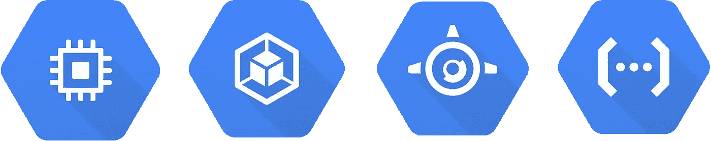

# GCP:谷歌云平台计算堆栈解释。

> 原文：<https://medium.com/google-cloud/gcp-the-google-cloud-platform-compute-stack-explained-c4ebdccd299b?source=collection_archive---------0----------------------->

谷歌云平台(GCP)提供了无数的服务，其中一个特别的服务是它的计算堆栈，其中包含谷歌计算引擎(GCE)、谷歌 Kubernetes 引擎(以前的容器引擎)(GKE)、谷歌应用引擎(GAE)和谷歌云功能(GCF)。这些服务都有很酷的名字，但是对于它们的功能以及是什么使它们变得如此令人困惑…