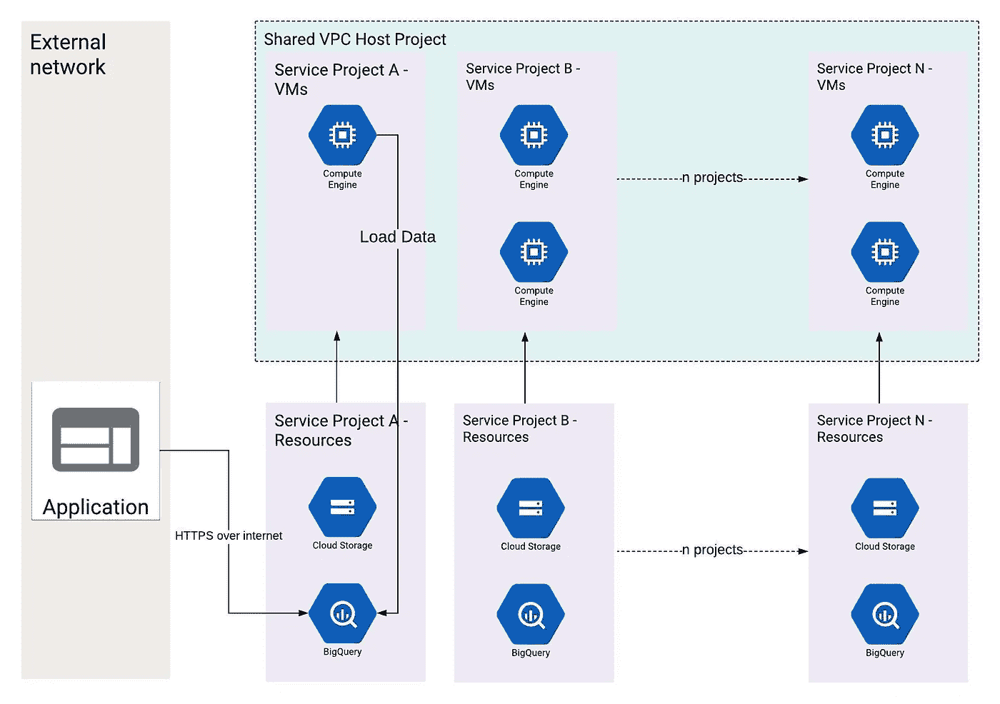

# GCP VPC SC 共享 VPC 网络

> 原文：<https://medium.com/google-cloud/gcp-vpc-sc-with-shared-vpc-network-526f85377cdd?source=collection_archive---------0----------------------->

# 快速总结(TL；博士)

本文描述了在谷歌云平台中使用 VPC 服务控制(VPC-SC)和共享 VPC 的局限性和解决方案。

问题源于 VPC-SC 将服务项目虚拟机视为共享 VPC 的资源(而非服务项目资源)。一方面，如果仅使用服务项目启用 VPC-SC，则它自己的虚拟机将被视为外围资源。另一方面，如果共享 VPC 与服务项目包含在同一个 VPC-SC 中，则使用该共享 VPC 的其他服务项目的虚拟机也包含在同一个边界中。因此，其他服务项目虚拟机无法连接到资源。这些问题将在下面的章节中详细解释。

**解决方法**解决方案是仅在服务项目上创建 VPC-SC，然后通过添加公共 IP 来连接 GCP 虚拟机的访问，以访问上下文管理器。更多详情请见下文。

# 什么是 VPC-SC (VPC 服务控制)

通俗地说，就是针对 GCS、BigQuery、Bigtable 等支持服务的防火墙。它让信息安全团队高枕无忧，没有人能够从未经授权的网络访问这些服务中包含的数据。换句话说，它禁止数据渗透。谷歌云文档[此处](https://cloud.google.com/vpc-service-controls/)。

# 什么是共享 VPC 网络

顾名思义，共享 VPC 是在 GCP 项目中创建的 VPC 网络，并为多个其他项目所共享。包含共享 VPC 的项目称为共享 VPC 主机，使用其网络的项目称为服务项目。GCP 文档[此处](https://cloud.google.com/vpc/docs/shared-vpc)。

# 在共享 VPC 的情况下实施 VPC-供应链的问题

通常在共享 VPC 的情况下，多个独立的工作负载/应用程序使用相同的共享 VPC。其中一个团队需要 VPC SC，而其他团队不需要。

下图描述了 VPC-SC 如何观察当前的设置。

在上图中，我们假设只有项目 A 在 GCS 和 BQ 中有敏感数据，因此需要 VPC-SC。这可以通过以下方式实现:

1.  VPC SC 周边，共享 VPC 主机项目+服务项目 A +带外部网络公共 IP 的访问上下文管理器(ACM)。缺点是服务项目 B 虚拟机将无法与自己项目中的 GCS 或 BQ 对话。
2.  VPC-共享 VPC 主机的 SC+所有服务项目+外部网络的 ACM。缺点是一些产品与 VPC-SC(此处记录为)不兼容，如 AppEngine、云功能、数据流等。这可能会限制其他不需要 VPC-SC 但仍想使用无服务器服务的团队。第二个缺点是，每个团队缺少多个 VPC-SC。这增加了攻击面，因为突破防线会造成更大的伤害。
3.  VPC-SC，服务项目 A +外部网络的 ACM+共享网络虚拟机公共 IP 的 ACM。虽然这适合大多数用例，但缺点是要在 ACM 中维护虚拟机的公共 IP 列表，因为新虚拟机随时可能启动。(我们将在解决方案中修复这一缺陷)。

# 通过共享 VPC 使用 VPC-SC 的解决方案

一个简单的解决方案是使用服务项目 A +具有外部网络 IP 的 ACM+具有共享网络虚拟机公共 IP 的 ACM 创建 VPC-SC。然而，为了使它实际上有用，我们需要减轻它的缺点，这是需要在 ACM 中维护虚拟机的公共 IP 列表，因为新的虚拟机可以随时启动。上述缺点解决方法是使用 NAT 网关。

使用 ACM，我们可以将允许访问 VPC-SC 边界的公共 IP 列入白名单。因此，我们创建了一个包含 NAT 公共 IP 的 ACM 列表。因此，共享网络上托管的任何虚拟机都将被允许与 VPC-SC 内部的资源进行通信。

实施该解决方案的主要步骤是:

1.  使用计算引擎虚拟机在共享 VPC 项目中创建 NAT 网关。将静态外部 IP 分配给 NAT 虚拟机。创建所需的路线。此处描述了[NAT 网关的逐步实现。
    注意:云 NAT 还不能和这个变通办法一起工作。(撰写日期:2019 年 6 月 25 日)。](https://cloud.google.com/vpc/docs/special-configurations#natgateway)
2.  服务项目虚拟机都不应有外部 IP，而应仅使用 NAT 网关。
3.  创建访问上下文管理器(ACM ),用于将共享网络的 NAT IPs(以及任何其他授权网络的公共 IP)列入白名单。
4.  仅使用服务项目创建 VPC-SC，并将其链接到上面的 ACM。

## 什么是 NAT 网关

它允许我们使用一个外部 IP 地址从多个虚拟机实例发送流量，但只将一个虚拟机暴露给互联网。NAT 网关的其他好处是能够轻松监控逃到互联网的流量。