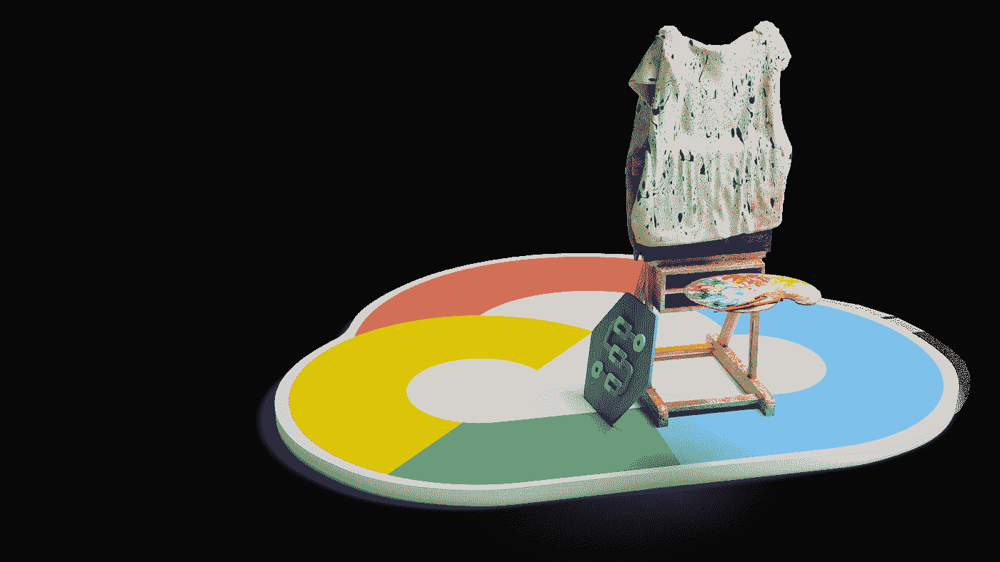
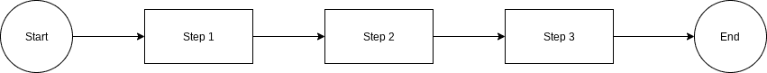
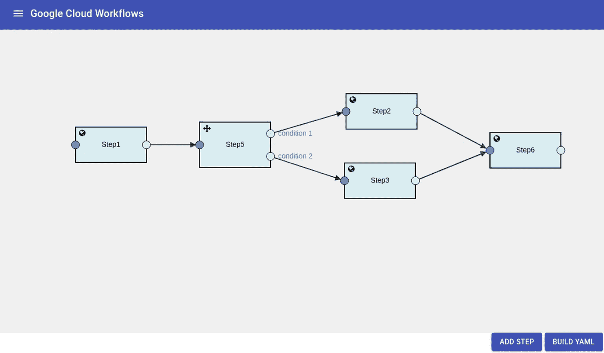
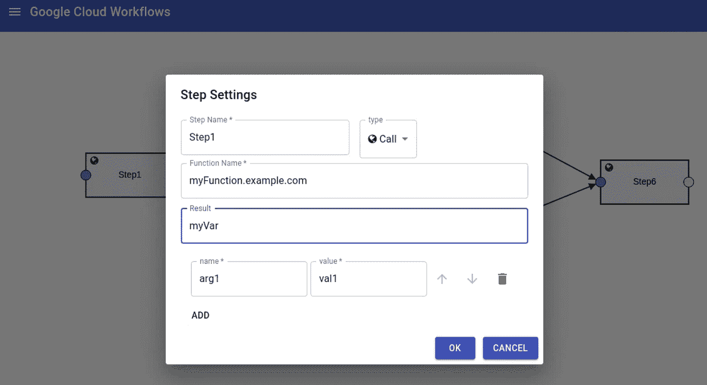
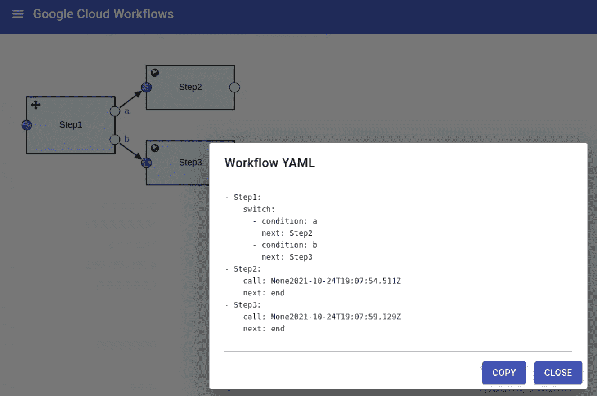
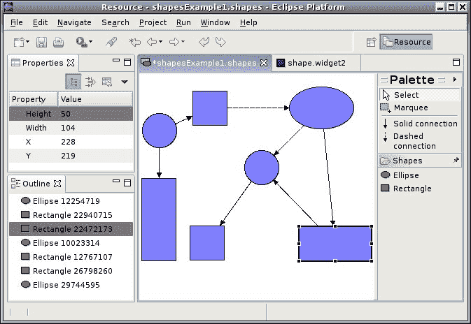

# GCP 工作流可视化编辑器

> 原文：<https://medium.com/google-cloud/gcp-workflows-visual-editor-9876fb1c823f?source=collection_archive---------0----------------------->



Google 云平台 [Workflows](https://cloud.google.com/workflows) 为执行基于工作流的活动提供了工作流语言和运行时环境。为了描述您的工作流程，您可以编写 YAML 或 JSON 来创建一组链接的步骤。通常，人们脑海中会有一个类似于以下的模型:



当在 YAML 表达时，它可能看起来像:

```
- Step1:
    call: ''
    next: Step2
- Step2:
    call: ''
    next: Step3
- Step3:
    call: ''
    next: end
```

这适用于没有分支、连接或复杂参数的最小流。比较 YAML 的文本，我们看到在我们的模型和实现之间有一个明显的*理解*分离。如果我们真的可以画一张图，并把它变成 GCP 工作流，会怎么样？

这个早期的原型项目提供了一个基于浏览器的图表环境，使我们能够实现这一点。我们看到了一个绘图画布，我们可以在其中绘制步骤并将它们连接在一起:



绘制该图的结果是 YAML 文件，否则您将不得不手工构建该文件。除了允许您绘制图表和生成 YAML，该项目可以反向工作。您可以导入现有的 YAML，该工具将呈现相应的图**和**，允许您直观地编辑该图并重新生成新的 YAML。

目前支持的工作流步骤类型包括:

*   打电话
*   分配
*   开关(条件)
*   返回

使用可从步骤中打开的属性对话框，可以单独修改每个步骤的属性。要打开属性，双击或右键单击以打开其上下文菜单。



点击“建立 YAML”按钮打开一个对话框，其中包含相应的 YAML。



然后，您可以将其复制到剪贴板，以便在工作流中使用。相反，从左上方的菜单中，您可以打开一个对话框，允许您粘贴/导入 YAML，这将导致绘制等效的图，并可编辑。这给了我们双向编辑。

如果你的图表开始变得混乱，在应用菜单中有一个“布局”按钮。单击该按钮会导致图表以令人满意的形式自动布局。

为了查看项目的运行情况，这里的[是一个示例构建。](http://www.gcptest.cloud/workflows/)

# 项目的位置

该项目可以在 GitHub 获得源代码。使用 [React](https://reactjs.org/) 、 [JointJS](https://www.jointjs.com/) 和 [MUI Core](https://mui.com/) 在 JavaScript 中实现。

我们可以通过运行以下命令从源代码构建项目:

```
npm install
npm run build
```

输出将在`./build`目录中找到。将这些上传到网络服务器，你就完成了。

# 待完成

这个项目远未完成。目前(2021-2010 年)，这只是一个早期的概念验证，看看是否有兴趣/需求。如果是的话，项目还会继续打磨。

尚未涉及的领域

*   子流程
*   循环
*   引发错误
*   尝试/抓住
*   步骤分组
*   提供自上而下的布局
*   支持定义明确的呼叫类型
*   变量
*   错误处理

# UI 可能性

目前，步骤的设置显示在上下文对话框中，该对话框出现在步骤的上下文菜单中。另一种可能的 UI 样式是在图画布的右侧显示一个永久可见的属性区域。然后，我们将有一个当前选择的步骤的概念和*的属性，这个*步骤将显示在属性区域，并有一个“应用”按钮可用。下面是一张来自旧 Eclipse UI 的图片:



请注意左上角的属性。这可能是基于对话框的设置的替代样式。

# 项目的性质

这个项目是*原样*，不是任何形式的谷歌产品。这仅仅是一个示例，展示了将流行的开源库结合起来绘制生成 YAML 的图表的可能性。根本没有正式的支持，随时可能被移除或放弃(不太可能)。问题、评论和议题应通过 GitHub 项目的 GitHub 议题设施提出，并将尽最大努力解决。

# 链接

*   [Github 项目](https://github.com/kolban-google/workflows)
*   [样本部署](http://www.gcptest.cloud/workflows/)
*   [GCP 工作流程](https://cloud.google.com/workflows)

# 信用

*   封面艺术中使用的画架的搅拌机模型是由 [Grue](https://www.blendswap.com/blend/15453) 制作的。