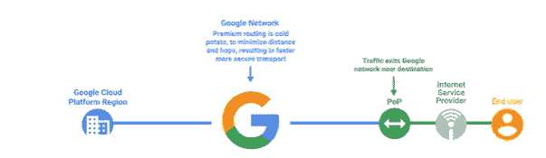
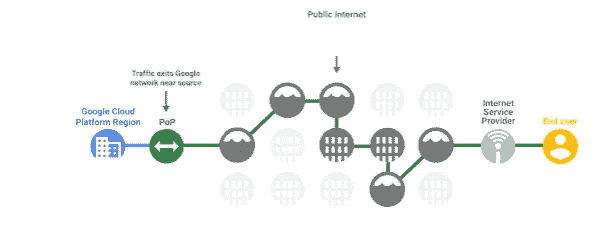
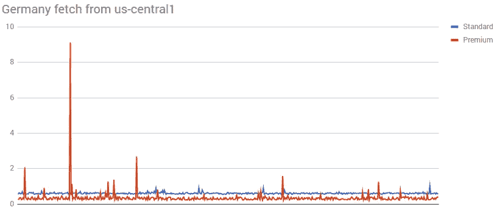
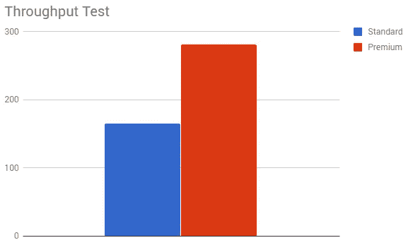
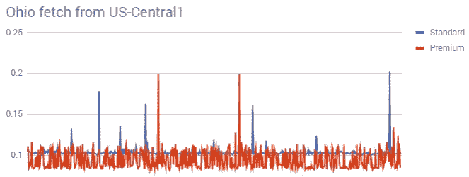
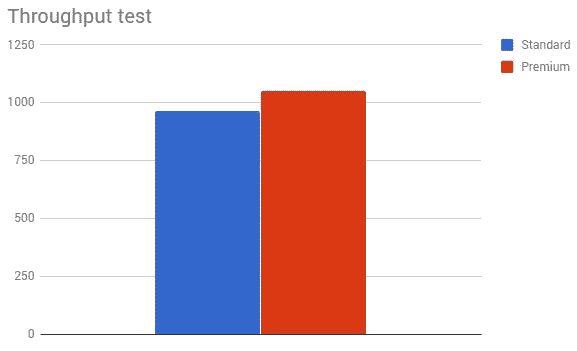
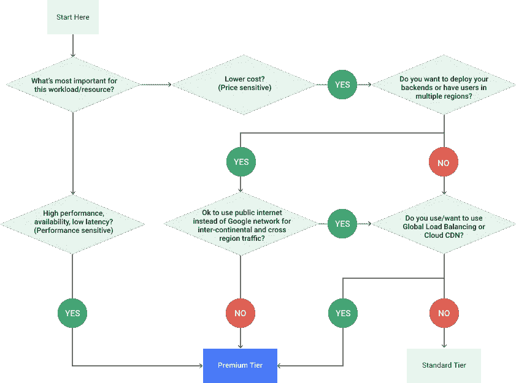

# GCP 的标准层网络性能

> 原文：<https://medium.com/google-cloud/gcps-standard-tier-networking-performance-c66350cf4763?source=collection_archive---------0----------------------->

如果你仔细观察，你的大部分网络数据在优先级上可能并不一致。如果您有一些优先级较低的异步内容，并且并不真正需要 2TB/s 的传输速度，那么为了传输这些数据而支付 2TB 的连接就没有什么意义了。这就是 GCP 新的**标准层**网络的用武之地；它比**高级层提供更低的吞吐量和更高的延迟。**

你究竟为什么想要一个性能较低的网络？

简单:**成本更低**。

如果你在过去十年左右的时间里一直关注我的工作，你就会知道我非常喜欢使用正确的工具来完成正确的工作，尤其是在成本和性能方面。因此，能够查看您的数据，并调整它所拥有的网络体验类型(以及这需要您付出的代价)，这是一个非常酷的想法，适用于各种情况。

但是，在我们兴奋之前，让我们先回答几个问题:为什么标准层与高级层不同，我们看到的性能差异是什么？

忙到没时间看书？检查 TL；上面的 DR 视频！

# 什么是标准层？

为了描述这一点，让我们首先从**高级层**的工作原理开始。简而言之，高级层通过减少在公共互联网上的旅行时间来实现改进的网络性能；数据包进入(并离开)谷歌的网络，尽可能靠近**用户**，然后在到达虚拟机之前在谷歌的主干网上传输。

另一方面，标准层允许数据包尽可能靠近虚拟机进入谷歌的网络，花更多的时间在公共互联网上传输。

考虑到这一点，标准层和高级层之间的区别就变得非常明显了。

**高级**层数据包在谷歌网络上花费*更多*时间，因此性能更好(但成本*更多*)。

**标准**层数据包在谷歌网络上花费*更少*时间，因此性能更差(但花费*更少*！)

作为开发人员，这意味着您应该问两个问题:性能差异有多大，成本差异有多大？

# 测试性能差异

随着客户端和虚拟机之间的物理距离的增加，这两个层之间的性能差异变得惊人地明显，因此，为了测试性能，让我们来看看最佳和最差的性能场景。

# 最坏的情况:跨越海洋

为了测试这一点，我在**美国中心 1** 中设置了两个虚拟机，并将其中一个配置为高级层，另一个配置为标准层。然后，在法兰克福的一台非 GCP 机器上，从每个实例中获取 100k 的图像 500 次。

该图显示，对于重复读取，高级层平均比标准层快 41%。在进行更高容量的吞吐量测试时，我们也看到了大约 46%的差异:

# 最佳情况—同一地区

显然，在海洋上抓取是网络测试的最坏情况。所以让我们来看看*最好的*情况是什么样的。让我们把客户机尽可能移近我们的中心，而不要让*真正进入*GCP 网络。

在这种最佳情况下，我们可以看到标准层的性能非常接近高级层，尽管它有点不可靠(较大的较长读取集)。

我们的吞吐量看起来也很接近，标准在这个测试中只低 8%。

# 什么时候应该使用标准层？

到目前为止，大部分云性能地图集内容都直接关注于提高 GCP 应用程序性能所需做的事情。

但是当涉及到高级/标准层时，您真的应该问问自己"*我需要多高的性能，以此换取成本可以吗？*”

我会向你推荐这张方便的图表(在[原始博客文章](https://cloudplatform.googleblog.com/2017/08/introducing-Network-Service-Tiers-your-cloud-network-your-way.html)中提供)来帮助你解决这个问题:

# 另一个旋钮转动。

从我的测试来看，标准层相当惊人。如果我在同一个地理区域传输数据，考虑到降低的入口成本，性能下降 8%是完全值得的。同样，最坏情况下的性能差异对于非关键数据(例如，用户提交日志信息或批处理工作数据)来说听起来是一个很好的折衷，尤其是在降低成本的情况下！

*重复免责声明*:在撰写本文时(2018 年 2 月 22 日)， **GCP 的分层网络仍处于 alpha 阶段**，因此许多东西都在不断变化，并将会改变(例如，定价差异尚未公布)。因此，请留意 [GCP 网络服务等级](https://cloud.google.com/network-tiers/)页面，了解更多信息。

在此之前，我对新的网络服务层感到兴奋。对于希望在云应用的性能和成本之间找到另一个平衡点的个人来说，这是一个很好的新选择。