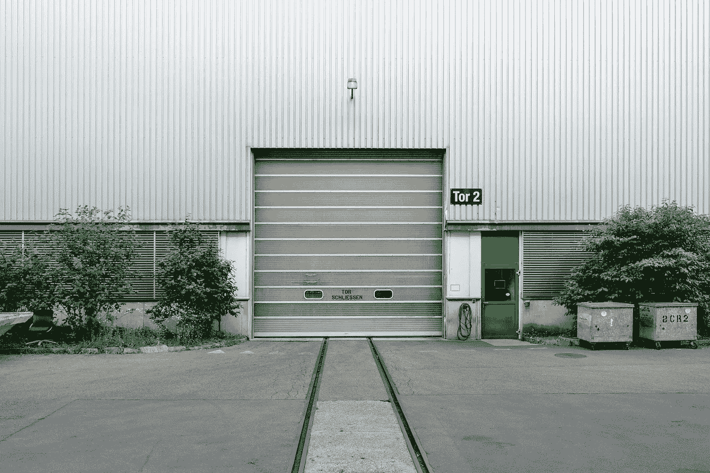

# GCR.io 提示和技巧

> 原文：<https://medium.com/google-cloud/gcr-io-tips-tricks-d80b3c67cb64?source=collection_archive---------1----------------------->



图片来源:塞缪尔·泽勒

[Google Container Registry](http://gcr.io/) 可能是最容易使用的容器图像存储解决方案。我想分享一些我在过去几个月里发现的技巧和诀窍:

# GCR 101 大楼

GCR 是谷歌云平台的私有 Docker 图像注册服务。它与 [Google 容器引擎](https://cloud.google.com/container-engine/)集群和 Google 计算引擎实例一起工作，开箱即用，无需设置任何身份验证。每个谷歌云项目都有一个名为`gcr.io/{PROJECT_ID}`的注册表。您可以拉/推至 GCR，如下所示:

```
docker build -t gcr.io/{PROJECT_ID}/{image}:taggcloud docker -- push gcr.io/{PROJECT_ID}/{image}:taggcloud docker -- pull gcr.io/{PROJECT_ID}/{image}:tag
```

这是使用 GCR 应该知道的全部内容，这就是它的美妙之处。

# 无 gcloud 的推/拉

如果您想避免使用`gcloud docker --`前缀，而只是使用 docker CLI 进行推/拉，您可以运行以下命令，这将为您提供对 GCR 的短期访问:

```
gcloud docker -a
```

然后你可以做一个:

```
docker [push/pull] gcr.io/{PROJECT_ID}/{image}:tag
```

像往常一样直接使用 docker CLI。

# 无停靠站的构建/推送

如果你的机器上没有安装 Docker 怎么办？gcloud 仍然允许你(在云上)构建映像并自动推送到 GCR。如果有 docker 文件，可以直接构建/推送，不需要 docker:

```
gcloud container builds submit -t gcr.io/{PROJECT_ID}/{image}:tag .
```

当您运行它时，源代码被压缩成一个 tar 文件，上传到 GCS bucket，然后[云容器构建器](https://cloud.google.com/container-builder/docs/)构建它，并将结果映像推送到 GCR。我之前在博客上讨论过这件事。

# 列出/搜索图像

您可以使用以下命令列出注册表中的所有容器图像:

```
gcloud container images list
```

该命令仅显示最后几幅图像。所以试着加上`--limit=99999`来获得一个更长的列表。

或者使用关键字搜索，如:

```
gcloud container images list --filter=blog
```

此命令也可用于列出公共注册表中的图像:

```
gcloud container images list --repository=gcr.io/google-containers
```

对于公共注册中心，您也可以直接使用“docker 搜索”:

```
docker search gcr.io/google-containers/kube
```

# 创建公共注册中心

你可以在 GCR 上方便地向公众公开你的整个集装箱注册。由于 GCR 目前是建立在[谷歌云存储(GCS)](https://cloud.google.com/storage/) 之上的，运行几个命令使存储桶公开可读就是你所需要的:

```
gsutil defacl ch -u AllUsers:R gs://artifacts.{PROJECT_ID}.appspot.comgsutil acl ch -r -u AllUsers:R gs://artifacts.{PROJECT_ID}.appspot.comgsutil acl ch -u AllUsers:R gs://artifacts.{PROJECT_ID}.appspot.com
```

第一个命令更新默认权限，使将来的对象对公众可读。第二个命令使现有对象公开可读，第三个命令使 bucket 本身公开可读。这里的[记录了这一点](https://cloud.google.com/container-registry/docs/access-control)。

> *注意:当其他人从你的公共注册表中提取图片时，你将支付出口网络费用。*

目前，据我所知，没有办法保持注册表默认为私有，并使个别图像公开。

# 更快地从码头中心拉货

GCR 为 Docker Hub 提供了一个托管的[注册表镜像](https://docs.docker.com/registry/recipes/mirror/)。如果你[配置](https://cloud.google.com/container-registry/docs/using-dockerhub-mirroring)你的 Docker 引擎使用`mirror.gcr.io`和`--registry-mirror`，你就可以通过这个镜像获取 Docker Hub 镜像。它速度更快，而且您可以将自己与 Docker Hub 中断隔离得更远。

直接从 mirror.gcr.io 提取图像**不是受支持的用例**，但是您仍然可以:

1.  该图像必须是 Docker Hub(如库/节点)上的[官方图像](https://hub.docker.com/explore/)之一
2.  您只能拉出“:最新”标签。

示例:

```
docker pull mirror.gcr.io/library/node
```

您可以通过以下方式找到支持的图像列表:

```
gcloud container images list --repository=mirror.gcr.io/library
```

# 找出注册表的总大小

同样，由于 GCR 目前使用 GCS 进行存储，您可以看到存储容量。

你可以用它来计算你的图片占用了多少存储空间。运行:

```
$ gsutil du -hs gs://artifacts.{PROJECT_ID}.appspot.com
781.16 MiB gs://artifacts.ahmet-blog.appspot.com
```

由于 docker-registry 将所有图像层存储在一个单一的平面目录中，因此不容易找出特定图像的所有标签使用的总存储空间。你必须写代码来做到这一点。但是你可以在谷歌云平台控制台→容器注册部分找到每个标签的图片大小。

# 清理旧图像

当您的持续集成管道每天都在构建和推送数十个映像时，过一段时间后，您将最终拥有大量映像。如果不再需要超过一段时间的容器图像，可以在脚本的帮助下删除它们。

要查询某个日期之前推送的图像(例如，下面的 2017–04–01):

```
gcloud container images list-tags gcr.io/PROJECT/image \
  --limit=999999 --sort-by=TIMESTAMP \
  --filter="timestamp.datetime &lt; '2017-04-01'" \
  --format='get(digest)'
```

然后，您可以使用 jq 命令从 JSON 中提取图像摘要，然后使用一个简单的 for 循环将它传递给 gcloud 命令进行删除:

```
IMAGE=gcr.io/ahmetb-starter/coffeedirectory
DELETE_BEFORE=2017-04-01for digest in $(gcloud container images list-tags \
  gcr.io/ahmetb-starter/coffeedirectory --limit=999999 \
  --sort-by=TIMESTAMP \
  --filter="timestamp.datetime < '${DELETE_BEFORE}'" \
  --format='get(digest)'; do
    gcloud container images delete -q --force-delete-tags\
      "${IMAGE}@${digest}"
done
```

我创建了一个更好的版本(带有适当的错误检查等)[作为脚本](https://gist.github.com/ahmetb/7ce6d741bd5baa194a3fac6b1fec8bb7)您可以直接下载和使用:

[https://gist . github . com/ahmetb/7 ce 6d 741 BD 5b aa 194 a3 fac 6 B1 FEC 8 bb 7](https://gist.github.com/ahmetb/7ce6d741bd5baa194a3fac6b1fec8bb7)

# 了解更多信息

我希望你喜欢这些建议。如果你有更多，请在评论中告诉我或发邮件给我，我会在这里补充。如果您有兴趣了解更多信息，请查看 GCR 的文档和 T2 的云容器构建器。

*免责声明:我在谷歌云工作，但不从事容器注册产品。*

*最初发布于*[*Ahmet . im*](https://ahmet.im/blog/google-container-registry-tips/)*。如果你喜欢这篇文章，你可以在推特* [*上关注我*](https://twitter.com/ahmetb) *或者* [*通过电子邮件*](https://feedburner.google.com/fb/a/mailverify?uri=ahmet-alp-balkan) *订阅我的博客(不超过一篇文章/月)。*