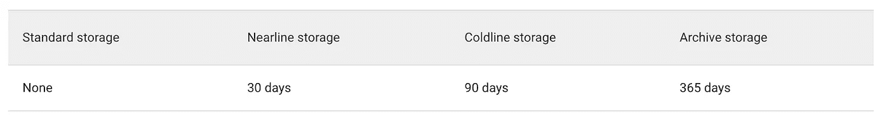
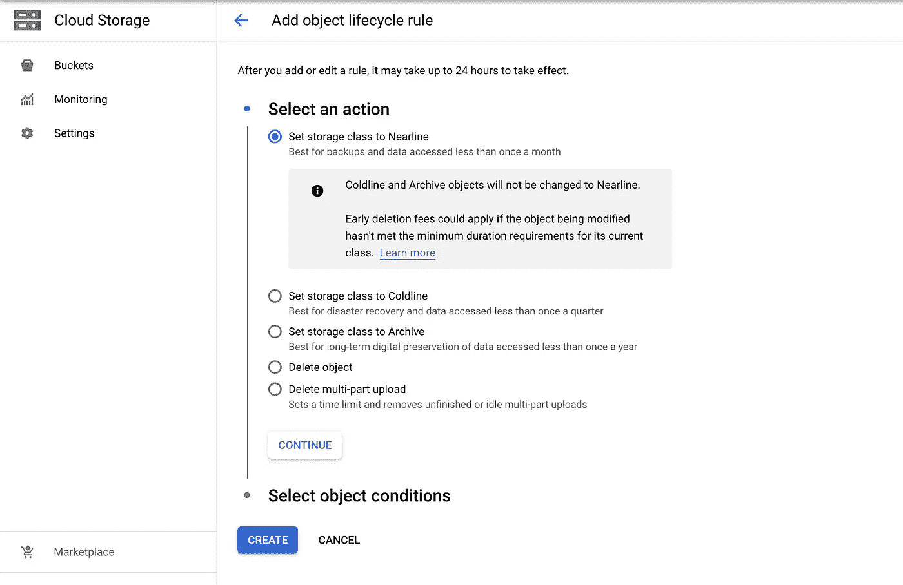
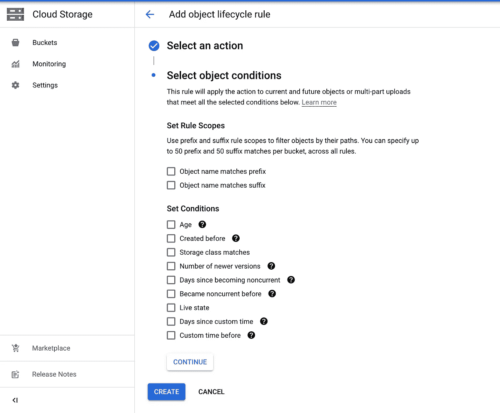
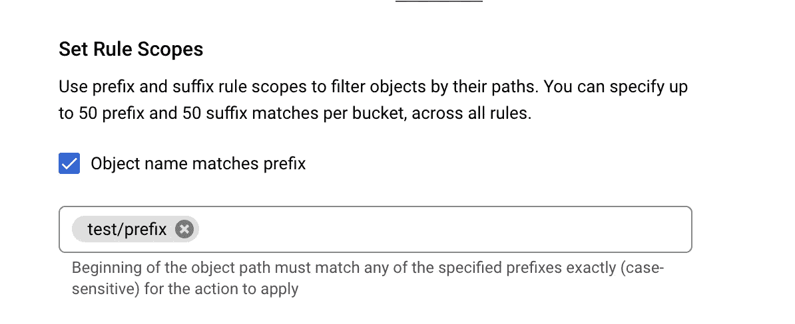
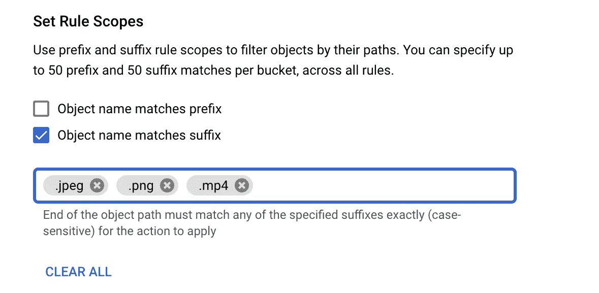
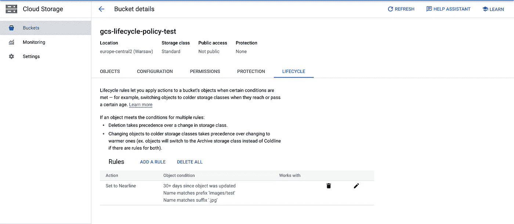
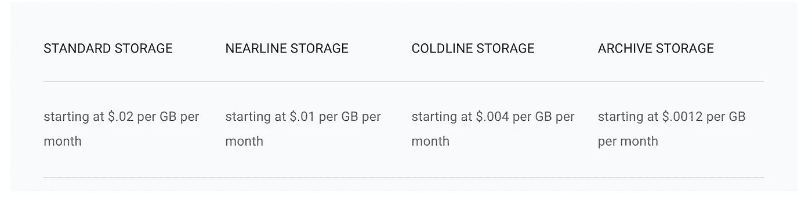

# 带前缀和后缀的 GCS 生命周期策略

> 原文：<https://medium.com/google-cloud/gcs-lifecycle-policies-with-prefix-suffix-677e1792181b?source=collection_archive---------0----------------------->

在这篇博客中，我们将关注 Google 云存储(GCS)管理存储在存储桶中的数据的新特性。最近，GCP 推出了使用对象名称匹配前缀和对象名称匹配后缀来管理存储在桶中的数据的生命周期的功能，这使得用户可以根据桶中的每个文件夹或对象名称来创建策略。这个特性以前是没有的，生命周期策略是基于整个存储桶的，而不是基于每个文件夹或对象的，所以让我们在这篇博客中对此进行更深入的探讨。

图片由 [Ag Ku](https://pixabay.com/users/myrfa-3126475/?utm_source=link-attribution&utm_medium=referral&utm_campaign=image&utm_content=1614223) 来自 [Pixabay](https://pixabay.com//?utm_source=link-attribution&utm_medium=referral&utm_campaign=image&utm_content=1614223)

大多数企业正在将其基础架构和数据迁移到云中，以获得更好的可扩展性和存储管理。但是，在企业公司中管理数据是一项艰巨的任务，存储在云中的数据成本很高，很快所有云区域都感受到了数据量增加的压力。以下是一些关于云使用的统计数据。

*   **到 2025 年，将有 1000 亿 TB 的数据存在云中**
*   **世界上 50%的公司数据存储在云中**
*   云数据中心占世界能源消耗的 3%
*   **90%** 的大型企业已经采用了云计算基础架构
*   企业帐户平均使用 **2.6 个公共**和 **2.7 个私有**云

# 什么是谷歌云存储(GCS)？

让我们了解一下谷歌云存储(GCS)及其存储特性。

GCS 是一项服务，用于在 Google Cloud 中存储基于您的 [*对象*](https://cloud.google.com/storage/docs/objects) 的数据。对象是由任何格式的文件组成的不可变的数据。你把物体储存在叫做 [*桶*](https://cloud.google.com/storage/docs/buckets) 的容器里。我们可以在 Google Cloud 项目中创建存储桶，并管理来自项目、文件夹&组织的存储桶的访问和策略。

## 气相色谱的特点:

*   加速复制
*   对象生命周期管理、版本控制、保留策略
*   Google 管理、客户管理或提供的加密密钥
*   统一和细粒度的桶级访问
*   申请人支付铲斗锁
*   云存储的发布/订阅通知
*   使用云存储的云审计日志

## **GCS 对象存储类:**

图片由 GCP 云拍摄

*   标准存储:标准存储最适合于频繁访问的数据(“热”数据)和/或仅短期存储的数据。
*   近线存储:近线存储是一种低成本、高度耐用的存储服务，用于在 30 天内存储一次不常访问的数据
*   cold line storage:cold line storage 是一种成本非常低、非常耐用的存储服务，可以在 90 天内存储几次不常访问的数据
*   存档存储:存档存储是成本最低、高度耐用的存储服务，用于数据存档、在线备份和灾难恢复。

## **对象生命周期管理。**

生命周期管理用于控制一个对象需要在存储桶或存储桶的某个存储类别中存储多长时间，以节省成本。在 GCP 创建生命周期策略，我们必须创建生命周期管理配置，每个配置包含一个规则。让我们看看如何创建规则

**第一步:**
——导航到 GCP 控制台→云存储→你的桶，在配置选择动作&对象条件中有两个主要部分。

**步骤 2:**
-在选择行动阶段时，我们可以选择将对象类别更改为近线、冷线或存档。我们可以删除对象或多部分上传的另一种方式。

**第 3 步:**
-在对象条件中，我们可以选择触发生命周期策略的条件。这是规则范围的最新变化

我们现在可以通过对象的**前缀&后缀
1)使用前缀:**在此选项中，我们可以在对象范围规则中添加多个前缀，因此以此前缀开头的对象将只受生命周期策略的影响。使用这些范围规则，我们可以在特定的文件夹或对象上设置策略。

**2)使用后缀:**在该选项中，我们为策略下的对象添加多个后缀。因此，使用此作用域，我们可以为某些对象类型创建策略，例如。png '，'。jpeg '和' . mp4 '。因此，我们可以为每种对象类型制定不同的生命周期策略。

**第四步:** ——既然我们已经设定了对象的范围，那么让我们来探索对象的条件。有 9 个条件选项可用，我们可以为每个生命周期策略配置选择最少一个或最多 9 个条件。

1.  年龄:
    从对象的创建日期(对象被添加到当前存储桶时)开始计算
2.  创建时间:
    基于对象的创建日期(对象被添加到当前存储桶的时间)
3.  存储类匹配:
    基于条件规则中可用的存储类，这些存储类是标准、近线、冷线、归档、区域、持久缩减可用性
4.  较新版本的数量:
    如果启用了对象版本控制，则限制存储的版本数量。
5.  变为非当前状态后的天数:
    如果启用了对象版本控制，则从活动对象被修改或删除时开始计算。
6.  变为非当前之前:
    基于活动对象被修改或删除的时间，如果启用了对象版本控制。
7.  实时状态:仅对选定状态为实时或非当前的版本化对象应用操作
8.  自自定义时间以来的天数:
    从对象的自定义时间开始计算，对于具有此自定义元数据的对象。
9.  自定义时间之前:
    基于对象的自定义时间，对于有此自定义元数据的对象。

这四个步骤对于在 GCS 中创建生命周期策略非常重要。
请注意，每个生命周期策略配置仅限于单个 GCS 存储桶。因此，如果您有多个存储桶，则必须在每个存储桶中创建一个生命周期策略配置。

## 成本模型和节约

在云上存储数据是有成本的，所以让我们来了解一下在 GCS 上存储数据的成本

图片由 GCP 云拍摄

**1)存储费用** GCS 成本按存储数据的每 GB 和存储类别计算。因此，让我们以 GCP 成本计算器[链接](https://cloud.google.com/products/calculator)的成本为例。假设我们在 GCS 欧洲中心存储了 100GB 的数据 2

*   标准等级: **$ 2.30**
*   近线类: **$ 1.30**
*   Coldline class: **$ 0.60**
*   存档类: **$ 0.25**

**2)运营费用** 当您在云存储中执行*操作*时，会收取运营费用。操作是对云存储中的对象进行读、写或删除操作的动作。操作有三个类别:A 类、B 类和自由。[参见下面的](https://cloud.google.com/storage/pricing#operations-by-class)了解每类操作的分类。

**3)检索费用** 当使用近线存储、冷线存储或归档存储来存储任何读取、复制、移动或重写的对象数据或元数据时，将收取*检索费用*。此成本是与读取和检索数据相关的任何[网络费用](https://cloud.google.com/storage/pricing#network-pricing)之外的费用。

因此，我们可以采取的成本计算模型的简单总结是将数据存储在正确的类别中，并且使用生命周期管理对于节省成本非常重要。

## 前缀和后缀特性的优点。

*   在存储桶内的文件夹和对象级别创建生命周期管理策略。这在以前是不可能的
*   基于后缀，例如:png。jpg .mp4 生命周期管理策略，因此我们可以为每个不同类型的对象制定策略规则。
*   巨大的成本节约，因为我们可以按照我们的要求管理每个文件夹的存储类别。
*   如果我们有一个包含数百万个对象的存储桶，那么很容易管理存储桶对象。

## 参考

*   [https://cloud.google.com/storage/docs/storage-classes](https://cloud.google.com/storage/docs/storage-classes)
*   [https://cloud . Google . com/blog/products/storage-data-transfer/understanding-cloud-storages-new-prefix-and-suffix-life cycle-rules](https://cloud.google.com/blog/products/storage-data-transfer/understanding-cloud-storages-new-prefix-and-suffix-lifecycle-rules)
*   【https://cloud.google.com/storage/pricing 

# 开源代码库

[https://github.com/HarshalRane23](https://github.com/HarshalRane23)

# 有问题吗？

如果你有任何问题，我很乐意在评论中阅读。在[中](/@harshalrane23)或 [LinkedIn](https://www.linkedin.com/in/harshal-rane-15538027/) 上关注我。