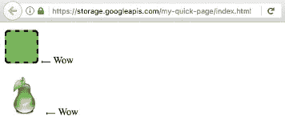

# 云存储:我的静态页面在线在一个单一的命令

> 原文：<https://medium.com/google-cloud/gcs-my-static-page-online-in-1-single-command-cfb2381fd527?source=collection_archive---------0----------------------->

这是:

```
**gsutil cp -r -a public-read page/* gs://my-quick-page/**
```

搞定了。我的小 HTML 网站现在在 https://storage.googleapis.com/my-quick-page/index.html 上线了。试试链接！

如果满足以下先决条件，这真的很方便:

*   我在本地机器上有一个 HTML 页面；
*   我是谷歌云存储客户，这意味着我在我的谷歌云平台帐户中启用了计费(或“免费试用”)；
*   我已经安装并初始化了[云 SDK](https://cloud.google.com/sdk/downloads) ，其中包括**gsutil**；
*   我已经有了一个名为“我的快速页面”的存储桶。如果没有，我用以下内容创建它:

```
**gsutil mb gs://my-quick-page**
```

此示例的网站在我的本地驱动器上具有以下结构:

page/index . html
page/CSS/main . CSS
page/img/pear . png
page/img/favicon . png



该网址相当长，并使用了一个 GCS 域，而不是我的自定义域。最棒的是，由于有了*.storage.googleapis.com 证书，我的网站自动变得安全了 (HTTPS)。

请访问 [gsutil cp](https://cloud.google.com/storage/docs/gsutil/commands/cp) 文档和[托管静态网站](https://cloud.google.com/storage/docs/hosting-static-website)以了解更多更符合您需求的选项，例如使用您的自定义域名。