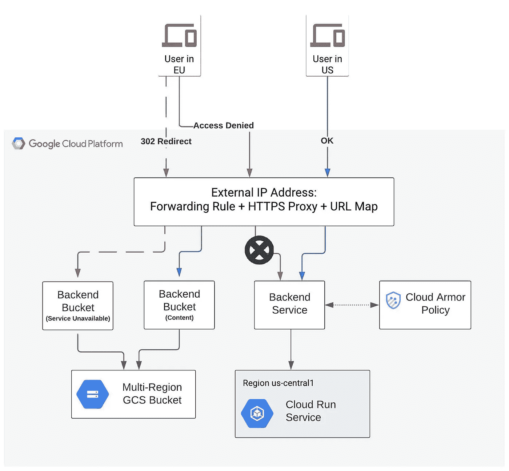
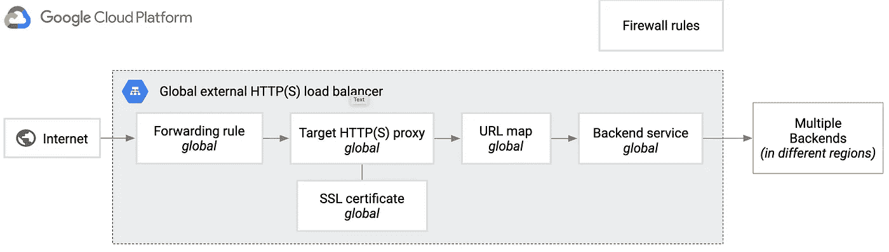
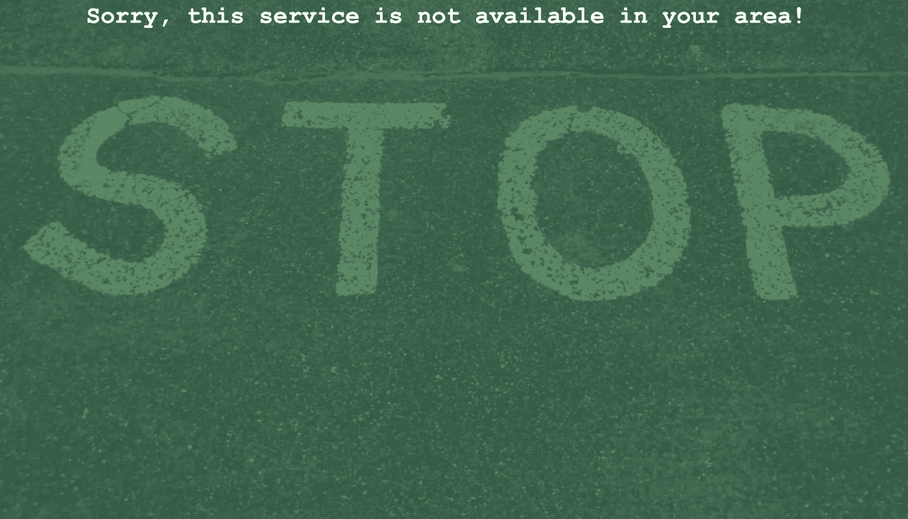

# 使用云盔甲在 GCP 上地理围栏全球负载平衡服务

> 原文：<https://medium.com/google-cloud/geofencing-a-globally-load-balanced-service-on-gcp-using-cloud-armor-44099480fd00?source=collection_archive---------0----------------------->

在这篇文章中，我们将通过使用[云运行](https://cloud.google.com/run)、[谷歌云存储](https://cloud.google.com/storage) (GCS)和[全球 HTTP(S)负载均衡器](https://cloud.google.com/load-balancing/docs/https)，来看看如何使用云装甲来地理围栏在 GCP 上运行的网站/服务。

地理围栏是我们创建虚拟边界以阻止从边界外部访问服务的地方。这通常用于提供媒体内容的服务，在这些服务中，内容仅在特定的地理位置/地区获得许可。例如，OTT (Over the Top)流媒体服务可能仅有权在美国境内播放内容，并且需要防止用户从美国境外访问该服务。

为了跟随这篇文章，你需要一个 [GCP 账户](https://cloud.google.com/free)和一个你自己的域名来测试。本文假设您已经熟悉 GCP 云控制台和工具，如 Cloud Shell、gcloud 和 gsutil。

我们的架构将如下图所示。负载平衡器实际上是一组组件(前端、转发规则、HTTP(S)代理、url 映射+后端)，本质上是使用 URL 映射将流量定向到特定后端来处理请求。我们将运行一个提供动态内容的云运行服务和一个提供静态内容和“服务不可用”页面的 GCS 存储桶。云装甲政策是附加到我们的后端服务，并将重定向任何请求不是来自美国的“服务不可用”页面。我用“我们”作为例子，因为那是我所在的地方。对于测试，请使用您所在的国家代码。



# **步骤 1:创建项目并部署云运行服务**

首先，我们将创建一个项目和一个简单的云运行服务。

登录 GCP 云控制台，打开云 Shell，运行以下命令，将<project-name>替换为您自己的项目名称:</project-name>

```
gcloud projects create <project-name>
gcloud config set project <project-name>
```

在 Cloud Console 中，选择新创建的项目，然后从导航中选择“计费”,以将计费帐户与项目相关联。

从 Cloud Shell 运行以下命令，从 GitHub 克隆示例代码:

```
git clone [https://github.com/danpeachey/geofence-example](https://github.com/danpeachey/geofence-example)
```

现在，我们将启用必要的 GCP 服务，并将我们的示例部署到云运行:

```
gcloud services enable artifactregistry.googleapis.com \
    cloudbuild.googleapis.com \
    run.googleapis.com \
    compute.googleapis.comcd ./geofence-example/geofence-servicegcloud run deploy geofenceservice --source . --region us-central1
```

对部署期间的任何提示做出响应。记下作为输出提供的服务 URL，并单击它来查看我们新部署的服务。

您应该会看到一个带有欢迎消息的简单网页。

# **步骤 2:创建全局 HTTPS 负载平衡器**

接下来，我们将设置一个外部全局 HTTP(S)负载平衡器来提供服务。首先，我们需要创建一个外部 IP 地址。在云 Shell 中运行以下程序:

```
gcloud compute addresses create geo-service-lb-ip \
    --ip-version=IPV4 \
    --network-tier=PREMIUM \
    --global
```

现在运行以下命令，记下创建的 IP 地址:

```
gcloud compute addresses describe geo-service-lb-ip \
    --format=”get(address)” --global
```

现在我们有了一个外部 IP 地址，我们需要创建一个指向它的 DNS A 记录。根据您注册域名所使用的服务，这将有所不同。以下是对谷歌域名和 T2 域名的说明。

例如，如果您的测试域是 example.com 的*，为我们将用于测试服务的子域创建一个 A 记录，例如 app.example.com 的*，并将其指向我们刚刚创建的 IP 地址。**

**接下来，我们将创建一个用于负载平衡器的 SSL 证书，用您的完整子域(例如*app.example.com*)替换<my-domain>:</my-domain>**

```
**gcloud compute ssl-certificates create geo-service-cert \
    --domains=<my-domain> \
    --global**
```

**在我们创建负载平衡器并将证书与其相关联之前，证书不会变为活动状态。运行以下命令查看证书的状态:**

```
**gcloud compute ssl-certificates describe geo-service-cert \
    --global \
    --format=”get(name,managed.status, managed.domainStatus)”**
```

**负载平衡器有几个组件:将流量从 IP/端口前端发送到 HTTP(S)代理的转发规则，然后该代理使用 URL 映射来确定流量应发送到哪个后端服务或后端存储桶。GCP 文档对负载平衡器架构有一个很好的[概述](https://cloud.google.com/load-balancing/docs/https)，如下图所示(来自 GCP 文档):**

****

**首先，我们基于我们的云运行服务创建一个无服务器后端(网络端点组/NEG ):**

```
**gcloud compute network-endpoint-groups create geo-service-cr-neg \
    --region=us-central1 \
    --network-endpoint-type=serverless \
    --cloud-run-service=geofenceservice**
```

**然后，我们创建一个包含无服务器后端的后端服务。如果我们想要提供高可用性/冗余，我们将在不同的区域创建我们的云运行服务的多个实例，并将它们全部添加到后端服务，但是对于这个示例，我们只使用了一个实例。**

```
**gcloud compute backend-services create geo-service-backend-service \
    --load-balancing-scheme=EXTERNAL \
    --global**
```

**将无服务器后端添加到后端服务:**

```
**gcloud compute backend-services add-backend \
    geo-service-backend-service \
    --global \
    --network-endpoint-group=geo-service-cr-neg \
    --network-endpoint-group-region=us-central1**
```

**创建 URL 映射，将传入流量路由到正确的后端服务。现在，我们可以使用默认路由:**

```
**gcloud compute url-maps create geo-service-lb-url-map \
    --default-service geo-service-backend-service**
```

**创建 HTTPS 代理:**

```
**gcloud compute target-https-proxies create \
    geo-service-lb-https-proxy \
    --ssl-certificates=geo-service-cert \
    --url-map=geo-service-lb-url-map**
```

**创建将流量转发到 HTTP(S)代理的转发规则:**

```
**gcloud compute forwarding-rules create geo-service-https-fw-rule \
    --load-balancing-scheme=EXTERNAL \
    --network-tier=PREMIUM \
    --address=geo-service-lb-ip \
    --target-https-proxy=geo-service-lb-https-proxy \
    --global \
    --ports=443**
```

**我们现在已经设置了外部全局负载平衡器。一旦之前所做的 DNS 更改得到传播，并且证书状态变为活动状态，我们应该能够访问 https:// <my-domain>并查看由 Cloud Run 直接提供的相同欢迎页面。您可以使用以下命令检查证书状态:</my-domain>**

```
**gcloud compute ssl-certificates describe geo-service-cert \
    --global \
    --format=”get(name,managed.status, managed.domainStatus)”**
```

**完成所有工作可能需要几个小时，即使看起来证书是活动的，DNS 指向正确的 IP，如果您仍然看到 404 或类似的错误，请多给它一点时间。我的经验是一切都在 30-45 分钟内完成，你的可能会有所不同。**

# ****步骤 3:添加自定义标题和云防护策略****

**因为我们对地理围栏服务感兴趣，所以让我们向后端服务添加一个自定义头，将用户地区和城市插入到 HTTP 请求头中。然后，我们可以在代码中使用这些值来表示基于位置的不同视图。**

**在 Cloud Shell 中运行下面的代码来添加一个[定制头](https://cloud.google.com/load-balancing/docs/https/custom-headers):**

```
**gcloud compute backend-services update geo-service-backend-service \
    --global \
    --custom-request-header ‘X-Client-Geo-Location:{client_region},{client_city}’**
```

**等一两分钟，然后在 https:// <my-domain>上重新审视你的服务。您现在应该看到欢迎消息已经更改，现在包括了您的国家和城市。</my-domain>**

**目前，我们的服务面向全球所有人。让我们通过添加云防护策略来改变这种情况。在此示例中，如果您在美国，我将拒绝访问(因为我也在美国)。您可以将值“US”更改为您所在国家的两个字符的 ISO 3166 国家代码，以进行自我测试。**

```
**gcloud compute security-policies create geofence-armor-policygcloud compute security-policies rules create 100 \
    --security-policy geofence-armor-policy \
    --expression “origin.region_code==’US’” \
    --action deny-403**
```

**现在，我们将云装甲策略与我们的后端服务联系起来:**

```
**gcloud compute backend-services update geo-service-backend-service \
    --global \
    --security-policy geofence-armor-policy**
```

**同样，给变化几分钟的传播时间。现在当你访问 https:// <my-domain>时，你应该得到一个 403 拒绝错误。我们已经成功阻止用户从特定位置访问我们的服务，但这不是最佳体验。我们将把我们的拒绝状态改为重定向到一个漂亮的 HTML 页面，让用户知道该服务在他们的区域不可用。</my-domain>**

# ****步骤 4:为静态内容设置 GCS 存储桶，并创建重定向规则****

**首先，让我们删除我们的云装甲政策，这样我们就可以再次看到我们的服务。我们更新后端服务，为安全策略名称传入一个空字符串:**

```
**gcloud compute backend-services update geo-service-backend-service \
    --global \
    --security-policy ""**
```

**现在，让我们设置一个 GCS bucket 来托管我们服务的静态内容(例如图像、视频)以及托管我们的“服务不可用”页面。然后，我们将向负载平衡器添加后端，并更新我们的 url 映射，以将特定请求映射到后端存储桶。**

**让我们创建一个网站托管桶，但在此之前，你需要用谷歌[验证你的域名](https://cloud.google.com/storage/docs/domain-name-verification)。完成后，运行以下命令来创建 bucket 并复制内容:**

```
**gsutil mb -l US -b on gs://<my-domain>
cd ~
gsutil cp -r ~/geofence-example/web/* gs://<my-domain>**
```

**我们需要将文件公开，我们将降低默认 TTL，这样更改就不会缓存太久:**

```
**gsutil iam ch allUsers:objectViewer gs://<my-domain>gsutil setmeta -h "cache-control: max-age=60" \
gs://<my-domain>/content/*gsutil setmeta -h "cache-control: max-age=60" \
gs://<my-domain>/denied/***
```

**现在我们创建后端存储桶:**

```
**gcloud compute backend-buckets create geofence-bucket-content \
    --gcs-bucket-name=<my-domain>gcloud compute backend-buckets create geofence-bucket-denied \
    --gcs-bucket-name=<my-domain>**
```

**并更新 url 映射以将任何请求/内容路由到内容桶，将请求/拒绝路由到拒绝桶，并将所有其他请求路由到我们的默认服务。(记得用你的域名替换<my-domain>):</my-domain>**

```
**gcloud compute url-maps add-path-matcher geo-service-lb-url-map \
--path-matcher-name geo-fence-matcher \
--default-service geo-service-backend-service \
--backend-service-path-rules='/*=geo-service-backend-service' \
--backend-bucket-path-rules='/content/*=geofence-bucket-content,/denied/*=geofence-bucket-denied' \
--new-hosts=<my-domain>**
```

**让我们测试我们的变化。如果您访问 https:// <my-domain>,您现在应该会看到相同的欢迎消息以及覆盖背景的内容图像。</my-domain>**

****

**如果您访问 https://<my-domain>/denied/no service . html，您应该会看到一个页面，通知您该服务在您所在的地区不可用。</my-domain>**

****

**现在，让我们更新我们的云装甲政策，将任何访问我们服务的尝试重定向到我们的“服务不可用”页面，而不是只给出 403 拒绝状态。**

**首先，让我们从策略中删除当前的拒绝规则:**

```
**gcloud compute security-policies rules delete 100 \
--security-policy geofence-armor-policy**
```

**并用一个替换它来进行重定向:**

```
**gcloud beta compute security-policies rules create 100 \
--security-policy geofence-armor-policy \
--expression "origin.region_code=='US'" \
--action redirect \
--redirect-type external-302 \
--redirect-target 'https://<my-domain>/denied/noservice.html'**
```

**最后，将策略与后端服务重新关联:**

```
**gcloud compute backend-services update geo-service-backend-service \
    --global \
    --security-policy geofence-armor-policy**
```

**给更改几分钟的传播时间，然后尝试转到 https:// <my-domain>。您应该会被自动重定向到“服务不可用”页面。要重置，请取消策略与后端的链接。您还可以更新规则以否定逻辑(例如“origin.region_code！='US ' ")来测试允许来自美国的访问(并阻止来自美国以外的访问尝试)。</my-domain>**

# **结论**

**希望这篇文章是有用的，并有助于演示如何使用云装甲来保护特定区域的服务。请记住删除该项目，这样您就不会继续为此付费，并删除您在本练习中创建的任何不必要的 DNS 条目。**

**此外，在我们走之前，一些警告和意见。目前，我们最初的云跑步服务仍可在其最初的 run.app url 上使用。这将允许用户绕过我们的云装甲政策，直接访问服务。这很容易解决。更新您的云运行服务，仅允许来自“内部和负载平衡器”的流量，以便只能通过负载平衡器访问该流量:**

```
**gcloud run services update geofenceservice --platform managed \
    --ingress internal-and-cloud-load-balancing \
    --region us-central1**
```

**此外，我们还没有设置任何云防护政策来保护对静态内容的直接访问。**

**例如 https:// <my-domain>/content/cloud.jpg 如果有直接网址还是可以的。您可以设置一个 Cloud Armor edge 策略来拒绝访问(后端 buckets 只支持 edge 策略，它只支持允许/拒绝操作，但不支持重定向)。然而，由于我们公开了 GCS bucket，您仍然可以访问公开的 GCS url 并以这种方式访问。在这种情况下，如果您需要锁定静态内容，使用后端服务(如云运行、GKE、托管实例组)可能更好，它使用服务帐户安全地从桶中读取并将对象传递回来。然后用云 CDN 向外扩展，减少流量到原点。然后，您可以将 Cloud Armor edge 策略应用于 CDN，将后端策略应用于后端服务，以全面保护对内容的访问。</my-domain>**

**现在事情差不多结束了！感谢阅读，我希望它是有用的。敬请关注即将发布的更多 OTT 相关帖子！**