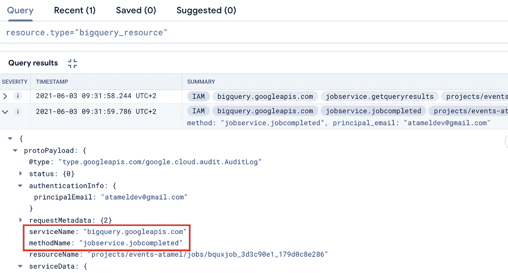
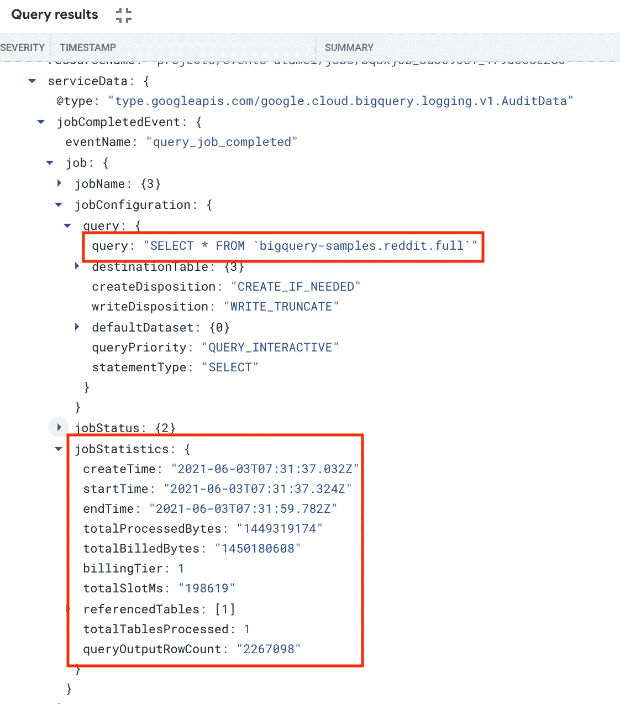
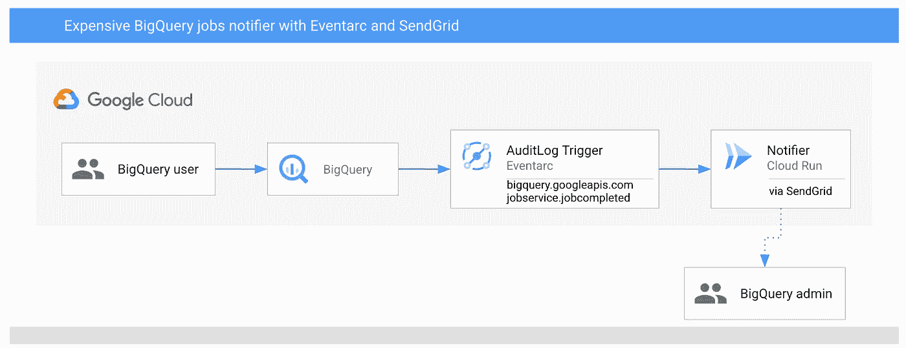

# 使用 Eventarc 和 SendGrid 在昂贵的 BigQuery 作业执行时得到通知

> 原文：<https://medium.com/google-cloud/get-notified-when-an-expensive-bigquery-job-executes-using-eventarc-and-sendgrid-4591053109ca?source=collection_archive---------2----------------------->

# Eventarc 支持的事件

上周，我在我们的 [eventarc-samples](https://github.com/GoogleCloudPlatform/eventarc-samples) repo 中整理了一份由 Eventarc 支持的[事件列表。感谢我们的文档团队，这个列表现在是我们官方文档的一部分，在](https://github.com/GoogleCloudPlatform/eventarc-samples/tree/main/eventarc-events)[参考部分](https://cloud.google.com/eventarc/docs/reference/supported-events)。

在查看完整列表后，我开始思考这些事件支持的一些用例。今天我想谈谈其中的一个用例:**当一个昂贵的 BigQuery 作业执行时，如何得到通知？**

# 确定已完成且昂贵的 BigQuery 作业

要回答的第一个问题是:如何确定已完成且昂贵的 BigQuery 作业？幸运的是，BigQuery 的审计日志拥有所有的信息。请注意，在 BigQuery 中，审计日志是默认启用的，因此您不必做任何特殊的事情来启用它们。

要查看已完成的 BigQuery 作业，您可以查看在`bigquery.googleapis.com`的`serviceName`和`jobservice.jobcompleted`的`methodName`下记录的审计日志:



要获得更多的作业细节，您可以在`jobsCompletedEvent`下检查，在那里您可以访问执行了什么查询，更重要的是在`totalBilledBytes`下它花费了多少:



`totalBilledBytes`让您知道这个查询有多昂贵。例如，如果查询被缓存，这将是零，没有成本，但对于昂贵的查询，它将是千兆字节或更多。在本例中，我们假设 1GB 或更大的查询开销很大。

# 体系结构

该架构非常简单:



1.  一个 BigQuery 用户运行一些 BigQuery 作业。这会生成一些审计日志。
2.  Eventarc 触发器为`bigquery.googleapis.com`的`serviceName`和`jobservice.jobcompleted`的`methodName`过滤这些审计日志，并转发给云运行服务。
3.  云运行服务接收`jobcompleted`事件，记录它并检查`totalBilledBytes`是否大于 1GB。如果是，它使用 SendGrid 向 BigQuery 管理员发送一封电子邮件。

# 开始之前

在部署服务和触发器之前，请完成一些设置步骤。

## 默认计算服务帐户

默认计算服务帐户将在 Eventarc 的审核日志触发器中使用。将`eventarc.eventReceiver`角色授予默认计算服务帐户:

```
export PROJECT_NUMBER="$(gcloud projects describe $(gcloud config get-value project) --format='value(projectNumber)')"gcloud projects add-iam-policy-binding $(gcloud config get-value project) \
    --member=serviceAccount:${[PROJECT_NUMBER}-compute@developer.gserviceaccount.com](mailto:PROJECT_NUMBER}-compute@developer.gserviceaccount.com) \
    --role='roles/eventarc.eventReceiver'
```

## 区域、位置、平台

为云运行和 Eventarc 设置区域、位置和平台:

```
export REGION=us-central1
export GOOGLE_CLOUD_PROJECT=$(gcloud config get-value project)gcloud config set run/platform managed
gcloud config set run/region ${REGION}
gcloud config set eventarc/location ${REGION}
```

# 通知人

该服务将接收 BigQuery `jobcompleted`事件，记录接收到的事件，如果`totalBilledBytes`超过 1GB，它将使用 SendGrid 发送一封关于昂贵查询的电子邮件。

您需要设置一个 SendGrid 帐户并创建一个 API 密钥。你可以跟随 SendGrid 的 API Keys [doc](https://app.sendgrid.com/settings/api_keys) 来获得更多关于如何设置 SendGrid 的细节。

服务的代码在 [app.py](https://github.com/GoogleCloudPlatform/eventarc-samples/blob/main/bigquery-jobs-notifier/app.py) 中。您可以看看如何解析接收到的 CloudEvent，如何解析包含相关信息的审计日志，以及最后如何为昂贵的查询发送电子邮件。

构建并推送容器映像:

```
export SERVICE_NAME=bigquery-usage-notifier
export GOOGLE_CLOUD_PROJECT=$(gcloud config get-value project)
gcloud builds submit --tag gcr.io/${GOOGLE_CLOUD_PROJECT}/${SERVICE_NAME}
```

部署服务，同时将`TO_EMAILS`传入您想要发送通知的电子邮件地址，并将`SENDGRID_API_KEY`与 send SendGrid API 密匙一起传入。

```
export [TO_EMAILS=youremail@gmail.com](mailto:TO_EMAILS=youremail@gmail.com)
export SENDGRID_API_KEY=yoursendgridapikeygcloud run deploy ${SERVICE_NAME} \
  --image gcr.io/${GOOGLE_CLOUD_PROJECT}/${SERVICE_NAME} \
  --allow-unauthenticated \
  --update-env-vars TO_EMAILS=${TO_EMAILS},SENDGRID_API_KEY=${SENDGRID_API_KEY}
```

# 引发

部署服务后，创建一个触发器来过滤正确的 BigQuery 事件:

```
gcloud eventarc triggers create ${SERVICE_NAME}-trigger \
  --destination-run-service=${SERVICE_NAME} \
  --destination-run-region=${REGION} \
  --event-filters="type=google.cloud.audit.log.v1.written" \
  --event-filters="serviceName=bigquery.googleapis.com" \
  --event-filters="methodName=jobservice.jobcompleted" \
  --[service-account=${PROJECT_NUMBER}-compute@developer.gserviceaccount.com](mailto:service-account=${PROJECT_NUMBER}-compute@developer.gserviceaccount.com)
```

测试前，确保触发器已准备好:

```
gcloud eventarc triggers listNAME                                ACTIVE
bigquery-usage-notifier-trigger      Yes
```

# 试验

要进行测试，您需要运行一个产生 1GB 或更多计费字节的 BigQuery 作业。下面是一个使用`bq` CLI 运行的示例查询:

```
bq query \
  --nouse_legacy_sql \
  --nouse_cache \
  'SELECT * FROM `bigquery-samples`.reddit.full'
```

查询完成后，您应该会看到云运行服务记录了查询，并且您还应该会收到一封类似这样的电子邮件:

```
The following BigQuery job completed

principalEmail: atameldev@gmail.com
jobId: bqjob_r3293aa18ce3b8bed_00000179e689b8b9_1
createTime: 2021-06-07T12:54:16.783Z
query: SELECT * FROM `bigquery-samples`.reddit.full
totalBilledBytes: 1450180608.0, above 1GB? True
```

如果您想尝试一下，所有代码都在我们的 [eventarc-samples](https://github.com/GoogleCloudPlatform/eventarc-samples/tree/main/bigquery-jobs-notifier) repo 中。如有任何问题/反馈，请随时通过 Twitter [@meteatamel](https://twitter.com/meteatamel) 联系我。

*原发布于*[*https://atamel . dev*](https://atamel.dev/posts/2021/06-08_bigquery-jobs-notifier/)*。*