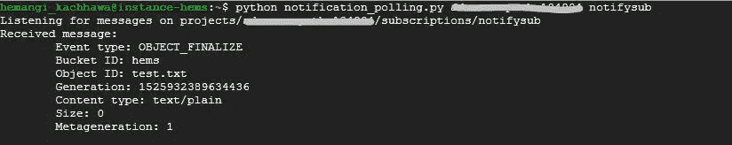

# 使用发布/订阅获取 Google 云存储的对象通知

> 原文：<https://medium.com/google-cloud/get-object-notification-for-google-cloud-storage-74187cf542c8?source=collection_archive---------0----------------------->

每当我们在谷歌云存储中存储数据时，很多时候我们的目标是获得 bucket 中每次变化的更新。可能是检索最近添加的文件，大小，时间戳等。对于这个云，发布/订阅通知允许您跟踪云存储对象的更改。

订阅云发布/订阅通知是触发警报和操作以响应存储桶中的变化的通用方式。现在让我们看看如何滚动！


首先，让我们快进一下这项任务的先决条件:

1.  启用云[发布/订阅 API](https://console.cloud.google.com/flows/enableapi?apiid=pubsub&_ga=2.54338464.-928986593.1506334033)
2.  拥有足够的 bucket 权限(如果您不拥有项目，请使用 ACL 或 IAM &分别拥有[所有者权限](https://cloud.google.com/storage/docs/access-control/lists#permissions)或 [storage.buckets.update 权限](https://cloud.google.com/storage/docs/access-control/iam#permissions)。)
3.  有足够的权限访问发布/订阅主题

潜入主场景！希望你有准备这道菜所需的所有材料..

1.  让我们创建一个存储桶:

```
gsutil mb gs://[UNIQUE_BUCKET_NAME]
```

2.创建一个云发布/订阅主题，并将其绑定到我们的 GCS bucket:

```
gsutil notification create -t [TOPIC_NAME] -f json -e OBJECT_FINALIZE gs://[BUCKET_NAME]
```

`-t`指定发布/订阅主题

`-f`指定您希望消息的有效负载作为 JSON API 中的对象获得。

您也可以使用`-e`指定其他事件类型

3.现在让我们创建一个发布/订阅订阅:

```
gcloud beta pubsub subscriptions create [SUBSCRIPTION_NAME] --topic=[TOPIC_NAME]
```

太好了！我们一切都准备好了，杰克！只需要读那些信息。这是我在任务中使用的[样本](https://github.com/GoogleCloudPlatform/python-docs-samples/blob/master/storage/cloud-client/notification_polling.py)。

你准备好品尝这道菜了吗？这就对了。以下列身份运行脚本:

```
python [SCRIPT_NAME].py [PROJECT_ID] [SUBSCRIPTION_NAME]
```

并尝试在 bucket 上进行一些冒险，您应该会得到如下输出:



**如何处理这些事件通知？**

这是个聪明的问题！因此，您可以检索该发布/订阅消息，并将其添加到您的应用程序中，通过电子邮件等方式获得通知。看看这个例子，它给出了关于[通过应用引擎](https://cloud.google.com/community/tutorials/use-cloud-pubsub-cloud-storage-app-engine)使用发布/订阅通知的合理想法。

在下一篇文章中，我将分享如何使用云函数来完成同样的任务。在那之前，祝你生活愉快！