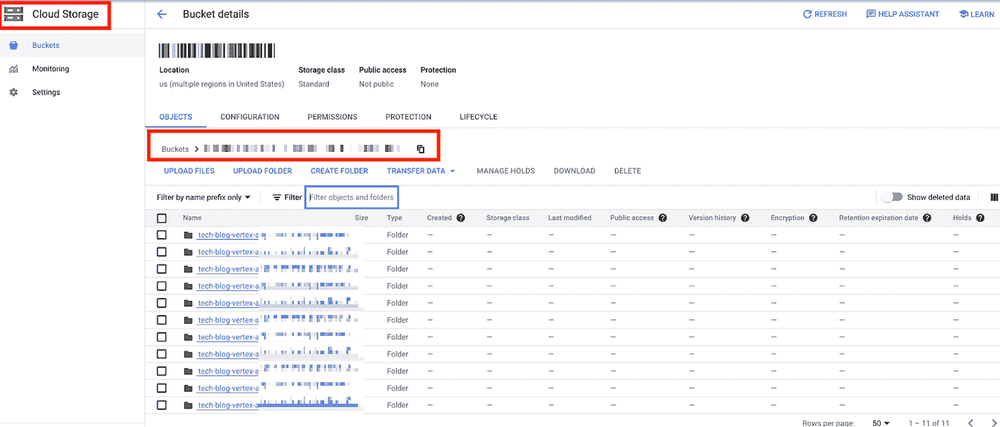
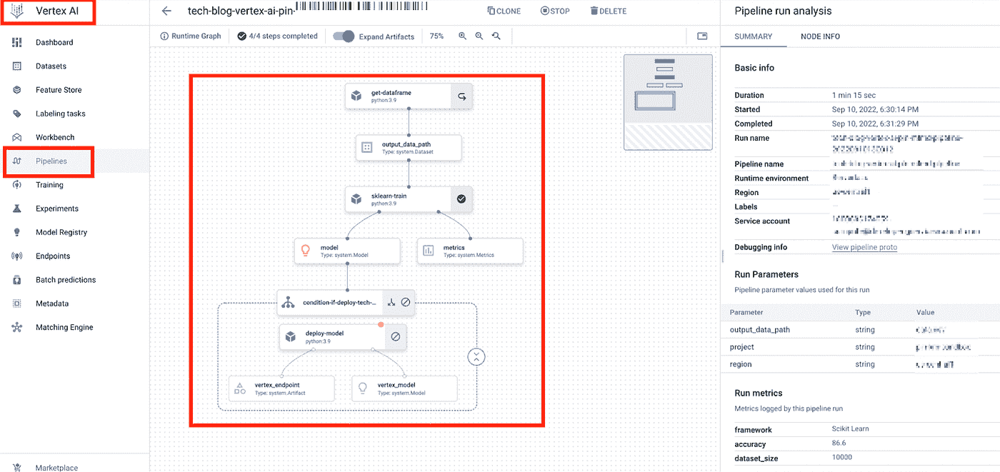
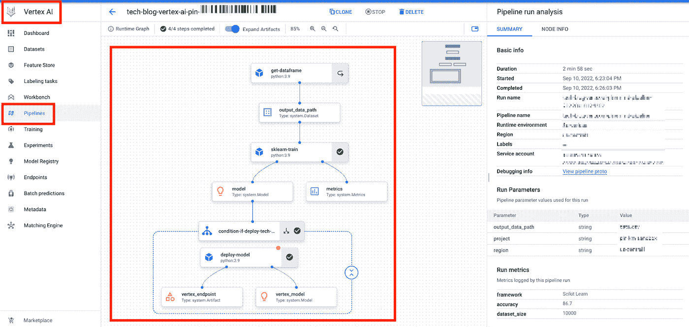
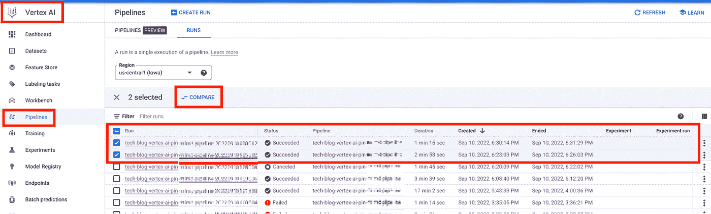
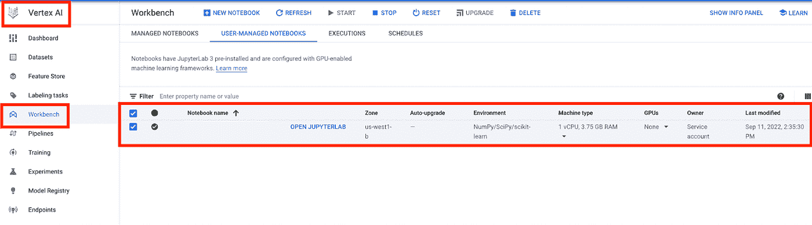
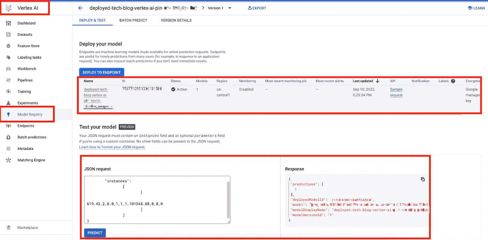
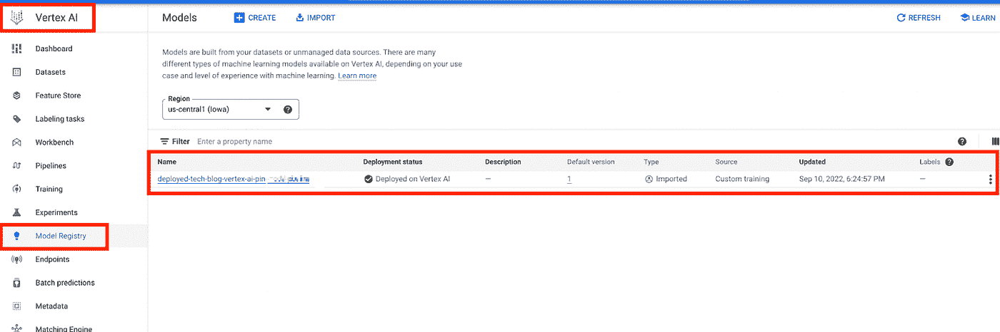
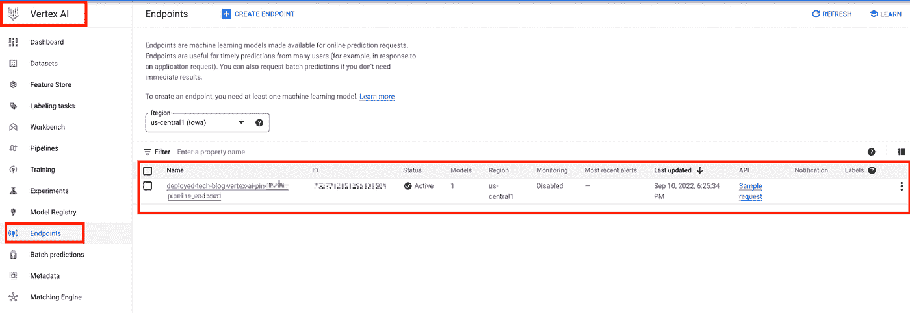

# 让顶点人工智能开始吧！

> 原文：<https://medium.com/google-cloud/get-set-go-with-vertex-ai-fbefc69d74c4?source=collection_archive---------2----------------------->

# 概述:

这个技术博客的目的是了解编写顶点 AI 管道的基础知识。这将有助于衡量如何设置和运行管道的基本理解和基础。大多数情况下，它将用于 [MLOPs](https://cloud.google.com/architecture/mlops-continuous-delivery-and-automation-pipelines-in-machine-learning) 解决方案和/或在更大的解决方案架构中建立无服务器 ML 管道。

# 目标:

为一个 ML 模型构建端到端标准化和可重用的顶点 AI 管道。管道阶段将包括以下步骤:

*   数据摄取(样本数据集)
*   数据清理
*   模特培训
*   条件模型部署
*   端点创建

# 技术堆栈:

*   [云存储](https://cloud.google.com/storage/docs/introduction):云存储用于保存文物。
*   [Vertex AI](https://cloud.google.com/vertex-ai/docs/start/introduction-unified-platform) : Vertex AI 是 Google Cloud 提供的一项服务，将 AutoML 和 AI 平台汇集到一个统一的 API、客户端库和用户界面中。
*   [工作台](https://cloud.google.com/vertex-ai/docs/workbench/user-managed/introduction):可以在工作台中创建笔记本，用于编写管道代码。
*   [管道](https://cloud.google.com/vertex-ai/docs/pipelines):顶点管道用于查看编码管道的可视化编排。
*   [模型注册](https://cloud.google.com/vertex-ai/docs/model-registry/introduction):所有创建的模型在这里都是可见的。这些将用于在线预测。
*   [端点](https://cloud.google.com/vertex-ai/docs/predictions/using-private-endpoints):通过使用端点，可以为模型提供服务。可以通过 UI 或 SDK 进行预测。

# 问题陈述和 ML 解决方案:

我们已经解决了一个基本的客户流失问题。其代码可在[这里](https://github.com/manan-bedi2908/Customer_Churn-Deployment/blob/master/Customer_Churn.ipynb)找到。我们已经把这段代码转换成了顶点 AI 流水线代码。

# 解决方法:

Vertex AI 是一个统一的 MLOps 平台，可以帮助数据科学家/ML 工程师增加实验，更快地部署，并充满信心地管理模型。它可以被视为一个托管的管道运行程序，具有其他关键功能，如数据标记、AutoML 支持的培训、端点管理等。

Vertex AI 是 Google Cloud 提供的一项服务，它将 AutoML 和 AI 平台整合到一个统一的 API、客户端库和用户界面中。AutoML 允许您在图像、表格、文本和视频数据集上训练模型，而无需编写代码，而 AI 平台中的训练则允许您运行自定义训练代码。使用 Vertex AI， [AutoML 训练](https://cloud.google.com/vertex-ai/docs/training/training)和[定制训练](https://cloud.google.com/vertex-ai/docs/training/custom-training)都可以作为实施的选项。人们还可以用 Vertex AI 保存模型、部署模型和请求预测。出于这个博客的目的，我们将使用定制培训方法。

我们还必须考虑顶点人工智能特性目前在哪里可以实现。并非 Vertex AI 的所有特性在每个 GC 区域都可用。因此，在根据特定地区的服务可用性提出解决方案时，我们需要注意。[这个](https://cloud.google.com/vertex-ai/docs/general/locations)是指示哪个顶点 AI 特性在哪个区域可用的参考链接。

# IAM 先决条件:

在构建管道之前，必须检查用户是否具有以下角色，以避免身份验证问题:

*   **服务使用消费者**:检查服务状态和操作的能力；、以及消费者项目消费者配额和账单。
*   **存储对象管理**:授予对对象的完全控制权，包括列出、创建、查看和删除对象。
*   **顶点 AI 管理员**:授予对顶点 AI 中所有资源的完全访问权限。如果不能赋予 admin 角色，可以考虑将 Vertex AI 编辑角色赋予管道开发者。
*   联网许可将根据具体情况而定。

# 管道任务:

一个 MLOps 管道可能有多个任务，如数据摄取、预处理、训练、测试等。所有这些都可以定义为单独的组件，我们可以设置它们之间的依赖关系。

我们正在使用[新的 Kubeflow Pipelines SDK 版本](https://www.kubeflow.org/docs/components/pipelines/sdk-v2/)，它与 Vertex AI 和代表“特定领域语言”的 [DSL](https://www.kubeflow.org/docs/components/pipelines/sdk/sdk-overview/#kfp.dsl) 兼容，因为它是用于管道定义的 SDK 的主要模块。我们还使用来自上述 SDK 的输入、输出和度量，因为它们是我们在组件之间传递对象的方式。当我们定义一个组件时，我们可以声明暗示组件输入和输出的参数类型。

我们管道的基本前提是数据摄取→数据预处理→模型训练→模型测试→检查准确度分数→如果准确度分数>阈值，那么模型部署和端点创建。

## 数据接收和预处理:

在我们的例子中，我们从 GCS 桶中获取数据，并在管道本身中进行预处理步骤，使用 Python 中的[熊猫](https://pandas.pydata.org/)库处理[数据集](https://github.com/manan-bedi2908/Customer_Churn-Deployment/blob/master/Churn_Modelling.csv)。我们将对上述流失预测用例的数据集进行基本的[标签编码](https://www.geeksforgeeks.org/ml-label-encoding-of-datasets-in-python/)和[特征重要性](https://towardsdatascience.com/understanding-feature-importance-and-how-to-implement-it-in-python-ff0287b20285#:~:text=Feature%20Importance%20refers%20to%20techniques,to%20predict%20a%20certain%20variable.)。

## 模型训练和测试:

我们使用[随机森林分类器](https://www.geeksforgeeks.org/random-forest-classifier-using-scikit-learn/)进行模型训练和测试。

## 模型部署和端点创建:

我们已经为模型的条件部署编写了一个逻辑。我们将在模型训练阶段检查准确性阈值。如果它高于所需的阈值，那么只有模型将被部署，端点将被创建。

# 管道结构:

## 笔记本:

*   笔记本可以从 Vertex AI 中的工作台访问。在 Vertex AI 的云控制台中，你可以从 Vertex AI 中查看你所有的笔记本实例。您在笔记本实例中运行的代码决定了作业、模型或其他资源的存储位置。换句话说，Vertex AI API 请求在 Vertex AI 中创建资源。
*   现在，我们可以创建一个完全由 Google 管理的托管笔记本或用户托管笔记本，我们可以指定笔记本实例将在其上旋转的机器类型的所有详细信息。
*   笔记本是我们写作工作中不可或缺的一部分。使用笔记本，我们可以在数据集上执行特征工程和数据准备，在自定义训练模型上构建和迭代，或者使用 Vertex AI 客户端库之一来创建复杂的模型，然后存储这些资源以在 Vertex AI 中使用。

## 组件:

管道将有不同的任务。这些任务可以被视为流水线的独立组件。我们必须使用组件装饰器来为任务指定代码。该组件不要求您为每次代码更改构建新的容器映像，它旨在用于笔记本环境中的快速迭代。您可以通过调用@component decorator 来创建一个轻量级组件。当管道运行时，这个装饰器将底层函数定义编译成实际运行的组件。我们可以指定以下参数:

*   base_image:加载函数将在其上运行的基本图像。我们可以在这里提供预建或定制的 docker 图像。在我们的例子中，我们使用 Python 3.9 作为基础映像(注意:在使用这些预构建的基础映像时，我们应该意识到这样一个事实，即在运行外部包的安装时，我们可能会面临一些问题。例如，软件包“scipy”在安装时有一些已知的问题。在这种情况下，我们可以将基础映像更改为以前版本的 Python(从 3.9 到 3.8)，并检查它是否工作。
*   output_component_file:这将组件加载到一个 YAML 文件中，以便重用。我们可以通过使用函数 load_component_from_file( )从 YAML 文件中加载组件。
*   packages_to_install:在这里，我们可以指定要安装的包，这些包在我们的基本映像之外。例如，如果我们的 base_image 是 Python3.9，我们可以通过将它指定到一个列表中来安装 Pandas 库。

我们可以向函数提供输入参数，并且可以将函数的输出转换成命名的双重格式，以便以后存储和使用。下面是一个相同的例子:

```
#defining a component
@component(
packages_to_install=["sklearn", "pandas", "joblib","google-cloud-bigquery"],
base_image="python:3.9",
output_component_file="model_component.yaml",
)
def sklearn_train(
dataset: Input[Dataset],
metrics: Output[Metrics],
model: Output[Model]
)-> NamedTuple("output", [("deploy", str)]):
import pandas as pd
#your code here
deploy = latest_model_threshold_str
return (deploy,)
```

[这里的](https://github.com/pin-a-king/get-going-with-vertex-ai-v0/blob/ae247aabffb022cd09ae3f906ad65884afd56f16/vertex_ai_pipeline_pin.py)是定义样本组件的实际代码片段的链接。

## 管道 DSL:

可以通过 Python 领域特定语言(DSL)来定义 ML 任务序列的规范。工作流的拓扑结构是通过将上游步骤的输出连接到下游步骤的输入来隐式定义的。管道定义中的一个步骤调用管道中的一个组件。在复杂的管道中，组件可以在循环中执行多次，也可以有条件地执行。使用管道 DSL，我们可以建立不同组件之间的依赖关系。为了建立依赖关系，我们可以使用 after()或者一个接一个地调用任务。PIPELINE_ROOT 是 GCS 路径，我们将在这里存储每个管道运行的所有工件。我们可以利用不同的 DSL 功能，比如特定组件的条件执行。[这里的](https://github.com/pin-a-king/get-going-with-vertex-ai-v0/blob/ae247aabffb022cd09ae3f906ad65884afd56f16/vertex_ai_pipeline_pin.py)是定义管道组件的实际代码片段的链接。以下是定义管道的示例:

```
#define a pipeline and create a task from a component:
@pipeline(
# Default pipeline root. You can override it when submitting the pipeline.
pipeline_root = PIPELINE_ROOT,
# A name for the pipeline.
name = "tech-blog-vertex-ai-pin-mlmd-pipeline",
)
def pipeline(
output_data_path: str = "data.csv",
project: str = PROJECT_ID,
region: str = REGION
):
dataset_task = get_dataframe()
model_task = sklearn_train(
dataset_task.output
)
with dsl.Condition(model_task.outputs["deploy"] == "true", name = "if_deploy_tech_blog_model_vertex_ai_pin"):
deploy_task = deploy_model(
model = model_task.outputs["model"],
project = project,
region = region
)
```

## 编译管道:

我们可以使用 compile()将管道代码编译成序列化的 JSON 格式。这个 JSON 将用于触发管道。[这里的](https://github.com/pin-a-king/get-going-with-vertex-ai-v0/blob/ae247aabffb022cd09ae3f906ad65884afd56f16/vertex_ai_pipeline_pin.py)是编译管道的实际代码片段的链接。下面是相同的代码片段:

```
compiler.Compiler().compile(
pipeline_func = pipeline, package_path = "tech-blog-vertex-ai-pin-mlmd_pipeline.json"
)
```

## PipelineJob 对象:

该客户端用于创建响应来触发管道。我们可以使用下面的函数，它是 Python SDK 的 API 客户端的一部分:

*   [PipelineJob 对象](https://cloud.google.com/vertex-ai/docs/pipelines/run-pipeline?hl=en#vertex-ai-sdk-for-python):使用管道的序列化版本以及显示名称、enable_caching 等其他参数触发管道。(当 enable_caching 为 TRUE 时，管道运行将存储元数据，对于后续运行，它将从失败或停止的地方继续运行；如果为 FALSE，则管道将执行所有组件)。
*   [job.submit](https://cloud.google.com/vertex-ai/docs/pipelines/run-pipeline?hl=en#vertex-ai-sdk-for-python) :触发流水线运行。

[这里的](https://github.com/pin-a-king/get-going-with-vertex-ai-v0/blob/ae247aabffb022cd09ae3f906ad65884afd56f16/vertex_ai_pipeline_pin.py)是创建并提交管道作业的实际代码片段的链接。下面是相同的示例代码片段:

```
run1 = aiplatform.PipelineJob(
display_name = "tech-blog-vertex-ai-pin-mlmd-pipeline",
template_path = "tech-blog-vertex-ai-pin-mlmd_pipeline.json",
job_id = "tech-blog-vertex-ai-pin-mlmd-pipeline-{0}".format(TIMESTAMP),
enable_caching = True,
)
run1.submit()
```

# 顶点人工智能产生的假象:

我们可以指定 pipeline_root 文件夹的位置，每个管道运行的所有元数据都将存储在该文件夹中，如上一节所述。下面是在提到的 PIPELINE_ROOT 桶中为每次运行保存的工件的屏幕截图:



# 在整体架构中包含顶点 AI 管道的可能方法:

*   顶点人工智能管道可以单独用于 EDA。
*   除此之外，整个管道可以保存为 JSON 格式。这个 JSON 文件可以存储在一个 GCS 桶中，它可以用来触发管道运行。
*   对于 CICD 实现，上述存储的管道版本可以根据需要进行更新或升级。
*   我们可以使用一个[云函数](https://cloud.google.com/functions)从保存的 JSON 管道中触发一次运行。
*   我们还可以使用[云调度器](https://cloud.google.com/scheduler)作业来调度管道运行；在管道环境内或外部。

# 顶点人工智能视觉:

*   下面是管道执行的两个屏幕截图，其中第一个没有执行模型部署，第二个执行了模型部署:



*   下面是的屏幕截图，如果我们想比较两个管道运行的指标:



*   下面是使用其规格创建的用户管理笔记本的屏幕截图:



*   下面是在模型注册表中创建的模型的屏幕截图:



*   下面是向部署的模型发送预测请求的屏幕截图。它还必须遵循下述格式(JSON ):

```
{
  "instances":
  [
    [
      619,42,2,0.0,1,1,1,101348.88,0,0,0
    ]
  ]
}
```



*   下面是创建的端点的屏幕截图:



# 代码:

请在这里找到这个博客[的全部代码](https://github.com/pin-a-king/get-going-with-vertex-ai-v0)！

(PS:请注意，数据集已经保存在提到的 GCS 桶中)

# 最佳实践:

*   如前所述，笔记本是在计算引擎实例上运行的，因此，只要不使用，建议停止笔记本实例，以节省底层计算引擎的运行成本。
*   我们可以在一个端点上部署一个模型，或者在一个端点上部署多个模型；但在后一种情况下，我们需要[相应地分割](https://cloud.google.com/vertex-ai/docs/general/deployment#models-endpoint)流量以实现可伸缩性。
*   一个端点可以多次使用。我们可以取消部署不必要的模型，并在同一个端点上部署新模型；而不是创造一个新的。
*   如果不再使用该模型，我们应该从端点上取消部署该模型。然后我们可以删除端点。然后，我们可以删除顶点人工智能中的模型。
*   顶点 AI 资源如果长时间无人管理，会产生巨大的成本；所以如果不使用，我们应该删除各自的资源。
*   顶点人工智能定价:顶点人工智能操作和等效的“遗留”操作的定价对于每个操作都是相同的。例如，如果您使用人工智能平台训练来训练模型，则使用顶点人工智能训练来训练模型的[成本](https://cloud.google.com/vertex-ai/pricing#training)是相同的。如果你使用的是传统的人工智能平台产品，那么计费可能会用“培训单位”来表示。Vertex Pipelines 对每个管道运行收取 0.03 美元的运行执行费。您还需要为在顶点管道中使用的谷歌云资源付费，比如管道组件消耗的计算引擎资源。如需完整的定价信息，请点击[此处](https://cloud.google.com/vertex-ai/pricing)。

# 参考资料:

以下参考资料是开始使用 Vertex AI 的良好起点:

*   [什么是顶点 AI？](https://www.youtube.com/watch?v=gT4qqHMiEpA)
*   [原型到生产用顶点 AI](https://www.youtube.com/playlist?list=PLIivdWyY5sqJAyUJbbsc8ZyGLNT4isnuB)
*   [用顶点 AI](https://www.youtube.com/watch?v=766OilR6xWc) 建立端到端管道