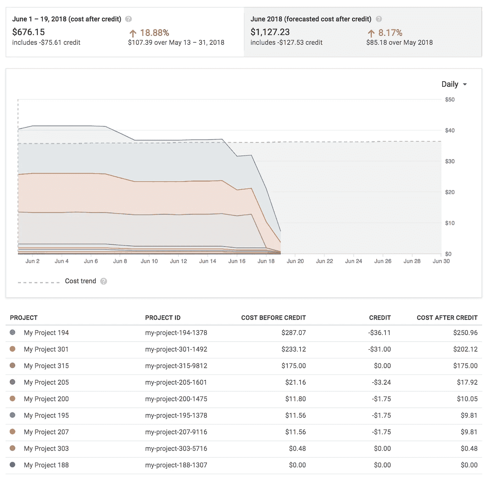

# GCP 入门:账单账户

> 原文：<https://medium.com/google-cloud/getting-started-on-gcp-billing-accounts-16accd0bcdeb?source=collection_archive---------0----------------------->

在你开始在公共云上构建基础设施、应用和服务之前，你需要关心的第**件事**是**你将如何*为它***支付。

# 关于账单账户

如果你将使用[谷歌云平台](https://cloud.google.com/) (GCP)，你想从创建一个[付费账户](https://cloud.google.com/billing/docs/concepts#billing_account)开始。

您的付费账户将与一个[谷歌支付档案](https://support.google.com/paymentscenter/topic/9017382?ref_topic=9037778)关联，该档案将用于支付您创建的任何云资源，如虚拟机和存储，以及您消费的任何其他服务，如网络流量或支持。

除了定义您支付 GCP 服务的方式之外，您的账单账户也是您控制对账单和报告的访问、管理预算和通知以及从财务角度监控您的 GCP 账户行为的地方。

您可以使用帐单帐户做的一些事情:

*   更改其名称或其关联的 GCP [组织](https://cloud.google.com/billing/docs/concepts#organization)
*   控制谁可以使用新项目帐户、谁可以查看成本以及谁可以修改权限的权限
*   查看信用、交易、发票和付款
*   配置具有阈值的预算，当超出阈值时，将向[发布/订阅](https://cloud.google.com/pubsub/docs/)发送电子邮件警报或消息
*   管理计费数据自动导出到存储在[云存储](https://cloud.google.com/storage/)中的 CSV 或 JSON 文件，或直接导出到 [BigQuery](https://cloud.google.com/bigquery/)
*   管理自助支付选项，如信用卡/借记卡或从您的银行账户直接扣款
*   查看您的账单数据报告，以分析成本、发现趋势和预测未来支出

[GCP 计费报表示例](https://cloud.google.com/billing/docs/how-to/reports)

# 支付选项

在创建您的付款帐户之前，您需要确定您计划使用的付款方式。谷歌提供两种不同类型的计费账户:

*   自助服务(信用卡/借记卡或支票账户直接借记)
*   已开票(支票或电汇)

当然，最简单也是最常见的开始方式是创建一个由你的信用卡或借记卡支持的自助账单账户。如果你是一个个体或小企业，这可能足以满足你的长期需求。

但是，如果您是一个计划在公共云服务上花费大量资金的大型组织，那么在某个时候转移到发票帐户可能是有意义的。举例来说，您可以通过发票账户来避免一些棘手问题，请参见“[为什么您不应该使用 Google Cloud](/@serverpunch/why-you-should-not-use-google-cloud-75ea2aec00de) ”(中)。

# 创建计费帐户

既然你已经决定了如何付款，你可以继续创建一个帐单帐户。

对于信用卡/借记卡或直接借记支持的自助计费账户，您可以在 console.cloud.google.com/billing[创建您的账户:](https://console.cloud.google.com/billing)

 [## 谷歌云平台

### Google 云平台让您可以在同一基础设施上构建、部署和扩展应用程序、网站和服务…

console.cloud.google.com](https://console.cloud.google.com/billing) 

有关创建自助计费账户的更多信息，请参见操作指南:“[创建新的计费账户](https://cloud.google.com/billing/docs/how-to/manage-billing-account#create_a_new_billing_account)”

对于已开发票的账单账户，您需要[请求已开发票的账单](https://cloud.google.com/billing/docs/how-to/invoiced-billing)，并且您的组织需要满足 Google 的资格要求。根据您的组织的资金、规模和结构，这一过程可能会很艰巨，可能需要您花几个月的时间作为一个积极的、付费的 GCP 客户，然后才有资格。

或者，你可以与[谷歌全球合作伙伴网络](https://cloud.google.com/partners/)的成员合作，而不是直接从谷歌获得付费账户。我在与 [ONIX](https://cloud.withgoogle.com/partners/detail/?id=CIGAgICAgIC9%2FgE%3D&language=en&hl=en-US) 和 [SADA 系统](https://cloud.withgoogle.com/partners/detail/?id=CIGAgICAgIClPg%3D%3D&language=en&hl=en-US)的合作中获得了很好的经验，但是如果您有兴趣了解不同的合作伙伴能够为您的组织提供什么，请查看[查找合作伙伴](https://cloud.withgoogle.com/partners/)目录，按能力、产品或位置进行搜索。

使用开票账户的另一个好处是，与必须接受在线[服务条款](https://cloud.google.com/terms/)的自助服务相比，您有机会在签署合同前就合同进行协商。对于许多大型组织来说，这将是一项要求，因为他们的法律团队希望有机会调整条款。

# 初始配置

一旦您创建了您的付费帐户，您就可以开始使用谷歌云平台了！然而，在您继续之前，我建议您注意一些事情。

*   调整[计费账户权限](https://cloud.google.com/billing/docs/how-to/billing-access)以满足您的需求。具体来说，确保您有一组有限的人可以更新计费帐户权限(管理员)，这样只有您信任的人可以在您的计费帐户上创建项目(用户)，并且任何需要监控成本和预测的人都有适当的访问权限(查看者)。
*   [将账单数据导出到 BigQuery](https://cloud.google.com/billing/docs/how-to/export-data-bigquery) ，因为当发生需要您调查的事情时，您希望数据在那里等着您。
*   设置预算提醒,帮助记录你的支出，并保持在你期望的范围内。我建议建立两个预算，一个基于每月的具体预算，另一个基于“上个月的花费”这样，你可以随时了解你的支出是如何随着时间的推移而增加的。随着消费的变化调整您的预算，使它们继续具有相关性和可操作性。
*   [在您的自助记账账户上配置一个额外的信用卡/借记卡或银行账户](https://cloud.google.com/billing/docs/how-to/payment-methods)，以防您的主要支付方式出现任何问题。

# 后续步骤

现在您已经有了一个满足您需求的计费帐户，是时候开始云计算了！

*   了解[组织](https://cloud.google.com/resource-manager/docs/cloud-platform-resource-hierarchy#organizations)
*   操作方法:[创建和管理组织](https://cloud.google.com/resource-manager/docs/creating-managing-organization)
*   操作方法:[创建和管理文件夹](https://cloud.google.com/resource-manager/docs/creating-managing-folders)
*   操作方法:[创建和管理项目](https://cloud.google.com/resource-manager/docs/creating-managing-projects)
*   操作方法:[通过账单报告查看您的成本趋势](https://cloud.google.com/billing/docs/how-to/reports)
*   操作方法:[用数据工作室](https://cloud.google.com/billing/docs/how-to/visualize-data)可视化时间