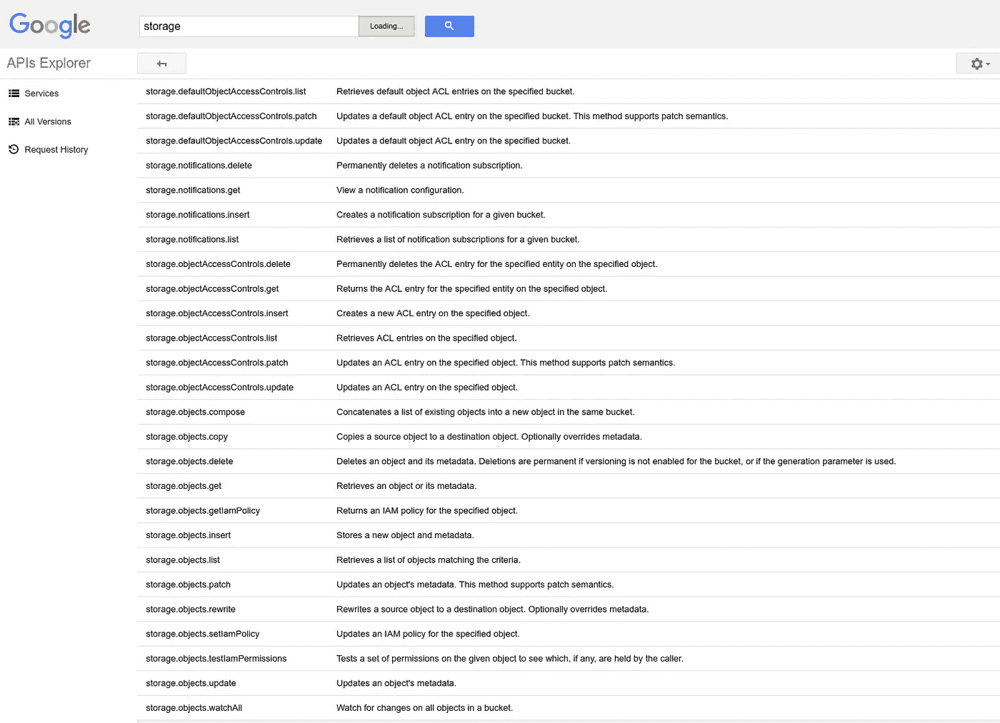

# 在 GCP 上开始使用 Java

> 原文：<https://medium.com/google-cloud/getting-started-w-java-on-gcp-9c068638140f?source=collection_archive---------0----------------------->

## “缺失教程”系列

*写一篇简短的* [*系列*](/@DazWilkin/starting-w-google-cloud-platform-apis-41221830ba76) *【入门】帖子对于像我这样的人来说，他们可能想要针对谷歌服务编写代码，选择了一种语言，但在一两周没有编写代码之后，我被“我到底该如何入门”所困扰*

## 设置

我运行的是(Linux)，Java (openjdk-8-jdk)，Apache Maven (3.5.0)。

我将使用 Maven，因为它是我最熟悉的 Java 构建工具。Google 提供了与 Maven 和 Gradle 的工具集成，例如 App Engine。当然，您也可以手动管理软件包。

让我们设置我们的环境:

```
PROJECT_ID=[[YOUR-PROJECT-ID]]
LANG=javamkdir -p ${HOME}/${PROJECT_ID}/${LANG}
cd ${HOME}/${PROJECT_ID}/${LANG}
```

## 谷歌 Java 库

在基础文章“[开始使用 Google 云平台 API](/@DazWilkin/starting-w-google-cloud-platform-apis-41221830ba76)”中，我总结了 Google 提供的两个库:

***API 客户端库***

API 客户端库被分解成一个核心包(google-api-client)和特定于服务的包。在这篇文章中，我们将使用谷歌云存储(GCS ),因此我们也需要引用 GCS JSON API 包(google-api-services-storage)。

谷歌

```
[https://developers.google.com/api-client-library/java/](https://developers.google.com/api-client-library/java/)
[https://developers.google.com/api-client-library/java/apis/](https://developers.google.com/api-client-library/java/apis/)
```

专家

```
[https://mvnrepository.com/artifact/com.google.api-client/google-api-client](https://mvnrepository.com/artifact/com.google.api-client/google-api-client)
[https://mvnrepository.com/artifact/com.google.apis/google-api-services-storage](https://mvnrepository.com/artifact/com.google.apis/google-api-services-storage)
```

当前库是 1.22.0，mvnrepository 为 pom.xml 文件生成 XML:

```
<dependency>
  <groupId>com.google.api-client</groupId>
  <artifactId>google-api-client</artifactId>
  <version>1.22.0</version>
</dependency><dependency>
  <groupId>com.google.apis</groupId>
  <artifactId>google-api-services-storage</artifactId>
  <version>v1-rev111-1.18.0-rc</version>
</dependency>
```

开源代码库

```
[https://github.com/google/google-api-java-client](https://github.com/google/google-api-java-client)
```

***云客户端库***

**NB** 云客户端库的发布周期滞后于底层服务。服务可能是正式版，但云客户端库*可能是 Alpha 版。

谷歌

```
[https://cloud.google.com/apis/docs/cloud-client-libraries](https://cloud.google.com/apis/docs/cloud-client-libraries)
```

专家

```
[https://mvnrepository.com/artifact/com.google.cloud/google-cloud-core](https://mvnrepository.com/artifact/com.google.cloud/google-cloud-core) 
```

当前的核心库是 1.6.0，Google 云存储库也是 1.6.0:

```
<dependency>
    <groupId>com.google.cloud</groupId>
    <artifactId>google-cloud-core</artifactId>
    <version>1.6.0</version>
</dependency><dependency>
    <groupId>com.google.cloud</groupId>
    <artifactId>google-cloud-storage</artifactId>
    <version>1.6.0</version>
</dependency>
```

开源代码库

```
[https://googlecloudplatform.github.io/google-cloud-java/0.24.0/index.html](https://googlecloudplatform.github.io/google-cloud-java/0.24.0/index.html)
[https://github.com/GoogleCloudPlatform/google-cloud-java](https://github.com/GoogleCloudPlatform/google-cloud-java)
```

API 文档:

```
[https://googlecloudplatform.github.io/google-cloud-java/0.24.0/apidocs/index.html](https://googlecloudplatform.github.io/google-cloud-java/0.24.0/apidocs/index.html)
```

好吧，让我们写一些代码。

## 谷歌云存储

在这个例子中，我们将使用[谷歌云存储](https://cloud.google.com/storage/)。

你可以通过 **API** 客户端库使用谷歌的任何服务，因为[所有这些](https://developers.google.com/api-client-library/java/apis/)客户端库都支持它们。

谷歌的许多服务都得到云客户端库的支持，尽管它们的发布节奏与底层服务不同。你可以在这里看到列表以及库是 Alpha、Beta 还是 GA。

选择一个您不介意在 GCS bucket 上复制多次的任意(小)文件，并:

```
BUCKET=$(whoami)-$(date +%y%m%d%H%M)
FILE=[[/Path/To/Your/File]]gsutil mb -p ${PROJECT_ID} gs://${BUCKET}
Creating gs://${BUCKET}/...for i in $(seq -f "%02g" 1 10)
do
  gsutil cp $FILE gs://${BUCKET}/${i}
donegsutil ls gs://${BUCKET}
gs://${BUCKET}/01
gs://${BUCKET}/02
gs://${BUCKET}/03
gs://${BUCKET}/04
gs://${BUCKET}/05
gs://${BUCKET}/06
gs://${BUCKET}/07
gs://${BUCKET}/08
gs://${BUCKET}/09
gs://${BUCKET}/10
```

## 应用程序默认凭据(ADC)

使用 Google APIs 时，ADCs 是一种获取身份验证凭证的简单方法，还有一个好处是代码可以从本地工作站移植到应用引擎和计算引擎。如果可以，请始终使用 ADC。

```
[https://developers.google.com/identity/protocols/application-default-credentials](https://developers.google.com/identity/protocols/application-default-credentials) [https://developers.google.com/identity/protocols/application-default-credentials#callingjava](https://developers.google.com/identity/protocols/application-default-credentials#callingjava)
```

与 Google 的其他 Java 资产一样，ADC 可以从 mvnrepository 获得:

```
[https://mvnrepository.com/artifact/com.google.apis/google-api-services-oauth2](https://mvnrepository.com/artifact/com.google.apis/google-api-services-oauth2)
```

您需要在 Maven pom.xml 中引用 ADC 作为依赖项:

```
<dependency>
  <groupId>com.google.apis</groupId>
  <artifactId>google-api-services-oauth2</artifactId>
  <version>v2-rev129-1.22.0</version>
</dependency>
```

## 解决方案 1:使用 API 客户端库

事实上，习惯上，我手动为 Java 项目创建目录，但是我使用 Maven 在 Googled 上搜索了正确的方法:

```
mvn archetype:generate \
--batch-mode \
--define archetypeGroupId=org.apache.maven.archetypes \
--define groupId=com.google.dazwilkin \
--define artifactId=api
```

这将生成一个名为“api”的目录，其中包含一个默认的 pom.xml 和一个包含模板 Java 文件的“src”目录树。

使用您喜欢的编辑器(或 IDE)，打开 pom.xml:

```
<project ...>
  <modelVersion>4.0.0</modelVersion>
  <groupId>com.google.dazwilkin</groupId>
  <artifactId>api</artifactId>
  <packaging>jar</packaging>
  <version>1.0-SNAPSHOT</version>
  <name>api</name>
  <url>[http://maven.apache.org](http://maven.apache.org)</url>
  <dependencies>
    <dependency>
      <groupId>junit</groupId>
      <artifactId>junit</artifactId>
      <version>3.8.1</version>
      <scope>test</scope>
    </dependency>
  </dependencies>
</project>
```

添加 API 客户端库依赖项和依赖项，以便可以使用应用程序默认凭据。保存文件。结果应该类似于:

```
<project>
  <modelVersion>4.0.0</modelVersion>
  <groupId>com.google.dazwilkin</groupId>
  <artifactId>api</artifactId>
  <packaging>jar</packaging>
  <version>1.0-SNAPSHOT</version>
  <name>api</name>
  <url>[http://maven.apache.org](http://maven.apache.org)</url>
  <dependencies> <dependency>
      <groupId>junit</groupId>
      <artifactId>junit</artifactId>
      <version>3.8.1</version>
      <scope>test</scope>
    </dependency> <!-- Google API Client Library -->
    <dependency>
      <groupId>com.google.api-client</groupId>
      <artifactId>google-api-client</artifactId>
      <version>1.22.0</version>
    </dependency> <!-- API Client Library: Storage -->
    <dependency>
      <groupId>com.google.apis</groupId>
      <artifactId>google-api-services-storage</artifactId>
      <version>v1-rev111-1.18.0-rc</version>
    </dependency> <!-- Application Default Credentials -->
    <dependency>
      <groupId>com.google.apis</groupId>
      <artifactId>google-api-services-oauth2</artifactId>
      <version>v2-rev129-1.22.0</version>
    </dependency> </dependencies>
</project>
```

然后打开生成的 App.java:

```
package com.google.dazwilkin;public class App 
{
    public static void main( String[] args )
    {
        System.out.println( "Hello World!" );
    }
}
```

*可选*:我建议把 App.java 改名为 CloudStorage.java，把 class App 也改名为 CloudStorage。

让我们一点一点来。

我们将从应用程序默认凭证 Java [示例](https://developers.google.com/identity/protocols/application-default-credentials#callingjava)中复制一些样板代码，虽然 Google 没有明确记录这一点，但您可以看到实例化存储服务的一致示例:

```
private static HttpTransport httpTransport;private static final JsonFactory JSON_FACTORY = JacksonFactory.getDefaultInstance();httpTransport = GoogleNetHttpTransport.newTrustedTransport();GoogleCredential credential = GoogleCredential.getApplicationDefault();Storage storage = new Storage.Builder(
    httpTransport,
    JSON_FACTORY,
    credential
).setApplicationName(
    APPLICATION_NAME
).build();
```

好消息是，这个样板文件适用于所有 Google 的服务，所以您将看到并可以将这个模式用于任何其他服务。

API 客户端库采用一致的模式来引用服务资源，并根据这些资源进行方法调用:

```
service.resources().verb().execute()
```

您将在下面的代码中看到我们使用了两次这种模式:一次是获取项目的 bucket，另一次是获取 bucket 的对象:

```
storage.buckets().list().execute()
storage.objects().list().execute()
```

与本系列中的其他示例一样，虽然可以通过查看 API 文档来理解 API，但我发现最简单的方法是用 API Explorer 复制我的意图，然后对其进行编码。

因此，例如，要枚举项目中的存储桶，可以查看 API Explorer 条目，并看到 **storage.buckets.list** “检索给定项目的存储桶列表”


云存储 JSON API v1

然后，使用 storage.buckets.list 创建一个调用，按预期返回项目的存储桶。注意:虽然我没有在此屏幕截图中显示铲斗的详细信息，但 200 表示通话成功:


随着您对 API 客户端库的熟悉，您会发现针对不同的服务清除代码变得更加容易。因为，虽然它不一定是惯用的，但它是一致的。学习如何为一个服务编码，你将能够为任何一个服务编码。

因此，实际上，继续快速浏览一下 Java 文档:


[https://developers . Google . com/resources/API-libraries/documentation/storage/v1/Java/latest/](https://developers.google.com/resources/api-libraries/documentation/storage/v1/java/latest/)

获得以下代码相对简单:

```
Storage.Buckets.List bucketsList = storage.buckets().list(PROJECT_ID);
Buckets buckets;
do {
    buckets = bucketsList.execute();
    List<Bucket> items = buckets.getItems();
    if (items != null) {
        for (Bucket bucket: items) {
            System.out.println(bucket.getName());    
        }
    }
    bucketsList.setPageToken(buckets.getNextPageToken());
} while (buckets.getNextPageToken()!=null);
```

这段代码最复杂的部分是分页；-)出于性能原因，并且因为枚举可能很大，API 实现的最佳实践是在页面中提供桶列表。要枚举整个列表，需要检索每一页，获取下一页的令牌，并将其传递回 API，然后重新执行 API 调用。

您可以放心地看到，枚举 bucket 中对象的代码在结构上与 bucket 枚举代码非常相似:

```
Storage.Objects.List objectsList = storage.objects().list(BUCKET_NAME);
Objects objects;
do {
    objects = objectsList.execute();
    List<StorageObject> items = objects.getItems();
    if (items != null) {
        for (StorageObject object : items) {
            System.out.println(object.getName());
        }
    }
    objectsList.setPageToken(objects.getNextPageToken());
} while (objects.getNextPageToken()!=null);
```

同样，复杂性主要在于重复执行 API 调用的循环，直到不再有要检索的对象页面。返回到 API Explorer，此方法实现 storage.objects.list，它“检索匹配标准的对象列表”:



将这些放在一起，并添加您将需要的许多导入语句:

pom.xml:

CloudStorage.java:

可能有更好的方法来构建和运行解决方案，但我的方法是:

```
mvn clean install --quiet-------------------------------------------------------
 T E S T S
-------------------------------------------------------
Running com.google.dazwilkin.CloudStorageTest
Tests run: 1, Failures: 0, Errors: 0, Skipped: 0, Time elapsed: 0.028 secResults :Tests run: 1, Failures: 0, Errors: 0, Skipped: 0
```

然后:

```
mvn exec:java \
-define exec.mainClass="com.google.dazwilkin.CloudStorage" \
--quiet[[BUCKET]]
01
02
03
04
05
06
07
08
09
10
```

## 解决方案 2:使用云客户端库

与解决方案 1 一样，让我们使用 Maven 为我们生成项目结构:

```
mvn archetype:generate \
--batch-mode \
--define archetypeGroupId=org.apache.maven.archetypes \
--define groupId=com.google.dazwilkin \
--define artifactId=cld
```

打开 pom.xml:

```
<project>
  <modelVersion>4.0.0</modelVersion>
  <groupId>com.google.dazwilkin</groupId>
  <artifactId>cld</artifactId>
  <packaging>jar</packaging>
  <version>1.0-SNAPSHOT</version>
  <name>cld</name>
  <url>[http://maven.apache.org](http://maven.apache.org)</url>
  <dependencies>
    <dependency>
      <groupId>junit</groupId>
      <artifactId>junit</artifactId>
      <version>3.8.1</version>
      <scope>test</scope>
    </dependency>
  </dependencies>
</project>
```

这一次，我们将为核心和云存储添加云客户端库包，以及应用程序默认凭据包。您的 pom.xml 应该如下所示:

```
<project>
  <modelVersion>4.0.0</modelVersion>
  <groupId>com.google.dazwilkin</groupId>
  <artifactId>cld</artifactId>
  <packaging>jar</packaging>
  <version>1.0-SNAPSHOT</version>
  <name>cld</name>
  <url>[http://maven.apache.org](http://maven.apache.org)</url>
  <dependencies>
    <dependency>
      <groupId>junit</groupId>
      <artifactId>junit</artifactId>
      <version>3.8.1</version>
      <scope>test</scope>
    </dependency> <!-- Google Cloud Core -->
    <dependency>
      <groupId>com.google.cloud</groupId>
      <artifactId>google-cloud-core</artifactId>
      <version>1.6.0</version>
    </dependency> <!-- Google Cloud Storage -->
    <dependency>
      <groupId>com.google.cloud</groupId>
      <artifactId>google-cloud-storage</artifactId>
      <version>1.6.0</version>
    </dependency> <!-- Application Default Credentials -->
    <dependency>
      <groupId>com.google.apis</groupId>
      <artifactId>google-api-services-oauth2</artifactId>
      <version>v2-rev129-1.22.0</version>
    </dependency> </dependencies>
</project>
```

然后打开生成的 App.java:

```
package com.google.dazwilkin;public class App 
{
    public static void main( String[] args )
    {
        System.out.println( "Hello World!" );
    }
}
```

*可选*:我建议把 App.java 改名为 CloudStorage.java，把 class App 也改名为 CloudStorage。

好吧…让欢乐开始吧。

碰巧 Google Cloud 文档现在通常使用云客户端库示例(而不是早期的 API 客户端库),因此有几个示例可以帮助我们开始使用云存储:

```
[https://github.com/GoogleCloudPlatform/google-cloud-java/tree/master/google-cloud-storage](https://github.com/GoogleCloudPlatform/google-cloud-java/tree/master/google-cloud-storage)[https://cloud.google.com/storage/docs/reference/libraries#client-libraries-usage-java](https://cloud.google.com/storage/docs/reference/libraries#client-libraries-usage-java) 
```

但是，老实说，作为一个 Java 业余爱好者，拥有这些轻量级的示例和 API 文档对我来说远远不够。因此，我发现这比 API 客户端库解决方案更难(有了它，其他语言的一致性和使用 Google API Explorer 的能力是非常有帮助的)。

以下是 API 文档:

```
[https://googlecloudplatform.github.io/google-cloud-java/0.24.0/apidocs/index.html](https://googlecloudplatform.github.io/google-cloud-java/0.24.0/apidocs/index.html)
[https://googlecloudplatform.github.io/google-cloud-java/0.24.0/apidocs/com/google/cloud/storage/package-summary.html](https://googlecloudplatform.github.io/google-cloud-java/0.24.0/apidocs/com/google/cloud/storage/package-summary.html)
```

由于缺少示例，我从这些 API 文档中不清楚如何实例化服务，如何使用 Bucket|BucketInfo 和 Blob|BlobInfo，这些支持什么方法等等。:-(其他人是怎么做到的？

所以…抄袭…

GitHub 文档很好地解释了授权流程:

```
[https://github.com/GoogleCloudPlatform/google-cloud-java#authentication](https://github.com/GoogleCloudPlatform/google-cloud-java#authentication)
```

我发现，当使用 ADC 并在本地(GCP 以外)或计算引擎实例上运行时，以下代码就足够了:

```
Storage storage = StorageOptions.getDefaultInstance().getService();
```

GitHub 文档提供了一个枚举项目存储桶以及每个存储桶中的对象的示例:

```
[https://github.com/GoogleCloudPlatform/google-cloud-java/tree/master/google-cloud-storage#listing-buckets-and-contents-of-buckets](https://github.com/GoogleCloudPlatform/google-cloud-java/tree/master/google-cloud-storage#listing-buckets-and-contents-of-buckets)
```

我稍微调整了一下，以反映解决方案#1 中的代码，它枚举所有的桶，然后枚举特定桶中的对象:

```
for (Bucket bucket : storage.list().iterateAll()) {
    System.out.println(bucket.getName());
}Bucket bucket = storage.get(BUCKET_NAME);
for (Blob blob : bucket.list().iterateAll()) {
        System.out.println(blob.getName());
}
```

老实说，我发现将 iterateAll 应用于 list 方法的例子只是在我现在编写这个示例时:

```
[https://googlecloudplatform.github.io/google-cloud-java/0.24.0/apidocs/com/google/cloud/storage/Storage.html#list-java.lang.String-com.google.cloud.storage.Storage.BlobListOption...-](https://googlecloudplatform.github.io/google-cloud-java/0.24.0/apidocs/com/google/cloud/storage/Storage.html#list-java.lang.String-com.google.cloud.storage.Storage.BlobListOption...-)
```

但是我用的是:

```
for (Bucket bucket : storage.list().iterateAll()) {
    System.out.println(bucket.getName());
}
```

然后，对于特定存储桶(存储桶名称)中的对象:

```
Bucket bucket = storage.get(BUCKET_NAME);
for (Blob blob : bucket.list().iterateAll()) {
        System.out.println(blob.getName());
}
```

将这些与 pom.xml 和您需要的导入放在一起:

并且:

和以前一样:

```
mvn clean install --quiet-------------------------------------------------------
 T E S T S
-------------------------------------------------------
Running com.google.dazwilkin.CloudStorageTest
Tests run: 1, Failures: 0, Errors: 0, Skipped: 0, Time elapsed: 0.007 secResults :Tests run: 1, Failures: 0, Errors: 0, Skipped: 0
```

然后:

```
mvn exec:java \
--define exec.mainClass="com.google.dazwilkin.CloudStorage" \
--quietdazwilkin-1708301815
01
02
03
04
05
06
07
08
09
10
```

## 整理

完成后，您可以删除存储桶(及其对象)。在执行此删除操作时，要非常小心地指定正确的存储桶。它删除所有对象，然后删除存储桶:

```
gsutil rm -r gs://${BUCKET}
```

## 结论

Java 的 API 客户端库非常简单。一旦你熟悉了针对一个服务的编码，你就熟悉了如何针对谷歌服务的编码。使用 API Explorer 内省服务及其方法，然后测试 API 的能力，使得 API Explorer 在使用 API 客户端库进行开发时非常有用。

对于 Java 的云客户端库，我感觉和我开始写这篇文章时一样不熟悉:-(cloud.google.com 上提供的每个服务的示例和 GitHub 示例都很好，但是还不够。我希望这只是对我的一个挑战，但我担心其他开发人员也可能会在构建这些库时遇到困难。