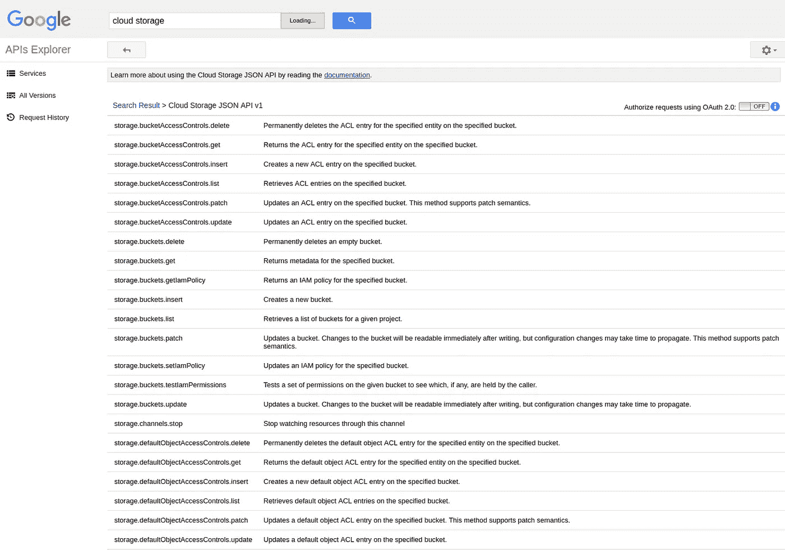
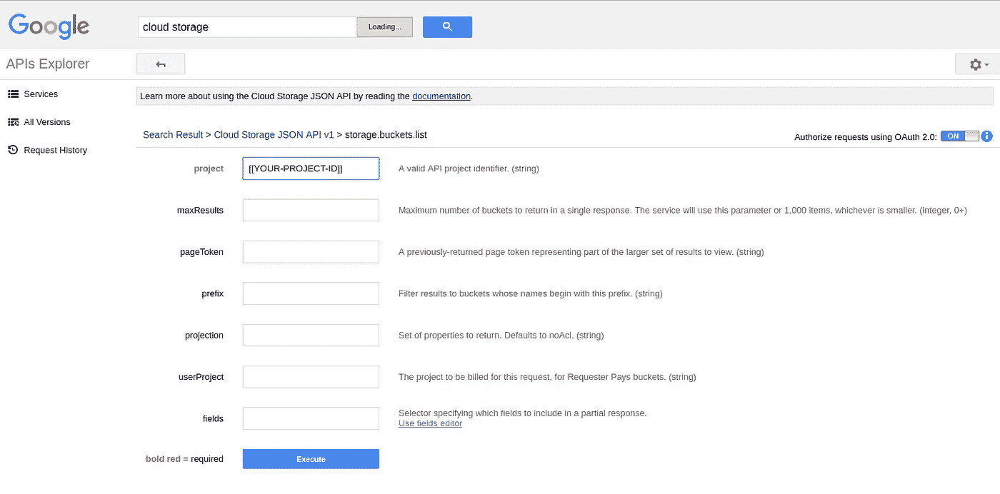
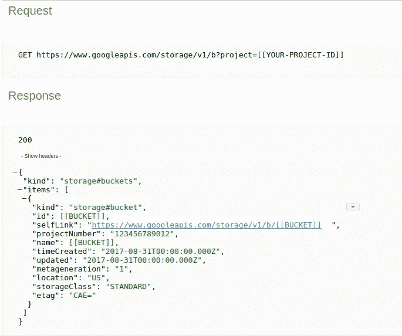
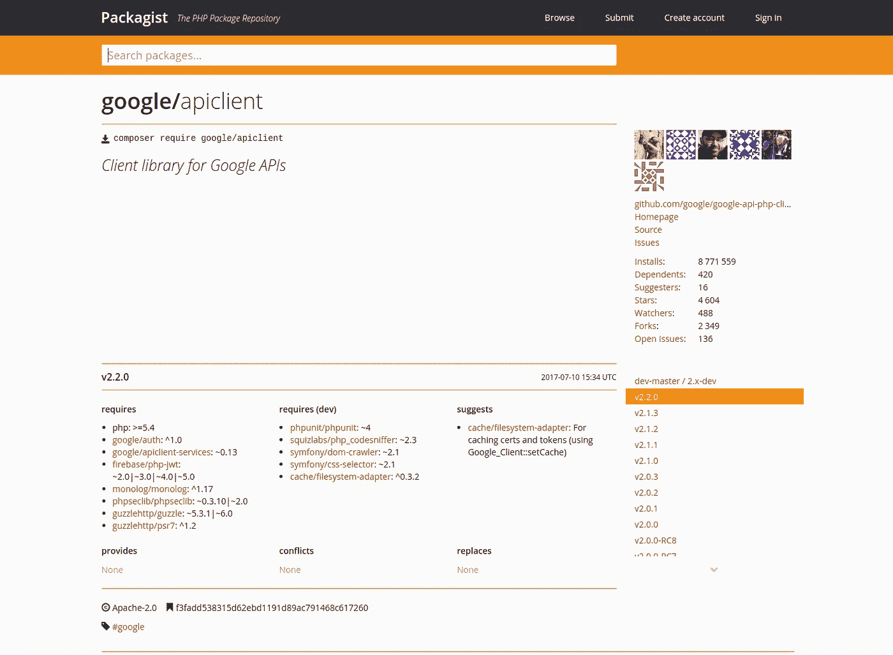
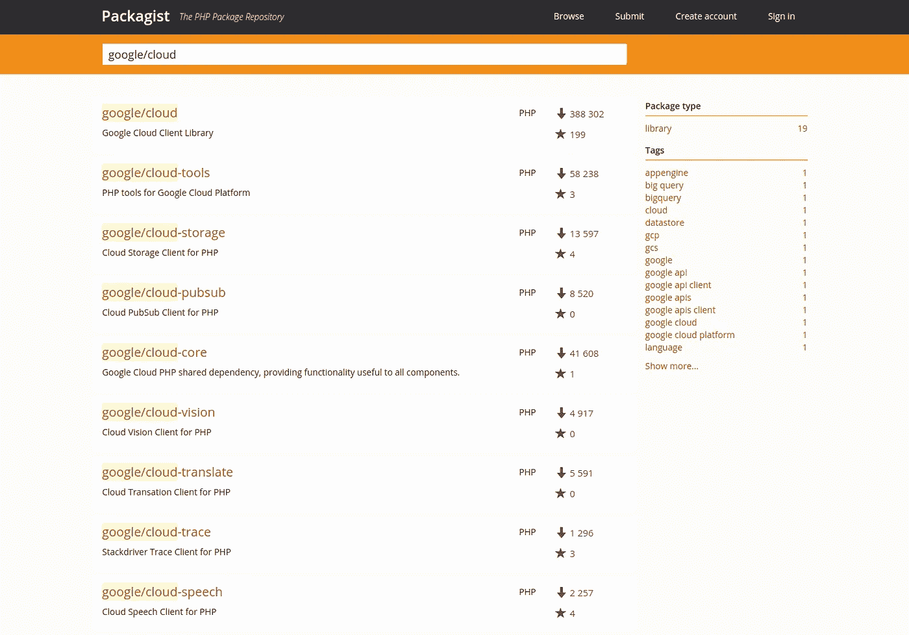
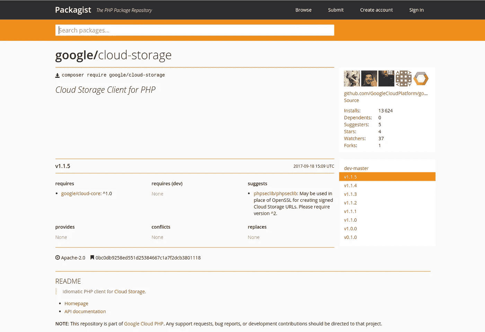

# 在 GCP 上开始使用 PHP

> 原文：<https://medium.com/google-cloud/getting-started-w-php-on-gcp-a68246f9054c?source=collection_archive---------0----------------------->

## “缺失教程”系列

*写一篇简短的* [*系列*](/@DazWilkin/starting-w-google-cloud-platform-apis-41221830ba76) *【入门】帖子对于像我这样的人来说，他们可能想要针对谷歌服务编写代码，选择了一种语言，但在一两周没有编写代码之后，我被“我到底该如何入门”所困扰*

## 服务器端编程语言（Professional Hypertext Preprocessor 的缩写）

PHP 是一种非常流行的语言，在服务器端(web)脚本中非常流行。我遇到过几次 PHP，但是不记得曾经用它写过多少代码。脸书可能是最知名的 PHP 应用程序，WordPress 紧随其后。

它是谷歌在[谷歌云平台(GCP)](https://cloud.google.com/) 上正式支持的 7 种语言之一。

## 设置

我运行的是 Linux (Ubuntu 16.04)。我假设 PHP 中有一个(常用的)包管理器，当然还有一个 PHP 运行时。据我所知，我的 Linux 机器上目前没有安装这两个软件。所以，让我们从这里开始。

```
PROJECT_ID=[[YOUR-PROJECT-ID]]
LANG=phpmkdir -p ${HOME}/${PROJECT_ID}/${LANG}
cd ${HOME}/${PROJECT_ID}/${LANG}
```

## 服务器端编程语言（Professional Hypertext Preprocessor 的缩写）

稍微搜索了一下，我就找到了 [PHP CLI](http://php.net/manual/en/features.commandline.php) ，我用以下代码安装了它:

```
[https://getcomposer.org/doc/01-basic-usage.md](https://getcomposer.org/doc/01-basic-usage.md)
```

## 设计者

Google API 客户端库 PHP 文档引用了“composer.json ”,这让我找到了 getcomposer.org。说明很简单:

```
[https://getcomposer.org/download/](https://getcomposer.org/download/)
```

然后:

```
php composer.phar ______
  / ____/___  ____ ___  ____  ____  ________  _____
 / /   / __ \/ __ `__ \/ __ \/ __ \/ ___/ _ \/ ___/
/ /___/ /_/ / / / / / / /_/ / /_/ (__  )  __/ /
\____/\____/_/ /_/ /_/ .___/\____/____/\___/_/
                    /_/
Composer version 1.5.2 2017-09-11 16:59:25Usage:
  command [options] [arguments]
```

Google 文档为 composer.json 提供了一个需要用括号括起来的片段。我的文件包含:

```
{
    "require": {
        "google/apiclient": "^2.0"
    }
}
```

然后:

```
php composer.phar install
Loading composer repositories with package information
Updating dependencies (including require-dev)
Package operations: 12 installs, 0 updates, 0 removals
  - Installing psr/http-message (1.0.1): Downloading (100%)
  - Installing guzzlehttp/psr7 (1.4.2): Downloading (100%)
  - Installing guzzlehttp/promises (v1.3.1): Downloading (100%)
  - Installing guzzlehttp/guzzle (6.3.0): Downloading (100%)      
  - Installing phpseclib/phpseclib (2.0.6): Downloading (100%)
  - Installing psr/log (1.0.2): Downloading (100%)
  - Installing monolog/monolog (1.23.0): Downloading (100%)        
  - Installing firebase/php-jwt (v5.0.0): Downloading (100%)
  - Installing google/apiclient-services (v0.26): Downloading (100%)
  - Installing psr/cache (1.0.1): Downloading (100%)    
  - Installing google/auth (v1.0.1): Downloading (100%)
  - Installing google/apiclient (v2.2.0): Downloading (100%)...Writing lock file
Generating autoload files
```

屈服:

```
ls -lcomposer.json
composer.lock
composer.phar
vendor
```

并且:

```
ls -l vendor

autoload.php
composer
firebase
google
guzzlehttp
monolog
phpseclib
psr
```

好的。那看起来没有错；-)我们继续，看看会发生什么…

## 应用程序默认凭据

本系列的一个一致建议是，如果可以，您应该使用[应用程序默认凭证(ADC)](https://developers.google.com/identity/protocols/application-default-credentials)。该页面包含在每种 Google 支持的编程语言中使用 ADC 的说明。以下是 PHP 的链接:

```
[https://developers.google.com/identity/protocols/application-default-credentials#callingphp](https://developers.google.com/identity/protocols/application-default-credentials#callingphp)
```

代码是:

```
$client = new Google_Client();
$client->useApplicationDefaultCredentials();
```

## 谷歌云存储

对于本系列中的大多数其他帖子，我一直在使用[Google Cloud Storage(GCS)](https://cloud.google.com/storage/)，我也将在 PHP 中使用该服务。

为了便于编写对 GCS Buckets 和对象进行操作的代码，下面的脚本将为您创建一个唯一命名的 bucket，并用 10 个不同命名但相同的内容图像填充它。请将$FILE 设置为您希望用作模板的小文件的路径值。

```
BUCKET=$(whoami)-$(date +%y%m%d%H%M)
FILE=[[/Path/To/Your/File]]gsutil mb -p ${PROJECT_ID} gs://${BUCKET}
Creating gs://${BUCKET}/...for i in $(seq -f "%02g" 1 10)
do
  gsutil cp $FILE gs://${BUCKET}/${i}
donegsutil ls gs://${BUCKET}
gs://${BUCKET}/01
gs://${BUCKET}/02
gs://${BUCKET}/03
gs://${BUCKET}/04
gs://${BUCKET}/05
gs://${BUCKET}/06
gs://${BUCKET}/07
gs://${BUCKET}/08
gs://${BUCKET}/09
gs://${BUCKET}/10
```

## 解决方案 1:使用 API 客户端库

PHP 的 cloud.google.com 文档在这一点上失去了动力:API 客户端库是从定义每个谷歌服务的[发现文档](https://developers.google.com/discovery/v1/reference/apis)中机器生成的。因此，这些库很好地反映了服务 API，并且，正如 PHP 文档所鼓励的那样，使用 Google API Explorer 作为推断如何使用这些库的方法是一个很好的实践。鉴于 PHP 的文档如此稀少，API Explorer 几乎是我们所拥有的全部。不幸的是，即使使用 [API Explorer for GCS](https://developers.google.com/apis-explorer/#search/cloud%20storage/storage/v1/) ，仍然很难确定 PHP 代码:



云存储 JSON API V1



调用 storage.buckets.list



正如您将在下面看到的，很容易确定我们将使用 storage.buckets.list 列出存储桶，使用 storage.objects.list 列出对象。但是，这些命令直接映射到存储->存储桶->列表而不是存储->存储桶->列表存储桶。所以，回到文档。

当我知道 Google 开源了 GitHub 上的库时，我发现:

```
[https://github.com/google/google-api-php-client](https://github.com/google/google-api-php-client)
```

然后我(随机)在谷歌上搜索了一下服务名(Google_Service_Storage ),找到了[这个](https://github.com/google/google-api-php-client/search?q=Google_Service_Storage&type):

```
...
$storage = new Google_Service_Storage($client);
...
```

然后我发现(说真的这是学这个库的方法？)StackOverflow 上的以下[解决方案](https://stackoverflow.com/questions/36013285/downloading-from-google-cloud-storage-with-php/36015334#36015334):

```
...
$object = $service->objects->listObjects(BUCKET, OBJECT);
...
```

所以，我开始探索，看看我能做些什么:

```
define("BUCKET_NAME", "[[BUCKET]]");$request = $service->objects->listObjects(BUCKET_NAME);
print_r($request);
```

这导致以下结果(修订):

```
Google_Service_Storage_Objects Object
(
    [itemsType:protected] => Google_Service_Storage_StorageObject
    [itemsDataType:protected] => array
    [kind] => storage#objects
    [nextPageToken] => 
    [prefixes] => 
    [internal_gapi_mappings:protected] => Array
        (
        )
[items] => Array
        (
            [0] => Google_Service_Storage_StorageObject Object
                (
                    [bucket] => [[BUCKET]]
                    [id] => [[BUCKET]]/01/1234567890123456
                    [kind] => storage#object
                    [name] => 01
                    [size] => 22976
                    ... [1] => Google_Service_Storage_StorageObject Object
                (
                    [bucket] => [[BUCKET]]
                    [id] => [[BUCKET]]/02/1234567890123456
                    [kind] => storage#object
                    [name] => 02
                    [size] => 22976
                    ...
```

“items”数组正确地表示了我上传到 bucket 的 10 个对象。然后，Google 给了我迭代数组并获取“name”属性的方法:

```
foreach ($request["items"] as $object)
    printf("%s\n", $object["name"]);
```

但是，事实证明，有针对这些属性的 getter，所以—我怀疑—更好的方法是:

```
foreach ($request["items"] as $object)
    printf("%s\n", $object->getName());
```

这(正确地)导致:

```
01
02
03
04
05
06
07
08
09
10
```

我以前从未参加过这种竞技表演，我猜想枚举桶的方法是相似的($service →buckets ),但最初错误地猜到了方法(listObjects ),然后意识到这需要:

```
define("PROJECT_ID", "dazwilkin-170828-medium");$request = $service->buckets->listBuckets(PROJECT_ID);
print_r($request);
```

导致:

```
Google_Service_Storage_Buckets Object
(
    [collection_key:protected] => items
    [itemsType:protected] => Google_Service_Storage_Bucket
    [itemsDataType:protected] => array
    [kind] => storage#buckets
    [nextPageToken] => 
    ...
[items] => Array
    (
        [0] => Google_Service_Storage_Bucket Object
            (
                [id] => [[BUCKET]]
                [kind] => storage#bucket
                [labels] =>
                [location] => US
                [name] => [[BUCKET]]
                [storageClass] => STANDARD
                [timeCreated] => 2017-08-31T00:00:00.000Z
                [updated] => 2017-08-31T00:00:00.000Z
                ...
```

所以我们很快就能了解到:

```
foreach ($request["items"] as $bucket)
    printf("%s\n", $bucket->getName());
```

将这些放在一起:

运行解决方案:

```
php cloudstorage.php[[BUCKET]]
01
02
03
04
05
06
07
08
09
10
```

这是一次相当令人失望的经历。让我们希望云客户端库得到更好的记录吧！

PS 我发现了 Packagist:



包装商:谷歌/apiclient

## 解决方案 2:使用云客户端库

在 PHP 中使用云客户端库看起来更有前途。云存储包括一个 PHP [示例](https://cloud.google.com/storage/docs/reference/libraries#client-libraries-install-php)，它提供了我们需要的大部分内容。我现在也发现了 Packagist:



包装商:谷歌/云



包装商:谷歌/云存储

这表明它依赖于 google/cloud-core，所以我假设我们可以参考 google/cloud-storage(注意，版本是 v.1.1.5 ),我们会很好:

composer.json:

```
{
    "require": {
        "google/cloud-storage": "^1.1.5"
    }
}
```

然后:

```
php composer.phar install
Loading composer repositories with package information
Updating dependencies (including require-dev)
Package operations: 12 installs, 0 updates, 0 removals
  - Installing psr/http-message (1.0.1): Loading from cache
  - Installing psr/log (1.0.2): Loading from cache
  - Installing monolog/monolog (1.23.0): Loading from cache
  - Installing guzzlehttp/psr7 (1.4.2): Loading from cache
  - Installing guzzlehttp/promises (v1.3.1): Loading from cache
  - Installing guzzlehttp/guzzle (6.3.0): Loading from cache
  - Installing psr/cache (1.0.1): Loading from cache
  - Installing firebase/php-jwt (v5.0.0): Loading from cache
  - Installing google/auth (v1.0.1): Loading from cache
  - Installing rize/uri-template (0.3.2): Downloading (100%)        
  - Installing google/cloud-core (v1.9.0): Downloading (100%)      
  - Installing google/cloud-storage (v1.1.5): Downloading (100%)...Writing lock file
Generating autoload files
```

虽然此库支持应用程序默认凭据，但实现方式有所不同。这对我很有效:

```
define("PROJECT_ID", [[YOUR-PROJECT-ID]]);$gcloud = new ServiceBuilder([
    "projectId" => PROJECT_ID
]);
```

API 文档！！:-)

专门针对[云存储](https://googlecloudplatform.github.io/google-cloud-php/#/docs/cloud-storage/v1.1.5/storage/storageclient)。让生活变得更容易。从文档中可以看到，StorageClient 对象有一个“buckets”[方法](https://googlecloudplatform.github.io/google-cloud-php/#/docs/cloud-storage/v1.1.5/storage/storageclient?method=buckets)，这正好提供了我们需要的代码:

```
$buckets = $storage->buckets();
foreach ($buckets as $bucket) {
    printf("%s\n", $bucket->getName());
}
```

我们可以猜测枚举对象的代码，但是，让我们回顾一下[文档](https://googlecloudplatform.github.io/google-cloud-php/#/docs/cloud-storage/v1.1.5/storage/bucket?method=objects)。这样的进步！

```
$bucket = $storage->bucket(BUCKET);
$objects = $bucket->objects();
foreach ($objects as $object) {
    printf("%s\n", $object->name());
}
```

总而言之:

运行解决方案:

```
php cloudstorage.php[[BUCKET]]
01
02
03
04
05
06
07
08
09
10
```

## 整理

完成后，您可以删除存储桶(及其所有对象)。非常小心地指定正确的存储桶名称，因为操作是不可撤销的。

```
gsutil rm -r gs://${BUCKET}
```

## 结论

除非你正在维护现有的代码*或者*你想要跨多个 Google 服务的一致性，并且这些服务中的一个或多个*没有*云客户端库，否则我强烈建议你考虑使用 PHP 的云客户端库。API 客户端库虽然全面，但是文档记录很差，这使得开发具有挑战性。

PHP 的云客户端库非常棒！