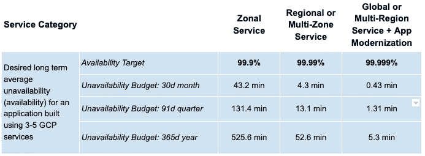

# 在 Google Cloud 上构建可靠性计划时开始

> 原文：<https://medium.com/google-cloud/getting-started-when-forming-a-reliability-program-on-google-cloud-aea5debeb532?source=collection_archive---------3----------------------->

泰勒·维克在 [Unsplash](https://unsplash.com?utm_source=medium&utm_medium=referral) 上的照片

我观察到，当内部公司选择迁移或扩展到云中时，选择的一部分是增加可靠性，但获得可靠性的执行是分散的。为了帮助实现可靠性的整体方法，应该制定一个可靠性计划来建立一个可靠应用程序的模型。在与我们的 Google Cloud 客户合作的过程中，我看到了在建立一个成功的可靠性项目时出现的这些模式。

# 建立最低可行的可靠性(MVR)

大多数较旧的应用程序没有完全设计为云原生应用程序，仍然采用单片设计，但这并不意味着您不能利用 Google Cloud 提供的额外可靠性。为了充分利用云可靠性计划，您应该确定在云上高度可用的最低要求。这些要求应该等于或高于本地要求。根据您的 SLA 和组织目标，应为以下主题设置最低配置要求:

*   分区和区域部署
*   负载平衡流量
*   没有单点故障
*   备份
*   高可用性设计
*   检测故障
*   容量管理

例如，所有层的负载平衡、应用程序必须是多区域的、计划备份并定义 RTO 和 RPO、在 X 时间内响应事件、消除瓶颈并预测高峰流量事件。这不是一个详尽的列表，但应该作为例子来确定在 Google Cloud 上启动的最低可靠性要求。

# 拥有顶级可靠应用程序的评分矩阵

为了建立应用程序的长期可靠性模型，应设计一个评分矩阵，以确定可靠性改进的领域。评分应包括基于对公司重要程度的加权指标。这些项目应该包括服务配置的最佳实践。包括设计模式，如负载平衡、水平扩展，以无状态为目标。添加运营流程，如将基础设施用作代码(IaC)、渐进式推广、自动化应急响应，以及消除辛劳。有关评分矩阵中应包含哪些内容的示例的更多详细信息，以下是谷歌最佳实践文档和可靠性文档的示例。

*   [https://cloud . Google . com/solutions/best-practices-compute-engine-region-selection](https://cloud.google.com/solutions/best-practices-compute-engine-region-selection)
*   [https://cloud . Google . com/solutions/scalable-and-resilient-apps](https://cloud.google.com/solutions/scalable-and-resilient-apps)
*   [https://cloud . Google . com/solutions/灾难恢复/架构](https://cloud.google.com/solutions/disaster-recovery/architecture)
*   [https://cloud.google.com/architecture/framework/reliability](https://cloud.google.com/architecture/framework/reliability)

拥有一个评分矩阵的最终结果是确定在你的应用中有多深的可靠性模式，以及如果想要增加它的可靠性，需要进一步改进的领域。

# 找到应用程序的真正 SLA，而不是观察到的 SLA

我多次听到公司说他们有一个“五个 9”的应用程序，但是在审查设计、使用的组件和这些组件的 SLA 时，数学不可能达到“五个 9”(例如，具有相互依赖的组件的单个区域部署)，相反，人们经常提到的是观察到的 SLA，这完全是靠运气或一些真正优秀的工程师获得的。

为了确定真正的 SLA，请确定每个组件的 SLA，然后确定它们是相互依赖还是独立于其他组件。例如，在连接到云 SQL 的单个区域中使用虚拟机。如果我们用下面的公式完成计算(99.5% * 99.95%) /100，您会看到我们获得了 99.45%的 SLA。如果我们在不包括全球平衡器的另一个地区将该模型翻倍，数学结果将是这样的 100-((100–99.45%)*(100–99.45%))= 99.6975%。

有无限多的模式可以出现，我在这里的目标是给出如何使用公式来计算实际 SLA 的例子，以实现应用程序实际构建的可靠性。下表给出了不同服务的平均目标。

相互依赖公式= (SLA% * SLA%) / 100

独立公式= (100-(100-SLA%) * (100-SLA%))

# 采用现场可靠性工程(SRE)工具

虽然不是所有的公司都可以组建一个完整的 SRE 团队，但使用 SRE 提供的方法和工具有很高的价值。SRE 提供的两个重要工具是识别应用程序的 SLO/SLI 和运行风险分析。定义您的 SLO/SLI 将帮助您理解什么对应用程序的可靠性真正重要。它将确定对您所服务的人重要的指标，而不是服务器一天 24 小时都在运行(可用性)。看一看[谷歌的 SRE 图书](https://sre.google/sre-book/service-level-objectives/)，以帮助确定 SLO/SLI 指标。我认为 SRE 剧本中最后一个非常有效的工具是创建风险分析。此[风险分析表](https://goo.gl/bnsPj7)帮助您确定可靠性风险目录，并根据您定义的 SLA 确定您是否可以在误差预算内接受某些风险。如果你不能接受风险，那么你需要增加你的错误预算或者找到一种方法来消除风险。关于 SLO 和错误预算的更多信息，请参考[谷歌的 SRE 工作手册](https://sre.google/workbook/implementing-slos/)。

# 确定遍布整个公司的可靠性冠军

需要可靠性冠军来支持可靠性的执行。它们本质上更接近于应用程序的设计和部署。这些拥护者应该由建筑师、工程师或 SRE 组成，并且应该知道实现可靠性的最佳实践配置。他们将成为可靠性评分矩阵的成员，以确定最佳可能的解决方案。

# 为可靠性创建一个治理委员会

创建一个治理委员会来建立一个可靠性框架，一套与可靠性相关的规则/流程。这个团队将由工程师和商业领袖组成。他们的唯一职责是管理上面确定的项目，以便将它们融入公司的流程中。流程的执行可以由这个团队来完成，但也可以由可靠性倡导者、产品所有者、架构师和工程师来完成。该机构将建立最低可行可靠性的要求和可靠应用的长期目标。这两个需求都应该与业务目标的结果相一致。

虽然可靠性计划中可以引入许多其他流程和主题，但这些似乎是重复出现的主题。我希望这些概念能够帮助您提高云的可靠性。