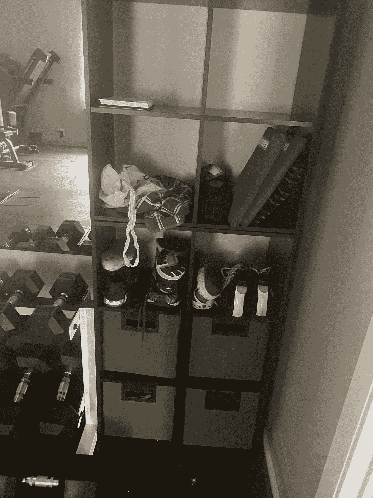
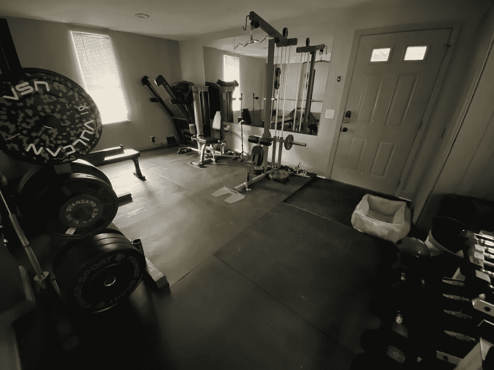
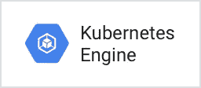
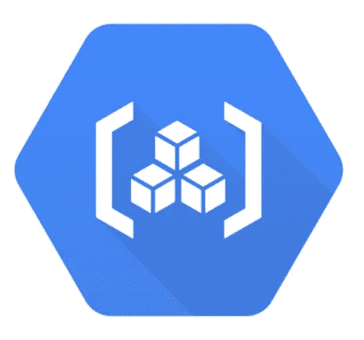

# 工件注册入门:部署到 Google Kubernetes 引擎

> 原文：<https://medium.com/google-cloud/getting-started-with-artifact-registry-deploying-to-google-kubernetes-engine-ee490da2f6de?source=collection_archive---------1----------------------->

*Google Cloud 最近发布了下一代容器管理工具:Artifact Registry。借助 Artifact Registry，您可以管理您的构建工件，同时与云的构建、测试和部署套件以及第三方 CI/CD 系统集成。通过与分析功能的集成，Artifact Registry 提供了您所使用的包的材料清单视图，同时持续地监控和更新那些工件的状态。这为您的软件开发和交付过程中使用的包、容器映像和其他依赖项提供了可见性和控制。*


# 使用工件注册管理构建工件

我最近发表了一篇[博文](/@ThatJenPerson/manage-your-build-artifacts-with-artifact-registry-953b98c58715)，宣布发布[工件注册库](https://cloud.google.com/artifact-registry/docs/overview)，一个存储容器和构建工件的地方。帖子中包含了一个关于组织我的第一个家的相当无力的比喻，但我不想错过这个向全世界讲述我的房子的机会！我会试着想一个更好的比喻，但老实说，我只是对有机会谈论我的家庭项目感到超级兴奋。就像当你只想阅读食谱，但你必须滚动阅读几段关于作者意大利之行的段落，在那里他们采摘了仍被露水打湿的葡萄成熟的西红柿，如果你不想阅读我的手工作品，你可以继续滚动到好东西。我写的每一篇 Artifact Registry 文章都很有可能包括家庭装修，尤其是考虑到我现在不被允许离开这个地方。但是，实际阅读这一部分的好处是，您将会惊讶于我是如何将这一切与工件注册表联系起来的！我也会的，因为我还在写作，还没有决定。

# 我拿到了。是关于那些储物盒

你知道每个人都有的储物盒吗？它们看起来像这样:



这么有条理！

它们非常适合解决储物问题。我的健身房里有这些零碎的东西:鞋子、阻力带、时钟、护腕等等。我可以把我所有的健身器材存放在一个存储单元中(就像 Artifact Registry 一样)，同时根据它们的用途把它们分成不同的立方体(就像不同的存储库一样)。这是一个很好的类比，对吗？没有吗？好的，我下次会更加努力。



看哪！我的家庭健身房。我需要它为我的健美准备，但这是一个长篇大论的另一篇博文。

# 好东西来了！

如果你跳过了这些细枝末节，这里是信息开始的地方，所以请注意！

# 神器注册表+谷歌 Kubernetes 引擎= ❤

如果你正在阅读这篇文章，很有可能你已经知道了[谷歌 Kubernetes 引擎](https://cloud.google.com/kubernetes-engine)，但是为了更彻底，这里有一个快速概述。GKE 是一个面向容器化应用的企业级平台，包括有状态和无状态、AI 和 ML、Linux 和 Windows、复杂和简单的 web 应用、API 和后端服务。您可以使用 GKE 来利用行业首创的功能，如四路自动扩展和无压力管理。您还可以优化 GPU 和 TPU 配置，使用集成的开发人员工具，并从 SREs 获得多集群支持。



神器注册表和谷歌 Kubernetes 引擎是天作之合。通过 GKE 使用工件注册，您可以在一个地方管理所有的工件。例如，您可以构建 Maven 包，将它们推送到 AR，用 Cloud Build 和 Jib 对它们进行容器化，然后将它们部署到 GKE。同时在构建过程、工件管理和 GKE 中使用一致的 IAM。



Artifact Registry 还使您能够在完全区域化的堆栈中运行。通过 Artifact Registry，澳大利亚或南美的客户可以运行 GKE 集群并管理同一地区的容器映像，并且在提取映像时无需支付任何出口成本。很可爱，是吧？

# 入门指南

要开始，您需要一个现有的存储库。您可以在[文档](https://cloud.google.com/artifact-registry/docs)或[我的上一篇博客文章](/@ThatJenPerson/manage-your-build-artifacts-with-artifact-registry-953b98c58715)中找到如何创建存储库。我还包含了这个 gcloud 命令，以防您需要快速提醒:

```
gcloud beta artifacts repositories create draynepipe — repository-format=docker — location=us-central1 — description="Docker repository"
```

这将创建一个名为 draynepipe 的新存储库。

# 获取您的代码

从新的或现有的代码开始。下面是一个简单的 go helloworld 应用程序，我将在我的容器中使用它:

***helloworld.go***

```
package mainimport (
  "fmt"
  "log"
  "net/http"
  "os"
)func main() {
  http.HandleFunc("/", handler) port := os.Getenv("PORT")
  if port == "" {
    port = "8080"
  } log.Printf("Listening on localhost:%s", port)
  log.Fatal(http.ListenAndServe(fmt.Sprintf(":%s", port), nil))
}func handler(w http.ResponseWriter, r *http.Request) {
  log.Print("Hello world received a request.")
  target := os.Getenv("TARGET")
  if target == "" {
    target = "World"
  }
  fmt.Fprintf(w, "Hello %s!\n", target)
}
```

我还在这里加入了 docker 文件，尽管它基本上是样板文件:

***Dockerfile***

```
# Use the offical Golang image to create a build artifact.
# This is based on Debian and sets the GOPATH to /go.
# [https://hub.docker.com/_/golang](https://hub.docker.com/_/golang)
FROM golang:1.12 as builder# Copy local code to the container image.
WORKDIR /app
COPY . .# Build the command inside the container.
RUN CGO_ENABLED=0 GOOS=linux go build -v -o helloworld# Use a Docker multi-stage build to create a lean production image.
# [https://docs.docker.com/develop/develop-images/multistage-build/#use-multi-stage-builds](https://docs.docker.com/develop/develop-images/multistage-build/#use-multi-stage-builds)
FROM alpine
RUN apk add — no-cache ca-certificates# Copy the binary to the production image from the builder stage.
COPY — from=builder /app/helloworld /helloworld# Run the web service on container startup.
CMD ["/helloworld"]
```

# 使用云构建构建项目

请注意，您不必使用云构建来构建您的项目，但是这样做允许您自动将映像推送到工件注册表。

如果您还不知道您的云项目 ID，您可以通过运行以下命令来获取它:

```
gcloud config get-value project
```

用以下内容创建一个名为`cloudbuild.yaml`的文件:

***cloud build . YAML***

```
steps:
  - name:'gcr.io/cloud-builders/docker'
  args: [ 'build', '-t', 'us-central1-docker.pkg.dev/$PROJECT_ID/${_REPOSITORY}/${_IMAGE}', '.' ]
images:
  - 'us-central1-docker.pkg.dev/$PROJECT_ID/${_REPOSITORY}/${_IMAGE}'
```

变量`${_REPOSITORY}`和`${_IMAGE}`用于存储库名称和存储库中映像的名称，这样它们可以在构建时使用定制的云构建替换进行替换。

如果您希望使用同一个构建配置文件将映像推送到不同环境的存储库，例如测试、试运行或生产环境，那么这种方法非常有用。例如，这个命令会用 *draynepipe* 替换存储库名称，用 *my-image* 替换映像名称:

```
gcloud builds submit — config=cloudbuild.yaml \
— substitutions=_REPOSITORY="draynepipe",_IMAGE="pipe-image" .
```

我运行这个来提交我的容器，以使用云构建进行构建。然后，使用工件注册表将它存储在 draynpipe 存储库中。

# 配置 Docker 存储库访问

您可能需要配置对容器的访问。查看文档,了解创建集群所需的最低 GKE 版本，这些集群拥有从同一个项目中的 Docker 存储库中提取容器的默认权限。如果您没有使用这些 GKE 版本，您将需要使用[Kubernetes imagePullSecrets](https://cloud.google.com/artifacts/docs/access-control#gke)配置对拉容器的访问。

如果您需要从另一个项目中的存储库中访问容器，那么您需要将对该存储库的读取权限授予用于提取图像的身份

# 运行图像

一旦配置了访问，就可以使用以下命令在 GKE 集群上运行工件注册表映像:

```
kubectl run [NAME] — image=LOCATION-docker.pkg.dev/PROJECT-ID/REPOSITORY/IMAGE:TAG
```

在哪里

*   [名称]是您为对象指定的名称
*   位置是存储库的区域或多区域位置。
*   PROJECT-ID 是您的 Google 云控制台项目 ID。
*   存储库是存储图像的存储库的名称。
*   图像是存储库中图像的名称。
*   标记是您要提取的图像版本的标记。

例如，我的`helloworld.go`命令是这样的:

```
kubectl run helloworld — image=us-central1-docker.pkg.dev/drayne/draynepipe/pipe-image:v1
```

现在，我存储在工件注册库中的图像被部署到 GKE！

# 轮到你了！

准备好开始从工件注册表部署到 Google Kubernetes 引擎了吗？查看 Docker 的[工件注册表快速入门和关于与 Google Kubernetes 引擎](https://cloud.google.com/artifact-registry/docs/docker/quickstart)集成的[工件注册表指南！对工件注册有疑问吗？欢迎在下面评论或发微博给我！](https://cloud.google.com/artifact-registry/docs/integrations#gke)