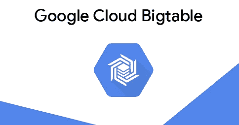

# GCP Bigtable 入门

> 原文：<https://medium.com/google-cloud/getting-started-with-bigtable-on-gcp-adfb896e0b26?source=collection_archive---------0----------------------->

如果您以前从未看过它，Bigtable 可能会显得有点不可接近。在本教程中，我们将带您越过这个障碍，并指导您完成使用 Bigtable 的第一步，这样您就可以开始在自己的项目中使用这个完全托管的 NoSQL 数据库。

Bigtable 是为低延迟数据访问而设计的，可伸缩性和可靠性非常重要。这实际上是相同的技术…