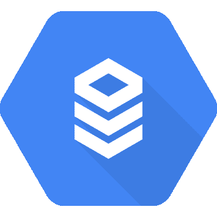

# SQL Server 云 SQL 入门

> 原文：<https://medium.com/google-cloud/getting-started-with-cloud-sql-for-sql-server-11717a38d11f?source=collection_archive---------3----------------------->

最后，面向 SQL Server 的云 SQL 现已推出测试版。在 Google Next’19 上发布的 Cloud SQL Server 是一种托管数据库服务，可以轻松地在 Google 云平台上设置、维护、管理和管理您的 SQL Server 数据库。云 SQL 定价不需要预先承诺，包括按秒计费和持续使用折扣，类似于谷歌计算引擎。对于定价…