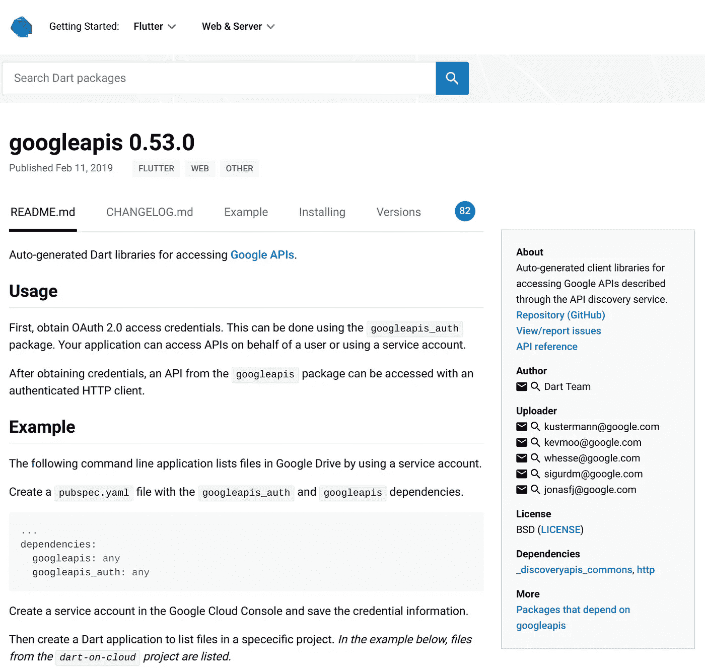
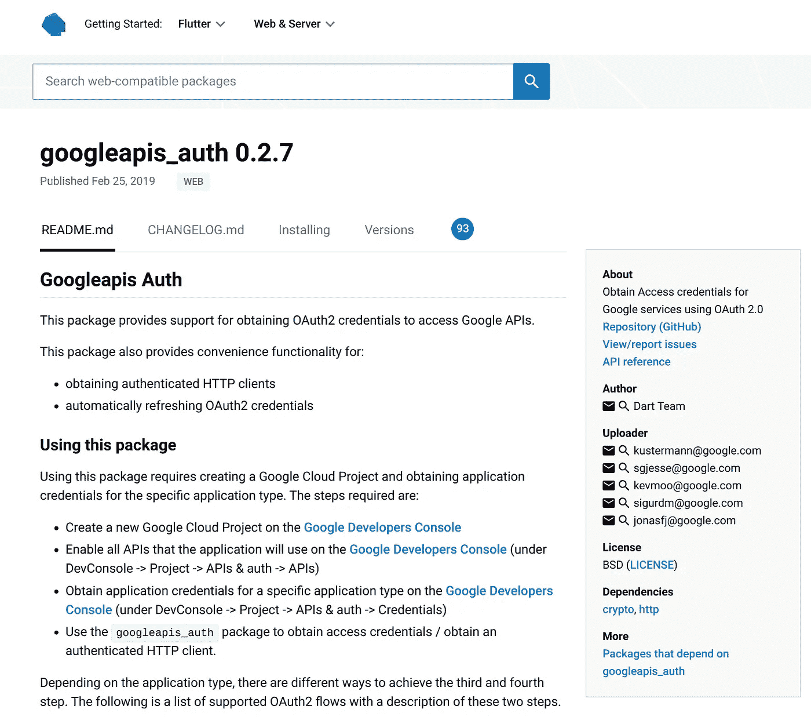

# 从 GCP 的 Dart 开始

> 原文：<https://medium.com/google-cloud/getting-started-with-dart-on-gcp-ffc49165d181?source=collection_archive---------0----------------------->

## “缺失教程”系列

这是对《T2》系列的一个迟来但仍有希望有用的补充。

Stackoverflow 上的一个开发者[无法](https://stackoverflow.com/questions/55493003)使用 Dart(lang)为 Google Cloud 语音转文本 API 找到好的文档。

我以前没有使用过 Dart，无法通过文档的方式找到太多信息来提供响应。所以我试了一下。这并不容易，但这主要是因为我真的不熟悉 Dart，也没有使用过语音到文本的 API(但这并不复杂)。

切入正题，下面是[解决方案](https://gist.github.com/DazWilkin/34d628b998b4266be818ffb3efd688aa)“布鲁克林大桥有多老了？”

## 设置

我运行的是 Linux (Debian)。我将提供安装 Dartlang ( [这里是](https://www.dartlang.org/install))的指导，虽然我是从 zip 文件安装的，而不是使用包管理器，但是我将让您自己安装。我用的是服务器 SDK。

```
PROJECT_ID=[[YOUR-PROJECT-ID]]
LANG=dartmkdir -p ${HOME}/${PROJECT_ID}/${LANG}
cd ${HOME}/${PROJECT_ID}/${LANG}
```

您需要启用语音转文本 API:

```
gcloud services enable speech.googleapis.com --project=${PROJECT}
```

您还需要一个(无权限)服务帐户的 JSON 密钥，以便您的代码可以访问 API:

```
ROBOT=[[YOUR-SERVICE-ACCOUNT]]
FILE=${PWD}/${ROBOT}.key.jsongcloud iam service-accounts create $ROBOT \
--display-name=$ROBOT \
--project=$PROJECTgcloud iam service-accounts keys create ${FILE} \
--iam-account=${ROBOT}@${PROJECT}.iam.gserviceaccount.com \
--project=$PROJECT
```

## 舞台管理

Dart 的 SDK 包括 [Stagehand](https://pub.dartlang.org/packages/stagehand) 哪些脚手架项目——我使用的是控制台应用程序——并有助于包管理:

```
mkdir speech && cd speechstagehand console-full
```

有用的是，该命令以如何继续的说明结束:

```
--> to provision required packages, run 'pub get'
--> run your app using `dart bin/main.dart`.
```

之前，我运行了`pub get`，我在 Visual Studio 代码中打开了目录，并决定我需要添加对 Google 的 API 客户端库的引用

> d**I 表达式**:参见[谷歌客户端库解释](https://cloud.google.com/apis/docs/client-libraries-explained)。

令人困惑的是，Dart 有几个(非歧义的)谷歌管理的 GitHub 库:[https://github.com/dart-lang/gcloud](https://github.com/dart-lang/gcloud)、[https://github.com/dart-lang/googleapis](https://github.com/dart-lang/googleapis)，并且隐藏在这个[https://GitHub . com/Dart-lang/Google APIs/tree/master/generated/Google APIs](https://github.com/dart-lang/googleapis/tree/master/generated/googleapis)中。后者用一个使用 Google 云存储的例子给了我最大的帮助。

我了解到 Dart 包的中央回购在这里:

`[https://pub.dartlang.org/](https://pub.dartlang.org/)`

通过`googleapis`搜索找到了这个:

`[https://pub.dartlang.org/packages/googleapis](https://pub.dartlang.org/packages/googleapis)`



我随后意识到我需要 OAuth 包来:

`[https://pub.dartlang.org/packages/googleapis_auth](https://pub.dartlang.org/packages/googleapis_auth)`



方便的是，点击任何一个页面上的“安装”会提供要粘贴到`pubspec.yaml`中的配置:

```
dependencies:
  googleapis: ^0.53.0
  googleapis_auth: ^0.2.7
```

然后，您可以运行`pub get`将这些包从 repo 中提取到您的项目中。

## 客户

GitHub repo 提供了一些样板代码，用于访问由服务帐户 JSON 密钥授权的 Google API 客户端库(云存储):

```
import 'package:googleapis/**speech/v1.dart**';
import 'package:googleapis_auth/auth_io.dart';final _credentials = new ServiceAccountCredentials.fromJson(r'''
{
  "private_key_id": ...,
  "private_key": ...,
  "client_email": ...,
  "client_id": ...,
  "type": "service_account"
}
''');const _SCOPES = const [**SpeechApi.CloudPlatformScope**];void main() {
  clientViaServiceAccount(_credentials, _SCOPES).then((http_client) {
    var speech = new **SpeechApi**(http_client);
    speech...
  });
}
```

猜测语音 API 的替换值很简单。

> **NB** 最好将服务帐户 JSON 密钥作为一个文件引用，但我是 noob，所以使用了示例中所示的文本文字，我将`${ROBOT}.key.json`的内容复制并粘贴到该示例中。

这让我很困惑，因为`auth-io`库接受 JSON 字符串或 Dart 映射，但是当我实例化 Speech API 的`recognize`类时，它的`fromJson`方法不…..最后，我不得不从头开始为自己编写一个示例，以理解这在 Dart 中是如何工作的:

通过尝试对谷歌的代码进行逆向工程，我学到了一些别的东西。例如，它使用了`core.String`，但是[标板](http://dartpad.dartlang.org/634c0cb8159549a44c5c786844da03f3)对此产生了错误。我意识到`core`前缀是某种形式的别名，并查看了 Google 代码中的导入，看到了`import 'dart:core' as core;`。这可能是一个很好的具体做法，确保当你写下例如`String`，并从`dart:core`中表示`String`时，这就是你所得到的。

查看谷歌的语音转文本文档，我意识到我将使用的关键方法是`recognize`:

`[https://cloud.google.com/speech-to-text/docs/reference/rest/v1/speech/recognize](https://cloud.google.com/speech-to-text/docs/reference/rest/v1/speech/recognize)`

并且该方法采用:

```
{
  "config": {
    object(RecognitionConfig)
  },
  "audio": {
    object(RecognitionAudio)
  }
}
```

搜索 GitHub repo，发现:

`[https://github.com/dart-lang/googleapis/blob/9181a52ad90c47c56d38576090ebbc94957ab716/generated/googleapis/lib/speech/v1.dart#L442](https://github.com/dart-lang/googleapis/blob/9181a52ad90c47c56d38576090ebbc94957ab716/generated/googleapis/lib/speech/v1.dart#L442)`

上面有一个看起来很有希望的签名:

```
async.Future<RecognizeResponse> recognize(RecognizeRequest request)
```

在 Node 中使用了期货。JS，我意识到样板代码使用了另一个未来，我有我的出发点:

```
clientViaServiceAccount(_credentials, _SCOPES).then((...) {...})
```

以…的形式:

```
speech.**speech**.recognize(_recognizeRequest).then((response) {...})
```

当`speech.recognize`不工作时，我检查代码并与云存储进行比较，看到:

```
SpeechResourceApi get **speech** => new SpeechResourceApi(_requester);
```

并意识到我需要添加它(也许应该重新考虑我对第一个的命名)。

REST API 文档显示该方法返回:

```
{
  "results": [
    {
      object(SpeechRecognitionResult)
    }
  ]
}
```

但是，从源代码来看，很明显这在 Dart 库中被称为`RecognizeResponse`。我到目前为止:

```
speech.speech.recognize(_recognizeRequest).then((response) {
  for (var result in response.results) {
    print(result.toJson());
  }
});
```

但是我花了很长时间(正如我上面提到的)才想出如何将 Map|JSON 传递给命令。最后，我使用源代码(和我的例子)作为我的指南:

```
final _json = {
  "audio":{
    "content":"**[[SEE BELOW]]**"
  },
  "config": {
    "encoding": "LINEAR16",
    "sampleRateHertz": 16000,
    "languageCode": "en-US"
  }
};
final _recognizeRequest = RecognizeRequest.fromJson(_json);
```

这似乎符合要求，当我试图`dart bin/main.dart`时，我不再收到令人震惊的错误；-)

我需要一个(base-64 编码的)样本文件。

方便的是，Google 文档正好涵盖了这个问题:

`[https://cloud.google.com/speech-to-text/docs/base64-encoding](https://cloud.google.com/speech-to-text/docs/base64-encoding)`

我猜想，在谷歌的其他样本中，会有一个方便使用的音频文件:

`[https://github.com/GoogleCloudPlatform/python-docs-samples/tree/master/speech/cloud-client/resources](https://github.com/GoogleCloudPlatform/python-docs-samples/tree/master/speech/cloud-client/resources)`

我用了`audio.raw`。

我浏览了一遍:

```
base64 audio.raw -w 0 > audio.b64
```

而且，因为我还不知道如何使用 Dart 中的文件，所以我也将它的内容复制并粘贴到我的源代码中；-)

然后，我运行了它:

```
dart bin/main.dart
```

而且，它成功了:

```
{
    alternatives: [{
        confidence: 0.9835046,
        transcript: how old is the Brooklyn Bridge
    }]
}
```

## 结论

Google 的 API 的一致性(！)客户端库使得语言之间的转换变得非常容易，因为 API 客户端库大部分都是相同的(不管是哪种语言),而且 Google 在记录其 REST APIs 方面做得非常好。

我遗漏了一件东西，并且假设它是可用的，那就是 Dart APIs 的在线文档。很明显，谷歌的资源中包含了大量基于评论的文档，但我找不到展示这些内容的网站。显然，那会很有帮助。

> 19–04–04:**更新** —找到文档:`[https://pub.dartlang.org/documentation/googleapis/latest/googleapis.speech.v1/googleapis.speech.v1-library.html](https://pub.dartlang.org/documentation/googleapis/latest/googleapis.speech.v1/googleapis.speech.v1-library.html)`

一般我在学习一个新的 Google API 的时候，都会用 Google 的**优* * APIs Explorer 来测试调用。在这种情况下，API 结构很清楚，我的主要挑战是如何与 Google 的机器生成的 API 客户端库进行交互。

希望这篇文章能帮助其他人使用 Dart(lang)和 Google 的 API 客户端库导航。

仅此而已！