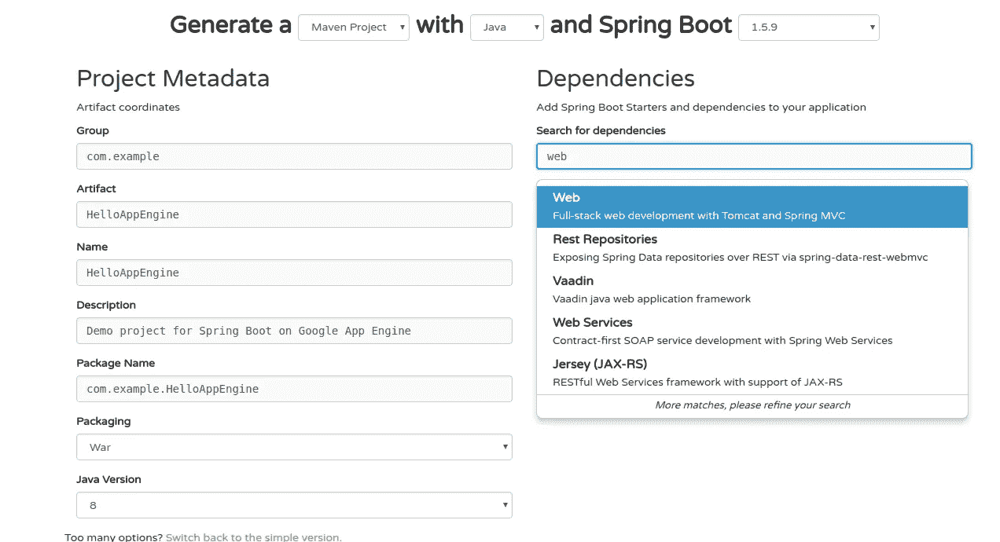
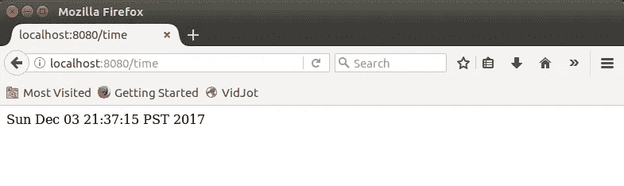

# 通过 5 个步骤开始使用谷歌应用引擎和 Spring Boot

> 原文：<https://medium.com/google-cloud/getting-started-with-google-app-engine-and-spring-boot-in-5-steps-2d0f8165c89?source=collection_archive---------0----------------------->

谷歌云平台(GCP)为开发者构建和部署应用到谷歌应用引擎提供了良好的集成工具。这里有一个教程，可以让你使用 Maven 通过 5 个步骤在 App Engine 上设置和部署你的 Spring Boot 应用程序。

请给我留下您的任何意见或问题，我会尽力回答。编码快乐！！！


运行在谷歌应用引擎上的 Spring Boot

1.  基础知识和工具(您需要的)

*   谷歌云平台帐户，并基本熟悉 GCP 控制台。
*   Java，Spring Boot，Maven 安装在你的机器上。
*   GCloud SDK 安装在本地计算机上，并进行初始化。

2.构建您的基本 Spring Boot 应用程序

*   前往[https://start.spring.io/](https://start.spring.io/)配置您的 Spring Boot 项目并下载 Maven 项目模板。
*   确保选择 Java 版本= 8，打包= war，依赖项= Web。本教程使用 Group = com.example 和 Artifact = Name = HelloAppEngine。



*   您将下载一个 zip 文件到您的本地计算机，然后解压缩它。在本教程中，解压后你将拥有 HelloAppEngine 文件夹。
*   将文件夹更改为 HelloAppEngine，然后编辑 HelloAppEngineApplication.java 以添加一个新的控制器来返回“你好，Spring Boot！”消息。

```
$vi src/main/java/com/example/HelloAppEngine/HelloAppEngineApplication.java
```

*   用以下内容替换 HelloAppEngineApplication.java。

```
package com.example.HelloAppEngine;import org.springframework.boot.SpringApplication;
import org.springframework.boot.autoconfigure.SpringBootApplication;
import org.springframework.web.bind.annotation.*;[@SpringBootApplicatio](http://twitter.com/SpringBootApplicatio)n
[@RestController](http://twitter.com/RestController)
public class HelloAppEngineApplication {public static void main(String[] args) {
                SpringApplication.run(HelloAppEngineApplication.class, args);
        }[@GetMapping](http://twitter.com/GetMapping)("/")
        public String hello() {
                return "Hello Spring Boot!";
        }
}
```

*   运行 HelloAppEngine Spring Boot 应用程序。然后将本地浏览器指向 [http://localhost:8080](http://localhost:8080)

```
cd HelloAppEngine
mvn spring-boot:run
```

*   您应该会看到您的第一条“你好，Spring Boot”消息。现在，您的 Spring Boot 应用程序已经在本地运行了。退出应用程序并进入下一步。


3.使您的应用程序与 App Engine 兼容

这一步将涉及修改 Maven 插件和编辑 pom.xml 的一些部分，以便该项目与谷歌应用引擎环境兼容。

*   打开 pom.xml 进行编辑。删除 spring-boot-starter-tomcat，并根据提供的内容添加 javax.servlet-api 依赖项。这是因为谷歌应用引擎使用 Jetty，而默认的 Spring Boot 使用 Tomcat。

```
<dependencies> <!-- Remove spring-boot-starter-tomcat dependency 
  <dependency>
       <groupId>org.springframework.boot</groupId>
       <artifactId>spring-boot-starter-tomcat</artifactId>
       <scope>provided</scope>
  </dependency>
  --> <!-- add following dependency under dependencies section -->
   <dependency>
       <groupId>javax.servlet</groupId>
       <artifactId>javax.servlet-api</artifactId>
       <version>3.1.0</version>
       <scope>provided</scope>
   </dependency> <dependency>
       <groupId>org.springframework.boot</groupId>
       <artifactId>spring-boot-starter-test</artifactId>
       <scope>test</scope>
  </dependency></dependencies>
```

*   添加 Maven 应用引擎插件

```
<plugins>
    <!-- add appengine-maven-plugin -->
            <plugin>
                <groupId>com.google.cloud.tools</groupId>
                <artifactId>appengine-maven-plugin</artifactId>
                <version>1.3.1</version>
            </plugin>
</plugins>
```

*   为部署描述符添加 appengine_web.xml。

```
$ mkdir -p src/main/webapp/WEB-INF/
$ touch src/main/webapp/WEB-INF/appengine-web.xml
```

*   将以下上下文添加到 appengine-web.xml。

```
<appengine-web-app >
  <version>1</version>
  <threadsafe>true</threadsafe>
  <runtime>java8</runtime>
</appengine-web-app>
```

*   使用 App Engine 插件运行您的应用程序。将您的浏览器指向 [http://localhost:8080](http://localhost:8080) ，然后您应该会看到默认的 Spring Boot 页面，就像之前使用 Spring Boot 插件的步骤一样，但是这次它运行在 App Engine 本地服务器上。

```
$ mvn appengine:run
```

4.部署到谷歌云

本节将带您在 GCP 上创建应用程序引擎，并向其部署您的应用程序。所有命令都使用安装在您本地机器上的 GCloud SDK，并且已经初始化为您的 GCP 帐户。

*   通过 console.cloud.google.com 在 GCP 创建您的项目。本教程的项目 id 为“ **spring-boot-187904** ”。在学习本教程时，您应该参考您的项目 id。
*   设置项目参数，使用 GCloud sdk 创建 app engine app。确保用您的项目 id 替换“ **spring-boot-187904** ”。

```
$ **gcloud config set project spring-boot-187904**Updated property [core/project].$ **gcloud app create --region us-central**
You are creating an app for project [spring-boot-187904].
WARNING: Creating an App Engine application for a project is irreversible and the region
cannot be changed. More information about regions is at
<[https://cloud.google.com/appengine/docs/locations](https://cloud.google.com/appengine/docs/locations)>.Creating App Engine application in project [spring-boot-187904] and region [us-central]....done.                       
Success! The app is now created. Please use `gcloud app deploy` to deploy your first app.
```

*   使用 Maven 和 App Engine 插件将您的应用程序部署到 Google App Engine (GAE)

```
$ mvn **appengine:deploy**...
#============================================================#
[INFO] GCLOUD: File upload done.
[INFO] GCLOUD: Updating service [default]...
[INFO] GCLOUD: ..............done.
[INFO] GCLOUD: Updating service [default]...
[INFO] GCLOUD: Waiting for operation [apps/spring-boot-187904/operations/64bc4dfd-5fff-4279-bb7f-b6fe2fbb7206] to complete...
[INFO] GCLOUD: ..............done.
[INFO] GCLOUD: done.
[INFO] GCLOUD: Deployed service [default] to [[https://spring-boot-187904.appspot.com](https://spring-boot-187904.appspot.com)]
[INFO] GCLOUD: 
[INFO] GCLOUD: You can stream logs from the command line by running:
[INFO] GCLOUD:   $ gcloud app logs tail -s default
[INFO] GCLOUD: 
[INFO] GCLOUD: To view your application in the web browser run:
[INFO] GCLOUD:   $ gcloud app browse
[INFO] -------------------------------------------------------------
[INFO] BUILD SUCCESS
[INFO] -------------------------------------------------------------
[INFO] Total time: 44.212 s
[INFO] Finished at: 2017-12-03T21:20:31-08:00
[INFO] Final Memory: 33M/246M
[INFO] -------------------------------------------------------------
```

*   使用浏览器转到[YOUR_PROJECT_ID].appspot.com 以访问您的 Spring Boot 应用程序。您应该会看到默认页面，就像在本地机器上一样。恭喜你，你现在已经可以在 GAE 上运行你的应用了。


5.向你的应用添加更多功能并进行更新

在这一节中，我们将在您的应用程序中添加一些特性，并将其重新部署到 GAE。

*   向应用程序添加更多控制器和端点。让我们修改默认消息并添加一个时间服务。将以下内容替换为 HelloAppEngineApplication.java 文件。

```
package com.example.HelloAppEngine;import org.springframework.boot.SpringApplication;
import org.springframework.boot.autoconfigure.SpringBootApplication;
import org.springframework.web.bind.annotation.*;import java.util.Calendar;
import java.util.Date;[@SpringBootApplicatio](http://twitter.com/SpringBootApplicatio)n
[@RestController](http://twitter.com/RestController)
public class HelloAppEngineApplication {public static void main(String[] args) {
                SpringApplication.run(
                           HelloAppEngineApplication.class, args);
        }[@GetMapping](http://twitter.com/GetMapping)("/")
        public String hello() {
                return "Hello Spring Boot, I'm on App Engine!!!";
        }[@GetMapping](http://twitter.com/GetMapping)("/time")
        public String time() {
                return Calendar.getInstance().getTime().toString();
        }
}
```

*   运行它的本地应用引擎插件，并用浏览器测试。你应该看看时间服务。

```
$ mvn appengine:run
```



*   使用与上一步相同的 Maven appengine 插件将新版本部署到 App Engine。使用浏览器并转到[YOUR_PROJECT_ID].appspot.com，然后您应该会看到一条新消息。请转到[YOUR _ PROJECT _ ID]。app spot . com/time 会给您提供当前时间信息。

```
$ mvn **appengine:deploy**...
#============================================================#
[INFO] GCLOUD: File upload done.
[INFO] GCLOUD: Updating service [default]...
[INFO] GCLOUD: ........done.
[INFO] GCLOUD: Updating service [default]...
[INFO] GCLOUD: Waiting for operation [apps/spring-boot-187904/operations/87ebf5c8-6b33-4806-8342-afa79cf5caef] to complete...
[INFO] GCLOUD: .............done.
[INFO] GCLOUD: .done.
[INFO] GCLOUD: Deployed service [default] to [[https://spring-boot-187904.appspot.com](https://spring-boot-187904.appspot.com)]
[INFO] GCLOUD: 
[INFO] GCLOUD: You can stream logs from the command line by running:
[INFO] GCLOUD:   $ gcloud app logs tail -s default
[INFO] GCLOUD: 
[INFO] GCLOUD: To view your application in the web browser run:
[INFO] GCLOUD:   $ gcloud app browse
[INFO] -------------------------------------------------------------
[INFO] BUILD SUCCESS
[INFO] -------------------------------------------------------------
[INFO] Total time: 01:02 min
[INFO] Finished at: 2017-12-03T21:53:41-08:00
[INFO] Final Memory: 30M/214M
[INFO] -------------------------------------------------------------
```


*   恭喜你！现在，您已经构建了应用程序，部署并更新了 Google App Engine。