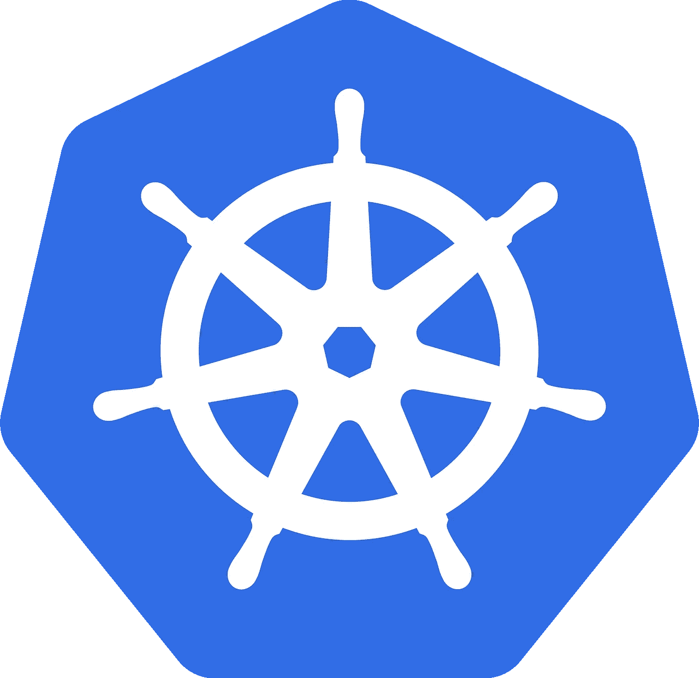

# Google Cloud 上的 Kubernetes 入门

> 原文：<https://medium.com/google-cloud/getting-started-with-google-cloud-55937aa6b9?source=collection_archive---------4----------------------->

## 安装和验证

首先，创建一个 [Google Cloud](https://cloud.google.com) 账户，初始化一个计费账户，添加一个新项目。接下来，安装资产:

## 以每月 6 美元的价格创建一个单节点 Kubernetes 集群

现在，您可以在一个 *f1-micro* 实例上创建一个新的 Kubernetes 集群，每月只需 6 美元多一点。

注意， *f1-micro* 单节点集群不允许云日志或云监控。然而，你现在可以在[谷歌开发者控制台](https://console.developers.google.com)中检查你的新集群

**重要提示:如果您为一个 pod 创建了一个 Kubernetes 服务，它将自动在 Google Cloud 上创建一个网络转发规则，前五个规则的最低价格为****18 美元/月*** *(截至 2015 年 10 月)。*

对于后续步骤，请查看:

[部署 Node.js 应用程序](https://cloud.google.com/container-engine/docs/tutorials/hello-node)

[使用永久磁盘部署应用](https://cloud.google.com/container-engine/docs/tutorials/persistent-disk/)