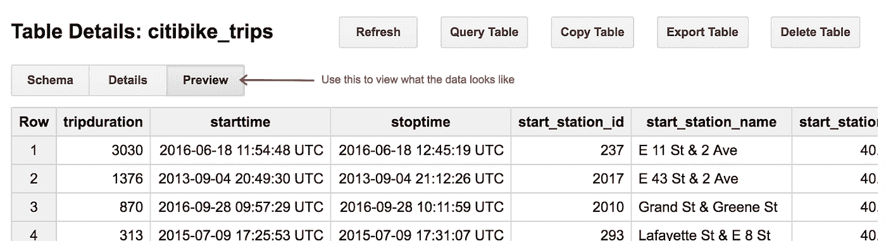
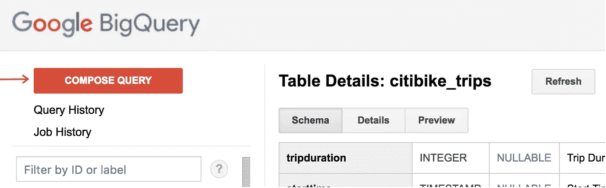
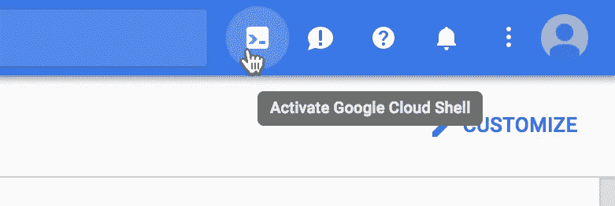
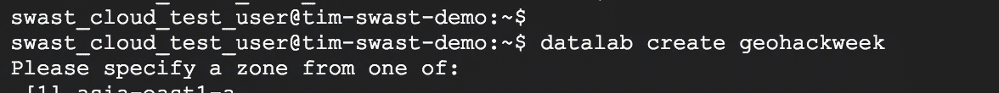
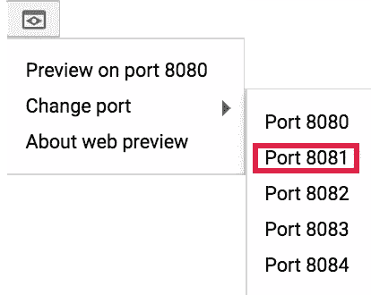

# Google BigQuery 入门——2017 年 GeoHackWeek 的 Google 云代码实验室

> 原文：<https://medium.com/google-cloud/getting-started-with-google-cloud-a-codelab-for-geohackweek-2017-848c25ed72fd?source=collection_archive---------0----------------------->

你好 [GeoHackWeek 2017](https://geohackweek.github.io/ghw2017/) 与会者。在这个 [codelabs](https://g.co/codelabs) 风格的教程中，我们将浏览一些在谷歌云平台(GCP)上可用的[公共数据集](https://cloud.google.com/public-datasets/)，并使用一些可用于分析地理空间数据的工具。

# 开始之前

希望你有一个 GCP 项目为它设置的谷歌帐户。如果没有，查看[初级教程](https://geohackweek.github.io/preliminary/02-gcp-tutorial/)。

一旦您有了一个启用了计费的 GCP 项目(例如，通过开始免费试用或使用优惠券)，您就可以继续下一步了。

# 关于这些公共数据集

有几个地方可以找到谷歌托管的[公共数据集](https://cloud.google.com/public-datasets/)。

*   [地球引擎公共数据集](https://earthengine.google.com/datasets/)
*   [Google Cloud Platform 公共数据集](https://console.cloud.google.com/launcher/browse?filter=solution-type:dataset) —新数据集将在此加载，但其他数据集将记录在产品文档中。
*   [Google BigQuery 公共数据集](https://cloud.google.com/bigquery/public-data/) —结构化数据集，可通过 SQL 查询。
*   [云存储公共数据集](https://cloud.google.com/storage/docs/public-datasets/) —栅格数据，包括 Landsat 数据。

我们将要探索的数据集是[纽约市花旗自行车旅行数据集](https://cloud.google.com/bigquery/public-data/nyc-citi-bike)。

# 在 Google BigQuery 中浏览纽约市的自行车出行数据集

通过在[https://big query . cloud . Google . com/table/big query-public-data:new _ York . Citi bike _ trips 的](https://bigquery.cloud.google.com/table/bigquery-public-data:new_york.citibike_trips?tab=schema) [BigQuery Web UI](https://cloud.google.com/bigquery/bigquery-web-ui) 中打开该表来查看该表。tab =模式

你会看到一个表格中有哪些列，以及一些在表格上做一些操作的按钮。

[不要在 BigQuery](https://stackoverflow.com/a/23991604) 中执行 SELECT *操作，而是使用预览按钮来获取表中某些行的样本。

使用预览按钮感受一下数据。

# 撰写 BigQuery 查询

对于我们的第一个查询，让我们找出哪些车站是最受欢迎的目的地。

点击**撰写查询**按钮。

我们将使用[标准 SQL 语法](https://cloud.google.com/bigquery/docs/reference/standard-sql/)，我们需要在选项中启用它。点击**显示选项**按钮，取消选中使用传统 SQL 语法的选项。

对本教程中的查询使用标准 SQL 语法。

现在，输入查询文本来查找最受欢迎的花旗自行车目的地。

然后点击**运行查询**按钮。

几秒钟后，您应该会看到一个电台表，按照它们在 trips 表中出现的频率排序。

为什么会显示“已处理 1.15 GB”？这意味着 BigQuery 扫描了那么多字节来计算这个查询的结果。[每月前 1 TB 的处理是免费的](https://cloud.google.com/bigquery/pricing#free-tier)。

# 更复杂的查询

在另一篇文章中，我[使用这个数据集寻找团体和单人旅行的热门目的地](/@TimSwast/what-are-the-most-popular-citibike-destinations-for-nyc-couples-1baf646fbba)。

# 可视化查询结果

可视化 BigQuery 查询结果的一种方法是使用云数据实验室。

首先，打开谷歌云平台控制台:[https://console.cloud.google.com](https://console.cloud.google.com)

然后，使用右上角的 Shell 图标打开 [Google Cloud Shell](https://cloud.google.com/shell/) 。

输入命令创建一个新的 Datalab 实例。

> *数据实验室创建地理周刊*

使用 Web 预览功能连接到新实例。

这将打开一个 Jupyter 笔记本环境，为使用 Google Cloud 进行一些定制。要从 Datalab 访问 Google BigQuery，可以使用 *pandas.io.gbq* (也称为 [pandas-gbq](https://pandas-gbq.readthedocs.io/en/latest/) )包。

> data frame = pandas . io . gbq . read _ gbq(
> ' SELECT 1 '，project_id='myproj '，dialect='standard ')

[Datalab 还内置了 IPython magic commands](http://googledatalab.github.io/pydatalab/datalab.magics.html) ，用于与 BigQuery 和其他 Google Cloud APIs 一起工作。

# 关闭您的 Datalab 实例

为了节省成本，您可以在不使用 Datalab 实例时停止它。

> 数据实验室停止地理黑客周

这将关闭实例，但不会删除它或它的存储。

要启动它并重新连接，请使用 connect 命令。

> 数据实验室连接地理黑客周刊

如果您完全完成了实例并备份了笔记本，您可以使用删除命令完全删除实例。

> 数据实验室删除地理黑客周

# 额外资源

*   [将 BigQuery 与谷歌地图 API](https://codelabs.developers.google.com/codelabs/bigquery-maps-api/#0) 相结合——这是一个代码实验室，它使用 BigQuery 中的用户定义函数来进行空间查询，然后使用谷歌地图可视化结果。
*   [更多可视化数据的资源](/@TimSwast/visualizing-big-data-with-google-cloud-fe323a03f85c) —我在 Google Cloud Next 2017 的演讲和我为此做的可视化演示。